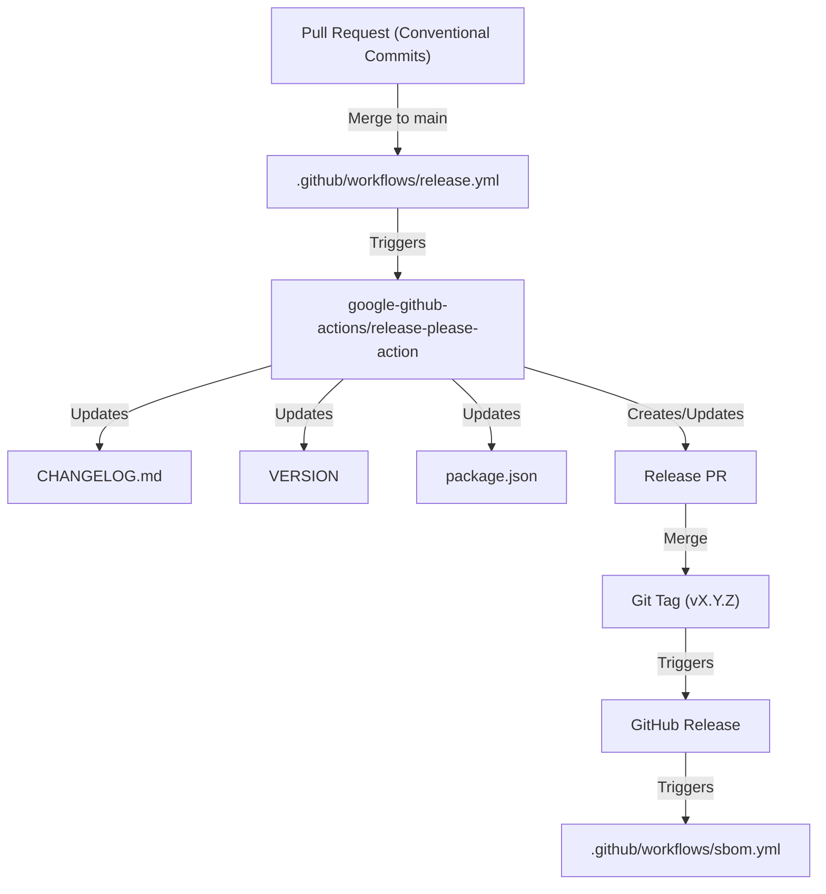
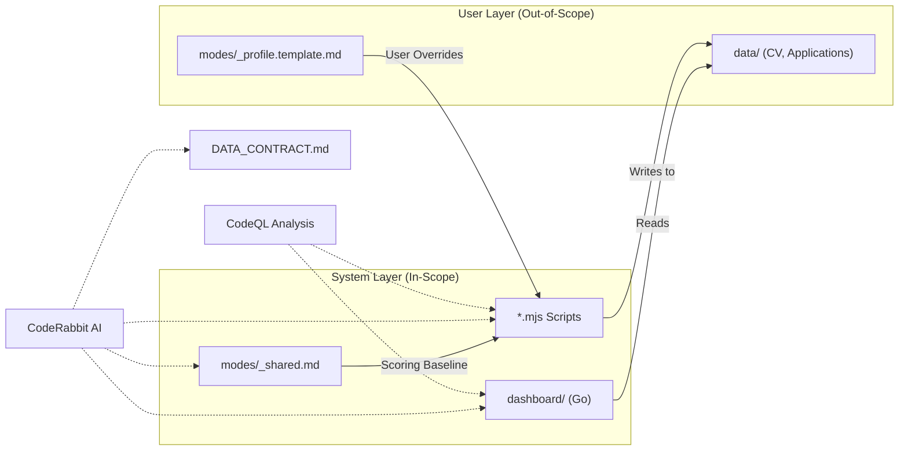

# Release Engineering 및 보안

관련 소스 파일

다음 파일들은 이 위키 페이지를 생성하기 위한 컨텍스트로 사용되었습니다.

- [.coderabbit.yaml](.coderabbit.yaml)
- [.github/dependabot.yml](.github/dependabot.yml)
- [.github/workflows/codeql.yml](.github/workflows/codeql.yml)
- [.github/workflows/dependency-review.yml](.github/workflows/dependency-review.yml)
- [.github/workflows/release.yml](.github/workflows/release.yml)
- [.github/workflows/sbom.yml](.github/workflows/sbom.yml)
- [.github/workflows/stale.yml](.github/workflows/stale.yml)
- [VERSION](VERSION)
- [modes/_profile.template.md](modes/_profile.template.md)
- [release-please-config.json](release-please-config.json)
- [renovate.json](renovate.json)

이 페이지는 `career-ops` 저장소를 관리하는 자동화 인프라와 보안 프로토콜을 자세히 설명합니다. career automation suite의 무결성을 보장하는 자동화된 release pipeline, dependency management 전략, AI assisted code review guardrail, security analysis workflow를 다룹니다.

## Release Management Workflow

프로젝트는 versioning 및 changelog 생성을 자동화하기 위해 `release-please`를 활용합니다. 이 workflow는 semantic version bump(예: `feat:`, `fix:`, `chore:`)를 결정하기 위해 **Conventional Commits**에 의존합니다.

### Release Please 구현
release process는 `main` branch로 push될 때 trigger됩니다. `release-please-action`은 commit history를 parse하여 `CHANGELOG.md`를 유지하고 manifest file의 version을 업데이트합니다.

- **Workflow Configuration**: [.github/workflows/release.yml:1-18]()에 정의되어 있습니다.
- **Configuration Details**: `simple` release type을 사용하고 `package.json`의 version을 동기화합니다 [release-please-config.json:3-15]().
- **Version Source**: 현재 system version은 [VERSION:1-1]()에서 유지됩니다.

### Release Lifecycle Diagram

다음 다이어그램은 developer의 pull request에서 최종 GitHub Release까지의 흐름을 보여줍니다.

**Release Pipeline Data Flow**

**출처:** [.github/workflows/release.yml:1-18](), [release-please-config.json:1-17](), [VERSION:1-1]().

---

## Dependency Management 및 무결성

`career-ops`는 여러 package manager(npm, Go modules, GitHub Actions)에 걸친 자동 dependency update를 위해 **Renovate**를 사용하며, 보조 coverage를 위해 **Dependabot**으로 보완합니다.

### Renovate Configuration
프로젝트는 보안을 유지하면서 developer distraction을 최소화하기 위해 엄격한 update schedule을 따릅니다.
- **Schedule**: update는 월요일 오전 7시 이전에 batch 처리됩니다 [renovate.json:9-9]().
- **Managers**:
    - `github-actions`: workflow action을 업데이트합니다 [renovate.json:14-17]().
    - `gomod`: `dashboard/` TUI의 Go dependency를 관리합니다 [renovate.json:19-22]().
    - `npm`: core script의 Node.js dependency를 관리합니다 [renovate.json:24-27]().
- **Limits**: CI congestion을 방지하기 위해 concurrent PR은 5개로 제한됩니다 [renovate.json:11-11]().

### Dependabot Integration
Dependabot은 Renovate cycle 사이에 security patch가 누락되지 않도록 동일한 ecosystem에 대해 weekly check를 제공합니다.
- **Ecosystems**: `npm`, `gomod`(`/dashboard` 내), `github-actions`를 포함합니다 [.github/dependabot.yml:3-19]().

### Dependency Review
모든 Pull Request에 대해 `dependency-review-action`은 새로운 vulnerability를 scan합니다.
- **Severity Threshold**: `high` severity vulnerability가 있는 dependency가 도입되면 CI가 실패하도록 구성되어 있습니다 [.github/workflows/dependency-review.yml:25-25]().
- **Status**: dependency graph setting이 finalized될 때까지 임시 workaround로 현재 `continue-on-error: true`로 실행됩니다 [.github/workflows/dependency-review.yml:22-23]().

**출처:** [renovate.json:1-30](), [.github/dependabot.yml:1-20](), [.github/workflows/dependency-review.yml:1-27]().

---

## AI Review Guardrails (CodeRabbit)

AI agent를 많이 활용하는 프로젝트에서 높은 code quality와 safety를 유지하기 위해 **CodeRabbit**은 system architecture에 맞춘 특정 instruction으로 자동화된 AI review를 제공합니다.

### Instruction Logic
CodeRabbit은 중요한 system boundary를 보호하기 위해 path-specific instruction으로 구성되어 있습니다.
- **Scoring Logic**: `modes/_shared.md`의 변경 사항은 A-F evaluation scoring system의 우발적 저하를 방지하기 위해 flag 처리됩니다 [.coderabbit.yaml:15-16]().
- **Data Contract**: `DATA_CONTRACT.md`의 변경 사항은 "System Layer"와 "User Layer" 사이의 boundary가 보존되는지 확인하기 위해 review됩니다 [.coderabbit.yaml:17-18]().
- **Script Safety**: `.mjs` 파일은 command injection, path traversal, SSRF vulnerability 여부를 audit합니다 [.coderabbit.yaml:19-20]().
- **Dashboard Integrity**: `dashboard/`의 Go code는 적절한 error handling 및 hardcoded path 여부를 check합니다 [.coderabbit.yaml:21-22]().
- **Agent Behavior**: `CLAUDE.md` 변경 사항은 기존 agent instruction과 conflict가 있는지 review됩니다 [.coderabbit.yaml:13-14]().

**출처:** [.coderabbit.yaml:1-25]().

---

## 보안 인프라

프로젝트는 static analysis와 SBOM 생성을 포괄하는 다층 보안 전략을 구현합니다.

### Static Analysis (CodeQL)
GitHub CodeQL은 codebase의 vulnerability를 detect하기 위해 weekly 및 모든 PR에서 실행됩니다.
- **Languages**: script의 경우 `javascript-typescript`, dashboard의 경우 `go`를 분석합니다 [.github/workflows/codeql.yml:22-22]().
- **Build Integration**: Go의 경우 정확한 analysis를 보장하기 위해 workflow가 dashboard를 직접 build합니다 [.github/workflows/codeql.yml:39-41]().
- **Schedule**: weekly run은 매주 월요일 오전 4시 UTC에 발생합니다 [.github/workflows/codeql.yml:8-8]().

### SBOM Generation
Software Bill of Materials(SBOM)는 software supply chain에 대한 transparency를 제공하기 위해 게시된 모든 release에 대해 생성됩니다.
- **Format**: SPDX-JSON [.github/workflows/sbom.yml:20-21]().
- **Artifact**: `career-ops-sbom.spdx.json`은 GitHub CLI를 사용해 GitHub Release assets에 직접 업로드됩니다 [.github/workflows/sbom.yml:26-26]().

**Code Entity to Security Boundary Mapping**

**출처:** [.github/workflows/codeql.yml:1-51](), [.github/workflows/sbom.yml:1-27](), [.coderabbit.yaml:1-25](), [modes/_profile.template.md:9-10]().

---

## Maintenance 및 Community Guardrails

저장소를 건강하고 focus된 상태로 유지하기 위해 자동화된 workflow가 issue와 PR의 lifecycle을 관리합니다.

### Stale Issue Management
`stale` workflow는 backlog rot을 방지하기 위해 inactive issue와 PR을 자동으로 close합니다.
- **Schedule**: 매주 월요일 오전 6시 UTC에 실행됩니다 [.github/workflows/stale.yml:4-4]().
- **Issue Threshold**: 60일 후 stale로 표시되고, 추가 14일 후 close됩니다 [.github/workflows/stale.yml:27-29]().
- **PR Threshold**: 30일 후 stale로 표시됩니다 [.github/workflows/stale.yml:28-28]().
- **Exemptions**: `pinned` 또는 `security` label이 붙은 issue/PR은 절대 stale로 표시되지 않습니다 [.github/workflows/stale.yml:33-34]().

**출처:** [.github/workflows/stale.yml:1-35]().
