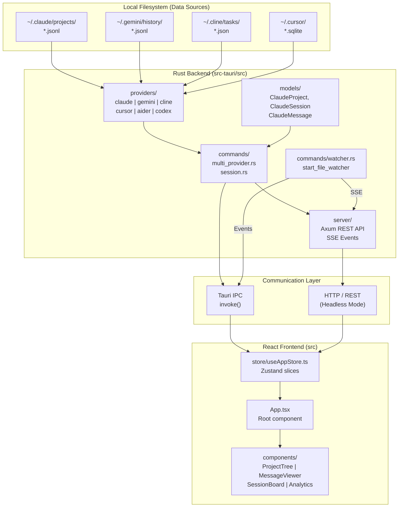
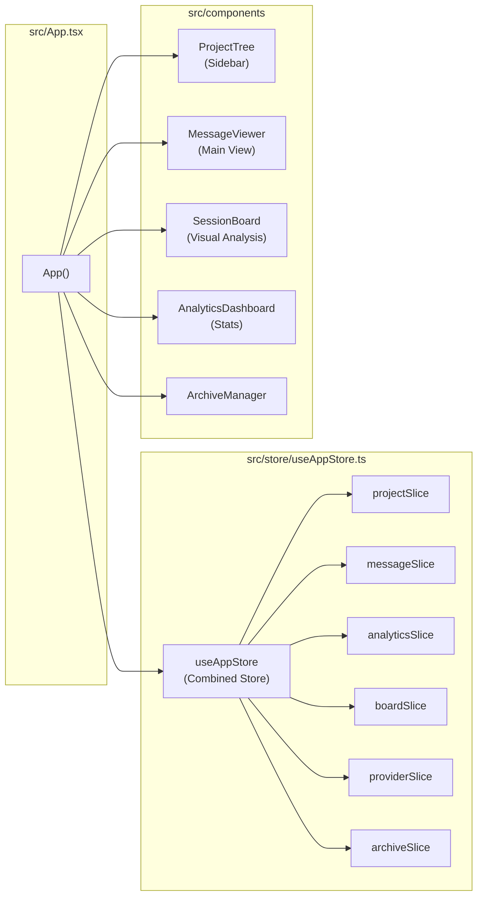

# 개요

<details>
<summary>관련 소스 파일</summary>

다음 파일들은 이 위키 페이지를 생성하기 위한 컨텍스트로 사용되었습니다:

- [CHANGELOG.md](CHANGELOG.md)
- [README.ja.md](README.ja.md)
- [README.ko.md](README.ko.md)
- [README.md](README.md)
- [README.zh-CN.md](README.zh-CN.md)
- [README.zh-TW.md](README.zh-TW.md)
- [docs/HOMEBREW.md](docs/HOMEBREW.md)
- [package.json](package.json)
- [src-tauri/Cargo.toml](src-tauri/Cargo.toml)
- [src-tauri/src/commands/mod.rs](src-tauri/src/commands/mod.rs)
- [src-tauri/src/lib.rs](src-tauri/src/lib.rs)
- [src-tauri/src/models.rs](src-tauri/src/models.rs)
- [src-tauri/tauri.conf.json](src-tauri/tauri.conf.json)
- [src/App.tsx](src/App.tsx)
- [src/components/MessageViewer.tsx](src/components/MessageViewer.tsx)
- [src/components/ProjectTree.tsx](src/components/ProjectTree.tsx)
- [src/hooks/index.ts](src/hooks/index.ts)
- [src/store/useAppStore.ts](src/store/useAppStore.ts)
- [src/test/ProjectTree.worktree.test.tsx](src/test/ProjectTree.worktree.test.tsx)
- [src/types/core/project.ts](src/types/core/project.ts)
- [src/types/index.ts](src/types/index.ts)

</details>


이 페이지는 Claude Code History Viewer가 무엇인지, 어떤 문제를 해결하는지, 그리고 기술 스택이 상위 수준에서 어떻게 구성되어 있는지를 설명합니다. 개별 시스템에 대한 더 자세한 내용은 문서 전반에 연결된 하위 페이지를 참조하세요.

---

## 목적

**Claude Code History Viewer (CCHV)**는 AI 코딩 어시스턴트를 위한 통합 히스토리 뷰어로, 오프라인 데스크톱 애플리케이션과 헤드리스 웹 서버 양쪽으로 동작합니다. 로컬 파일시스템에 저장된 대화 기록을 읽고, 탐색, 검색, 분석이 가능한 UI로 제공합니다. 어떤 데이터도 사용자 머신 밖으로 나가지 않습니다 [README.md:5-9]().

이 애플리케이션은 일곱 가지 AI 코딩 어시스턴트 제공자를 지원합니다:

| 제공자 | 기본 데이터 경로 |
|---|---|
| **Claude Code** | `~/.claude/projects/` |
| **Gemini CLI** | `~/.gemini/history/` |
| **Codex CLI** | `~/.codex/sessions/` |
| **Cline** | `~/.cline/tasks/` |
| **Cursor** | `~/.cursor/` |
| **Aider** | 프로젝트 디렉터리 |
| **OpenCode** | `~/.local/share/opencode/` |

각 제공자는 특정 형식(JSONL, SQLite 또는 JSON)으로 대화 데이터를 저장합니다. 애플리케이션은 Rust 백엔드를 통해 이러한 파일을 직접 읽으며, 백엔드는 Tauri IPC 브리지를 통해 React 프론트엔드에 구조화된 데이터를 노출하거나, 서버 모드에서는 Axum 기반 HTTP REST API를 통해 노출합니다 [README.md:68-78](), [src-tauri/Cargo.toml:60-66]().

설치 단계는 [Installation and Setup](#1.1) 페이지를 참조하세요. 사용자에게 노출되는 전체 기능 목록은 [Key Features](#1.2) 페이지를 참조하세요.

출처: [README.md:1-10](), [README.md:68-78](), [src-tauri/src/lib.rs:185-189]()

---

## 기술 스택

**계층별 상위 수준 스택:**

| 계층 | 기술 | 역할 |
|---|---|---|
| 데스크톱 런타임 | Tauri v2 | 네이티브 앱 셸, IPC 브리지, 시스템 플러그인 [src-tauri/tauri.conf.json:1-5]() |
| 헤드리스 서버 | Axum | 원격 접근을 위한 HTTP REST API 및 SSE 이벤트 [src-tauri/Cargo.toml:60-66]() |
| 백엔드 | Rust | 파일시스템 접근, 파싱, 통계, 파일 감시 [src-tauri/Cargo.toml:1-58]() |
| 프론트엔드 프레임워크 | React 19 + TypeScript | UI 렌더링 및 상태 관리 [package.json:58-67]() |
| 스타일링 | Tailwind CSS | 유틸리티 우선 스타일링 [package.json:91-92]() |
| 상태 관리 | Zustand | slice 패턴을 사용하는 전역 애플리케이션 스토어 [src/store/useAppStore.ts:1-9]() |
| 빌드 도구 | Vite | 프론트엔드 번들링 및 개발 서버 [package.json:95-96]() |
| 국제화 | i18next | 5개 언어 지원(en, ko, ja, zh-CN, zh-TW) [package.json:50-51]() |
| 명령 실행기 | `just` | 통합 빌드 및 개발 명령 [src-tauri/tauri.conf.json:9-10]() |

백엔드 코드는 `src-tauri/` 아래에 있고 프론트엔드는 `src/` 아래에 있습니다. Rust 크레이트는 `commands`, `models`, `providers`, `server`, `utils` 등을 포함한 모듈로 구성됩니다 [src-tauri/src/lib.rs:1-8]().

출처: [package.json:1-116](), [src-tauri/Cargo.toml:1-165](), [src-tauri/src/lib.rs:1-8](), [src/store/useAppStore.ts:1-117]()

---

## 저장소 레이아웃

**최상위 디렉터리 구조:**

```
claude-code-history-viewer/
├── src/                    # React/TypeScript frontend
│   ├── App.tsx             # Root component
│   ├── components/         # UI components (ProjectTree, MessageViewer, etc.)
│   ├── store/              # Zustand store and slices
│   ├── hooks/              # Custom React hooks
│   ├── types/              # Shared TypeScript types
│   └── utils/              # Frontend utility functions
├── src-tauri/              # Rust backend (Tauri application & Server)
│   └── src/
│       ├── lib.rs          # Entry point and command registration
│       ├── commands/       # All Tauri command handlers
│       ├── models/         # Rust data model structs
│       ├── providers/      # Provider-specific read logic
│       ├── server/         # Axum server for headless mode
│       └── utils/          # Rust utility functions
├── justfile                # Build/dev command runner recipes
└── scripts/                # i18n and build scripts
```

출처: [src-tauri/src/lib.rs:1-55](), [src/store/useAppStore.ts:1-117](), [src/App.tsx:1-21](), [package.json:14-17]()

---

## 시스템 아키텍처 다이어그램

**소스 데이터를 렌더링된 UI에 매핑하는 전체 시스템 토폴로지:**



출처: [src-tauri/src/lib.rs:111-191](), [src/App.tsx:23-68](), [src/store/useAppStore.ts:101-117](), [src-tauri/src/commands/watcher.rs:48-48](), [src-tauri/Cargo.toml:60-66]()

---

## 프론트엔드 컴포넌트-스토어 매핑

이 다이어그램은 주요 UI 컴포넌트를 이를 뒷받침하는 코드 구성 요소와 연결합니다.

**루트 컴포넌트와 상태 연결:**



출처: [src/App.tsx:24-68](), [src/store/useAppStore.ts:101-117](), [src/components/ProjectTree.tsx:3-3](), [src/store/useAppStore.ts:81-95]()

---

## 백엔드 명령 모듈

Rust 백엔드는 Tauri 명령(데스크톱)과 REST 엔드포인트(서버)를 통해 기능을 노출합니다. 이들은 [`src-tauri/src/lib.rs:111-191`]()에 등록됩니다.

| 모듈(`src-tauri/src/commands/`) | 책임 |
|---|---|
| `multi_provider.rs` | 제공자 감지, 제공자 간 프로젝트 스캔 및 검색 |
| `session.rs` | 세션/메시지 로드, 이름 변경, 검색, 파일 편집 복원 |
| `stats.rs` | 세션 및 프로젝트의 토큰 통계와 비용 분석 |
| `watcher.rs` | 실시간 업데이트를 위한 파일시스템 모니터링 |
| `claude_settings.rs` | Claude Code 설정 및 MCP 서버 구성 관리 |
| `metadata.rs` | 사용자 메타데이터(그룹화, 숨겨진 프로젝트, 사용자 지정 이름) 영속화 |
| `archive.rs` | 세션 아카이브 및 내보내기 관리 |
| `wsl.rs` | WSL 배포판 내부 프로젝트 감지 및 스캔 |

출처: [src-tauri/src/lib.rs:12-55](), [src-tauri/src/lib.rs:111-191]()

---

## 데이터 모델 개요

핵심 도메인 타입은 `src/types/`에 정의되어 있으며 Rust `models` 모듈에 반영됩니다.

| 타입 | 위치 | 설명 |
|---|---|---|
| `ClaudeProject` | `src/types/core/session.ts` | 프로젝트 디렉터리 정보, 세션 수, git 메타데이터 |
| `ClaudeSession` | `src/types/core/session.ts` | 단일 대화 파일에 대한 메타데이터 |
| `ClaudeMessage` | `src/types/core/message.ts` | 파싱된 단일 메시지(User, Assistant, Tool 등) |
| `SessionTokenStats` | `src/types/stats.types.ts` | 토큰 사용량, 비용, 모델 세부 정보 |
| `BoardSessionData` | `src/types/board.types.ts` | 다중 세션 Session Board를 위한 데이터 구조 |
| `UserMetadata` | `src/types/core/project.ts` | 사용자 선호도 및 영속 UI 상태 |

출처: [src/types/index.ts:15-38](), [src/types/index.ts:98-108](), [src/types/index.ts:194-209](), [src/types/index.ts:236-246]()

---

## 데이터 프라이버시

이 애플리케이션은 **100% 오프라인**입니다. 모든 데이터는 로컬 파일시스템에서 직접 읽습니다. 서버 모드에서도 데이터는 호스트 머신에 남아 있으며, 구성된 경우 Bearer 토큰 인증으로 통신이 보호됩니다 [README.md:9-9](), [README.md:78-78]().

---

## 다음으로 볼 곳

| 주제 | 페이지 |
|---|---|
| 세부 아키텍처 및 IPC 흐름 | [Architecture Overview](#2) |
| 프론트엔드 컴포넌트 계층 | [Frontend Architecture](#2.2) |
| Rust 백엔드 구성 | [Backend Architecture](#2.3) |
| 엔드투엔드 데이터 흐름 | [Data Flow](#2.4) |
| 다중 제공자 시스템 | [Multi-Provider System](#2.5) |
| 설치 | [Installation and Setup](#1.1) |
| 기능 목록 | [Key Features](#1.2) |
