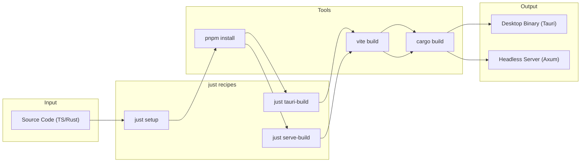
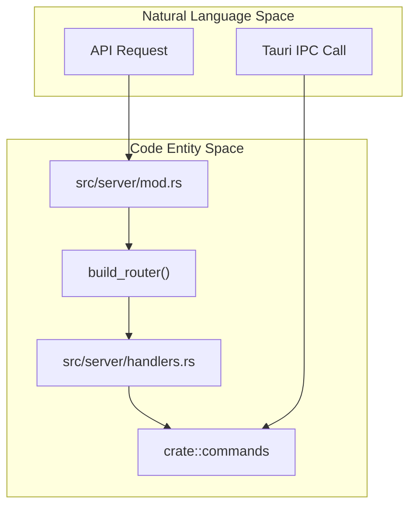

# 설치 및 설정

<details>
<summary>관련 소스 파일</summary>

다음 파일들은 이 위키 페이지를 생성하기 위한 컨텍스트로 사용되었습니다:

- [.dockerignore](.dockerignore)
- [.github/workflows/server-release.yml](.github/workflows/server-release.yml)
- [.github/workflows/updater-release.yml](.github/workflows/updater-release.yml)
- [Dockerfile](Dockerfile)
- [contrib/cchv.service](contrib/cchv.service)
- [docker-compose.yml](docker-compose.yml)
- [docs/server-guide.ko.md](docs/server-guide.ko.md)
- [docs/server-guide.md](docs/server-guide.md)
- [index.html](index.html)
- [install-server.sh](install-server.sh)
- [justfile](justfile)
- [pnpm-lock.yaml](pnpm-lock.yaml)
- [src-tauri/.cargo/config.toml](src-tauri/.cargo/config.toml)
- [src-tauri/capabilities/default.json](src-tauri/capabilities/default.json)
- [src-tauri/src/server/handlers.rs](src-tauri/src/server/handlers.rs)
- [src-tauri/src/server/mod.rs](src-tauri/src/server/mod.rs)
- [src/index.css](src/index.css)
- [src/utils/fileDialog.ts](src/utils/fileDialog.ts)
- [tailwind.config.js](tailwind.config.js)

</details>


이 페이지는 Claude Code History Viewer를 얻고 실행하는 방법을 설명합니다. 네 가지 설치 경로를 사용할 수 있습니다: Homebrew(macOS/Linux), 사전 빌드된 바이너리 다운로드(모든 플랫폼), `just` 명령 실행기를 사용한 소스 빌드, 그리고 헤드리스 환경을 위한 **WebUI Server Mode**입니다.

애플리케이션의 전체 아키텍처에 대한 정보는 [2]() 페이지를 참조하세요.

## 시스템 요구 사항

Claude Code History Viewer는 Tauri v2(데스크톱)와 Axum(서버)으로 빌드된 크로스 플랫폼 애플리케이션입니다.

### 지원 플랫폼

| 플랫폼 | 아키텍처 | 데스크톱 형식 | 서버 형식 |
|----------|-------------|----------------|---------------|
| **macOS** | Universal (ARM64 + x86_64) | `.dmg` | `.tar.gz` |
| **Windows** | x64 | `.exe` / Portable `.zip` | N/A |
| **Linux** | x64 / ARM64 | `.AppImage` | `.tar.gz` / Docker |

출처: [.github/workflows/updater-release.yml:59-70](), [.github/workflows/server-release.yml:21-34]()

### 실행 전제 조건

애플리케이션은 시작 시 다음 기본 제공자 위치에서 데이터를 읽습니다:

| 제공자 | 기본 데이터 경로 |
|----------|-------------------|
| **Claude Code** | `~/.claude/projects/` |
| **Codex CLI** | `~/.codex/sessions/` |
| **OpenCode** | `~/.local/share/opencode/` |

출처: [docs/server-guide.md:152-163](), [docs/server-guide.ko.md:150-161]()

---

## 설치 방법

### 방법 1: Homebrew(macOS 및 Linux)

이 애플리케이션은 `jhlee0409/tap`의 전용 tap을 통해 배포됩니다.

**데스크톱 앱(macOS Cask):**
```bash
brew install --cask jhlee0409/tap/claude-code-history-viewer
```

**헤드리스 서버(Formula):**
```bash
brew install jhlee0409/tap/cchv-server
```

출처: [docs/server-guide.md:60-62](), [docs/server-guide.md:141-142](), [.github/workflows/server-release.yml:154-171]()

---

### 방법 2: WebUI Server Mode(헤드리스)

애플리케이션은 독립 실행형 웹 서버로 실행할 수 있습니다. 이는 VPS, Docker 또는 원격 접근에 적합합니다. 서버 바이너리는 `rust-embed`를 사용해 프론트엔드를 내장합니다 [src-tauri/src/server/mod.rs:42-44]().

**빠른 시작:**
```bash
# Run the server
cchv-server --serve
```

**CLI 옵션:**
| 플래그 | 기본값 | 설명 |
|------|---------|-------------|
| `--serve` | — | **필수.** 데스크톱 UI 대신 HTTP 서버를 시작합니다 [src-tauri/src/server/mod.rs:180-188]() |
| `--port` | `3727` | 서버 포트 [src-tauri/src/server/mod.rs:50-52]() |
| `--host` | `0.0.0.0` | 바인드 주소 [src-tauri/src/server/mod.rs:55-56]() |
| `--token` | UUID v4 | 브라우저 접근을 위한 사용자 지정 인증 토큰 [src-tauri/src/server/mod.rs:49-52]() |

출처: [src-tauri/src/server/mod.rs:1-56](), [docs/server-guide.md:176-190]()

#### Docker 배포
내장된 자산과 함께 서버를 빌드하기 위한 멀티 스테이지 `Dockerfile`이 제공됩니다 [Dockerfile:1-57]().

```bash
docker compose up -d
```
출처: [Dockerfile:1-57](), [docker-compose.yml:1-15]()

---

### 방법 3: 소스에서 빌드

소스에서 빌드하려면 Node.js 20, pnpm 9+, Rust 툴체인이 필요합니다.

#### `justfile` 사용(권장)

프로젝트는 기본 태스크 실행기로 `justfile` [justfile:1-197]()을 사용합니다.

| 레시피 | 명령 | 목적 |
|--------|---------|---------|
| `just setup` | `mise install` + `pnpm install` | 환경 초기화 [justfile:17-22]() |
| `just dev` | `tauri dev` | 데스크톱 개발 모드 [justfile:44-45]() |
| `just tauri-build` | `tauri build` | 프로덕션 데스크톱 앱 빌드 [justfile:69-76]() |
| `just serve-build` | `cargo build --release --features webui-server` | 헤드리스 서버 빌드 [justfile:112-113]() |

**다이어그램: 빌드 파이프라인 흐름**



출처: [justfile:17-22](), [justfile:112-113](), [Dockerfile:4-32]()

---

## 기술 구현

### 서버 모드 아키텍처
`webui-server` 기능 플래그는 Axum 기반 HTTP 서버를 활성화합니다 [src-tauri/src/server/mod.rs:1-4](). 이는 `handlers` 모듈을 통해 Tauri 명령 로직을 REST 엔드포인트에 매핑합니다 [src-tauri/src/server/handlers.rs:1-15]().

**다이어그램: 코드 엔티티 매핑(서버 vs 데스크톱)**



출처: [src-tauri/src/server/mod.rs:47-162](), [src-tauri/src/server/handlers.rs:1-15]()

### `justfile` 로직
`justfile`은 macOS용 Universal Binaries 생성 [justfile:74-76]() 및 `package.json`과 `Cargo.toml` 사이의 버전 번호 동기화 [justfile:79-80]()와 같은 복잡한 플랫폼별 작업을 자동화합니다.

출처: [justfile:74-80](), [justfile:112-113]()

---

## 문제 해결

### Linux AppImage 충돌
롤링 릴리스 배포판(예: Arch Linux)에서는 EGL/Mesa 라이브러리 불일치로 인해 AppImage가 충돌할 수 있습니다. CI 파이프라인에는 이러한 충돌 라이브러리를 제거하기 위한 후처리 단계가 포함되어 있습니다 [ .github/workflows/updater-release.yml:186-215]().

### 버전 불일치
Rust 백엔드와 프론트엔드가 서로 다른 버전을 보고하는 경우 동기화 스크립트를 실행하세요:
```bash
just sync-version
```
출처: [justfile:79-80]()

## 데이터 프라이버시 및 보안

애플리케이션은 **100% 오프라인**입니다.
- **데스크톱 모드**: 권한은 Tauri capabilities를 통해 엄격하게 제어됩니다 [src-tauri/capabilities/default.json:1-24]().
- **서버 모드**: **Bearer 토큰 인증** [src-tauri/src/server/mod.rs:49-52]()과 구성 가능한 CORS [src-tauri/src/server/mod.rs:49-62]()를 포함합니다.
- **Systemd**: 제공되는 서비스 파일에는 `ProtectSystem=strict` 및 `NoNewPrivileges=true` 같은 보안 강화 설정이 포함되어 있습니다 [contrib/cchv.service:38-52]().

출처: [src-tauri/capabilities/default.json:1-24](), [src-tauri/src/server/mod.rs:49-62](), [contrib/cchv.service:38-52]()

## 자동 업데이트 시스템

데스크톱 애플리케이션에는 GitHub에서 서명된 릴리스를 확인하는 내장 업데이터가 있습니다 [.github/workflows/updater-release.yml:1-51](). Tauri의 업데이트 프로토콜을 위한 자동 메타데이터 생성을 지원합니다.

출처: [.github/workflows/updater-release.yml:1-51](), [src-tauri/capabilities/default.json:15-16]()
