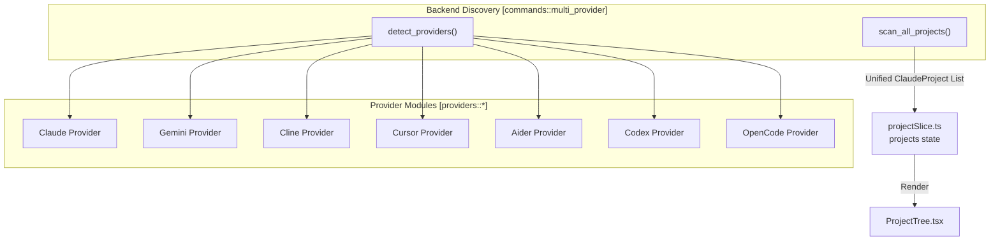
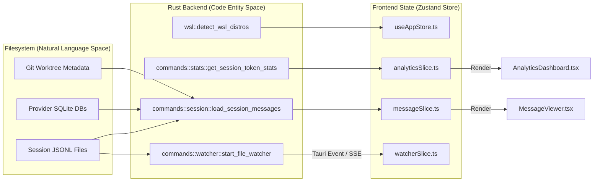

# 주요 기능

관련 소스 파일

다음 파일들은 이 위키 페이지를 생성하기 위한 컨텍스트로 사용되었습니다:

- [CHANGELOG.md](CHANGELOG.md)
- [README.ja.md](README.ja.md)
- [README.ko.md](README.ko.md)
- [README.md](README.md)
- [README.zh-CN.md](README.zh-CN.md)
- [README.zh-TW.md](README.zh-TW.md)
- [docs/HOMEBREW.md](docs/HOMEBREW.md)
- [package.json](package.json)
- [src-tauri/Cargo.toml](src-tauri/Cargo.toml)
- [src-tauri/src/commands/mod.rs](src-tauri/src/commands/mod.rs)
- [src-tauri/src/lib.rs](src-tauri/src/lib.rs)
- [src-tauri/src/models.rs](src-tauri/src/models.rs)
- [src-tauri/tauri.conf.json](src-tauri/tauri.conf.json)
- [src/App.tsx](src/App.tsx)
- [src/components/ArchiveManager/ArchiveBrowser.tsx](src/components/ArchiveManager/ArchiveBrowser.tsx)
- [src/components/ArchiveManager/ArchiveOverview.tsx](src/components/ArchiveManager/ArchiveOverview.tsx)
- [src/components/MessageViewer.tsx](src/components/MessageViewer.tsx)
- [src/components/ProjectTree.tsx](src/components/ProjectTree.tsx)
- [src/hooks/index.ts](src/hooks/index.ts)
- [src/hooks/useProjectSessions.ts](src/hooks/useProjectSessions.ts)
- [src/store/slices/archiveSlice.ts](src/store/slices/archiveSlice.ts)
- [src/store/useAppStore.ts](src/store/useAppStore.ts)
- [src/test/ArchiveBrowser.test.tsx](src/test/ArchiveBrowser.test.tsx)
- [src/test/ProjectTree.worktree.test.tsx](src/test/ProjectTree.worktree.test.tsx)
- [src/test/archiveSlice.test.ts](src/test/archiveSlice.test.ts)
- [src/test/useProjectSessions.test.tsx](src/test/useProjectSessions.test.tsx)
- [src/types/core/project.ts](src/types/core/project.ts)
- [src/types/index.ts](src/types/index.ts)

## 목적 및 범위

Claude Code History Viewer (CCHV)는 여러 AI 코딩 어시스턴트의 대화 기록을 탐색, 검색, 분석하도록 설계된 통합 오프라인 데스크톱 애플리케이션이자 헤드리스 웹 서버입니다. 이 문서는 7개 제공자 지원, 시각적 세션 분석, 실시간 모니터링을 포함한 핵심 기능의 기술 구현과 사용자 대상 기능을 자세히 설명합니다.

---

## 기능 개요

CCHV는 여러 AI 어시스턴트의 데이터 형식을 통합 인터페이스로 추상화하며, Tauri 기반 데스크톱 앱과 헤드리스 Axum 서버를 모두 지원합니다.

| 범주 | 주요 기능 | 주요 코드 엔티티 |
|----------|------------------|-------------------|
| **다중 제공자** | 7개 제공자 지원(Claude, Gemini, Cline 등) | `detect_providers`, `providerSlice` |
| **프로젝트 관리** | 스캔, worktree 그룹화, WSL 지원 | `scan_projects`, `ProjectTree`, `projectSlice` |
| **세션 분석** | 다중 세션 보드, 속성 브러싱, 타임라인 | `SessionBoard`, `boardSlice`, `ActivityTimeline` |
| **메시지 보기** | 가상 스크롤링, ANSI 렌더링, 내보내기 | `MessageViewer`, `MessageNavigator`, `messageSlice` |
| **분석** | 토큰 통계, 비용 세부 내역, 히트맵 | `get_global_stats_summary`, `AnalyticsDashboard` |
| **시스템 서비스** | 파일 감시, 자동 업데이트, Archive Manager | `start_file_watcher`, `useUpdater`, `ArchiveManager` |

**출처:** [src/App.tsx:23-68](), [src-tauri/src/lib.rs:111-191](), [README.md:90-103]()

---

## 다중 제공자 대화 브라우저

이 애플리케이션은 **일곱 가지** AI 코딩 어시스턴트를 위한 통합 뷰어로 작동합니다.

### 지원 제공자
백엔드는 표준 로컬 파일시스템 경로나 프로젝트별 디렉터리를 확인하여 설치된 제공자를 감지합니다.

| 제공자 | 데이터 소스 | 경로 규칙 |
|----------|-------------|-----------------|
| **Claude Code** | JSONL | `~/.claude/projects/` |
| **Gemini CLI** | SQLite/JSON | `~/.gemini/history/` |
| **Codex CLI** | JSON | `~/.codex/sessions/` |
| **Cline** | JSON | `~/.cline/tasks/` |
| **Cursor** | SQLite | `~/.cursor/` |
| **Aider** | JSON/Markdown | 프로젝트 디렉터리 |
| **OpenCode** | JSON | `~/.local/share/opencode/` |

**출처:** [README.md:68-76](), [src-tauri/src/lib.rs:31-34](), [src-tauri/src/lib.rs:185-189]()

### 제공자 발견 흐름

**출처:** [src-tauri/src/lib.rs:31-34](), [src-tauri/src/lib.rs:185-189](), [src/store/slices/providerSlice.ts:62-64]()

---

## 시각적 분석을 제공하는 Session Board

**Session Board**는 세션 간 워크플로 분석을 위한 다중 세션 타임라인 보기를 제공하며, `boardSlice`가 이를 관리합니다.

### 다단계 확대/축소 및 시각화
`InteractionCard` 컴포넌트는 세 가지 서로 다른 확대/축소 수준으로 세션 데이터를 렌더링합니다:
1.  **Pixel View**: 카드 높이가 토큰 수로 결정되는 고밀도 히트맵입니다.
2.  **Skim View**: 도구 아이콘(터미널, 파일, 웹)을 표시하는 압축 카드입니다.
3.  **Read View**: 메시지 일부와 정확한 토큰 지표를 표시하는 상세 카드입니다.

**출처:** [src/store/slices/boardSlice.ts:42-44](), [src/types/board.types.ts:241-251](), [README.md:104]()

### 활동 타임라인
보드에는 `SessionActivityTimeline`과 `ContributionGrid` SVG 막대 차트가 포함됩니다. `useActivityData` 훅은 원시 세션 데이터에서 일별 활동 지표와 연속 활동 기록을 계산하고 날짜 필터링을 처리합니다.

**출처:** [src/types/board.types.ts:247](), [src/store/slices/boardSlice.ts:1-117]()

---

## 분석 및 토큰 관리

**Analytics Dashboard**는 비용과 사용량 투명성을 제공합니다.

### 듀얼 모드 토큰 통계
시스템은 `get_session_token_stats`와 `get_global_stats_summary`를 통해 두 가지 모드로 통계를 계산합니다:
-   **Billing Total**: 모든 오버헤드(프롬프트 캐싱, 시스템 지침)를 포함합니다.
-   **Conversation Only**: 실제 사용자/어시스턴트 교환에 초점을 맞춥니다.

### 비용 및 분포
대시보드에는 비용 계산을 위해 `MODEL_PRICING`을 사용하는 `BillingBreakdownCard`와 7개 지원 어시스턴트 전반의 사용량을 비교하는 `ProviderDistributionChart`가 포함됩니다.

**출처:** [src-tauri/src/lib.rs:46-49](), [src/types/stats.types.ts:199-214](), [src/types/analytics.ts:233-238]()

---

## 시스템 서비스

### Archive Manager
사용자는 `ArchiveManager`를 통해 장기 기록을 관리할 수 있습니다.
-   **생성**: `create_archive` 명령은 세션을 관리형 저장 영역으로 패키징합니다.
-   **탐색**: `ArchiveBrowser`는 다시 가져오지 않고도 아카이브된 세션을 볼 수 있게 합니다.
-   **내보내기**: 세션을 HTML, Markdown 또는 JSON으로 내보내는 기능을 지원합니다.

**출처:** [src-tauri/src/lib.rs:13-18](), [src-tauri/src/lib.rs:191-193](), [src/store/slices/archiveSlice.ts:66-68]()

### 실시간 파일 모니터링
`watcher.rs` 모듈은 디바운스된 파일 감시기를 활용합니다. 세션 파일이 업데이트되면(예: 활성 Claude Code 세션 중), 백엔드는 Tauri 이벤트 브리지 또는 SSE(서버 모드)를 통해 프론트엔드 `watcherSlice`로 이벤트를 푸시합니다.

**출처:** [src-tauri/src/lib.rs:53](), [src-tauri/src/lib.rs:182-183](), [src/store/slices/watcherSlice.ts:54-56]()

### WSL 지원
Windows 사용자를 위해 CCHV는 Linux 배포판 내부의 프로젝트를 스캔할 수 있습니다. `wsl.rs` 모듈은 설치된 배포판을 감지하고 파일시스템 간극을 연결하여 WSL 환경에서 Claude Code 프로젝트를 로드합니다.

**출처:** [src-tauri/src/lib.rs:54](), [src-tauri/src/lib.rs:125](), [src/types/core/project.ts:113-114]()

---

## 데이터 흐름 아키텍처

이 다이어그램은 원시 파일시스템 데이터에서 UI 컴포넌트까지의 흐름을 추적합니다.

**출처:** [src-tauri/src/lib.rs:1-55](), [src/store/useAppStore.ts:81-117](), [src/App.tsx:23-68](), [src-tauri/src/models.rs:1-10]()
