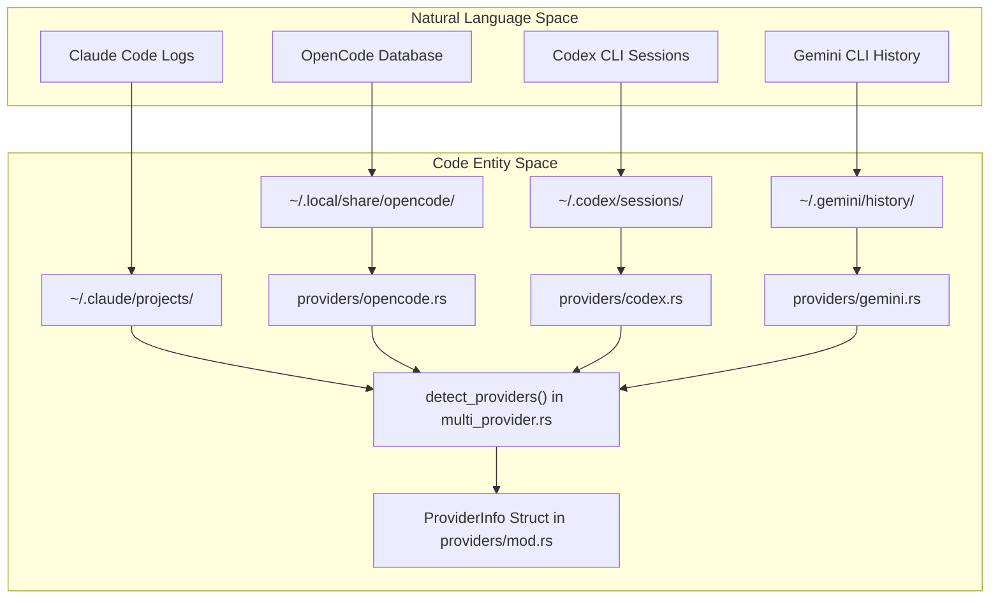
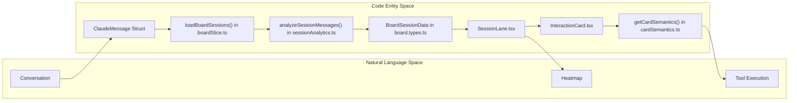

# 용어집

관련 소스 파일

다음 파일들은 이 위키 페이지를 생성하기 위한 컨텍스트로 사용되었습니다.

- [CHANGELOG.md](CHANGELOG.md)
- [README.ja.md](README.ja.md)
- [README.ko.md](README.ko.md)
- [README.md](README.md)
- [README.zh-CN.md](README.zh-CN.md)
- [README.zh-TW.md](README.zh-TW.md)
- [docs/HOMEBREW.md](docs/HOMEBREW.md)
- [package.json](package.json)
- [src-tauri/Cargo.toml](src-tauri/Cargo.toml)
- [src-tauri/src/commands/mod.rs](src-tauri/src/commands/mod.rs)
- [src-tauri/src/lib.rs](src-tauri/src/lib.rs)
- [src-tauri/src/models.rs](src-tauri/src/models.rs)
- [src-tauri/src/providers/codex.rs](src-tauri/src/providers/codex.rs)
- [src-tauri/src/providers/gemini.rs](src-tauri/src/providers/gemini.rs)
- [src-tauri/src/providers/opencode.rs](src-tauri/src/providers/opencode.rs)
- [src-tauri/src/utils.rs](src-tauri/src/utils.rs)
- [src-tauri/tauri.conf.json](src-tauri/tauri.conf.json)
- [src/App.tsx](src/App.tsx)
- [src/components/MessageViewer.tsx](src/components/MessageViewer.tsx)
- [src/components/ProjectTree.tsx](src/components/ProjectTree.tsx)
- [src/components/SessionBoard/BoardControls.tsx](src/components/SessionBoard/BoardControls.tsx)
- [src/components/SessionBoard/InteractionCard.tsx](src/components/SessionBoard/InteractionCard.tsx)
- [src/components/SessionBoard/SessionBoard.tsx](src/components/SessionBoard/SessionBoard.tsx)
- [src/components/SessionBoard/SessionLane.tsx](src/components/SessionBoard/SessionLane.tsx)
- [src/components/SmartJsonDisplay.tsx](src/components/SmartJsonDisplay.tsx)
- [src/components/ToolIcon.tsx](src/components/ToolIcon.tsx)
- [src/components/contentRenderer/ClaudeContentArrayRenderer.tsx](src/components/contentRenderer/ClaudeContentArrayRenderer.tsx)
- [src/components/contentRenderer/OpenCodeStepRenderer.tsx](src/components/contentRenderer/OpenCodeStepRenderer.tsx)
- [src/hooks/index.ts](src/hooks/index.ts)
- [src/i18n/locales/en/renderers.json](src/i18n/locales/en/renderers.json)
- [src/i18n/locales/ja/renderers.json](src/i18n/locales/ja/renderers.json)
- [src/i18n/locales/ko/renderers.json](src/i18n/locales/ko/renderers.json)
- [src/i18n/locales/zh-CN/renderers.json](src/i18n/locales/zh-CN/renderers.json)
- [src/i18n/locales/zh-TW/renderers.json](src/i18n/locales/zh-TW/renderers.json)
- [src/store/slices/boardSlice.ts](src/store/slices/boardSlice.ts)
- [src/store/useAppStore.ts](src/store/useAppStore.ts)
- [src/test/ProjectTree.worktree.test.tsx](src/test/ProjectTree.worktree.test.tsx)
- [src/types/board.types.ts](src/types/board.types.ts)
- [src/types/core/project.ts](src/types/core/project.ts)
- [src/types/index.ts](src/types/index.ts)
- [src/utils/sessionAnalytics.ts](src/utils/sessionAnalytics.ts)
- [src/utils/toolSummaries.ts](src/utils/toolSummaries.ts)

이 페이지는 Claude Code History Viewer(CCHV) 전반에서 사용되는 codebase 고유 용어, 전문 용어, domain concept를 정의합니다. 자연어 concept와 Rust 백엔드 및 React 프론트엔드의 기술적 구현 사이의 mapping을 제공합니다.

## Domain Concepts

### Provider
"Provider"는 conversation log를 생성하는 특정 AI coding assistant를 나타냅니다. CCHV는 여러 provider를 통합된 interface로 추상화합니다.
*   **Claude Code**: 주요 provider이며, log를 `~/.claude/projects/`에 저장합니다 [README.md:68-70]().
*   **Gemini CLI**: history를 `~/.gemini/history/`에 저장합니다 [README.md:71]().
*   **Codex CLI**: session rollout을 `~/.codex/sessions/`에 저장합니다 [README.md:72]().
*   **Cline**: task를 `~/.cline/tasks/`에 저장합니다 [README.md:73]().
*   **Cursor**: composer/chat log를 `~/.cursor/`에 저장합니다 [README.md:74]().
*   **Aider**: log를 project directory에 저장합니다 [README.md:75]().
*   **OpenCode**: session을 `~/.local/share/opencode/`에 저장합니다 [README.md:76]().

### Project
session의 논리적 grouping이며, 일반적으로 git repository 또는 특정 workspace directory에 대응합니다 [src-tauri/src/providers/opencode.rs:147-151]().
*   **구현**: `ClaudeProject` struct로 표현됩니다 [src-tauri/src/models.rs:11-25]().
*   **Grouping**: project는 `worktree` 또는 `directory` 기준으로 grouping될 수 있습니다 [src/App.tsx:162-166]().

### Session
사용자와 AI assistant 간의 단일 연속 conversation입니다.
*   **구현**: `ClaudeSession` struct로 표현됩니다 [src/types/index.ts:102-124]().
*   **Sidechain**: token usage를 포함할 수 있지만 primary message flow에는 속하지 않는 보조 background process(예: thinking 또는 progress update)를 의미합니다 [src-tauri/src/commands/stats.rs:34-42]().

### Board / Session Board
여러 session을 grid 또는 lane layout에서 나란히 보기 위한 상위 수준 시각 분석 도구입니다 [src/components/SessionBoard/SessionBoard.tsx:20-40]().

---

## 기술 용어 및 약어

| 용어 | 정의 | 코드 위치 |
| :--- | :--- | :--- |
| **ANSI** | terminal color 및 formatting의 표준입니다. `ansi-to-html` utility를 통해 rendering됩니다. | [package.json:43](), [src-tauri/src/commands/session.rs:120-140]() |
| **Brushing** | Session Board에서 attribute(예: tool name)에 hover하면 모든 lane에서 matching card를 highlight하는 filtering mechanism입니다. | [src/components/SessionBoard/SessionBoard.tsx:117-155](), [src/components/SessionBoard/BoardControls.tsx:104-105]() |
| **Frecency** | 가장 관련성 높은 terminal command 또는 tool의 rank를 매기기 위해 사용하는 **Frequency**와 **Recency**의 조합입니다. | [src/components/SessionBoard/SessionBoard.tsx:157-160]() |
| **IPC** | Inter-Process Communication입니다. Tauri에서는 TypeScript와 Rust 사이의 `invoke` bridge입니다. | [src-tauri/src/lib.rs:111-191]() |
| **JSONL** | JSON Lines format입니다. Codex 및 Gemini 같은 provider가 session rollout을 저장하는 데 사용합니다. | [src-tauri/src/providers/codex.rs:68-73](), [src-tauri/src/commands/stats.rs:182-186]() |
| **MCP** | Model Context Protocol입니다. AI model을 외부 tool 및 data source에 연결하기 위한 표준입니다. | [src/components/SessionBoard/InteractionCard.tsx:115-117](), [src-tauri/src/commands/claude_settings.rs:100-120]() |
| **Rollout** | session log file(예: `rollout-*.jsonl`)을 가리키는 Codex 고유 용어입니다. | [src-tauri/src/providers/codex.rs:68-73](), [src-tauri/src/commands/stats.rs:178-186]() |
| **Sidechain** | "Conversation Only" stats mode에서 종종 제외되는 background token usage(예: `progress`, `queue-operation`)입니다. | [src-tauri/src/commands/stats.rs:66-71]() |

---

## System Mapping: 자연어에서 코드로

다음 다이어그램은 사용자에게 보이는 concept를 특정 code entity 및 data structure와 연결합니다.

### Data Provider Discovery
이 다이어그램은 system이 물리적 file location을 Provider entity로 mapping하는 방식을 보여줍니다.

**출처:** [src-tauri/src/lib.rs:30-33](), [src-tauri/src/providers/opencode.rs:23-34](), [src-tauri/src/providers/codex.rs:14-26](), [README.md:68-76]()

### Session Board Data Flow
이 다이어그램은 raw message가 Session Board의 시각적 "Lane"과 "Card"로 변환되는 방식을 보여줍니다.

**출처:** [src/store/slices/boardSlice.ts:114-153](), [src/components/SessionBoard/SessionLane.tsx:60-115](), [src/components/SessionBoard/InteractionCard.tsx:108-117](), [src/utils/sessionAnalytics.ts](), [src/types/board.types.ts:35-45]()

---

## State 및 Storage 용어

### AppStore
`useAppStore.ts`에서 생성되는 global Zustand store이며, 여러 "slice"를 합성합니다 [src/store/useAppStore.ts:101-117]().

### Slice Pattern
global store를 domain별 module로 분할하는 state management pattern입니다.
*   **`projectSlice`**: project scanning, selection, grouping logic을 관리합니다 [src/store/slices/projectSlice.ts]().
*   **`boardSlice`**: session board data, zoom level, attribute brushing을 관리합니다 [src/store/slices/boardSlice.ts:18-30]().
*   **`metadataSlice`**: 사용자 정의 rename, hidden project, persistent metadata storage를 처리합니다 [src/store/slices/metadataSlice.ts]().

### Stats Mode
token cost가 계산되는 방식을 결정합니다 [src-tauri/src/commands/stats.rs:27-31]().
*   **`billing_total`**: 모든 message와 sidechain process(예: thinking time)를 포함합니다.
*   **`conversation_only`**: 실제 chat cost를 보여주기 위해 system noise와 sidechain token usage를 제외합니다.

---

## UI Components 및 Interactions

### Zoom Levels
Session Board의 특정 보기 mode이며, detail 수준과 layout을 결정합니다 [src/types/board.types.ts:11-16]().
1.  **Pixel (0)**: token density와 activity pattern을 보여주는 heatmap/miniature view입니다 [src/components/SessionBoard/SessionLane.tsx:152-173]().
2.  **Skim (1)**: tool usage와 conversation flow를 빠르게 훑어보기 위한 icon 기반 view입니다 [src/components/SessionBoard/SessionLane.tsx:179-183]().
3.  **Read (2)**: chat interface와 유사한 full content view이며, readability에 최적화되어 있습니다 [src/components/SessionBoard/SessionLane.tsx:185-188]().

### Semantic Variants
일관된 styling, iconography, brushing에 사용되는 tool execution 및 message type의 categorization입니다.
*   **`terminal`**: shell command 및 script execution [src/components/SessionBoard/SessionBoard.tsx:129-130]().
*   **`mcp`**: Model Context Protocol server와의 interaction [src/components/SessionBoard/SessionBoard.tsx:117-120]().
*   **`git`**: 구체적으로 식별된 git command(commit, log 등) [src/components/SessionBoard/SessionBoard.tsx:140-142]().
*   **`file_edit`**: file modification operation(write, edit, patch) [src/components/SessionBoard/InteractionCard.tsx:38-51]().

**출처:** [src/components/SessionBoard/BoardControls.tsx:64-99](), [src/components/SessionBoard/InteractionCard.tsx:112-117](), [src/utils/toolIconUtils.ts](), [src/utils/cardSemantics.ts]()
