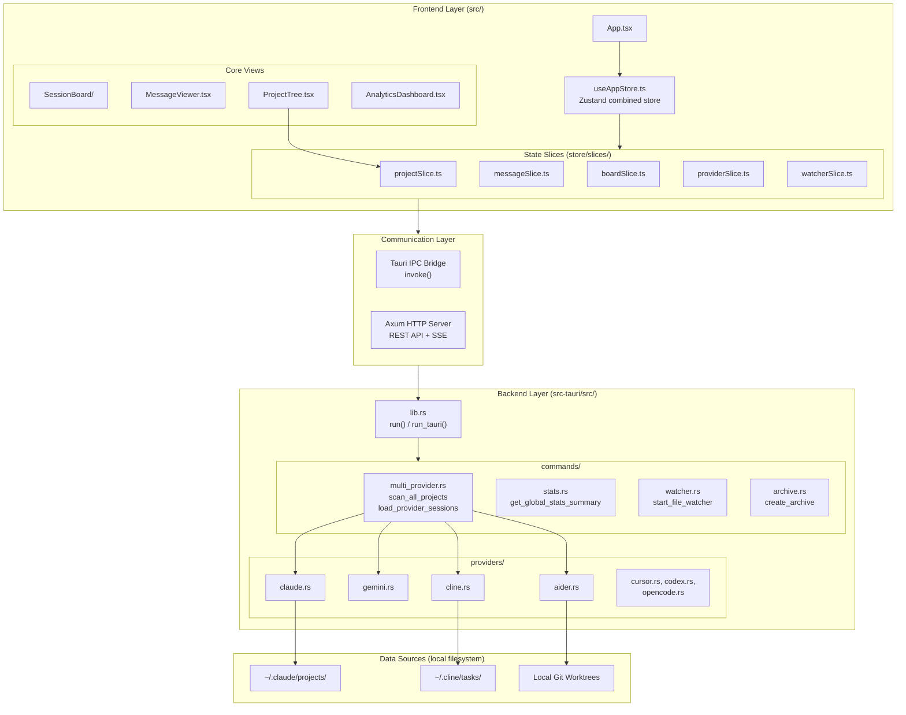
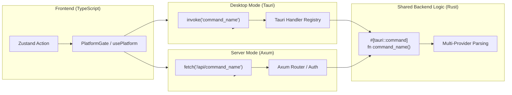

# 아키텍처 개요

<details>
<summary>관련 소스 파일</summary>

다음 파일들은 이 위키 페이지를 생성하기 위한 컨텍스트로 사용되었습니다:

- [CHANGELOG.md](CHANGELOG.md)
- [README.ja.md](README.ja.md)
- [README.ko.md](README.ko.md)
- [README.md](README.md)
- [README.zh-CN.md](README.zh-CN.md)
- [README.zh-TW.md](README.zh-TW.md)
- [docs/HOMEBREW.md](docs/HOMEBREW.md)
- [package.json](package.json)
- [src-tauri/Cargo.toml](src-tauri/Cargo.toml)
- [src-tauri/src/commands/mod.rs](src-tauri/src/commands/mod.rs)
- [src-tauri/src/lib.rs](src-tauri/src/lib.rs)
- [src-tauri/src/models.rs](src-tauri/src/models.rs)
- [src-tauri/tauri.conf.json](src-tauri/tauri.conf.json)
- [src/App.tsx](src/App.tsx)
- [src/components/MessageViewer.tsx](src/components/MessageViewer.tsx)
- [src/components/ProjectTree.tsx](src/components/ProjectTree.tsx)
- [src/hooks/index.ts](src/hooks/index.ts)
- [src/store/useAppStore.ts](src/store/useAppStore.ts)
- [src/test/ProjectTree.worktree.test.tsx](src/test/ProjectTree.worktree.test.tsx)
- [src/types/core/project.ts](src/types/core/project.ts)
- [src/types/index.ts](src/types/index.ts)

</details>


## 목적 및 범위

이 문서는 Claude Code History Viewer의 시스템 아키텍처를 상위 수준에서 개괄하며, 주요 하위 시스템과 이들이 상호 작용하는 방식을 설명합니다. 헤드리스 서버 모드를 포함해 애플리케이션 전반에서 사용되는 3계층 아키텍처(프론트엔드, 백엔드, 빌드 시스템), 기술 스택, 핵심 아키텍처 패턴을 소개합니다.

특정 하위 시스템에 대한 자세한 정보:
- **System Architecture**: 전체 토폴로지, 파일 감시기 사이드 채널, 헤드리스 서버 모드. [System Architecture](#2.1)를 참조하세요.
- **Frontend Architecture**: React 컴포넌트 계층과 Zustand 상태 관리. [Frontend Architecture](#2.2)를 참조하세요.
- **Backend Architecture**: Rust 명령 모듈과 다중 제공자 로직. [Backend Architecture](#2.3)를 참조하세요.
- **Data Flow**: JSONL/SQLite 파일에서 UI 컴포넌트까지의 엔드투엔드 추적. [Data Flow](#2.4)를 참조하세요.
- **Multi-Provider System**: Claude Code, Gemini, Codex, Cline, Cursor, Aider, OpenCode 추상화. [Multi-Provider System](#2.5)를 참조하세요.

---

## 3계층 아키텍처

애플리케이션은 세 개의 뚜렷한 아키텍처 계층으로 구성됩니다:

### 프론트엔드 계층(React + TypeScript)
React 19, TypeScript, Vite로 빌드된 데스크톱 UI이며, 상태 관리에는 Zustand를 사용합니다. 프론트엔드는 세션 데이터를 렌더링하고 사용자 상호작용을 관리하며, Tauri의 IPC 시스템 또는 서버 모드의 HTTP REST API를 통해 백엔드와 통신합니다.

**주요 기술:**
- `react` 19 — UI 프레임워크 [package.json:58-58]()
- `zustand` — 상태 관리 [src/store/useAppStore.ts:8-8]()
- `@tanstack/react-virtual` — 성능을 위한 가상 스크롤링 [package.json:34-34]()
- `i18next` — 5개 언어를 지원하는 국제화 [src/App.tsx:2-2]()

### 백엔드 계층(Rust + Tauri)
파일 시스템 작업, 세션 파싱, 분석 계산, 파일 감시를 처리하는 네이티브 Rust 백엔드입니다. `lib.rs`에 선언된 최상위 모듈인 `commands`, `models`, `providers`, `utils`로 구성됩니다. 선택적으로 헤드리스 모드를 위한 `axum` 서버를 포함합니다.

| 모듈 | 경로 | 역할 |
|--------|------|------|
| `commands` | `src-tauri/src/commands/` | 프론트엔드에 노출되는 Tauri 명령 핸들러 [src-tauri/src/lib.rs:13-55]() |
| `models` | `src-tauri/src/models/` | 공유 Rust 데이터 구조 [src-tauri/src/lib.rs:2-2]() |
| `providers` | `src-tauri/src/providers/` | 제공자별 데이터 읽기 로직(7개 제공자) [src-tauri/src/lib.rs:3-3]() |
| `server` | `src-tauri/src/server/` | 헤드리스 WebUI 모드를 위한 Axum HTTP 서버 [src-tauri/src/lib.rs:8-8]() |

### 빌드 시스템
태스크 자동화를 위한 `justfile`, CI/CD를 위한 GitHub Actions, 배포를 위한 Tauri updater plugin을 사용하는 개발 및 릴리스 파이프라인입니다.

**출처:** [src-tauri/src/lib.rs:1-55](), [src/App.tsx:1-21](), [src/store/useAppStore.ts:1-75](), [package.json:1-68]()

---

## 코드 엔티티로 본 시스템 개요

다음 다이어그램은 세 아키텍처 계층을 보여주고, 다중 제공자 백엔드를 포함해 코드베이스의 특정 코드 엔티티에 매핑합니다:

**시스템 토폴로지 — 코드 엔티티 맵**



**출처:** [src/App.tsx:23-68](), [src/store/useAppStore.ts:81-117](), [src-tauri/src/lib.rs:111-191](), [README.md:68-76]()

---

## Tauri IPC 및 서버 명령 흐름

애플리케이션은 표준 Tauri 데스크톱 앱과 헤드리스 WebUI 서버라는 두 가지 주요 실행 모드를 지원합니다.



**명령 등록 예시:**

백엔드는 [src-tauri/src/lib.rs:117-191]()에서 Tauri 환경을 위한 명령을 등록합니다:
```rust
.invoke_handler(tauri::generate_handler![
    scan_all_projects,
    load_provider_sessions,
    load_provider_messages,
    get_global_stats_summary,
    start_file_watcher,
    // ...
])
```

**출처:** [src-tauri/src/lib.rs:117-191](), [src/App.tsx:77-77](), [src-tauri/Cargo.toml:19-19]()

---

## 상태 관리 아키텍처

애플리케이션은 도메인별로 상태를 구성하기 위해 slice 패턴과 함께 Zustand를 사용합니다. `AppStore`는 15개의 전문화된 slice를 조합한 것입니다.

**Slice 인벤터리(`useAppStore.ts` 기준):**

| Slice | 도메인 |
|-------|--------|
| `projectSlice` | 프로젝트 및 세션 선택 [src/store/useAppStore.ts:10-12]() |
| `messageSlice` | 대화 메시지 및 페이지네이션 [src/store/useAppStore.ts:14-16]() |
| `providerSlice` | 활성 제공자 감지(Claude, Gemini 등) [src/store/useAppStore.ts:62-64]() |
| `boardSlice` | Session board 시각화 상태 [src/store/useAppStore.ts:42-44]() |
| `analyticsSlice` | 토큰 사용량 및 비용 분석 [src/store/useAppStore.ts:22-24]() |
| `archiveSlice` | 아카이브 관리 및 탐색 [src/store/useAppStore.ts:66-68]() |

**출처:** [src/store/useAppStore.ts:81-117]()

---

## 핵심 아키텍처 패턴

### 1. 다중 제공자 추상화
백엔드는 일곱 가지 서로 다른 AI 어시스턴트를 처리하기 위해 통합 인터페이스를 사용합니다. `scan_all_projects` 같은 명령은 등록된 제공자를 순회하며 `~/.claude`, `~/.cline`, 로컬 git worktree를 포함한 서로 다른 파일시스템 위치의 데이터를 집계합니다 [src-tauri/src/lib.rs:31-34](), [README.md:68-76]().

### 2. 이중 가상화
고성능 렌더링을 위해 애플리케이션은 **Message Viewer**(`useMessageVirtualization` 경유)와 **Session Board**(수백 개 세션과 수천 개 메시지 처리) 양쪽에서 가상화를 사용합니다 [src/types/index.ts:34-37](), [src/types/index.ts:241-251]().

### 3. 디바운스된 파일 감시
`watcher.rs` 시스템은 로컬 세션 파일을 모니터링합니다. AI 에이전트의 빠른 쓰기 중 UI 깜박임을 방지하기 위해 `notify-debouncer-mini`를 사용해 파일시스템 이벤트를 일괄 처리한 뒤 Tauri 이벤트 또는 SSE를 통해 내보냅니다 [src-tauri/src/lib.rs:113-116](), [src-tauri/Cargo.toml:56-57]().

### 4. 점진적 로딩
애플리케이션은 먼저 메타데이터(`scan_projects`)를 로드한 다음 세션 목록을 로드하고, 마지막으로 사용자가 요청할 때만 개별 메시지나 토큰 통계를 로드합니다. 이를 통해 대규모 기록 데이터셋에서도 UI 응답성을 유지합니다 [src/App.tsx:179-216]().

**출처:** [src-tauri/src/lib.rs:39-44](), [src/App.tsx:86-93](), [src/types/index.ts:193-214]()
