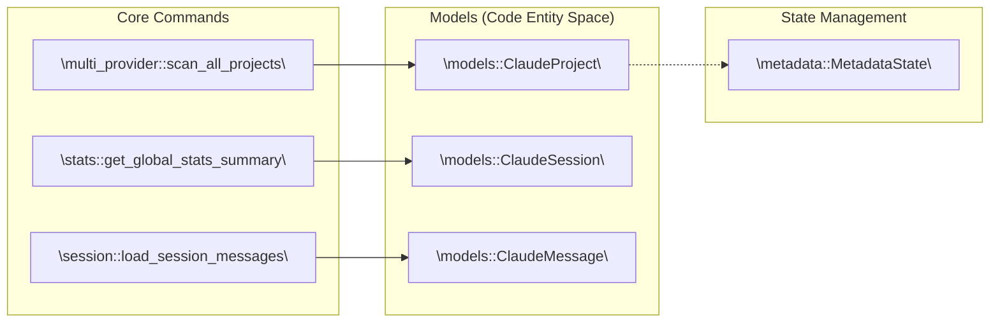
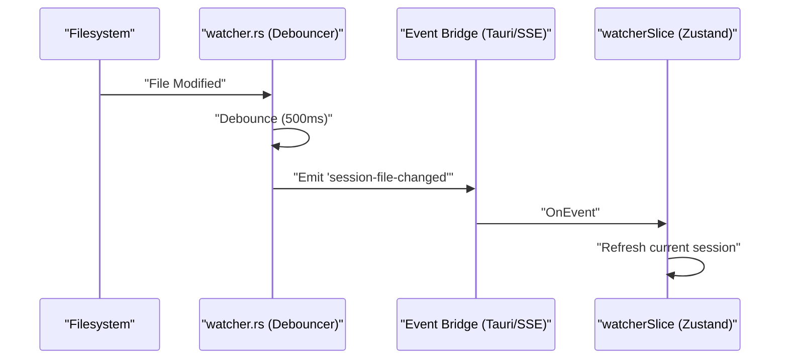

# 시스템 아키텍처

<details>
<summary>관련 소스 파일</summary>

다음 파일들은 이 위키 페이지를 생성하기 위한 컨텍스트로 사용되었습니다:

- [.dockerignore](.dockerignore)
- [.github/workflows/server-release.yml](.github/workflows/server-release.yml)
- [Dockerfile](Dockerfile)
- [contrib/cchv.service](contrib/cchv.service)
- [docker-compose.yml](docker-compose.yml)
- [docs/server-guide.ko.md](docs/server-guide.ko.md)
- [docs/server-guide.md](docs/server-guide.md)
- [index.html](index.html)
- [install-server.sh](install-server.sh)
- [src-tauri/src/commands/mod.rs](src-tauri/src/commands/mod.rs)
- [src-tauri/src/lib.rs](src-tauri/src/lib.rs)
- [src-tauri/src/models.rs](src-tauri/src/models.rs)
- [src-tauri/src/server/handlers.rs](src-tauri/src/server/handlers.rs)
- [src-tauri/src/server/mod.rs](src-tauri/src/server/mod.rs)
- [src/App.tsx](src/App.tsx)
- [src/components/MessageViewer.tsx](src/components/MessageViewer.tsx)
- [src/components/ProjectTree.tsx](src/components/ProjectTree.tsx)
- [src/hooks/index.ts](src/hooks/index.ts)
- [src/store/useAppStore.ts](src/store/useAppStore.ts)
- [src/test/ProjectTree.worktree.test.tsx](src/test/ProjectTree.worktree.test.tsx)
- [src/types/core/project.ts](src/types/core/project.ts)
- [src/types/index.ts](src/types/index.ts)
- [src/utils/fileDialog.ts](src/utils/fileDialog.ts)

</details>


이 페이지는 Claude Code History Viewer의 전체 시스템 토폴로지를 설명합니다: 파일시스템 데이터 소스, Rust 백엔드 명령 계층, Tauri IPC 브리지, 헤드리스 WebUI 서버 모드, React/Zustand 프론트엔드, 파일 감시기 사이드 채널을 다룹니다.

---

## 개요

애플리케이션은 **Tauri Desktop App**과 **Headless WebUI Server**라는 두 가지 뚜렷한 모드로 동작합니다. 두 모드는 디스크 I/O, 제공자 파싱, 비용 계산을 위한 동일한 Rust 핵심 로직을 공유합니다.

*   **Desktop Mode:** Rust 프로세스가 IPC 브리지(`tauri::generate_handler!`)를 통해 React/TypeScript WebView와 통신하는 Tauri 애플리케이션입니다.
*   **Server Mode:** React 프론트엔드(`rust-embed`로 내장)를 제공하고 Tauri 명령을 미러링하는 REST API를 제공하는 헤드리스 Axum HTTP 서버(`cchv-server`)입니다.

**상위 수준 시스템 토폴로지**

```mermaid
flowchart TD
    subgraph "Data Sources"
        FS_CLAUDE["\"~/.claude/projects/ (*.jsonl)\""]
        FS_SQLITE["\"Cursor/Aider (SQLite/JSON)\""]
        FS_OPENCODE["\"OpenCode (*.json)\""]
    end

    subgraph "src-tauri/ (Rust Core)"
        subgraph "providers/"
            P_CLAUDE["\"claude/\""]
            P_MULTI["\"multi_provider.rs\""]
            P_OTHERS["\"cursor.rs, aider.rs, etc.\""]
        end
        subgraph "commands/"
            C_PROJ["\"project.rs\""]
            C_SESSION["\"session.rs\""]
            C_STATS["\"stats.rs\""]
            C_WATCHER["\"watcher.rs\""]
        end
        MODELS["\"models.rs\""]
    end

    subgraph "Distribution Modes"
        TAURI["\"Tauri Desktop App\""]
        AXUM["\"Axum WebUI Server\""]
    end

    subgraph "src/ (Frontend)"
        STORE["\"useAppStore.ts (Zustand)\""]
        APP["\"App.tsx (React)\""]
    end

    FS_CLAUDE --> P_CLAUDE
    FS_SQLITE --> P_OTHERS
    FS_OPENCODE --> P_MULTI

    P_MULTI --> C_PROJ
    P_MULTI --> C_SESSION
    
    C_PROJ --> TAURI
    C_SESSION --> TAURI
    C_STATS --> AXUM
    C_WATCHER -.->|"SSE / Tauri Event"| STORE

    TAURI -->|"IPC"| STORE
    AXUM -->|"HTTP/REST"| STORE
    STORE --> APP
```

출처: [src-tauri/src/lib.rs:58-70](), [src-tauri/src/commands/mod.rs:1-14](), [src/store/useAppStore.ts:81-95](), [src-tauri/src/server/mod.rs:1-10]()

---

## 파일시스템 소스

애플리케이션은 일곱 가지 서로 다른 AI 제공자를 추상화합니다. 각 제공자는 고유한 위치와 형식으로 데이터를 저장하며, 이는 백엔드 `providers/` 모듈에 의해 통합됩니다.

| 제공자 | 기본 기준 경로 | 형식 | 감지 로직 |
|---|---|---|---|
| Claude Code | `~/.claude/projects/` | JSONL | `commands/project.rs` |
| Cursor | `~/Library/Application Support/Cursor/...` | SQLite | `providers/cursor.rs` |
| Aider | `.aider.chat.history.md` | Markdown/YAML | `providers/aider.rs` |
| Cline | `~/Library/Application Support/Code/User/globalStorage/saoudrizwan.claude-dev/...` | JSON | `providers/cline.rs` |

Claude Code 프로젝트 경로는 인코딩되어 있으며(예: `-Users-jack-app`), `utils/`의 `decode_project_path`를 사용해 디코딩됩니다 [src-tauri/src/lib.rs:4-4](). Git worktree 멤버십은 스캔 시 `detect_git_worktree_info`를 통해 감지되어 `ProjectTree`에서 그룹화를 가능하게 합니다 [src/test/ProjectTree.worktree.test.tsx:84-106]().

출처: [src-tauri/src/commands/multi_provider.rs:31-34](), [src-tauri/src/commands/project.rs:35-38]()

---

## 백엔드 아키텍처

백엔드는 Rust 라이브러리 크레이트로 구성됩니다. 고성능 데이터 처리, 파일시스템 모니터링, 비용 계산을 처리합니다.

**백엔드 엔티티 맵**



출처: [src-tauri/src/lib.rs:1-55](), [src-tauri/src/models.rs:1-50](), [src-tauri/src/commands/metadata.rs:26-30]()

모든 공개 명령은 `tauri::generate_handler!`를 통해 `run_tauri()`에 등록됩니다 [src-tauri/src/lib.rs:117-193](). `MetadataState`는 영속성을 위해 `tauri::State`로 관리됩니다 [src-tauri/src/lib.rs:112-112]().

---

## WebUI Server Mode(헤드리스)

`--serve` 플래그로 시작하면 애플리케이션은 헤드리스 Axum 서버로 실행됩니다 [src-tauri/src/lib.rs:62-67]().

*   **Axum HTTP Server:** 모든 Tauri 명령을 REST 엔드포인트(예: `POST /api/scan_all_projects`)로 미러링합니다 [src-tauri/src/server/handlers.rs:40-61]().
*   **Authentication:** `AUTH_TOKEN` 환경 변수를 통해 Bearer 토큰 인증을 사용합니다.
*   **Real-time Events:** Tauri 이벤트 버스를 대체하여 Server-Sent Events(SSE)로 파일 감시기 알림을 웹 프론트엔드에 푸시합니다.
*   **Static Assets:** `rust-embed`를 사용해 프론트엔드 파일을 바이너리에 내장하므로, 서버는 단일 이식 가능 바이너리가 됩니다 [Dockerfile:4-32]().

출처: [src-tauri/src/server/mod.rs:1-20](), [src-tauri/src/server/handlers.rs:1-15](), [Dockerfile:49-57]()

---

## React/Zustand 프론트엔드 계층

프론트엔드는 전역 상태에 `useAppStore`(Zustand)를 사용하는 React 애플리케이션입니다. Tauri IPC와 Web REST 호출의 차이를 추상화하기 위해 `PlatformProvider`를 사용합니다 [src/App.tsx:11-11]().

**프론트엔드 상태 Slice**

| Slice | 책임 | 주요 엔티티 |
|---|---|---|
| `projectSlice` | 프로젝트/세션 목록 | `ClaudeProject` |
| `messageSlice` | 대화 콘텐츠 | `ClaudeMessage` |
| `boardSlice` | 시각적 분석 데이터 | `BoardSessionData` |
| `archiveSlice` | 아카이브된 세션 관리 | `ArchiveEntry` |

출처: [src/store/useAppStore.ts:9-68](), [src/types/index.ts:105-108]()

---

## 파일 감시기 사이드 채널

`watcher.rs` 모듈은 세션 파일의 변경 사항을 감시하고 프론트엔드에 알림을 푸시합니다 [src-tauri/src/commands/watcher.rs:27-53]().



감시기는 빠른 AI 쓰기 작업 중 UI 깜박임을 방지하기 위해 `notify_debouncer_mini`를 사용합니다 [src-tauri/src/lib.rs:113-116]().

출처: [src-tauri/src/commands/watcher.rs:67-80](), [src/hooks/useFileWatcher.ts:21-23]()

---

## Docker 배포

애플리케이션은 서버 모드 배포를 위해 컨테이너화되어 있습니다. `Dockerfile`은 멀티 스테이지 빌드를 사용합니다:
1.  **Frontend Stage:** Vite/React 자산을 빌드합니다 [Dockerfile:5-15]().
2.  **Backend Stage:** `webui-server` 기능으로 Rust 바이너리를 컴파일하고 자산을 내장합니다 [Dockerfile:17-32]().
3.  **Runtime Stage:** 바이너리와 필요한 공유 라이브러리만 포함하는 최소 Debian 이미지입니다 [Dockerfile:34-57]().

출처: [Dockerfile:1-57](), [.github/workflows/server-release.yml:6-35]()
