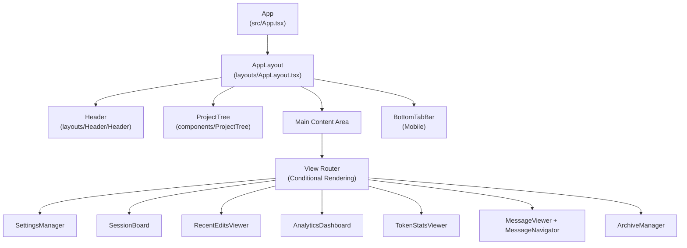
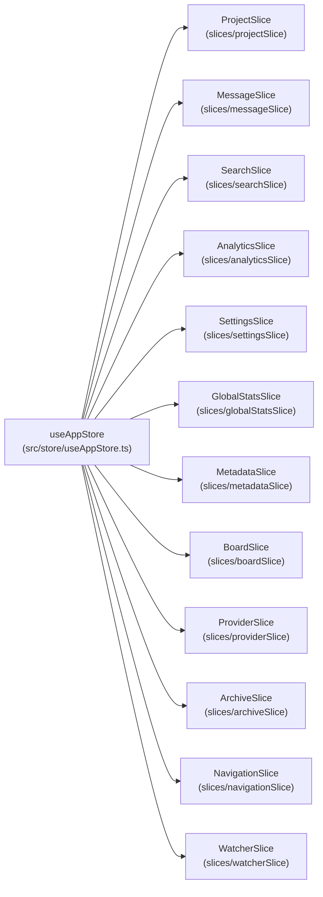
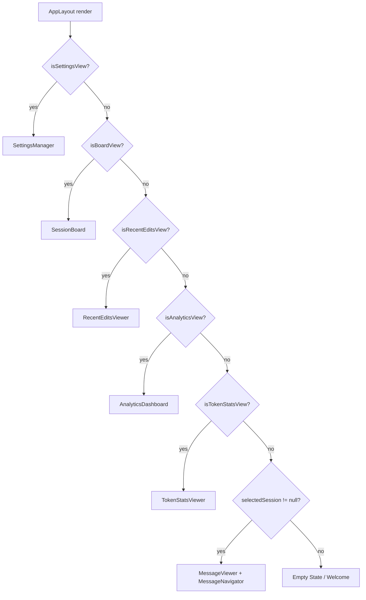
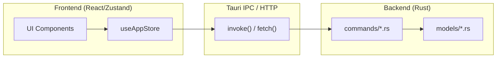

# 프론트엔드 아키텍처

관련 소스 파일

다음 파일들은 이 위키 페이지를 생성하기 위한 컨텍스트로 사용되었습니다:

- [src-tauri/src/commands/mod.rs](src-tauri/src/commands/mod.rs)
- [src-tauri/src/lib.rs](src-tauri/src/lib.rs)
- [src-tauri/src/models.rs](src-tauri/src/models.rs)
- [src/App.tsx](src/App.tsx)
- [src/components/MessageViewer.tsx](src/components/MessageViewer.tsx)
- [src/components/ProjectTree.tsx](src/components/ProjectTree.tsx)
- [src/components/contentRenderer/ThinkingRenderer.tsx](src/components/contentRenderer/ThinkingRenderer.tsx)
- [src/components/contentRenderer/ToolResultCard.tsx](src/components/contentRenderer/ToolResultCard.tsx)
- [src/components/contentRenderer/toolUseRenderers/ToolUseCard.tsx](src/components/contentRenderer/toolUseRenderers/ToolUseCard.tsx)
- [src/components/renderers/RendererCard.tsx](src/components/renderers/RendererCard.tsx)
- [src/components/renderers/styles.ts](src/components/renderers/styles.ts)
- [src/contexts/platform/PlatformGate.tsx](src/contexts/platform/PlatformGate.tsx)
- [src/contexts/platform/PlatformProvider.tsx](src/contexts/platform/PlatformProvider.tsx)
- [src/contexts/platform/context.ts](src/contexts/platform/context.ts)
- [src/contexts/platform/index.ts](src/contexts/platform/index.ts)
- [src/hooks/index.ts](src/hooks/index.ts)
- [src/layouts/AppLayout.tsx](src/layouts/AppLayout.tsx)
- [src/shared/RendererHeader.tsx](src/shared/RendererHeader.tsx)
- [src/store/useAppStore.ts](src/store/useAppStore.ts)
- [src/test/ProjectTree.worktree.test.tsx](src/test/ProjectTree.worktree.test.tsx)
- [src/types/core/project.ts](src/types/core/project.ts)
- [src/types/index.ts](src/types/index.ts)

프론트엔드는 Tauri webview 내부에서 렌더링되는 React/TypeScript 애플리케이션입니다. 루트 진입점은 `App.tsx`이며, 모든 주요 렌더링 하위 시스템을 조합하고 전역 Zustand 스토어(`useAppStore`)에 연결합니다.

백엔드 세부 정보는 2.3 페이지를 참조하세요. 엔드투엔드 데이터 흐름은 2.4 페이지를 참조하세요.

## 개요

프론트엔드 아키텍처는 다음 핵심 원칙을 따릅니다:
- `src/App.tsx`의 `App`을 루트로 하는 컴포넌트 트리 [src/App.tsx:23-23]().
- 도메인별 slice를 `useAppStore`로 조합한 Zustand 기반 중앙 집중식 상태 관리 [src/store/useAppStore.ts:101-117]().
- Rust 백엔드와의 통신은 Tauri의 `invoke` IPC 또는 서버 모드의 HTTP REST만 사용 [src-tauri/src/lib.rs:111-191]().
- 뷰 전환은 스토어의 `analytics.currentView`로 구동되며, `useAnalytics` 훅을 통해 노출됨 [src/App.tsx:70-74]().
- Tauri 데스크톱과 헤드리스 웹 모드의 차이를 처리하기 위해 `PlatformProvider`를 통한 환경 인식 실행 [src/App.tsx:77-77]().

출처: [src/App.tsx:23-203](), [src/store/useAppStore.ts:1-118]()

## 컴포넌트 계층

`App` 함수는 구조적 영역인 `Header`, `ProjectTree` 사이드바, 메인 콘텐츠 영역, 푸터 상태 표시줄을 갖춘 고정 셸을 렌더링합니다. 레이아웃은 `AppLayout`이 관리합니다.

**다이어그램: App 컴포넌트 트리**

출처: [src/App.tsx:357-602](), [src/layouts/AppLayout.tsx:136-203]()

## 상태 관리

애플리케이션에는 `src/store/useAppStore.ts`의 도메인 slice들로 조립된 단일 Zustand 스토어가 있습니다. 내보내진 `useAppStore` 훅은 컴포넌트가 모든 slice에 동시에 접근할 수 있게 합니다.

**다이어그램: useAppStore Slice 조합**

### Slice 책임

| Slice | 주요 상태 필드 | 주요 액션 |
|---|---|---|
| `projectSlice` | `projects[]`, `sessions[]`, `selectedProject` | `selectProject`, `clearProjectSelection` |
| `messageSlice` | `messages[]` | `selectSession`, `loadMoreMessages` |
| `searchSlice` | `sessionSearch` | `setSessionSearchQuery`, `goToNextMatch` |
| `analyticsSlice` | `analytics.currentView` | `setAnalyticsCurrentView` |
| `boardSlice` | `boardSessions`, `zoomLevel` | `loadBoardSessions`, `setZoomLevel` |
| `providerSlice` | `providers[]`, `activeProviders[]` | `detectProviders`, `setActiveProviders` |
| `metadataSlice` | `userMetadata` | `updateUserSettings`, `loadUserMetadata` |
| `archiveSlice` | `archives[]` | `listArchives`, `createArchive` |

출처: [src/store/useAppStore.ts:81-117](), [src/App.tsx:24-68]()

## 플랫폼 컨텍스트

애플리케이션은 Tauri 데스크톱 환경과 헤드리스 웹 서버 모드 간 호환성을 유지하기 위해 플랫폼 추상화 계층을 사용합니다.

- **PlatformProvider**: `isDesktop`, `isMobile`, 플랫폼별 API 구현을 제공합니다 [src/App.tsx:77-77]().
- **PlatformGate**: 플랫폼에 따라 UI 요소를 조건부 렌더링하는 데 사용되는 래퍼 컴포넌트입니다(예: 웹 UI에서 데스크톱 전용 설정 숨기기) [src/layouts/AppLayout.tsx:32-32]().

## 뷰 라우팅

메인 콘텐츠 영역은 `AppLayout` 내부의 조건부 렌더링 체인입니다. 활성 뷰는 `useAnalytics`의 `computed` 속성으로 제어되며, 이 속성은 스토어에서 `analytics.currentView`를 읽습니다.

**다이어그램: 뷰 라우팅 로직**

출처: [src/App.tsx:458-557](), [src/layouts/AppLayout.tsx:159-203]()

## 주요 렌더링 하위 시스템

### ProjectTree
왼쪽 사이드바(`src/components/ProjectTree/index.tsx`)는 코딩 프로젝트와 AI 세션 간 내비게이션을 관리합니다.
- **그룹화 모드**: `none`, `directory`, `worktree` 그룹화를 지원합니다 [src/test/ProjectTree.worktree.test.tsx:156-189]().
- **제공자 필터링**: 다중 제공자 탭(Claude, Codex, OpenCode 등)을 지원합니다 [src/App.tsx:95-119]().

### MessageViewer
대화 표시 엔진(`src/components/MessageViewer/MessageViewer.tsx`)은 대량의 AI 상호작용 데이터를 처리합니다.
- **가상화**: 대규모 메시지 기록에서 성능을 위해 최적화되어 있습니다 [src/components/MessageViewer.tsx:8-16]().
- **전문화된 렌더러**: 모델 추론을 위한 `ThinkingRenderer`처럼 서로 다른 메시지 타입을 위한 사용자 지정 컴포넌트를 포함합니다 [src/components/contentRenderer/ThinkingRenderer.tsx:18-24]().

### AnalyticsDashboard
프로젝트와 제공자 전반의 상위 수준 인사이트를 제공합니다.
- **뷰**: Global, Project, Session 통계 간 라우팅합니다 [src/App.tsx:151-156]().
- **훅 기반**: `useAnalytics` 훅을 통해 조정됩니다 [src/App.tsx:70-74]().

## 백엔드와의 통신

프론트엔드는 Tauri의 명령 시스템을 통해 Rust 백엔드와 통신합니다. 명령은 `invoke`를 사용해 호출되며, 결과는 일반적으로 Zustand slice에 저장됩니다.

**다이어그램: 프론트엔드-백엔드 브리지**

주요 IPC 명령에는 `scan_projects`, `load_project_sessions`, `load_session_messages_paginated`, `get_global_stats_summary`가 포함됩니다 [src-tauri/src/lib.rs:112-191]().

출처: [src-tauri/src/lib.rs:111-191](), [src/store/useAppStore.ts:1-117](), [src/layouts/AppLayout.tsx:50-134]()
