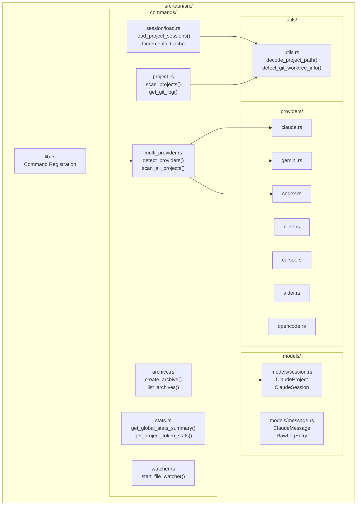
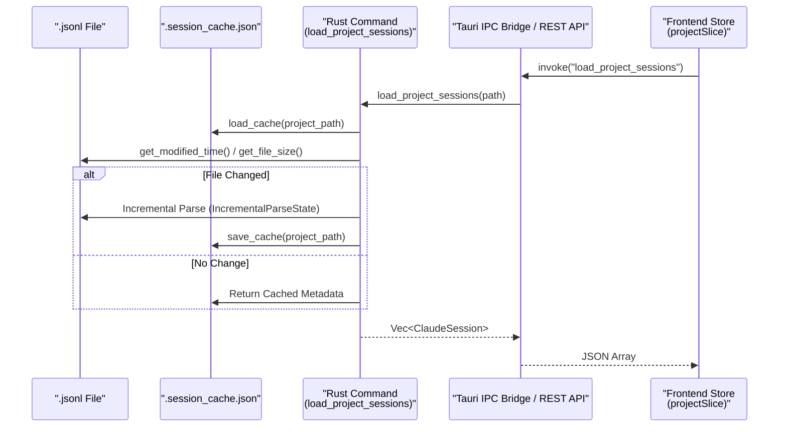

# 백엔드 아키텍처

관련 소스 파일

다음 파일들은 이 위키 페이지를 생성하기 위한 컨텍스트로 사용되었습니다:

- [src-tauri/src/commands/archive.rs](src-tauri/src/commands/archive.rs)
- [src-tauri/src/commands/mod.rs](src-tauri/src/commands/mod.rs)
- [src-tauri/src/commands/session/load.rs](src-tauri/src/commands/session/load.rs)
- [src-tauri/src/lib.rs](src-tauri/src/lib.rs)
- [src-tauri/src/main.rs](src-tauri/src/main.rs)
- [src-tauri/src/models.rs](src-tauri/src/models.rs)
- [src-tauri/src/models/session.rs](src-tauri/src/models/session.rs)
- [src-tauri/src/models/snapshot_tests.rs](src-tauri/src/models/snapshot_tests.rs)
- [src-tauri/src/models/snapshots/claude_code_history_viewer_lib__models__snapshot_tests__session_snapshots__claude_session.snap](src-tauri/src/models/snapshots/claude_code_history_viewer_lib__models__snapshot_tests__session_snapshots__claude_session.snap)
- [src/App.tsx](src/App.tsx)
- [src/components/MessageViewer.tsx](src/components/MessageViewer.tsx)
- [src/components/ProjectTree.tsx](src/components/ProjectTree.tsx)
- [src/hooks/index.ts](src/hooks/index.ts)
- [src/store/useAppStore.ts](src/store/useAppStore.ts)
- [src/test/ProjectTree.worktree.test.tsx](src/test/ProjectTree.worktree.test.tsx)
- [src/types/core/project.ts](src/types/core/project.ts)
- [src/types/core/session.ts](src/types/core/session.ts)
- [src/types/index.ts](src/types/index.ts)

백엔드 계층은 파일 시스템 접근, 다중 제공자 데이터 처리, 시스템 통합을 위한 Rust/Tauri 기반을 제공합니다. 이 페이지는 명령 모듈 구성, 다중 제공자 추상화, 고성능 데이터 처리, 주요 유틸리티를 문서화합니다.

## 개요

백엔드는 Rust와 Tauri를 기반으로 구축되며, IPC를 통해 프론트엔드에 기능을 노출하는 전문화된 명령 모듈들로 구성됩니다. **Claude Code**, **Gemini CLI**, **Codex CLI**, **Cline**, **Cursor**, **Aider**, **OpenCode**라는 일곱 가지 제공자 간 차이를 추상화하는 통합 제공자 시스템을 갖추고 있습니다.

**백엔드 시스템 토폴로지**

출처: [src-tauri/src/lib.rs:1-55](), [src-tauri/src/commands/mod.rs:1-14](), [src-tauri/src/commands/session/load.rs:1-14]()

## 명령 모듈 구성

명령은 `#[tauri::command]`로 장식된 도메인별 모듈입니다. 이들은 `src-tauri/src/lib.rs`에 등록되며 React 프론트엔드가 Tauri `invoke` API를 통해 호출합니다.

| 모듈 | 책임 | 주요 코드 엔티티 |
| :--- | :--- | :--- |
| `multi_provider.rs` | 제공자 간 발견 및 데이터 로딩을 조정합니다. | `detect_providers`, `scan_all_projects`, `search_all_providers` |
| `project.rs` | 로컬 파일시스템 프로젝트 스캔 및 Git 통합. | `scan_projects`, `get_git_log`, `detect_claude_config_dir` |
| `session/` | JSONL 세션 로그의 고부하 파싱 및 세션 관리. | `load_project_sessions`, `load_session_messages_paginated`, `restore_file` |
| `stats.rs` | 청구/대화 모드를 포함한 분석 및 토큰 사용량 계산. | `get_project_token_stats`, `get_global_stats_summary`, `get_session_comparison` |
| `archive.rs` | `~/.claude-history-viewer/archives/`의 아카이브된 세션 관리. | `create_archive`, `list_archives`, `get_archive_sessions` |
| `watcher.rs` | `notify`를 통한 세션 파일 실시간 모니터링. | `start_file_watcher`, `stop_file_watcher` |
| `wsl.rs` | Windows Subsystem for Linux 파일시스템과의 통합. | `detect_wsl_distros`, `is_wsl_available` |

출처: [src-tauri/src/lib.rs:117-200](), [src-tauri/src/commands/session/load.rs:203-210](), [src-tauri/src/commands/archive.rs:1-16]()

## 다중 제공자 아키텍처

백엔드는 고유한 데이터 형식을 공통 `ClaudeProject` 및 `ClaudeSession` 모델로 추상화하여 다양한 AI 코딩 어시스턴트를 지원합니다.

### 제공자 감지
`detect_providers` 명령은 사용자 머신에서 사용 가능한 기록 소스를 식별합니다:
*   **Claude Code**: `~/.claude/projects`.
*   **Gemini CLI**: `~/.config/gemini-cli`.
*   **Codex CLI**: `$CODEX_HOME` 또는 `~/.codex/sessions`.
*   **Cline/Cursor/Aider**: 각 도구의 표준 구성 및 로그 디렉터리.

### 통합 스캔
`scan_all_projects` 명령은 감지된 모든 제공자에서 병렬 스캔을 실행하고, 결과를 프론트엔드 `ProjectTree`를 위한 통합 목록으로 정규화합니다.

출처: [src-tauri/src/lib.rs:185-189](), [src/types/core/session.ts:11-18](), [src/types/core/session.ts:45-62]()

## 데이터 로딩 및 성능

백엔드는 대규모 세션 기록을 효율적으로 처리하기 위해 다계층 전략을 사용합니다.

### 1. 증분 메타데이터 캐싱
`session/load.rs` 모듈은 매번 새로고침할 때 대용량 JSONL 파일을 다시 파싱하지 않도록 `SessionMetadataCache`를 구현합니다.
*   **캐시 구조**: 프로젝트 폴더 내 `.session_cache.json`에 `modified_time`, `file_size`, `last_byte_offset`을 저장합니다. [src-tauri/src/commands/session/load.rs:17-54]()
*   **증분 업데이트**: 파일이 커진 경우 파서는 처음부터가 아니라 `last_byte_offset`부터 재개합니다. [src-tauri/src/commands/session/load.rs:114-141]()

### 2. 빠른 라인 분류
스캔 중 모든 라인을 완전한 JSON으로 역직렬화하는 대신, 백엔드는 `QuickLineClassifier`를 사용해 `sessionId`, `timestamp`, `isSidechain` 같은 필수 필드만 추출합니다. [src-tauri/src/commands/session/load.rs:184-194]()

### 3. SIMD 가속 파싱
`utils.rs`의 유틸리티는 `memchr`을 활용해 SIMD 가속 개행 감지를 수행하고, 파싱 전에 메모리 매핑된 버퍼에서 라인 경계를 식별합니다.

출처: [src-tauri/src/commands/session/load.rs:17-56](), [src-tauri/src/commands/session/load.rs:184-194]()

## 주요 유틸리티

### 경로 디코딩
Claude Code는 프로젝트 경로를 디렉터리 이름으로 인코딩합니다(예: `/Users/jack/project`가 `-Users-jack-project`가 됨). `utils.rs`의 `decode_project_path` 함수는 다음을 사용해 이를 실제 파일시스템 경로로 되돌립니다:
1.  **인덱스 조회**: `originalPath` 키에 대해 `sessions-index.json`을 확인합니다.
2.  **파일시스템 탐색**: `decode_recursive`는 모든 하이픈 분할 지점에서 디렉터리 존재 여부를 확인하여 경로 재구성을 시도합니다.

### Git Worktree 감지
`detect_git_worktree_info` 함수(`scan_projects` 중 호출됨)는 프로젝트가 Git worktree인지 식별합니다. `main` 저장소와 `linked` worktree를 구분하여 프론트엔드가 이를 시각적으로 그룹화할 수 있게 합니다. [src/types/core/session.ts:24-31]()

출처: [src-tauri/src/utils.rs:119-154](), [src-tauri/src/commands/project.rs:175-178](), [src/test/ProjectTree.worktree.test.tsx:84-106]()

## 헤드리스 서버 모듈

`webui-server` 기능이 활성화되면 백엔드는 `server` 모듈을 사용해 독립 실행형 HTTP 서버로 실행할 수 있습니다.

*   **기술**: **Axum** 웹 프레임워크로 빌드됩니다.
*   **기능**: 모든 Tauri IPC 명령을 REST API 엔드포인트로 미러링합니다.
*   **인증**: 안전한 원격 접근을 위해 Bearer 토큰 인증을 구현합니다.
*   **실시간**: 파일 감시기 업데이트를 위해 Tauri의 이벤트 시스템을 **Server-Sent Events (SSE)**로 대체합니다.

출처: [src-tauri/src/lib.rs:7-8](), [src-tauri/src/lib.rs:60-67]()

## 데이터 흐름: 디스크에서 프론트엔드까지

출처: [src-tauri/src/commands/session/load.rs:64-74](), [src-tauri/src/commands/session/load.rs:77-96](), [src-tauri/src/commands/session/load.rs:114-141](), [src/store/useAppStore.ts:10-12]()
