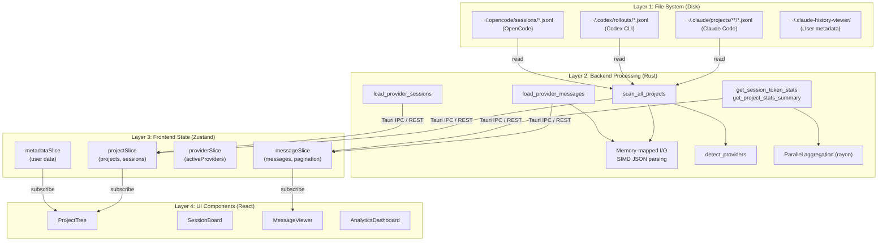
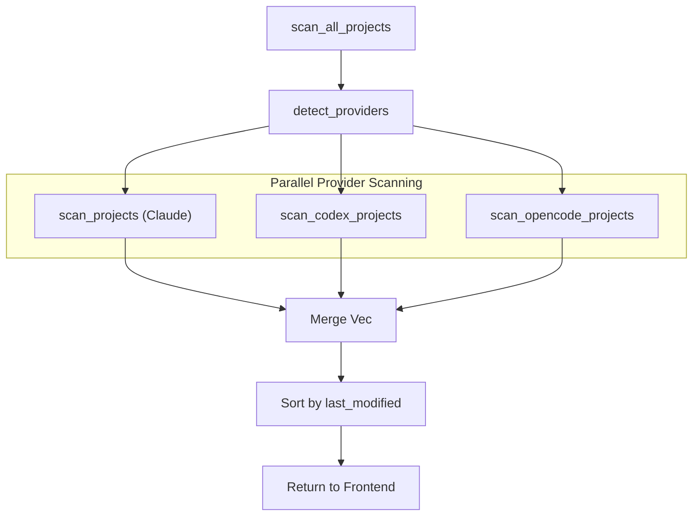

# 데이터 흐름

<details>
<summary>관련 소스 파일</summary>

다음 파일들은 이 위키 페이지를 생성하기 위한 컨텍스트로 사용되었습니다:

- [src-tauri/src/commands/archive.rs](src-tauri/src/commands/archive.rs)
- [src-tauri/src/commands/mod.rs](src-tauri/src/commands/mod.rs)
- [src-tauri/src/commands/project.rs](src-tauri/src/commands/project.rs)
- [src-tauri/src/commands/session/load.rs](src-tauri/src/commands/session/load.rs)
- [src-tauri/src/lib.rs](src-tauri/src/lib.rs)
- [src-tauri/src/models.rs](src-tauri/src/models.rs)
- [src-tauri/src/models/session.rs](src-tauri/src/models/session.rs)
- [src-tauri/src/models/snapshot_tests.rs](src-tauri/src/models/snapshot_tests.rs)
- [src-tauri/src/models/snapshots/claude_code_history_viewer_lib__models__snapshot_tests__session_snapshots__claude_session.snap](src-tauri/src/models/snapshots/claude_code_history_viewer_lib__models__snapshot_tests__session_snapshots__claude_session.snap)
- [src/App.tsx](src/App.tsx)
- [src/components/MessageViewer.tsx](src/components/MessageViewer.tsx)
- [src/components/MessageViewer/MessageViewer.tsx](src/components/MessageViewer/MessageViewer.tsx)
- [src/components/ProjectTree.tsx](src/components/ProjectTree.tsx)
- [src/hooks/index.ts](src/hooks/index.ts)
- [src/store/slices/projectSlice.ts](src/store/slices/projectSlice.ts)
- [src/store/slices/types.ts](src/store/slices/types.ts)
- [src/store/useAppStore.ts](src/store/useAppStore.ts)
- [src/test/ProjectTree.worktree.test.tsx](src/test/ProjectTree.worktree.test.tsx)
- [src/types/core/project.ts](src/types/core/project.ts)
- [src/types/core/session.ts](src/types/core/session.ts)
- [src/types/index.ts](src/types/index.ts)

</details>


## 목적 및 범위

이 문서는 Claude Code History Viewer 애플리케이션에서 데이터가 디스크의 영속 저장소에서 백엔드 처리를 거쳐 프론트엔드 렌더링까지 어떻게 흐르는지 설명합니다. 파일 시스템 접근, SIMD 최적화를 포함한 다중 제공자 백엔드 처리, Tauri 명령(또는 서버 모드의 HTTP REST)을 통한 IPC 통신, Zustand 기반 프론트엔드 상태 관리, 최종 UI 렌더링까지 전체 데이터 파이프라인을 다룹니다.

상태 관리 아키텍처와 스토어 slice에 대한 정보는 [Store Architecture](4.1)를 참조하세요. 백엔드 명령 모듈에 대한 자세한 내용은 [Backend Systems](5)를 참조하세요. UI 컴포넌트 구조는 [Frontend Architecture](2.2)를 참조하세요.

---

## 개요: 3계층 데이터 흐름

애플리케이션은 세 개의 뚜렷한 계층을 통해 데이터를 처리합니다:



**출처:**
- [src-tauri/src/lib.rs:112-191]()
- [src/store/useAppStore.ts:81-117]()
- [src/App.tsx:23-68]()

---

## 데이터 소스

### 제공자 세션 파일

애플리케이션은 여러 제공자를 지원하며, 각 제공자는 서로 다른 파일 규칙과 디렉터리 구조를 갖습니다. 백엔드는 이를 통합 `ClaudeProject` 및 `ClaudeSession` 모델로 추상화합니다.

| 제공자 | 기본 디렉터리 | 파일 형식 | 경로 프로토콜 |
|----------|-------------------|-------------|---------------|
| **Claude Code** | `~/.claude/projects/` | `.jsonl` | `file://` |
| **Codex CLI** | `~/.codex/rollouts/` | `rollout-*.jsonl` | `codex://` |
| **OpenCode** | `~/.opencode/sessions/` | `.jsonl` | `opencode://` |

**출처:**
- [src-tauri/src/commands/multi_provider.rs:30-49]()
- [src-tauri/src/commands/project.rs:64-83]()
- [src-tauri/src/commands/session/load.rs:16-45]()

### 사용자 메타데이터 및 구성

사용자 선호도, 사용자 지정 세션 이름, 프로젝트 표시 여부는 `metadata` 모듈이 관리합니다. 이 데이터는 제공자 쪽 파일 변경 후에도 사용자 주석이 유지되도록 로컬 JSON 구조에 영속화됩니다.

```json
{
  "version": 8,
  "sessions": {
    "session-uuid": {
      "customName": "Refactor Feature X",
      "starred": true
    }
  },
  "projects": {
    "/path/to/project": {
      "hidden": false
    }
  },
  "settings": {
    "groupingMode": "worktree",
    "activeProviders": ["claude", "gemini"]
  }
}
```

**출처:**
- [src/types/core/project.ts:110-124]()
- [src/store/slices/metadataSlice.ts:34-36]()
- [src-tauri/src/commands/session/load.rs:48-54]()

---

## 백엔드 처리 파이프라인

### 다중 제공자 스캔 흐름

`scan_all_projects` 명령은 감지된 모든 제공자에 걸친 스캔을 조정합니다. 효율적인 파일시스템 순회를 위해 `WalkDir` 크레이트를 사용하고, 프로젝트 경계와 git worktree를 감지하기 위한 휴리스틱을 적용합니다.



**출처:**
- [src-tauri/src/commands/multi_provider.rs:60-100]()
- [src-tauri/src/commands/project.rs:159-212]()
- [src/store/slices/projectSlice.ts:190-210]()

### 최적화된 메시지 파싱

`load_session_messages`와 `load_session_messages_paginated`의 메시지 로딩은 대용량 `.jsonl` 파일을 UI 차단 없이 처리하기 위해 고성능 Rust 프리미티브를 사용합니다.

1.  **메모리 매핑:** 대용량 버퍼를 메모리로 복사하지 않기 위해 `memmap2::Mmap`을 통해 파일에 접근합니다 [src-tauri/src/commands/session/load.rs:6-6]().
2.  **증분 캐싱:** `SessionMetadataCache`는 변경되지 않은 파일의 재파싱을 건너뛰기 위해 바이트 오프셋과 수정 시간을 저장합니다 [src-tauri/src/commands/session/load.rs:17-45]().
3.  **병렬 집계:** `rayon`은 CPU 코어 전반에서 JSON 라인 처리를 병렬화하는 데 사용됩니다 [src-tauri/src/commands/session/load.rs:7-7]().
4.  **SIMD JSON:** 백엔드는 `RawLogEntry` 구조를 역직렬화하기 위해 `serde_json`(특정 빌드에서는 `simd_json`)을 사용합니다 [src-tauri/src/commands/session/load.rs:3-3]().

**출처:**
- [src-tauri/src/commands/session/load.rs:1-212]()
- [src-tauri/src/commands/session/load.rs:63-74]()

---

## IPC 통신 계층

프론트엔드는 통합 `api` 래퍼를 통해 Rust 백엔드와 통신합니다. 데스크톱 앱에서는 Tauri의 `invoke` 브리지를 사용합니다. 서버 모드에서는 HTTP REST 호출로 변환됩니다.

### 주요 명령 엔드포인트

| 명령 | 역할 | 구현 |
|---------|------|----------------|
| `scan_all_projects` | 제공자 전반의 모든 프로젝트 발견 | `commands::multi_provider::scan_all_projects` |
| `load_provider_sessions` | 특정 프로젝트의 세션 나열 | `commands::multi_provider::load_provider_sessions` |
| `load_session_messages` | JSONL 파일에서 메시지 파싱 | `commands::session::load::load_session_messages` |
| `get_project_stats_summary` | 토큰 사용량 및 비용 계산 | `commands::stats::get_project_stats_summary` |
| `start_file_watcher` | 라이브 업데이트를 위해 세션 파일 모니터링 | `commands::watcher::start_file_watcher` |

**출처:**
- [src-tauri/src/lib.rs:112-191]()
- [src/store/slices/projectSlice.ts:120-183]()
- [src/store/slices/messageSlice.ts:151-173]()

---

## 프론트엔드 상태 관리

### Zustand 스토어 Slice

`useAppStore`는 단일 진실 공급원으로 작동하며, 백엔드 데이터에 반응하는 여러 도메인별 slice로 구성됩니다.

*   **`projectSlice`**: 프로젝트 및 세션의 계층 구조를 관리합니다. 원시 프로젝트 목록에서 그룹화된 보기(Worktree/Directory)로 전환하는 작업을 처리합니다 [src/store/slices/projectSlice.ts:28-52]().
*   **`messageSlice`**: 현재 대화 기록을 저장합니다. 페이지네이션 로딩과 subagent 세션 스택을 지원합니다 [src/store/slices/messageSlice.ts:109-148]().
*   **`searchSlice`**: 로컬 검색 인덱스를 사용해 전역 및 세션별 검색 결과를 처리합니다 [src/store/useAppStore.ts:18-20]().
*   **`metadataSlice`**: 사용자 정의 메타데이터(이름 변경, 숨김 상태)를 백엔드와 UI 사이에서 동기화합니다 [src/store/useAppStore.ts:34-36]().

**출처:**
- [src/store/useAppStore.ts:81-117]()
- [src/store/slices/projectSlice.ts:112-117]()
- [src/store/slices/types.ts:96-194]()

---

## UI 렌더링 파이프라인

### 메시지 렌더링 흐름

세션이 선택되면 메시지는 성능과 풍부한 콘텐츠에 최적화된 전문 렌더링 파이프라인을 통해 흐릅니다.

1.  **선택**: `App.tsx`의 `handleSessionSelect`가 로딩 시퀀스를 트리거합니다 [src/App.tsx:179-199]().
2.  **로딩**: `messageSlice`가 `load_provider_messages`를 호출하고, 이는 `MessagePage`를 반환합니다 [src/store/slices/messageSlice.ts:151-173]().
3.  **가상화**: `MessageViewer`는 `@tanstack/react-virtual`의 `useMessageVirtualization`을 사용해 뷰포트에 보이는 메시지만 렌더링합니다 [src/components/MessageViewer/MessageViewer.tsx:25-25]().
4.  **필터링**: `displayMessages` 메모화 셀렉터는 렌더링 전에 역할 및 콘텐츠 타입 필터(예: "Thinking" 블록 숨기기)를 적용합니다 [src/components/MessageViewer/MessageViewer.tsx:89-124]().
5.  **전문화된 렌더링**: 개별 메시지 노드는 `ClaudeMessageNode`에 의해 렌더링되며, 이 컴포넌트는 도구 출력을 `FileEditItem` 또는 `AnsiText` 같은 특정 렌더러로 라우팅합니다 [src/components/MessageViewer/MessageViewer.tsx:1-17]().

**출처:**
- [src/components/MessageViewer/MessageViewer.tsx:45-124]()
- [src/store/slices/messageSlice.ts:151-221]()
- [src/App.tsx:179-199]()

### 라이브 업데이트 흐름

애플리케이션은 디스크의 세션 파일이 변경될 때 실시간 업데이트를 지원합니다.

1.  **감시기**: 백엔드 `watcher.rs`가 프로젝트 디렉터리를 모니터링합니다 [src-tauri/src/lib.rs:53-53]().
2.  **이벤트**: `.jsonl` 파일이 수정되면 백엔드는 Tauri 이벤트 또는 SSE 메시지를 내보냅니다 [src-tauri/src/lib.rs:182-183]().
3.  **프론트엔드 동기화**: `useAppInitialization`은 이러한 이벤트를 수신하고 `messageSlice`의 `refreshCurrentSession`을 트리거하며, 이는 새 메시지에 대한 증분 가져오기를 수행합니다 [src/App.tsx:84-84]().

**출처:**
- [src-tauri/src/lib.rs:182-183]()
- [src/store/slices/projectSlice.ts:41-52]()
- [src/App.tsx:81-85]()
