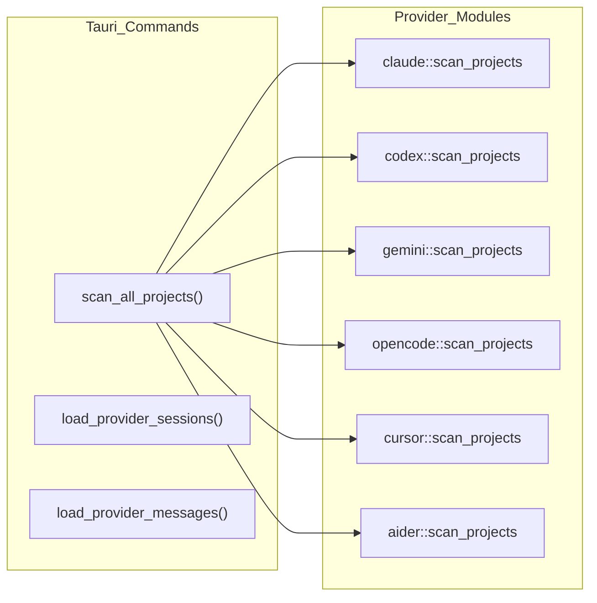
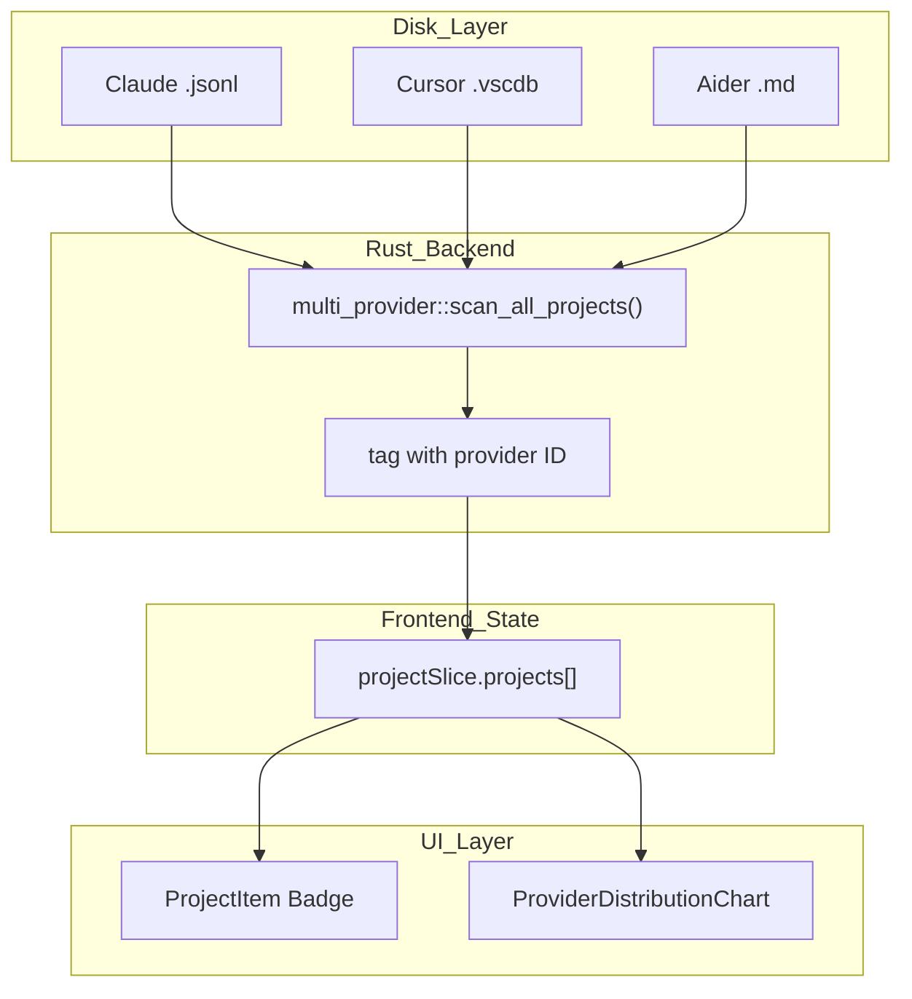

# 다중 제공자 시스템

관련 소스 파일

다음 파일들은 이 위키 페이지를 생성하기 위한 컨텍스트로 사용되었습니다:

- [docs/superpowers/specs/2026-03-28-wsl-support-design.md](docs/superpowers/specs/2026-03-28-wsl-support-design.md)
- [src-tauri/src/commands/multi_provider.rs](src-tauri/src/commands/multi_provider.rs)
- [src-tauri/src/providers/aider.rs](src-tauri/src/providers/aider.rs)
- [src-tauri/src/providers/cline.rs](src-tauri/src/providers/cline.rs)
- [src-tauri/src/providers/codex.rs](src-tauri/src/providers/codex.rs)
- [src-tauri/src/providers/cursor.rs](src-tauri/src/providers/cursor.rs)
- [src-tauri/src/providers/gemini.rs](src-tauri/src/providers/gemini.rs)
- [src-tauri/src/providers/mod.rs](src-tauri/src/providers/mod.rs)
- [src-tauri/src/providers/opencode.rs](src-tauri/src/providers/opencode.rs)
- [src-tauri/src/utils.rs](src-tauri/src/utils.rs)
- [src/components/AnalyticsDashboard/components/ProviderDistributionChart.tsx](src/components/AnalyticsDashboard/components/ProviderDistributionChart.tsx)
- [src/components/MessageViewer/components/MessageHeader.tsx](src/components/MessageViewer/components/MessageHeader.tsx)
- [src/components/MessageViewer/helpers/agentProgressHelpers.ts](src/components/MessageViewer/helpers/agentProgressHelpers.ts)
- [src/components/SimpleUpdateManager.tsx](src/components/SimpleUpdateManager.tsx)
- [src/components/contentRenderer/toolUseRenderers/ApplyPatchToolRenderer.tsx](src/components/contentRenderer/toolUseRenderers/ApplyPatchToolRenderer.tsx)
- [src/components/contentRenderer/toolUseRenderers/TaskToolRenderer.tsx](src/components/contentRenderer/toolUseRenderers/TaskToolRenderer.tsx)
- [src/components/contentRenderer/toolUseRenderers/UpdatePlanToolRenderer.tsx](src/components/contentRenderer/toolUseRenderers/UpdatePlanToolRenderer.tsx)
- [src/test/updateSettings.test.ts](src/test/updateSettings.test.ts)
- [src/types/updateSettings.ts](src/types/updateSettings.ts)
- [src/utils/providers.ts](src/utils/providers.ts)
- [src/utils/updateSettings.ts](src/utils/updateSettings.ts)

이 페이지는 Claude Code, Codex CLI, OpenCode, Gemini CLI, Cline, Cursor, Aider를 하나의 공통 인터페이스로 추상화하는 통합 다중 제공자 아키텍처를 설명합니다. 제공자 감지, 제공자별 파일 레이아웃 규칙, 프로젝트 스캔, 세션 및 메시지 로딩, 제공자 간 검색, 프론트엔드 필터링을 다룹니다.

백엔드 명령 구현에 대한 자세한 내용은 [Backend Systems](5) 및 [Project and Session Commands](5.1)를 참조하세요. 제공자 범위의 통계는 [Statistics and Analytics](5.2)를 참조하세요.

---

## 지원 제공자

일곱 가지 제공자가 통합되어 있습니다. 모두 선택적 `provider` 문자열 태그를 포함하는 `ClaudeProject`, `ClaudeSession`, `ClaudeMessage` 레코드를 생성합니다 [src-tauri/src/models/session.rs:27-66]().

| 제공자 | ID 문자열 | 기본 기준 경로 | 데이터 형식 |
|---|---|---|---|
| Claude Code | `"claude"` | `~/.claude` | 세션별 JSONL |
| Codex CLI | `"codex"` | `~/.codex` | JSONL rollout 파일 |
| OpenCode | `"opencode"` | `~/.local/share/opencode` | JSON/SQLite 하이브리드 |
| Gemini CLI | `"gemini"` | `~/.gemini` | JSON chats |
| Cline | `"cline"` | *(플랫폼별)* | JSON history |
| Cursor | `"cursor"` | *(플랫폼별)* | SQLite (`state.vscdb`) |
| Aider | `"aider"` | 로컬 프로젝트 디렉터리 | Markdown history |

출처: [src-tauri/src/commands/multi_provider.rs:31-41](), [src-tauri/src/providers/opencode.rs:28-34](), [src-tauri/src/providers/gemini.rs:13-19](), [src-tauri/src/providers/cursor.rs:15-21](), [src-tauri/src/providers/aider.rs:28-37](), [src/utils/providers.ts:3-17]()

---

## 제공자별 파일 레이아웃

각 제공자는 서로 다른 위치와 구조로 데이터를 저장합니다. 백엔드는 이를 공유 Rust 데이터 모델로 변환합니다.

**제공자 저장소 레이아웃**

```mermaid
graph TD
  subgraph "Claude_Code"
    CL_BASE["~/.claude/"]
    CL_PROJ["projects/"]
    CL_HASH["[encoded-path]/"]
    CL_JSONL["session.jsonl"]
    CL_BASE --> CL_PROJ --> CL_HASH --> CL_JSONL
  end

  subgraph "Gemini_CLI"
    GEM_BASE["~/.gemini/"]
    GEM_TMP["tmp/"]
    GEM_PROJ["[project-uuid]/"]
    GEM_CHATS["chats/*.json"]
    GEM_BASE --> GEM_TMP --> GEM_PROJ --> GEM_CHATS
  end

  subgraph "Cursor"
    CUR_BASE["Cursor/User/"]
    CUR_WS["workspaceStorage/"]
    CUR_HASH["[workspace-id]/"]
    CUR_DB["state.vscdb (SQLite)"]
    CUR_BASE --> CUR_WS --> CUR_HASH --> CUR_DB
  end

  subgraph "Aider"
    AID_ROOT["Project Root"]
    AID_HIST[".aider.chat.history.md"]
    AID_ROOT --> AID_HIST
  end
```

출처: [src-tauri/src/providers/gemini.rs:36-63](), [src-tauri/src/providers/cursor.rs:43-68](), [src-tauri/src/providers/aider.rs:7-11](), [src-tauri/src/providers/opencode.rs:68-84]()

### 기준 경로 해석

각 제공자는 플랫폼별 기본값으로 폴백하기 전에 환경 변수 오버라이드를 확인합니다:

| 제공자 | Env 오버라이드 | 기본값(macOS 예시) |
|---|---|---|
| Claude | *(저장된 설정)* | `~/.claude` |
| Codex | `$CODEX_HOME` | `~/.codex` |
| Gemini | `$GEMINI_HOME` | `~/.gemini` |
| OpenCode | `$OPENCODE_HOME` | `~/.local/share/opencode` |
| Cursor | N/A | `~/Library/Application Support/Cursor/User` |

출처: [src-tauri/src/providers/codex.rs:29-46](), [src-tauri/src/providers/gemini.rs:22-30](), [src-tauri/src/providers/opencode.rs:37-62](), [src-tauri/src/providers/cursor.rs:24-41]()

---

## 가상 경로 체계

시스템은 제공자 범위 리소스를 구분하고 백엔드가 요청을 올바른 로더로 라우팅할 수 있도록 **가상 경로 접두사**를 사용합니다.

| 제공자 | Project `path` 필드 | Session `file_path` 필드 |
|---|---|---|
| Claude | 실제 파일시스템 경로 | 실제 파일시스템 `.jsonl` 경로 |
| Gemini | `gemini://{project_dir}` | 실제 파일시스템 `.json` 경로 |
| Cursor | `cursor://{ws_path}` | `cursor://{composer_id}` |
| Aider | `aider://{project_dir}` | `aider://{history_file}#{index}` |

출처: [src-tauri/src/providers/gemini.rs:104-105](), [src-tauri/src/providers/cursor.rs:100-101](), [src-tauri/src/providers/aider.rs:83-84](), [src-tauri/src/providers/aider.rs:137-139]()

---

## 백엔드 명령 아키텍처

모든 다중 제공자 Tauri 명령은 `src-tauri/src/commands/multi_provider.rs`에 있습니다. 이들은 활성 제공자를 순회하는 디스패치 계층으로 작동합니다.

**다중 제공자 명령 디스패치**

출처: [src-tauri/src/commands/multi_provider.rs:23-149](), [src-tauri/src/commands/multi_provider.rs:153-182]()

### `scan_all_projects`

`active_providers`를 순회합니다. 다른 제공자 모듈을 호출하기 전에 Claude(사용자 지정 경로 및 WSL 지원 포함)를 특별히 처리합니다 [src-tauri/src/commands/multi_provider.rs:46-182](). 빈 프로젝트(`session_count > 0`)를 필터링하고, 강건한 제공자 간 정렬을 위해 `parse_rfc3339_utc`를 사용해 `last_modified` 기준으로 결과를 정렬합니다 [src-tauri/src/commands/multi_provider.rs:185-207]().

### `load_provider_messages`

제공자 ID에 따라 로딩을 라우팅합니다. 대부분의 제공자에서는 해당 `load_messages` 함수를 호출합니다. 로딩 후에는 도구 결과를 해당 호출과 통합하기 위해 `merge_tool_execution_messages`를 적용합니다 [src-tauri/src/commands/multi_provider.rs:222-261]().

---

## 제공자별 데이터 형식

### Cursor SQLite 저장소
Cursor는 `workspaceStorage/{id}/state.vscdb`의 SQLite 데이터베이스에 대화 데이터("composers")를 저장합니다. 백엔드는 `globalStorage` 테이블에서 `composerData:{id}` 키를 쿼리하여 대화 기록이 포함된 JSON blob을 가져옵니다 [src-tauri/src/providers/cursor.rs:191-210]().

### Aider Markdown 기록
Aider는 기록을 `.aider.chat.history.md`에 저장합니다. 백엔드는 `# aider chat started at` 헤더를 기준으로 이 파일을 분할합니다 [src-tauri/src/providers/aider.rs:7-8](). Markdown 콘텐츠를 파싱하여 사용자와 어시스턴트 턴을 식별하고, 이를 통합 `ClaudeMessage` 모델에 매핑합니다 [src-tauri/src/providers/aider.rs:158-187]().

### OpenCode 하이브리드
OpenCode는 `opencode.db`(SQLite)에서 읽는 것을 선호하지만, `storage/project` 및 `storage/session` 디렉터리의 JSON 파일 스캔으로 폴백합니다 [src-tauri/src/providers/opencode.rs:81-112]().

---

## 프론트엔드 상태 및 UI

### `providerSlice`
감지된 제공자 목록과 현재 활성 필터 집합을 관리합니다. `getProviderId`는 알 수 없는 제공자 문자열이 기본값인 `"claude"`로 처리되도록 보장합니다 [src/utils/providers.ts:50-63]().

### UI 렌더링
`MessageHeader` 컴포넌트는 제공자가 기본값인 `"claude"`가 아닌 경우 어시스턴트 메시지에 대한 제공자 레이블을 동적으로 렌더링합니다 [src/components/MessageViewer/components/MessageHeader.tsx:64-68]().

Analytics Dashboard의 `ProviderDistributionChart`는 각 제공자에 대한 색상 매핑을 사용하여 사용량을 시각화합니다 [src/components/AnalyticsDashboard/components/ProviderDistributionChart.tsx:12-20]():
- `aider`: 빨강
- `claude`: 호박색
- `cline`: 청록
- `codex`: 초록
- `cursor`: 시안
- `gemini`: 보라
- `opencode`: 파랑

출처: [src/components/AnalyticsDashboard/components/ProviderDistributionChart.tsx:12-20](), [src/utils/providers.ts:94-102](), [src/components/MessageViewer/components/MessageHeader.tsx:64-68]()

---

## 제공자 식별 흐름(엔드투엔드)

아래 다이어그램은 디스크에서 렌더링된 UI까지 전체 스택에서 제공자 태그가 어떻게 매핑되는지 보여줍니다.

출처: [src-tauri/src/commands/multi_provider.rs:43-149](), [src/utils/providers.ts:75-82](), [src/components/AnalyticsDashboard/components/ProviderDistributionChart.tsx:41-64]()
