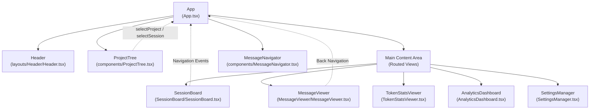
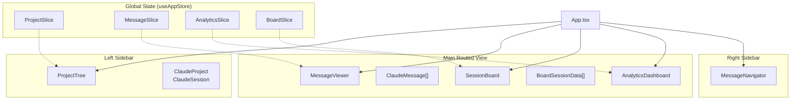

# 핵심 컴포넌트

관련 소스 파일

다음 파일들은 이 위키 페이지를 생성하기 위한 컨텍스트로 사용되었습니다:

- [src-tauri/src/commands/mod.rs](src-tauri/src/commands/mod.rs)
- [src-tauri/src/lib.rs](src-tauri/src/lib.rs)
- [src-tauri/src/models.rs](src-tauri/src/models.rs)
- [src/App.tsx](src/App.tsx)
- [src/components/MessageViewer.tsx](src/components/MessageViewer.tsx)
- [src/components/ProjectTree.tsx](src/components/ProjectTree.tsx)
- [src/components/contentRenderer/ThinkingRenderer.tsx](src/components/contentRenderer/ThinkingRenderer.tsx)
- [src/components/contentRenderer/ToolResultCard.tsx](src/components/contentRenderer/ToolResultCard.tsx)
- [src/components/contentRenderer/toolUseRenderers/ToolUseCard.tsx](src/components/contentRenderer/toolUseRenderers/ToolUseCard.tsx)
- [src/components/renderers/RendererCard.tsx](src/components/renderers/RendererCard.tsx)
- [src/components/renderers/styles.ts](src/components/renderers/styles.ts)
- [src/hooks/index.ts](src/hooks/index.ts)
- [src/layouts/AppLayout.tsx](src/layouts/AppLayout.tsx)
- [src/shared/RendererHeader.tsx](src/shared/RendererHeader.tsx)
- [src/store/useAppStore.ts](src/store/useAppStore.ts)
- [src/test/ProjectTree.worktree.test.tsx](src/test/ProjectTree.worktree.test.tsx)
- [src/types/core/project.ts](src/types/core/project.ts)
- [src/types/index.ts](src/types/index.ts)

이 페이지는 Claude Code History Viewer 애플리케이션을 구성하는 주요 사용자 인터페이스 컴포넌트를 문서화합니다. 이러한 컴포넌트는 프로젝트 탐색, 세션 분석, 메시지 보기, 설정 구성을 위한 기본 상호작용 표면을 제공합니다.

상태 관리 아키텍처에 대한 정보는 [State Management](#4)를 참조하세요. 백엔드 명령 모듈은 [Backend Systems](#5)를 참조하세요. 콘텐츠 렌더링 내부 구조는 [Content Rendering](#6)을 참조하세요.

## 개요

애플리케이션은 루트 `App` 컴포넌트([src/App.tsx:23-605]())가 조정하는 여러 주요 UI 컴포넌트로 구성되며, `App`은 레이아웃, 뷰 라우팅, `useAppStore`([src/store/useAppStore.ts:101-117]())를 통한 전역 상태 조정을 처리합니다.

| 컴포넌트 | 하위 페이지 | 목적 | 주요 파일 |
|-----------|----------|---------|--------------|
| **Header** | [Header and Navigation](#3.7) | 내비게이션 버튼, 뷰 전환, 설정 드롭다운 | `src/layouts/Header/Header.tsx` |
| **Project Tree** | [Project Tree](#3.1) | Git worktree 그룹화를 포함한 프로젝트 및 세션 내비게이션 | `src/components/ProjectTree.tsx` |
| **Session Board** | [Session Board](#3.2) | 대화형 필터링을 포함한 다중 세션 타임라인 시각화 | `src/components/SessionBoard/SessionBoard.tsx` |
| **Message Viewer** | [Message Viewer](#3.3) | 가상 스크롤링을 포함한 단일 세션 상세 보기 | `src/components/MessageViewer.tsx` |
| **Analytics Dashboard** | [Analytics Dashboard](#3.4) | 프로젝트/전역 사용량 지표, 모델 및 도구 세부 내역 | `src/components/AnalyticsDashboard.tsx` |
| **Token Stats Viewer** | [Token Stats Viewer](#3.5) | 날짜 필터링을 포함한 세션별 및 프로젝트별 토큰 통계 | `src/components/TokenStatsViewer.tsx` |
| **Settings Manager** | [Settings Manager](#3.6) | Claude Code 설정 및 MCP 서버를 위한 구성 UI | `src/components/SettingsManager.tsx` |
| **Archive Manager** | [Archive Manager](#3.8) | 관리형 및 만료 예정 세션 아카이브 브라우저 | `src/components/ArchiveManager.tsx` |
| **Recent Edits Viewer** | [Recent Edits Viewer](#3.9) | 파일 수정 기록 및 diff 뷰어 | `src/components/RecentEditsViewer.tsx` |

출처: [src/App.tsx:23-605](), [src/layouts/AppLayout.tsx:13-31](), [src/store/useAppStore.ts:101-117]()

## 애플리케이션 레이아웃 구조

레이아웃은 `AppLayout`([src/layouts/AppLayout.tsx:136-230]())에 정의되어 있으며, 사이드바, 헤더, 메인 콘텐츠 영역을 구성합니다.

### 시각적 레이아웃 컴포넌트 계층
이 다이어그램은 UI 영역을 기반 React 컴포넌트 및 해당 데이터 모델에 매핑합니다.

**뷰 라우팅 로직**: 메인 콘텐츠 영역은 `analytics.currentView` 상태([src/App.tsx:458-556]())와 `selectedSession` 컨텍스트에 따라 서로 다른 뷰를 표시합니다.

출처: [src/App.tsx:458-556](), [src/layouts/AppLayout.tsx:136-230]()

## 컴포넌트 계층 및 Props 흐름

다음 다이어그램은 상위 수준 UI 컴포넌트를 이들이 소비하는 특정 TypeScript 타입 및 스토어 slice와 연결합니다.

**상태 관리 패턴**: 컴포넌트는 `useAppStore` 훅([src/store/useAppStore.ts:101-117]())을 통해 전역 상태에 접근합니다. `App` 컴포넌트는 일반적으로 상위 수준 상태를 읽고 이를 `AppLayout`([src/layouts/AppLayout.tsx:50-134]()) 같은 레이아웃 컴포넌트에 전달합니다.

출처: [src/App.tsx:24-68](), [src/store/useAppStore.ts:101-117](), [src/layouts/AppLayout.tsx:50-134]()

## 핵심 컴포넌트 요약

### Project Tree
`ProjectTree`([src/components/ProjectTree.tsx:3]())는 프로젝트 내비게이션을 관리합니다. `none`, `directory`, `worktree`([src/types/index.ts:117]()) 세 가지 그룹화 모드를 지원합니다. `activeProviders`([src/App.tsx:67]())를 기준으로 프로젝트를 필터링하고, `updateProjectMetadata`([src-tauri/src/lib.rs:28]())를 통해 특정 프로젝트 경로를 숨기거나 다시 표시할 수 있습니다.
자세한 내용은 [Project Tree](#3.1)를 참조하세요.

### Session Board
`SessionBoard`([src/layouts/AppLayout.tsx:26]())는 다중 세션 시각적 분석 보기를 제공합니다. `boardSlice` 상태([src/store/useAppStore.ts:42-44]())를 활용해 확대/축소 수준(Pixel/Skim/Read)과 상호작용 카드의 가로 타임라인 패닝을 관리합니다.
자세한 내용은 [Session Board](#3.2)를 참조하세요.

### Message Viewer
`MessageViewer`([src/components/MessageViewer.tsx:8]())는 대화 기록을 읽기 위한 기본 인터페이스입니다. `useMessageVirtualization`을 통한 가상 스크롤링을 활용하며, `ThinkingContent`([src/components/contentRenderer/ThinkingRenderer.tsx]()) 및 `ToolUseContent`([src/types/index.ts:62]()) 같은 복잡한 콘텐츠 타입을 처리합니다.
자세한 내용은 [Message Viewer](#3.3)를 참조하세요.

### Analytics Dashboard
`AnalyticsDashboard`([src/components/AnalyticsDashboard.tsx]())는 사용량 통계 표시를 조정합니다. 사용자의 선택 컨텍스트에 따라 `GlobalStatsView`, `ProjectStatsView`, `SessionStatsView` 간 라우팅하며, `useAnalytics` 훅([src/App.tsx:70-74]())으로 구동됩니다.
자세한 내용은 [Analytics Dashboard](#3.4)를 참조하세요.

### Token Stats Viewer
`TokenStatsViewer`([src/components/TokenStatsViewer.tsx]())는 캐시 적중과 비용을 포함한 토큰 사용량의 상세 세부 내역을 제공하며, `get_session_token_stats`([src-tauri/src/lib.rs:48]())를 통해 페이지네이션 및 날짜 범위 필터링을 지원합니다.
자세한 내용은 [Token Stats Viewer](#3.5)를 참조하세요.

### Settings Manager
`SettingsManager`([src/components/SettingsManager.tsx]())는 사용자가 `ClaudeCodeSettings`를 수정하고, MCP 서버 구성을 관리하며, 환경별 구성을 위한 `UnifiedPresets`([src/hooks/index.ts:5]())를 적용할 수 있게 합니다.
자세한 내용은 [Settings Manager](#3.6)를 참조하세요.

### Header and Navigation
`Header`([src/layouts/Header/Header.tsx]())는 기본 뷰 전환 로직과 전역 컨트롤을 포함합니다. 긴 메시지 스레드 내 내비게이션을 위한 `MessageNavigator`([src/layouts/AppLayout.tsx:20]())와 테마 및 언어 선택을 위한 설정 드롭다운을 통합합니다.
자세한 내용은 [Header and Navigation](#3.7)을 참조하세요.

### Archive Manager
`ArchiveManager`([src/components/ArchiveManager.tsx]())는 아카이브된 세션을 관리하기 위한 인터페이스를 제공합니다. 사용자가 활성 프로젝트 외부의 기록 데이터를 탐색할 수 있도록 `list_archives` 및 `get_archive_sessions`([src-tauri/src/lib.rs:16-17]()) 같은 백엔드 명령과 연동합니다.
자세한 내용은 [Archive Manager](#3.8)를 참조하세요.

### Recent Edits Viewer
`RecentEditsViewer`([src/components/RecentEditsViewer.tsx]())는 세션 전반에서 AI 에이전트가 수행한 파일 수정을 추적합니다. diff를 표시하고 `restore_file` 명령([src-tauri/src/lib.rs:43]())을 통해 파일 복원을 허용합니다.
자세한 내용은 [Recent Edits Viewer](#3.9)를 참조하세요.

출처: [src/App.tsx:23-605](), [src/layouts/AppLayout.tsx:136-230](), [src-tauri/src/lib.rs:13-55](), [src/types/index.ts:1-271]()
