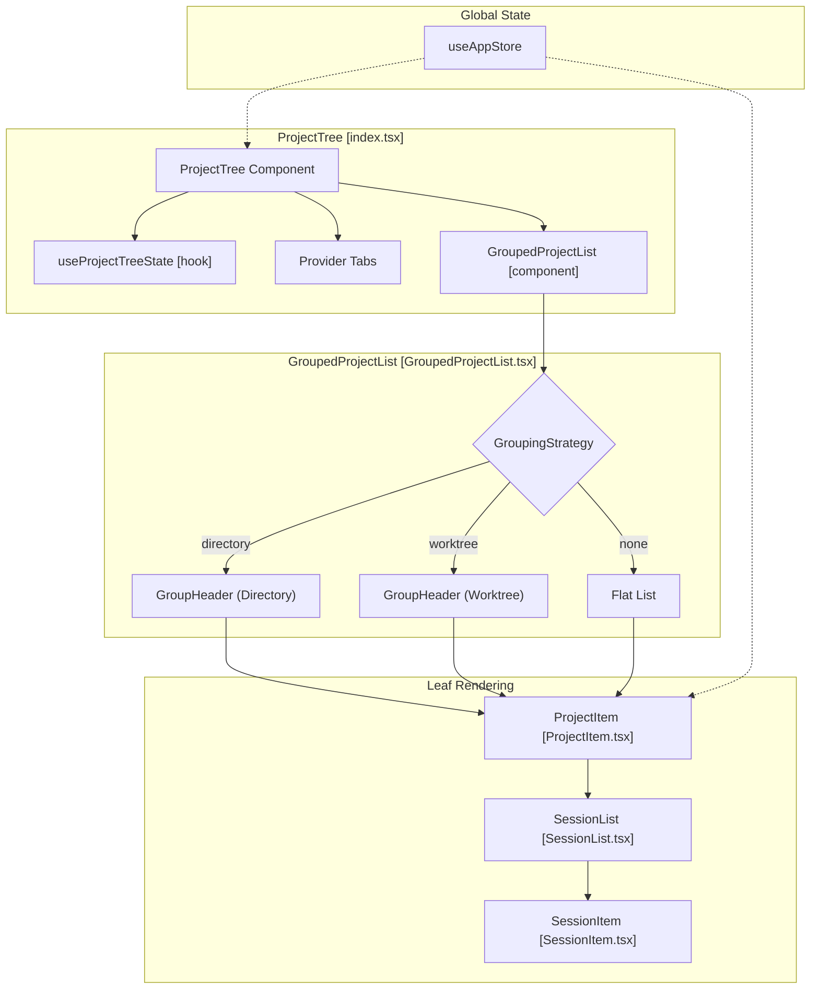
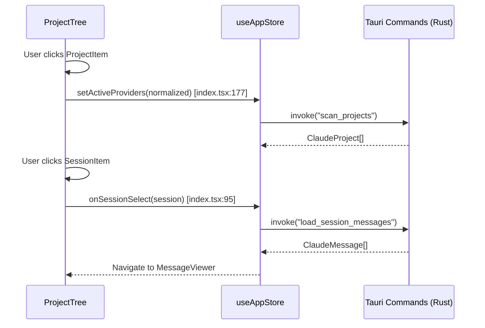

# Project Tree

관련 소스 파일

다음 파일들은 이 위키 페이지를 생성하기 위한 컨텍스트로 사용되었습니다:

- [src/components/ProjectContextMenu.tsx](src/components/ProjectContextMenu.tsx)
- [src/components/ProjectTree/components/GroupHeader.tsx](src/components/ProjectTree/components/GroupHeader.tsx)
- [src/components/ProjectTree/components/GroupedProjectList.tsx](src/components/ProjectTree/components/GroupedProjectList.tsx)
- [src/components/ProjectTree/components/ProjectItem.tsx](src/components/ProjectTree/components/ProjectItem.tsx)
- [src/components/ProjectTree/components/__tests__/GroupedProjectList.test.tsx](src/components/ProjectTree/components/__tests__/GroupedProjectList.test.tsx)
- [src/components/ProjectTree/components/__tests__/TreeSemantics.test.tsx](src/components/ProjectTree/components/__tests__/TreeSemantics.test.tsx)
- [src/components/ProjectTree/index.tsx](src/components/ProjectTree/index.tsx)
- [src/components/ProjectTree/types.ts](src/components/ProjectTree/types.ts)
- [src/contexts/modal/ModalProvider.tsx](src/contexts/modal/ModalProvider.tsx)
- [src/i18n/locales/en/common.json](src/i18n/locales/en/common.json)
- [src/i18n/locales/en/error.json](src/i18n/locales/en/error.json)
- [src/i18n/locales/ja/common.json](src/i18n/locales/ja/common.json)
- [src/i18n/locales/ja/error.json](src/i18n/locales/ja/error.json)
- [src/i18n/locales/ko/common.json](src/i18n/locales/ko/common.json)
- [src/i18n/locales/ko/error.json](src/i18n/locales/ko/error.json)
- [src/i18n/locales/zh-CN/common.json](src/i18n/locales/zh-CN/common.json)
- [src/i18n/locales/zh-CN/error.json](src/i18n/locales/zh-CN/error.json)
- [src/i18n/locales/zh-TW/common.json](src/i18n/locales/zh-TW/common.json)
- [src/i18n/locales/zh-TW/error.json](src/i18n/locales/zh-TW/error.json)
- [src/store/slices/settingsSlice.ts](src/store/slices/settingsSlice.ts)
- [src/test/App.accessibility.test.tsx](src/test/App.accessibility.test.tsx)

**Project Tree**는 Claude Code History Viewer의 기본 내비게이션 사이드바입니다. 일곱 가지 지원 제공자 전반의 AI 코딩 어시스턴트 기록을 탐색하기 위한 계층형 인터페이스를 제공하며, 사용자가 특정 프로젝트와 세션을 필터링, 그룹화, 선택할 수 있게 합니다.

트리 내부의 개별 세션 항목에 대한 자세한 내용은 [Session Item](#3.1.1)을 참조하세요.

## 목적 및 기능

Project Tree는 데이터 내비게이션을 위한 중앙 명령 허브로 작동하며, 사용자가 다음을 수행할 수 있게 합니다:
1. **제공자별 필터링**: 기록을 생성한 AI 도구(Claude Code, Gemini CLI, Codex CLI, Cline, Cursor, Aider, OpenCode)에 따라 프로젝트 표시 여부를 전환합니다 [src/components/ProjectTree/index.tsx:101-118]().
2. **프로젝트 구성**: 플랫, 디렉터리 기반, git-worktree 기반 그룹화 모드 간 전환합니다 [src/components/ProjectTree/components/GroupedProjectList.tsx:109-183]().
3. **선택 관리**: 프로젝트 선택에서 세션 로딩과 최종 메시지 표시까지의 흐름을 조정합니다 [src/components/ProjectTree/index.tsx:93-99]().
4. **전역 검색 접근**: `ModalContext`를 통해 프로젝트 간 메시지 검색 모달을 실행합니다 [src/contexts/modal/ModalProvider.tsx:41-47]().

## 컴포넌트 아키텍처

`ProjectTree` 컴포넌트는 제공자 필터링과 레이아웃 상태를 관리하는 복합 컨테이너이며, 실제 목록 렌더링은 `GroupedProjectList`에 위임합니다. 확장 상태와 컨텍스트 메뉴 위치를 추적하기 위해 `useProjectTreeState`를 활용합니다.

### 시스템 상호작용 다이어그램

출처: [src/components/ProjectTree/index.tsx:42-68](), [src/components/ProjectTree/components/GroupedProjectList.tsx:33-52](), [src/components/ProjectTree/components/ProjectItem.tsx:10-20]()

## 그룹화 모드

트리는 많은 수의 저장소를 처리하기 위해 세 가지 `GroupingStrategy` 모드를 지원합니다:

| 모드 | 로직 | 시각적 표시기 |
| :--- | :--- | :--- |
| **None** | 감지된 모든 프로젝트의 플랫 목록입니다. | 표준 폴더 아이콘 [src/components/ProjectTree/components/ProjectItem.tsx:120]() |
| **Directory** | 상위 디렉터리 경로별로 프로젝트를 그룹화합니다. | `FolderTree` 아이콘 [src/components/ProjectTree/components/GroupedProjectList.tsx:122]() |
| **Worktree** | Git worktree를 감지하고 "Main" 프로젝트 아래에 자식을 그룹화합니다. | `GitBranch` 아이콘 [src/components/ProjectTree/components/GroupedProjectList.tsx:160]() |

출처: [src/components/ProjectTree/components/GroupedProjectList.tsx:109-183](), [src/components/ProjectTree/components/ProjectItem.tsx:93-112]()

## 선택 및 로딩 흐름

프로젝트나 세션을 선택하면 `useAppStore`(Zustand)의 상태 업데이트와 백엔드 IPC 호출이 순차적으로 트리거됩니다.

출처: [src/components/ProjectTree/index.tsx:156-206](), [src/components/ProjectTree/index.tsx:93-99]()

## 프로젝트 컨텍스트 메뉴

`ProjectContextMenu`는 경로 복사와 표시 여부 관리 등 특정 프로젝트에 대한 관리 작업을 제공합니다.

- **경로 복사**: 프로젝트의 `actual_path`를 시스템 클립보드에 복사합니다 [src/components/ProjectContextMenu.tsx:73-88]().
- **숨기기/숨김 해제**: 트리에서 프로젝트의 표시 여부를 전환합니다. 숨겨진 프로젝트는 `onHide` 및 `onUnhide` 콜백을 통해 관리됩니다 [src/components/ProjectContextMenu.tsx:90-97]().
- **위치 지정**: 메뉴는 뷰포트 안에 유지되도록 `x` 및 `y` 좌표를 자동으로 조정합니다 [src/components/ProjectContextMenu.tsx:53-71]().

출처: [src/components/ProjectContextMenu.tsx:9-25](), [src/components/ProjectContextMenu.tsx:105-153]()

## 키보드 내비게이션

트리는 접근성과 파워 유저 워크플로를 위해 견고한 키보드 지원을 구현합니다:
- **화살표 키**: `ArrowRight`는 프로젝트 노드를 확장하고, `ArrowLeft`는 이를 접습니다 [src/components/ProjectTree/components/ProjectItem.tsx:53-61]().
- **타입어헤드**: 사용자는 이름의 처음 몇 글자를 입력해 프로젝트에 포커스할 수 있으며, 이는 `findTypeaheadMatchIndex`가 처리합니다 [src/components/ProjectTree/index.tsx:28-31]().
- **알림**: 내비게이션 중 스크린 리더 피드백을 제공하기 위해 `buildTreeItemAnnouncement`를 활용합니다 [src/components/ProjectTree/index.tsx:27-31]().

출처: [src/components/ProjectTree/index.tsx:25-31](), [src/components/ProjectTree/components/ProjectItem.tsx:53-61]()

***

### 하위 페이지
- [Session Item](#3.1.1) — 개별 세션 렌더링, 컨텍스트 메뉴, 네이티브 이름 변경 흐름에 대한 상세 문서.
