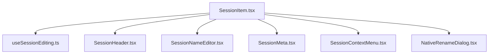
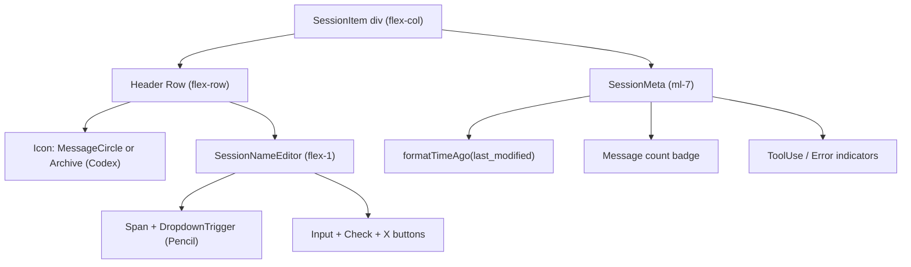
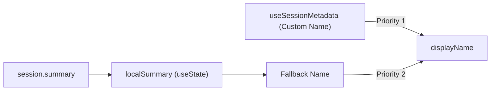
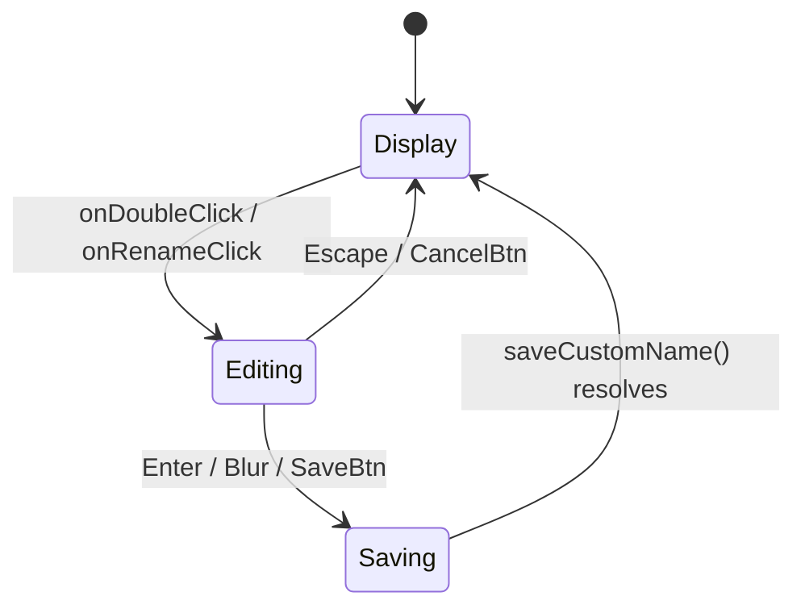
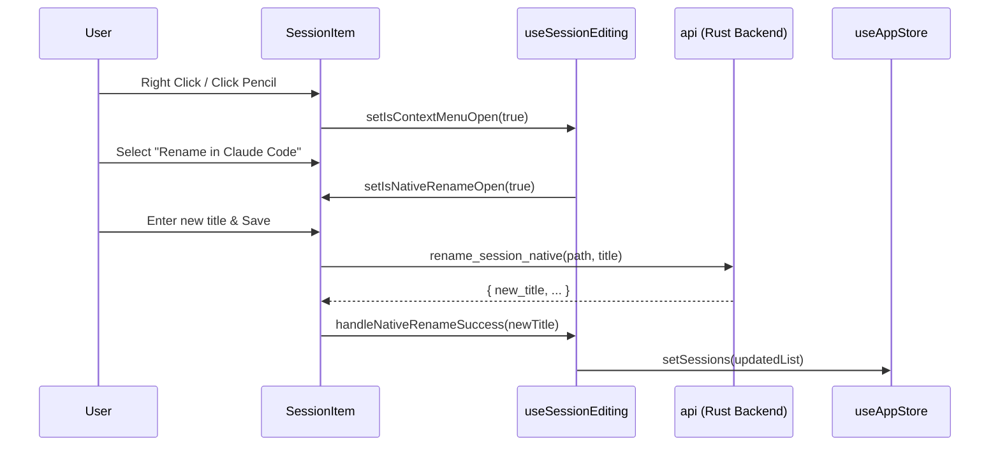

# Session Item

관련 소스 파일

다음 파일들은 이 위키 페이지를 생성하기 위한 컨텍스트로 사용되었습니다:

- [.spec-placeholder](.spec-placeholder)
- [docs/BRUSHING_SPEC.md](docs/BRUSHING_SPEC.md)
- [docs/specs/issue-80-session-sorting-search.md](docs/specs/issue-80-session-sorting-search.md)
- [src-tauri/src/commands/session/rename.rs](src-tauri/src/commands/session/rename.rs)
- [src/components/NativeRenameDialog.tsx](src/components/NativeRenameDialog.tsx)
- [src/components/ProjectTree/components/SessionList.tsx](src/components/ProjectTree/components/SessionList.tsx)
- [src/components/ProjectTree/components/__tests__/SessionList.test.tsx](src/components/ProjectTree/components/__tests__/SessionList.test.tsx)
- [src/components/SessionItem.tsx](src/components/SessionItem.tsx)
- [src/components/SessionItem/SessionItem.tsx](src/components/SessionItem/SessionItem.tsx)
- [src/components/SessionItem/components/SessionContextMenu.tsx](src/components/SessionItem/components/SessionContextMenu.tsx)
- [src/components/SessionItem/components/SessionMeta.tsx](src/components/SessionItem/components/SessionMeta.tsx)
- [src/components/SessionItem/components/SessionNameEditor.tsx](src/components/SessionItem/components/SessionNameEditor.tsx)
- [src/components/SessionItem/hooks/useSessionEditing.ts](src/components/SessionItem/hooks/useSessionEditing.ts)
- [src/components/SessionItem/types.ts](src/components/SessionItem/types.ts)
- [src/components/renderers/index.ts](src/components/renderers/index.ts)
- [src/components/renderers/types.ts](src/components/renderers/types.ts)
- [src/hooks/useNativeRename.ts](src/hooks/useNativeRename.ts)
- [src/i18n/locales/en/session.json](src/i18n/locales/en/session.json)
- [src/i18n/locales/ja/session.json](src/i18n/locales/ja/session.json)
- [src/i18n/locales/ko/session.json](src/i18n/locales/ko/session.json)
- [src/i18n/locales/zh-CN/session.json](src/i18n/locales/zh-CN/session.json)
- [src/i18n/locales/zh-TW/session.json](src/i18n/locales/zh-TW/session.json)
- [src/test/SessionItem.test.tsx](src/test/SessionItem.test.tsx)
- [src/types/metadata.types.ts](src/types/metadata.types.ts)
- [src/utils/brushMatchers.ts](src/utils/brushMatchers.ts)
- [src/utils/toolIconUtils.ts](src/utils/toolIconUtils.ts)

이 페이지는 `SessionItem` 컴포넌트를 문서화합니다: 프로젝트 트리 사이드바에서 단일 세션 항목을 렌더링하는 방식, 노출하는 두 가지 이름 변경 시스템(인라인 사용자 지정 이름 변경 및 네이티브 파일 이름 변경), 그리고 컨텍스트 메뉴의 클립보드 작업을 다룹니다.

---

## 개요

`SessionItem`([src/components/SessionItem/SessionItem.tsx:11-17]())은 프로젝트의 확장된 세션 목록 안에서 세션마다 한 번씩 렌더링되는 독립형 카드입니다. 담당 역할은 다음과 같습니다:

- 세션 메타데이터(표시 이름, 마지막 수정 시간, 메시지 수, 도구 사용 및 오류 표시기)를 표시합니다.
- 앱 수준 메타데이터에 사용자 지정 이름을 저장하는 인라인 이름 변경 흐름을 제공합니다.
- CLI에서 볼 수 있는 기본 세션 파일을 수정하는 네이티브 이름 변경 흐름을 제공합니다.
- 클립보드 작업(세션 ID 복사, resume 명령 복사, 파일 경로 복사)을 포함한 컨텍스트 메뉴를 제공합니다.

---

## Props

| Prop | Type | 설명 |
|---|---|---|
| `session` | `ClaudeSession` | 렌더링할 세션 객체 |
| `isSelected` | `boolean` | 이 항목이 현재 활성 세션인지 여부 |
| `onSelect` | `() => void` | 사용자가 이 세션을 클릭해 선택할 때 호출됨 |
| `onHover` | `() => void` (optional) | `mouseEnter` 시 호출됨(편집 중에는 건너뜀) |
| `formatTimeAgo` | `(date: string) => string` | `last_modified` 형식을 지정하기 위해 `ProjectTree`에서 주입됨 |

출처: [src/components/SessionItem/types.ts:7-13](), [src/components/ProjectTree/components/SessionList.tsx:43-49]()

---

## 컴포넌트 아키텍처

`SessionItem` 구현은 전문화된 하위 컴포넌트와 상태 관리를 위한 전용 훅으로 모듈화되어 있습니다.

**Session Item — 컴포넌트 계층**

출처: [src/components/SessionItem/SessionItem.tsx:4-8](), [src/components/SessionItem/SessionItem.tsx:107-134]()

**Session Item — 시각적 레이아웃**

출처: [src/components/SessionItem/SessionItem.tsx:60-104](), [src/components/SessionItem/components/SessionNameEditor.tsx:61-165]()

---

## 표시 이름 해석

컴포넌트는 이름을 해석하기 위해 메타데이터 훅을 활용하는 `useSessionEditing`([src/components/SessionItem/hooks/useSessionEditing.ts:39]())을 사용합니다:

- `useSessionDisplayName(session_id, localSummary)` — 저장된 사용자 지정 이름을 `localSummary` 폴백보다 우선합니다([src/components/SessionItem/hooks/useSessionEditing.ts:60]()).
- `useSessionMetadata(session_id)` — `customName` 및 `hasClaudeCodeName` 영속성을 관리합니다([src/components/SessionItem/hooks/useSessionEditing.ts:61-66]()).

`localSummary`는 `useEffect`를 통해 동기화 상태를 유지하는 `session.summary`의 컴포넌트 로컬 복사본입니다([src/components/SessionItem/hooks/useSessionEditing.ts:56-58]()).

**이름 해석 로직**

출처: [src/components/SessionItem/hooks/useSessionEditing.ts:56-71](), [src/test/SessionItem.test.tsx:27-30]()

---

## 이름 변경 시스템

### 1. 인라인 사용자 지정 이름 변경
제공자의 소스 파일을 수정하지 않고 애플리케이션의 로컬 메타데이터 데이터베이스에 "별칭"을 저장합니다. 더블 클릭 또는 컨텍스트 메뉴로 활성화됩니다.

**인라인 이름 변경 상태 머신**

출처: [src/components/SessionItem/hooks/useSessionEditing.ts:73-97](), [src/components/SessionItem/components/SessionNameEditor.tsx:126-191]()

### 2. 네이티브 이름 변경
지원 제공자(`claude`, `opencode`)의 기본 소스 파일을 직접 수정합니다. 이 변경 사항은 CLI 도구에 표시됩니다.

- **Claude**: `.jsonl` 파일의 첫 번째 사용자 메시지를 수정하여 제목 접두사 `[Title] original message...`를 포함합니다([src-tauri/src/commands/session/rename.rs:128-152]()).
- **OpenCode**: 저장소 메타데이터의 세션 제목을 업데이트합니다.

출처: [src/components/SessionItem/hooks/useSessionEditing.ts:50](), [src/components/NativeRenameDialog.tsx:63-65](), [src-tauri/src/commands/session/rename.rs:94-110]()

---

## 컨텍스트 메뉴 및 클립보드

컨텍스트 메뉴는 호버 트리거(Pencil 아이콘) 또는 오른쪽 클릭으로 사용할 수 있습니다.

| 작업 | 복사되는 텍스트 | 제공자 가용성 |
|---|---|---|
| **Copy Session ID** | `session.actual_session_id` | 전체 |
| **Copy Resume Command** | `claude --resume [id]` | `claude`만 |
| **Copy File Path** | `session.file_path` | 전체 |
| **Reveal in Finder** | N/A (폴더 열기) | 전체(절대 경로만) |
| **Delete Session** | N/A (휴지통으로 이동) | 전체(절대 경로만) |

출처: [src/components/SessionItem/hooks/useSessionEditing.ts:170-225](), [src/components/SessionItem/components/SessionContextMenu.tsx:37-122]()

---

## 제공자별 표시기

`SessionItem`은 세션 제공자와 상태에 따라 특정 배지와 아이콘을 렌더링합니다.

- **Codex Archive**: Codex 세션이 `archived_sessions`에 있는 경우 메시지 버블 대신 `Archive` 아이콘이 표시됩니다([src/components/SessionItem/hooks/useSessionEditing.ts:51-53]()).
- **CLI Sync Badge**: Claude 세션의 경우 요약에서 네이티브 이름 변경 제목이 감지되면 `CLI` 배지가 표시됩니다([src/components/SessionItem/hooks/useSessionEditing.ts:68-70]()).
- **Storage Type**: 파일 형식에 따라 메타데이터에 `JSON` 또는 `SQLite` 배지를 표시합니다([src/components/SessionItem/components/SessionMeta.tsx:38-49]()).

**제공자 기능 매트릭스**

| 기능 | Claude | Codex | OpenCode | 기타 |
|---|---|---|---|---|
| Native Rename | ✓ | ✗ | ✓ | ✗ |
| Resume Command | ✓ | ✗ | ✗ | ✗ |
| Archive Icon | ✗ | ✓ | ✗ | ✗ |
| CLI Sync Badge | ✓ | ✗ | ✗ | ✗ |

출처: [src/components/SessionItem/hooks/useSessionEditing.ts:49-53](), [src/components/SessionItem/components/SessionNameEditor.tsx:129-160](), [src/components/SessionItem/components/SessionMeta.tsx:38-49]()

---

## 상호작용 흐름

출처: [src/components/SessionItem/SessionItem.tsx:107-133](), [src/components/SessionItem/hooks/useSessionEditing.ts:257-285](), [src-tauri/src/commands/session/rename.rs:94-110]()
