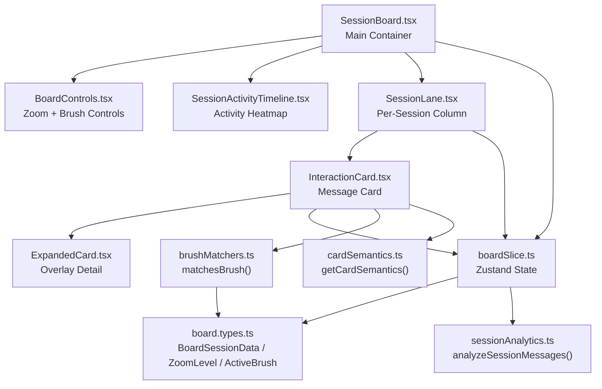
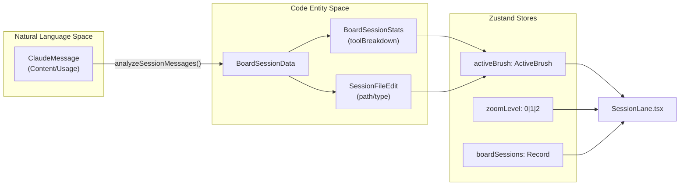

# Session Board

관련 소스 파일

다음 파일들은 이 위키 페이지를 생성하기 위한 컨텍스트로 사용되었습니다:

- [src/components/AnalyticsDashboard/components/DailyTrendChart.tsx](src/components/AnalyticsDashboard/components/DailyTrendChart.tsx)
- [src/components/AnalyticsDashboard/components/TokenDistributionChart.tsx](src/components/AnalyticsDashboard/components/TokenDistributionChart.tsx)
- [src/components/SessionBoard/BoardControls.tsx](src/components/SessionBoard/BoardControls.tsx)
- [src/components/SessionBoard/ContributionGrid.tsx](src/components/SessionBoard/ContributionGrid.tsx)
- [src/components/SessionBoard/InteractionCard.tsx](src/components/SessionBoard/InteractionCard.tsx)
- [src/components/SessionBoard/SessionActivityTimeline.tsx](src/components/SessionBoard/SessionActivityTimeline.tsx)
- [src/components/SessionBoard/SessionBoard.tsx](src/components/SessionBoard/SessionBoard.tsx)
- [src/components/SessionBoard/SessionLane.tsx](src/components/SessionBoard/SessionLane.tsx)
- [src/components/SessionBoard/useActivityData.ts](src/components/SessionBoard/useActivityData.ts)
- [src/components/SmartJsonDisplay.tsx](src/components/SmartJsonDisplay.tsx)
- [src/components/ToolIcon.tsx](src/components/ToolIcon.tsx)
- [src/components/ui/chart-tooltip.tsx](src/components/ui/chart-tooltip.tsx)
- [src/store/slices/boardSlice.ts](src/store/slices/boardSlice.ts)
- [src/test/useActivityData.test.ts](src/test/useActivityData.test.ts)
- [src/types/board.types.ts](src/types/board.types.ts)
- [src/utils/sessionAnalytics.ts](src/utils/sessionAnalytics.ts)
- [src/utils/toolSummaries.ts](src/utils/toolSummaries.ts)

Session Board는 수십 개에서 수백 개의 Claude 세션을 동시에 분석할 수 있는 다중 세션 타임라인 시각화입니다. 개요에서 세부 정보로 이동하는 내비게이션을 위해 세 가지 확대/축소 수준(Pixel, Skim, Read)을 구현하고, 세션 간 패턴 인식을 위한 대화형 브러싱 시스템을 제공합니다. 이 컴포넌트는 전체 프로젝트 대화 기록에서 도구 사용 패턴, 오류 클러스터, 파일 편집 워크플로를 이해하는 핵심 사용 사례를 다룹니다.

단일 세션 메시지 상세 보기는 3.3 페이지를 참조하세요. 세션 수준 통계 집계는 3.4 페이지를 참조하세요. Interaction card 렌더링과 lane 가상화 세부 정보는 3.2.1 페이지에 있으며, 활동 타임라인 히트맵은 3.2.2 페이지에 문서화되어 있습니다.

---

## 목적 및 범위

Session Board는 다음을 위한 기본 인터페이스 역할을 합니다:

- **세션 간 분석**: 가로 타임라인 레이아웃에서 50-200개 이상의 세션을 동시에 봅니다.
- **패턴 인식**: 시각적 브러싱을 통해 특정 파일이나 도구를 건드렸거나 오류가 발생한 세션을 식별합니다.
- **확대/축소 기반 내비게이션**: 픽셀 히트맵(토큰 밀도), skim 카드(도구 요약), read 카드(전체 콘텐츠) 간 전환합니다.
- **대규모 성능**: 이중 가상화(가로 열 + 세로 행)를 사용해 세션 전반의 10,000개 이상 메시지를 처리합니다.

이 컴포넌트는 열 기반 시각화에서 속성 기반 브러싱을 위한 overview-zoom-filter 패러다임을 구현합니다.

---

## 컴포넌트 아키텍처

Session Board는 도구 사용 블록을 분석하여 **Natural Language Space**(요약 및 메시지 콘텐츠)와 **Code Entity Space**(파일, 셸 명령, git 커밋)를 연결합니다.

### 컴포넌트 계층

> `BoardControls`와 `SessionActivityTimeline`은 순수하게 props 기반이며 Zustand 스토어에 직접 접근하지 않습니다. 모든 상태는 `SessionBoard`에서 하위로 전달됩니다.

**출처**: [src/components/SessionBoard/SessionBoard.tsx:1-41](), [src/components/SessionBoard/SessionLane.tsx:41-53](), [src/components/SessionBoard/InteractionCard.tsx:75-88](), [src/store/slices/boardSlice.ts:18-41]()

---

## 데이터 흐름 및 상태 관리

보드 상태는 `boardSlice.ts`가 관리하며, 이 파일은 원시 `ClaudeMessage` 데이터가 `analyzeSessionMessages`를 통해 `BoardSessionData`로 변환되는 방식을 조정합니다.

### 상태 상호작용 다이어그램

| 상태 필드 | 타입 | 목적 |
|-------------|------|---------|
| `boardSessions` | `Record<string, BoardSessionData>` | 세션 ID를 키로 하는 전체 세션 데이터 [src/store/slices/boardSlice.ts:19](). |
| `allSortedSessionIds` | `string[]` | 관련성, 이후 최신순으로 정렬된 모든 세션 ID [src/store/slices/boardSlice.ts:21](). |
| `visibleSessionIds` | `string[]` | 날짜 필터링 후 현재 표시되는 세션 ID [src/store/slices/boardSlice.ts:20](). |
| `zoomLevel` | `0 \| 1 \| 2` | 현재 확대/축소 수준(Pixel/Skim/Read) [src/types/board.types.ts:45](). |
| `activeBrush` | `ActiveBrush \| null` | 도구/파일/상태별 활성 필터 [src/types/board.types.ts:57](). |
| `stickyBrush` | `boolean` | 마우스가 벗어난 후에도 브러시가 유지되는지 여부 [src/store/slices/boardSlice.ts:25](). |
| `selectedMessageId` | `string \| null` | 확장된 카드 UUID [src/store/slices/boardSlice.ts:26](). |
| `dateFilter` | `DateFilter` | 시작/종료 날짜 범위 필터 [src/types/board.types.ts:47](). |

**출처**: [src/store/slices/boardSlice.ts:18-30](), [src/types/board.types.ts:36-50](), [src/components/SessionBoard/SessionBoard.tsx:21-40]()

---

## 확대/축소 수준

보드는 각각 다른 분석 작업에 최적화된 세 가지 확대/축소 수준을 제공합니다:

### 확대/축소 수준 0: Pixel View
세션을 픽셀 높이 카드가 있는 세로 히트맵으로 렌더링합니다.
- **휴리스틱**: 각 카드의 높이는 토큰 수에 비례합니다(최소 4px, 최대 20px) [src/components/SessionBoard/SessionLane.tsx:172]().
- **시각 요소**: 색상은 히트맵 CSS 변수(`--heatmap-empty`, `--heatmap-low` 등)를 사용해 도구 variant 범주를 나타냅니다 [src/components/SessionBoard/ContributionGrid.tsx:26-32]().

### 확대/축소 수준 1: Skim View
도구 이름, 아이콘, 콘텐츠 미리보기가 있는 압축 카드를 표시합니다.
- **그룹화 로직**: 연속된 도구 이벤트 또는 텍스트-도구 시퀀스는 sibling 표시기가 있는 단일 블록으로 병합됩니다 [src/components/SessionBoard/SessionLane.tsx:93-102]().
- **콘텐츠**: `getNaturalLanguageSummary`를 통해 자연어 요약을 표시합니다 [src/components/SessionBoard/InteractionCard.tsx:18]().

### 확대/축소 수준 2: Read View
전체 메시지 콘텐츠와 실행 메타데이터를 표시하는 상세 카드입니다.
- **세부 정보**: `exitCode` [src/components/SessionBoard/InteractionCard.tsx:59](), `FileEditDisplay` [src/components/SessionBoard/InteractionCard.tsx:38](), `verifiedCommit` 링크 [src/components/SessionBoard/InteractionCard.tsx:120]()를 표시합니다.

**출처**: [src/types/board.types.ts:45](), [src/components/SessionBoard/SessionLane.tsx:152-198](), [src/components/SessionBoard/InteractionCard.tsx:23-36]()

---

## Session Lane 구조

각 `SessionLane` 컴포넌트는 하나의 세션을 세로 열로 나타냅니다.

### Lane 헤더 및 분석
- **일치 비율**: 브러시가 활성화되면 헤더는 일치하는 메시지와 전체 메시지의 비율을 표시합니다 [src/components/SessionBoard/SessionLane.tsx:118-141]().
- **활동 지표**: `lucide-react`의 아이콘을 사용해 `fileEditCount`, `shellCount`, `gitToolCount`를 요약합니다 [src/components/SessionBoard/SessionLane.tsx:6-14]().
- **세션 깊이**: `deep`(messages > 15 또는 toolCount > 5인 경우) 또는 `shallow`로 분류됩니다 [src/store/slices/boardSlice.ts:96-103]().

**출처**: [src/components/SessionBoard/SessionLane.tsx:41-53](), [src/types/board.types.ts:36-43](), [src/store/slices/boardSlice.ts:96-103]()

---

## 이중 가상화

보드는 대규모 데이터셋을 효율적으로 처리하기 위해 두 단계의 가상화를 사용합니다:

1.  **가로 가상화(열)**: 세션 lane 렌더링을 위해 `SessionBoard.tsx`의 `useVirtualizer`가 관리합니다 [src/components/SessionBoard/SessionBoard.tsx:2]().
2.  **세로 가상화(lane별 행)**: interaction card 렌더링을 위해 `SessionLane.tsx`의 `rowVirtualizer`가 관리합니다 [src/components/SessionBoard/SessionLane.tsx:143]().

**출처**: [src/components/SessionBoard/SessionBoard.tsx:2](), [src/components/SessionBoard/SessionLane.tsx:143-198]()

---

## 브러싱 시스템

브러싱은 선택된 속성과 일치하는 카드를 강조 표시하여 대화형 세션 간 필터링을 제공합니다.

### 브러시 타입 및 매칭
브러시는 `model`, `status`, `tool`, `file`, `hook`, `command`, `mcp`를 기반으로 할 수 있습니다 [src/types/board.types.ts:57-60](). `getCardSemantics` 유틸리티는 특정 메시지가 활성 브러시와 일치하는지 판단합니다 [src/components/SessionBoard/InteractionCard.tsx:108-110]().

### 고정 브러싱
브러시는 "고정"될 수 있으며, 이는 마우스가 트리거 영역을 벗어나도 유지됨을 의미합니다 [src/store/slices/boardSlice.ts:25](). `Escape` 키를 누르면 모든 활성 및 고정 브러시가 지워집니다 [src/components/SessionBoard/SessionBoard.tsx:43-52]().

**출처**: [src/types/board.types.ts:57-60](), [src/components/SessionBoard/SessionBoard.tsx:43-52](), [src/store/slices/boardSlice.ts:35-36]()

---

## Board Controls

`BoardControls` 컴포넌트는 확대/축소 및 브러시 컨트롤을 위한 툴바를 제공합니다 [src/components/SessionBoard/BoardControls.tsx:39]().

- **확대/축소 컨트롤**: `Layout`(Pixel), `Layers`(Skim), `Eye`(Read) 아이콘 간 전환합니다 [src/components/SessionBoard/BoardControls.tsx:64-100]().
- **브러시 드롭다운**: `tool`, `mcp`, `command`에 대한 옵션을 채웁니다(frecency 기준 상위 10개) [src/components/SessionBoard/BoardControls.tsx:103-200]().
- **날짜 필터링**: 시간 범위별 세션 필터링을 위한 `DatePickerHeader`가 통합되어 있습니다 [src/components/SessionBoard/BoardControls.tsx:11]().

**출처**: [src/components/SessionBoard/BoardControls.tsx:39-55](), [src/components/SessionBoard/SessionBoard.tsx:79-168]()

---

## 활동 타임라인

`SessionActivityTimeline`은 프로젝트 활동의 상위 수준 히트맵을 제공합니다. 자세한 내용은 [Activity Timeline](#3.2.2)을 참조하세요.

- **Contribution Grid**: 일별 세션 빈도와 토큰 강도를 표시하는 SVG 기반 막대 차트 [src/components/SessionBoard/ContributionGrid.tsx:79-132]().
- **연속 활동 추적**: `useActivityData`를 사용해 `currentStreak` 및 `longestStreak`를 계산합니다 [src/components/SessionBoard/useActivityData.ts:95-147]().
- **날짜 선택**: 그리드에서 막대를 클릭하면 `setDateFilter`가 트리거되고, 이는 `visibleSessionIds`를 업데이트합니다 [src/components/SessionBoard/SessionActivityTimeline.tsx:41-51]().

**출처**: [src/components/SessionBoard/SessionActivityTimeline.tsx:19-28](), [src/components/SessionBoard/ContributionGrid.tsx:9-13](), [src/components/SessionBoard/useActivityData.ts:149-153]()

---

## 데이터 파이프라인: `loadBoardSessions`

보드 데이터는 git 로그 조회와 세션 분석을 포함하는 파이프라인을 통해 준비됩니다:

1.  **Git 상관관계**: 메시지를 실제 커밋과 연관 짓기 위해 `get_git_log`를 통해 프로젝트의 git 로그를 가져옵니다 [src/store/slices/boardSlice.ts:128-131]().
2.  **세션 분석**: `analyzeSessionMessages`를 실행해 `errorCount`, `fileEditCount`, `toolBreakdown` 같은 지표를 도출합니다 [src/store/slices/boardSlice.ts:153-178]().
3.  **관련성 점수화**: `getSessionRelevance`를 사용해 도구 사용, 오류, 문서화 작업을 기반으로 세션 표시 우선순위를 결정합니다 [src/store/slices/boardSlice.ts:69-94]().

**출처**: [src/store/slices/boardSlice.ts:114-180](), [src/utils/sessionAnalytics.ts:23-39]()
