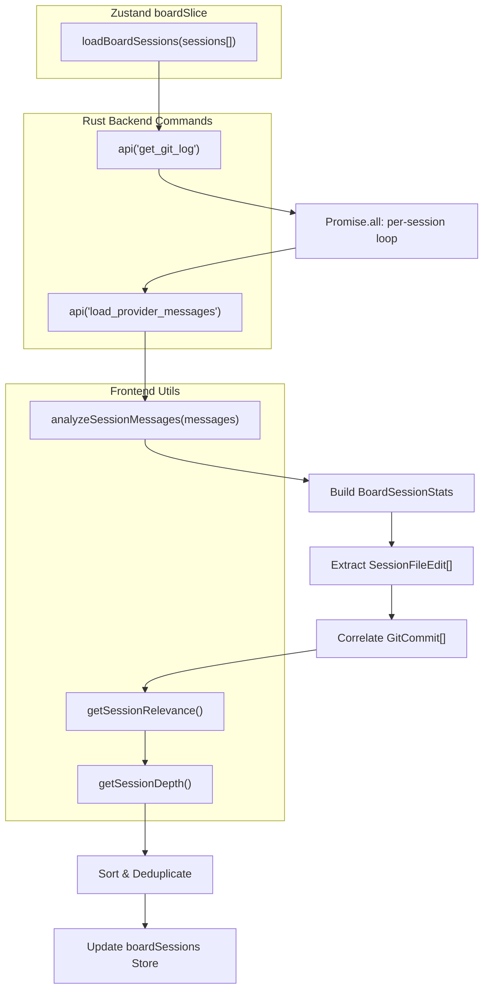
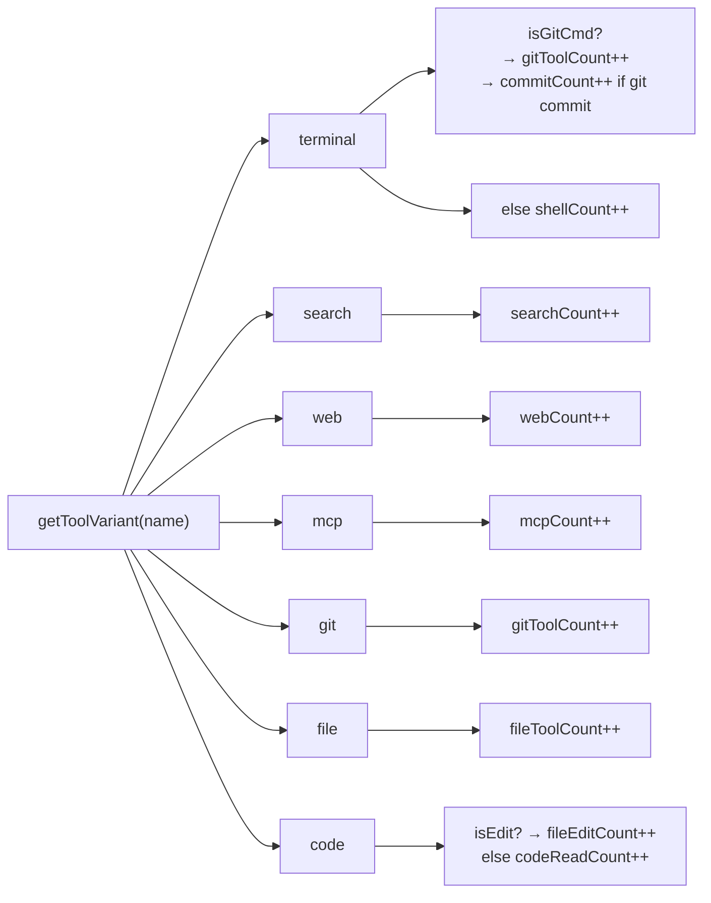
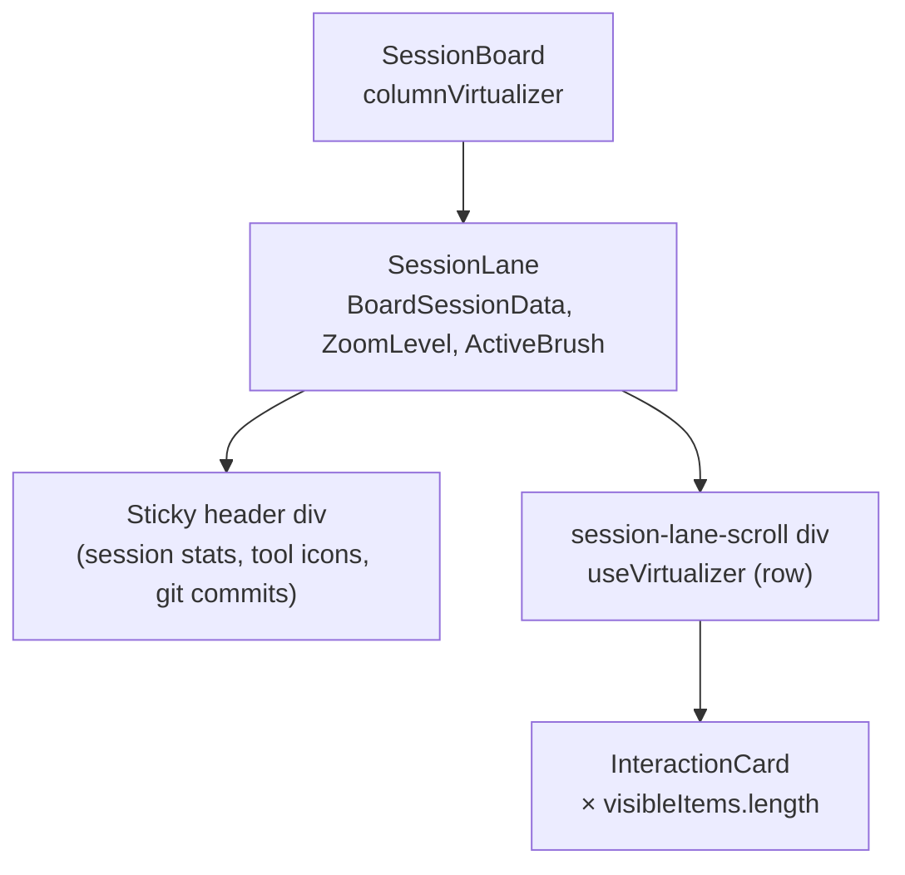
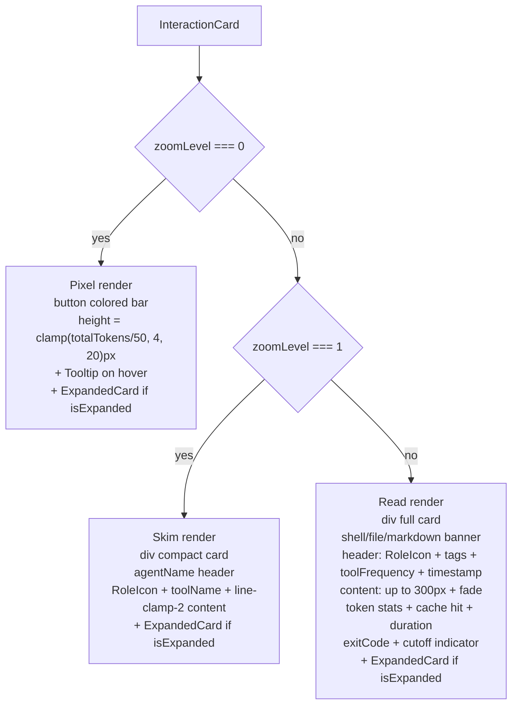

# Interaction Cards and Lanes

관련 소스 파일

다음 파일들은 이 위키 페이지를 생성하기 위한 컨텍스트로 사용되었습니다:

- [docs/BRUSHING_SPEC.md](docs/BRUSHING_SPEC.md)
- [src/components/SessionBoard/BoardControls.tsx](src/components/SessionBoard/BoardControls.tsx)
- [src/components/SessionBoard/InteractionCard.tsx](src/components/SessionBoard/InteractionCard.tsx)
- [src/components/SessionBoard/SessionBoard.tsx](src/components/SessionBoard/SessionBoard.tsx)
- [src/components/SessionBoard/SessionLane.tsx](src/components/SessionBoard/SessionLane.tsx)
- [src/components/SessionItem.tsx](src/components/SessionItem.tsx)
- [src/components/SmartJsonDisplay.tsx](src/components/SmartJsonDisplay.tsx)
- [src/components/ToolIcon.tsx](src/components/ToolIcon.tsx)
- [src/components/renderers/index.ts](src/components/renderers/index.ts)
- [src/components/renderers/types.ts](src/components/renderers/types.ts)
- [src/store/slices/boardSlice.ts](src/store/slices/boardSlice.ts)
- [src/test/SessionItem.test.tsx](src/test/SessionItem.test.tsx)
- [src/types/board.types.ts](src/types/board.types.ts)
- [src/utils/brushMatchers.ts](src/utils/brushMatchers.ts)
- [src/utils/sessionAnalytics.ts](src/utils/sessionAnalytics.ts)
- [src/utils/toolIconUtils.ts](src/utils/toolIconUtils.ts)
- [src/utils/toolSummaries.ts](src/utils/toolSummaries.ts)

이 페이지는 `InteractionCard`와 `SessionLane` 컴포넌트를 문서화합니다. 이 둘은 Session Board 보기에서 개별 AI 메시지와 세션별 열을 렌더링하는 두 가지 빌딩 블록입니다. 세 가지 확대/축소 수준, 메시지 그룹화 및 행 가상화 전략, 그리고 보드에 데이터를 채우는 `loadBoardSessions` 데이터 파이프라인을 다룹니다.

lane을 호스팅하는 `SessionBoard` 컨테이너(열 가상화, 패닝, 브러싱 컨트롤, 타임라인)에 대한 더 넓은 맥락은 [Section 3.2]()를 참조하세요. 브러싱 시스템과 `matchesBrush` 조건자에 대한 자세한 내용은 [Section 6.2]()를 참조하세요.

---

## 데이터 모델

보드는 `src/types/board.types.ts`에 정의된 복합 타입인 `BoardSessionData`를 기반으로 동작합니다.

**`BoardSessionData` 구조:**

| 필드 | 타입 | 설명 |
|---|---|---|
| `session` | `ClaudeSession` | 세션 메타데이터(id, 타임스탬프, 경로, 제공자) |
| `messages` | `ClaudeMessage[]` | JSONL에서 로드된 전체 메시지 목록 |
| `stats` | `BoardSessionStats` | 헤더 표시에 사용되는 집계 분석 정보 |
| `fileEdits` | `SessionFileEdit[]` | 타임라인용으로 추출된 파일 변경 이벤트 |
| `gitCommits` | `GitCommit[]` | 이 세션의 시간 범위와 상관관계가 있는 실제 git 커밋 |
| `depth` | `SessionDepth` | `"deep"` 또는 `"shallow"`, lane 너비를 제어 |

**`BoardSessionStats` 필드** [[src/types/board.types.ts:3-25]]():

| 통계 필드 | 의미 |
|---|---|
| `totalTokens`, `inputTokens`, `outputTokens` | 세션의 토큰 예산 |
| `errorCount` | 오류 신호가 있는 메시지 |
| `durationMs` | assistant 메시지의 `durationMs` 합계 |
| `toolCount` | 도구 사용 메시지의 총 개수 |
| `fileEditCount` | 파일에 대한 변경(write/edit/replace) |
| `shellCount` | git이 아닌 셸 명령 호출 |
| `commitCount` | `git commit` 호출 |
| `searchCount`, `webCount`, `mcpCount` | 검색, web-fetch, MCP 도구 호출 |
| `fileToolCount` | 파일 나열/생성 도구 |
| `codeReadCount` | 파일 읽기 도구 호출 |
| `gitToolCount` | Git status/diff/log 호출 |
| `hasMarkdownEdits`, `markdownEditCount` | Markdown 파일 변경 추적 |
| `filesTouchedCount` | 건드린 고유 파일 경로 수 |

**`ZoomLevel`**은 `0 | 1 | 2` 리터럴 유니온이며, 다음 별칭을 갖습니다:
- `0` → PIXEL (Heatmap)
- `1` → SKIM (Kanban)
- `2` → READ (Detail)

출처: [[src/types/board.types.ts:1-86]]()

---

## `loadBoardSessions` 데이터 파이프라인

`src/store/slices/boardSlice.ts`의 `boardSlice` 액션 `loadBoardSessions`는 `ClaudeSession` 객체 목록으로 보드를 채웁니다. 이 파이프라인은 프로젝트 또는 세션 목록이 변경될 때마다 실행됩니다.

**파이프라인: `loadBoardSessions`**

출처: [[src/store/slices/boardSlice.ts:114-278]]()

**관련성 점수화**(`getSessionRelevance`) [[src/store/slices/boardSlice.ts:69-94]]():

| 조건 | 점수 변화 |
|---|---|
| `messages.length < 3` | 고정 `0.2` |
| 기본 점수 | `0.5` |
| `stats.toolCount > 5` | `+0.3` |
| `stats.errorCount > 0` | `+0.2` |
| `.md` 파일 편집 있음 | `+0.2` |
| `stats.commitCount > 0` | `+0.3` |

최댓값은 `1.0`으로 제한됩니다. 세션은 관련성 내림차순으로 왼쪽에서 오른쪽으로 렌더링됩니다.

**깊이 분류**(`getSessionDepth`) [[src/store/slices/boardSlice.ts:96-103]]():
- `messages.length > 15` 또는 `stats.toolCount > 5`이면 `"deep"`
- 그렇지 않으면 `"shallow"`

---

## `analyzeSessionMessages`

`src/utils/sessionAnalytics.ts`의 `analyzeSessionMessages`는 `loadBoardSessions` 중 세션마다 한 번 호출됩니다. 모든 `ClaudeMessage`를 순회하고, `getToolVariant`를 통해 각 assistant `toolUse` 블록을 검사하여 `SessionStats` 객체를 채웁니다.

**분석에서의 도구 variant 매핑:**

출처: [[src/utils/sessionAnalytics.ts:23-143]](), [[src/utils/toolIconUtils.ts:8-54]]()

---

## `SessionLane`

`SessionLane`은 하나의 세션을 단일 세로 열로 렌더링합니다. 표시되는 세션 ID마다 `SessionBoard`의 열 가상화기가 한 번씩 인스턴스화합니다.

**컴포넌트 다이어그램:**

출처: [[src/components/SessionBoard/SessionLane.tsx:41-53]](), [[src/components/SessionBoard/SessionBoard.tsx:284-301]]()

### Lane 너비

Lane 너비는 `depth`와 `zoomLevel`에 의해 결정됩니다 [[src/components/SessionBoard/SessionLane.tsx:208-231]]():

| `zoomLevel` | `depth` | 너비 |
|---|---|---|
| `0` | any | `80px` |
| `1` 또는 `2` | `"shallow"` | `320px` |
| `1` 또는 `2` | `"deep"` | `380px` |

### 메시지 그룹화

행 가상화 전에 `SessionLane`은 원시 메시지 목록을 `{ head: ClaudeMessage, siblings: ClaudeMessage[] }` 그룹 목록인 `visibleItems`로 축소합니다. 이는 두 가지 목적을 수행합니다: 비어 있는 비도구 메시지를 필터링하고, 연속된 관련 메시지를 하나의 렌더링 카드로 병합합니다.

**그룹화 규칙** [[src/components/SessionBoard/SessionLane.tsx:60-115]]():

| 확대/축소 수준 | 그룹화 조건 |
|---|---|
| `0` (Pixel) | 동일한 `role` 그리고 동일한 도구/비도구 상태 → 하나의 색상 밴드로 병합 |
| `1`, `2` (Skim/Read) | 둘 다 도구 이벤트 → 병합, 또는 현재 항목이 도구이고 head가 assistant → 병합 |

Siblings는 집계 표시(병합 수 배지, 도구 빈도 요약)를 위해 `InteractionCard`에 전달됩니다.

### Lane 헤더

sticky 헤더는 다음을 표시합니다:
- 세션 타임스탬프
- 토큰 합계(`formatNumber`를 통한 `inputTokens`, `outputTokens`, `totalTokens`)
- 지속 시간(`formatDuration`)
- 도구 활동 아이콘(shell, file, search, web, MCP, git, docs, code edits, code reads) — 각각 클릭하여 `activeBrush` 설정 가능
- 브러시가 활성화된 경우 일치 비율 막대(예: `3/12 ▌▌▌░░░░░`)
- 상관관계가 있는 git 커밋 목록(처음 두 개 표시, 나머지는 개수로 표시)

출처: [[src/components/SessionBoard/SessionLane.tsx:247-583]]()

---

## `InteractionCard`

`InteractionCard`는 하나의 그룹화된 메시지 블록을 렌더링합니다. `memo`로 래핑되어 있습니다.

**Props** [[src/components/SessionBoard/InteractionCard.tsx:23-36]]():

| Prop | 타입 | 역할 |
|---|---|---|
| `message` | `ClaudeMessage` | 기본(head) 메시지 |
| `zoomLevel` | `ZoomLevel` | 렌더링 분기를 제어 |
| `isExpanded` | `boolean` | true일 때 `ExpandedCard` 오버레이 표시 |
| `gitCommits` | `GitCommit[]` | 검증된 커밋 감지에 사용 |
| `siblings` | `ClaudeMessage[]` | 병합된 그룹 구성원 |
| `activeBrush` | `ActiveBrush \| null` | highlight/dim에 사용되는 현재 브러시 |
| `onClick`, `onNext`, `onPrev` | callbacks | 확장 및 내비게이션 |
| `onToggleSticky` | callback | 활성 브러시 고정 |
| `onFileClick` | callback | 최근 편집 보기로 딥링크 |

### 카드 의미 정보

모든 의미 속성(variant, 도구 상태, 오류 플래그)은 `getCardSemantics`를 통해 한 번 계산됩니다 [[src/components/SessionBoard/InteractionCard.tsx:107-110]](). 이 유틸리티는 렌더링 계층과 브러싱 시스템 간의 일관된 분류를 보장합니다.

`brushMatch`는 이 카드의 속성에 대해 평가된 활성 브러시 조건자의 결과입니다. `brushMatch`가 false이고 브러시가 활성 상태이면, 확대/축소 수준에 따라 카드가 시각적으로 흐리게 표시되거나 ring 처리됩니다.

출처: [[src/utils/cardSemantics.ts]](), [[src/utils/brushMatchers.ts:4-55]]()

### 세 가지 확대/축소 수준 렌더링

**렌더링 분기 다이어그램:**

출처: [[src/components/SessionBoard/InteractionCard.tsx:217-612]]()

#### Level 0 — Pixel (Heatmap)

- 배경색은 `getToolVariant` → CSS 변수(예: `var(--tool-code)`, `var(--tool-terminal)`)를 통해 메시지 타입을 인코딩합니다.
- 사용자 메시지: 파랑, assistant 메시지: 중립 회색, 도구 메시지: variant 색상.
- 특수 오버라이드: 오류 → 빨강, 취소됨 → 주황, 커밋 → 남색, markdown 편집 → 호박색.
- 높이: `Math.min(Math.max(totalTokens / 50, 4), 20)` 픽셀 [[src/components/SessionBoard/SessionLane.tsx:172]]().
- 활성 브러시에서 일치하지 않는 카드: `opacity-40`.
- 호버 시: 에이전트 이름, 타임스탬프, 토큰 수, 콘텐츠 미리보기가 있는 Tooltip.

#### Level 1 — Skim (Kanban)

- 20×20 원 안의 역할 아이콘, 9px 대문자 도구 이름, `line-clamp-2`의 콘텐츠.
- Sibling 수 배지: `siblings.length > 0`이면 `Layers x{n}`.
- 셸 명령 미리보기는 10px mono이며 60자에서 잘립니다.
- 오류 상태: 깜박이는 빨간 점(오른쪽 위 absolute).
- `onToggleSticky`는 역할 아이콘 및 도구 이름 클릭에 연결됩니다.

#### Level 2 — Read (Detail)

- `max-h-[300px]`까지 전체 콘텐츠와 gradient fade 오버레이.
- 배너 행(상단): 셸 명령(`isShell`), 파일 편집(`isFileEdit`), 또는 markdown 편집(`editedMdFile`) 배지.
- 헤더 행: 역할 아이콘, 의미 태그(GIT, SHELL, DOCS), 도구 빈도 pill, 타임스탬프.
- 토큰 푸터: `input_tokens`, `output_tokens`, cache hit(`Zap` 아이콘), 지속 시간(`Timer` 아이콘).
- 상태 푸터: exit code(`CheckCircle2` / `X`), 토큰 cutoff 표시기(`stop_reason === "max_tokens"`일 때 `Scissors`).
- 오류 푸터: `AlertTriangle` + "Error detected" 행.

### 검증된 Git 커밋

`isCommit`이 true이면 `InteractionCard`는 메시지 부분 문자열과 타임스탬프 근접성(60초 이내)을 기준으로 일치하는 커밋을 찾기 위해 `gitCommits`를 스캔합니다. 일치한 커밋은 역할 아이콘에 `CheckCircle2` 오버레이를 추가합니다 [[src/components/SessionBoard/InteractionCard.tsx:120-134]]().

### `ExpandedCard` 오버레이

어떤 확대/축소 수준에서든 `isExpanded`가 true이면, 기본 카드 옆에 `ExpandedCard` 컴포넌트가 렌더링됩니다. 트리거 요소의 `DOMRect`는 `cardRef`를 통해 캡처되고 위치 지정을 위해 `triggerRect`로 전달됩니다 [[src/components/SessionBoard/InteractionCard.tsx:94-101]]().

---

## 행 가상화

`SessionLane`은 `@tanstack/react-virtual`의 `useVirtualizer`를 사용해 `visibleItems` 중 보이는 하위 집합만 렌더링합니다 [[src/components/SessionBoard/SessionLane.tsx:143-198]]().

**확대/축소 수준별 `estimateSize`:**

| `zoomLevel` | 메시지 타입 | 예상 행 높이 |
|---|---|---|
| `0` | any | `clamp(totalTokens / 50, 4, 20)` px |
| `1` | tool | `80 + (siblings.length > 0 ? 12 : 0)` px |
| `1` | text, `len < 100` | `60` px |
| `1` | text, `len >= 100` | `90` px |
| `2` | tool | `140` px |
| `2` | text, `len < 50` | `70` px |
| `2` | text, `len < 200` | `120` px |
| `2` | text, `len < 500` | `180` px |
| `2` | text, long | `250` px |

`overscan: 10`은 부드러운 스크롤을 위해 보이는 창의 위아래에 10개의 추가 행을 렌더링한 상태로 유지합니다.

가상화기의 스크롤 컨테이너는 바깥쪽 `session-lane-scroll` div입니다. 이 컨테이너의 `totalSize`는 `onHeightChange` prop을 통해 위로 보고되어 `SessionBoard`가 absolute-positioned 컨테이너의 `maxContentHeight`를 계산할 수 있게 합니다 [[src/components/SessionBoard/SessionLane.tsx:200-206]](), [[src/components/SessionBoard/SessionBoard.tsx:248-261]]().

출처: [[src/components/SessionBoard/SessionLane.tsx:143-206]]()

---

## 브러싱 통합

`SessionLane`과 `InteractionCard`는 둘 다 브러싱 시스템에 참여합니다.

**Lane 헤더:** 각 도구 활동 아이콘은 클릭 시 `onHover('tool', variant)`를 호출하는 `<button>`이며, 이는 스토어의 `activeBrush`를 설정합니다. `activeBrush`가 버튼의 범주와 일치하면 버튼에 `brush-match` 클래스가 적용됩니다.

**Lane 일치 비율:** `matchStats`는 `getCardSemantics`를 사용해 일치/전체 메시지를 세는 `visibleItems` 기반 `useMemo`입니다 [[src/components/SessionBoard/SessionLane.tsx:117-141]](). 이 비율은 헤더에 세그먼트 막대로 표시됩니다.

**카드 브러싱 동작:**

| Zoom | 일치 | 불일치 |
|---|---|---|
| `0` (Pixel) | `opacity-100` (전체) | `opacity-40` (흐리게) |
| `1`, `2` | `!ring-4 !ring-blue-500 overflow-visible z-50 !shadow-2xl` | 변경 없음 |

`brushMatch && !!activeBrush`일 때 `brushClass` CSS 클래스 `"brush-match"`가 적용됩니다 [[src/components/SessionBoard/InteractionCard.tsx:136-148]]().

출처: [[src/components/SessionBoard/InteractionCard.tsx:136-148]](), [[src/components/SessionBoard/SessionLane.tsx:117-141]](), [[src/components/SessionBoard/SessionLane.tsx:322-562]](), [[src/utils/brushMatchers.ts:4-55]]()
