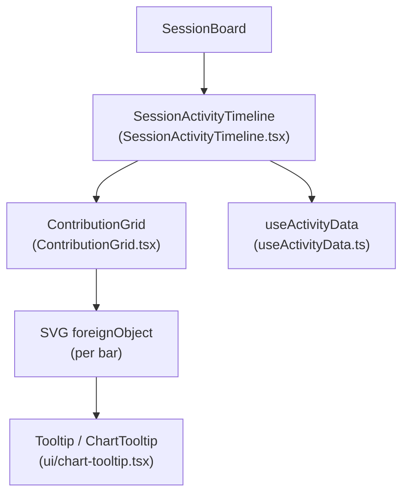
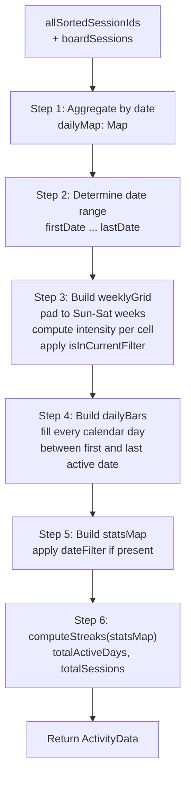
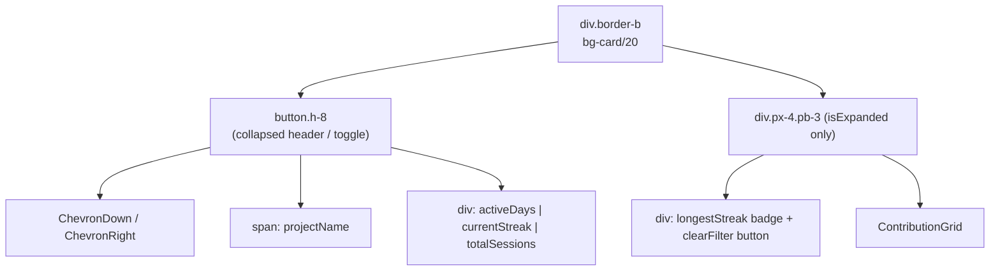
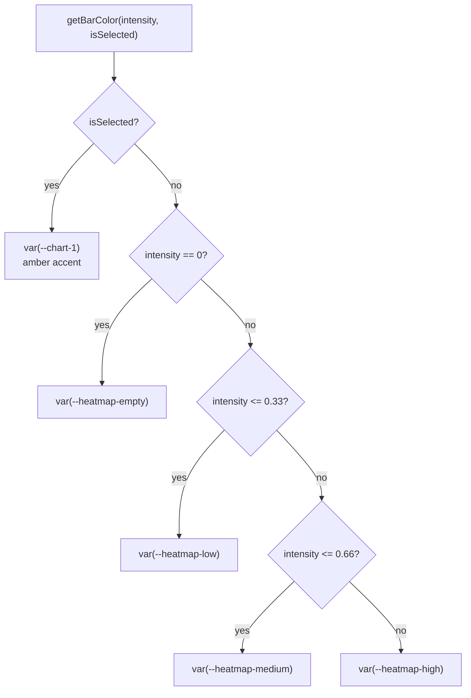
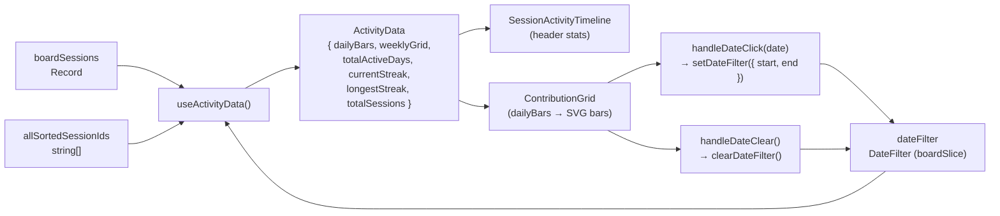

# Activity Timeline

<details>
<summary>관련 소스 파일</summary>

다음 파일들은 이 위키 페이지를 생성하기 위한 컨텍스트로 사용되었습니다:

- [src/components/AnalyticsDashboard/components/DailyTrendChart.tsx](src/components/AnalyticsDashboard/components/DailyTrendChart.tsx)
- [src/components/AnalyticsDashboard/components/TokenDistributionChart.tsx](src/components/AnalyticsDashboard/components/TokenDistributionChart.tsx)
- [src/components/SessionBoard/ContributionGrid.tsx](src/components/SessionBoard/ContributionGrid.tsx)
- [src/components/SessionBoard/SessionActivityTimeline.tsx](src/components/SessionBoard/SessionActivityTimeline.tsx)
- [src/components/SessionBoard/useActivityData.ts](src/components/SessionBoard/useActivityData.ts)
- [src/components/ui/chart-tooltip.tsx](src/components/ui/chart-tooltip.tsx)
- [src/test/useActivityData.test.ts](src/test/useActivityData.test.ts)

</details>


이 페이지는 Session Board에 내장된 Activity Timeline 하위 시스템을 문서화하며, `SessionActivityTimeline` 컴포넌트, `ContributionGrid` SVG 차트, 모든 지표를 계산하는 `useActivityData` 훅을 다룹니다. 타임라인은 프로젝트별 일간 세션 활동을 대화형 막대 차트로 시각화하는 데 초점을 둡니다.

`SessionActivityTimeline`이 마운트되는 방식과 더 넓은 Session Board 맥락은 [3.2 Session Board]()를 참조하세요. `boardSessions`와 `dateFilter`를 제공하는 `boardSlice` 상태는 [4.2 State Slices]()를 참조하세요.

---

## 개요

Activity Timeline은 각 session board 열 상단에 표시되는 접이식 스트립입니다. 프로젝트의 모든 세션을 일별 버킷으로 압축하고, 이를 비례 막대 차트로 렌더링하며, 사용자가 개별 막대를 클릭해 표시되는 세션을 날짜별로 필터링할 수 있게 합니다.

**컴포넌트 맵:**

| 파일 | Export | 역할 |
|---|---|---|
| `src/components/SessionBoard/SessionActivityTimeline.tsx` | `SessionActivityTimeline` | 컨테이너: 접이식 패널, 요약 통계, 콜백 연결 |
| `src/components/SessionBoard/ContributionGrid.tsx` | `ContributionGrid` | 대화형 막대가 있는 SVG 막대 차트 렌더러 |
| `src/components/SessionBoard/useActivityData.ts` | `useActivityData` | 순수 계산 훅: 집계, 그리드, 연속 활동 |
| `src/components/SessionBoard/useActivityData.ts` | `toDateString`, `getFilterEndMs` | 공유 날짜 유틸리티 |

---

## 컴포넌트 계층

**다이어그램: Activity Timeline의 컴포넌트 트리**



출처: [src/components/SessionBoard/SessionActivityTimeline.tsx:1-137](), [src/components/SessionBoard/ContributionGrid.tsx:1-282]()

---

## `useActivityData` 훅

이 훅은 핵심 데이터 변환 계층입니다. 원시 `BoardSessionData` 레코드와 `DateFilter`를 받아 완전히 계산된 `ActivityData` 객체를 반환합니다. 모든 계산은 `useMemo`로 감싸져 있으며 `boardSessions`, `allSortedSessionIds`, `dateFilter`가 변경될 때만 다시 실행됩니다.

### 입력 및 출력 타입

```typescript
useActivityData(
  boardSessions: Record<string, BoardSessionData>,
  allSortedSessionIds: string[],
  dateFilter: DateFilter
): ActivityData
```

| 타입 | 필드 |
|---|---|
| `DateFilter` | `start: Date | null`, `end: Date | null` |
| `DailyBar` | `date: string`, `sessionCount: number`, `totalTokens: number` |
| `WeeklyGridCell` | `date`, `dayOfWeek`, `weekIndex`, `sessionCount`, `totalTokens`, `intensity`, `isInCurrentFilter` |
| `MonthLabel` | `label: string`, `weekIndex: number` |
| `ActivityData` | `weeklyGrid`, `monthLabels`, `dailyBars`, `totalActiveDays`, `currentStreak`, `longestStreak`, `totalSessions`, `maxSessionsPerDay` |

출처: [src/components/SessionBoard/useActivityData.ts:1-35]()

### 계산 파이프라인

**다이어그램: useActivityData 계산 단계**



출처: [src/components/SessionBoard/useActivityData.ts:149-317]()

### 단계별 세부 정보

**1단계 — 일별 집계**

각 세션은 `session.last_message_time`의 로컬 날짜를 기준으로 버킷에 들어가며, 없으면 `session.last_modified`로 폴백합니다 [src/components/SessionBoard/useActivityData.ts:175-181](). 잘못된 타임스탬프는 건너뜁니다. 같은 날의 세션은 `DailyBucket` 안에서 `sessionCount`와 `totalTokens`를 누적합니다 [src/components/SessionBoard/useActivityData.ts:182-185]().

**2단계 — 날짜 범위**

`dailyMap`의 정렬된 키가 `firstDate`와 `lastDate`를 제공합니다. 이 값이 표시 범위의 경계가 됩니다 [src/components/SessionBoard/useActivityData.ts:189-196]().

**3단계 — 주간 그리드**

그리드는 `firstDate`가 포함된 주의 일요일에서 시작하고, `lastDate`가 포함된 주의 토요일까지 확장됩니다 [src/components/SessionBoard/useActivityData.ts:199-201](). 각 `WeeklyGridCell`은 다음을 포함합니다:

- `intensity = sessionCount / maxCount`(0-1, 여기서 `maxCount`는 전체 데이터 중 최대 일간 값) [src/components/SessionBoard/useActivityData.ts:241]()
- `isInCurrentFilter`: 셀의 자정 타임스탬프가 활성 `DateFilter` 범위 안에 있는지 여부(`getFilterEndMs`를 통해 계산) [src/components/SessionBoard/useActivityData.ts:242]()

월 라벨은 새 달의 7일 이전 또는 당일에 해당하는 일요일에 대해 생성됩니다 [src/components/SessionBoard/useActivityData.ts:251-255]().

**4단계 — 일별 막대**

`dailyBars`는 `firstDate`부터 `lastDate`까지 이어지는 모든 달력일을 포함하는 배열입니다 [src/components/SessionBoard/useActivityData.ts:271-283](). 세션이 없는 날은 `sessionCount: 0`을 가지며, `ContributionGrid`는 이를 최소 2px stub으로 렌더링합니다 [src/components/SessionBoard/ContributionGrid.tsx:174](). 이를 통해 공백이 있어도 시간축이 비례적으로 유지됩니다.

**5 & 6단계 — 필터링된 통계**

`dateFilter`가 활성화되면 필터 범위 안에 들어오는 일별 버킷만 포함하는 별도의 `statsMap`이 구성됩니다 [src/components/SessionBoard/useActivityData.ts:291-306](). 연속 활동 계산과 집계 통계(`totalActiveDays`, `totalSessions`)는 `statsMap`에서 동작합니다 [src/components/SessionBoard/useActivityData.ts:312-316](). `weeklyGrid`와 `dailyBars`는 항상 필터링되지 않은 전체 데이터셋을 반영합니다.

### 연속 활동 계산

`computeStreaks`에 구현되어 있습니다 [src/components/SessionBoard/useActivityData.ts:95-147]():

- 활성 날짜를 오름차순으로 정렬하고, 연속일 구간을 셉니다.
- **최장 연속 활동**: 최대 연속일 구간 길이 [src/components/SessionBoard/useActivityData.ts:117]().
- **현재 연속 활동**: 마지막 기록일이 오늘 또는 어제(로컬 날짜)인 경우에만 활성입니다. 마지막 날짜부터 거꾸로 셉니다 [src/components/SessionBoard/useActivityData.ts:128-144]().
- DST 안전: 날짜 차이는 밀리초를 `86_400_000`으로 나눈 뒤 `Math.round()`로 측정합니다 [src/components/SessionBoard/useActivityData.ts:113]().

### 날짜 유틸리티 함수

| 함수 | 동작 |
|---|---|
| `toDateString(date)` | UTC가 아니라 로컬 달력 필드를 사용해 `YYYY-MM-DD`를 반환합니다 [src/components/SessionBoard/useActivityData.ts:70-75]() |
| `getFilterEndMs(end)` | `end`가 정확히 로컬 자정이면 *다음* 날 자정을 반환합니다(포함형 일 단위 의미). 그렇지 않으면 `end + 1ms`를 반환합니다 [src/components/SessionBoard/useActivityData.ts:56-68](). |

---

## `SessionActivityTimeline` 컴포넌트

`SessionActivityTimeline`은 차트를 호스팅하는 접이식 패널입니다. 항상 마운트되어 있지만 조건에 따라 확장됩니다.

### Props

| Prop | Type | 설명 |
|---|---|---|
| `boardSessions` | `Record<string, BoardSessionData>` | 프로젝트에 대해 로드된 모든 보드 세션 |
| `allSortedSessionIds` | `string[]` | 정렬된 세션 ID(집계 순서를 구동) |
| `dateFilter` | `DateFilter` | `boardSlice`의 현재 활성 날짜 필터 |
| `setDateFilter` | `(filter: DateFilter) => void` | 새 날짜 필터 적용 |
| `clearDateFilter` | `() => void` | 활성 날짜 필터 제거 |
| `isExpanded` | `boolean` | 접힘/펼침 상태 제어 |
| `onToggle` | `() => void` | 확장 상태 전환 |
| `projectName` | `string?` | 접힌 헤더에 표시됨 |

출처: [src/components/SessionBoard/SessionActivityTimeline.tsx:8-17]()

### 레이아웃

**다이어그램: SessionActivityTimeline 레이아웃 구조**



출처: [src/components/SessionBoard/SessionActivityTimeline.tsx:61-133]()

### 날짜 필터 상호작용

`ContributionGrid`에서 막대를 클릭하면 `handleDateClick(date)`가 호출되며 [src/components/SessionBoard/SessionActivityTimeline.tsx:41-51](), 해당 로컬 날짜의 `00:00:00.000`부터 `23:59:59.999`까지를 포함하는 `DateFilter`를 구성하고 `setDateFilter`를 호출합니다. 현재 선택된 막대를 클릭하면 `clearDateFilter`가 호출됩니다 [src/components/SessionBoard/SessionActivityTimeline.tsx:53-55]().

`selectedDate`는 `dateFilter`에서 파생됩니다. `start`와 `end`를 같은 `YYYY-MM-DD` 문자열로 변환할 수 있으면, 그 문자열이 `ContributionGrid`에 전달되는 `selectedDate`입니다 [src/components/SessionBoard/SessionActivityTimeline.tsx:33-39]().

---

## `ContributionGrid` 컴포넌트

순수 SVG 막대 차트입니다. 자체 상태를 가지지 않으며, 모든 선택 로직은 콜백에 위임됩니다.

### 레이아웃 상수

| 상수 | 값 | 목적 |
|---|---|---|
| `BAR_WIDTH` | `14px` | 각 막대의 픽셀 너비 |
| `BAR_GAP` | `3px` | 막대 사이 간격 |
| `SLOT_WIDTH` | `17px` | `BAR_WIDTH + BAR_GAP` |
| `CHART_HEIGHT` | `80px` | 막대 영역 높이 |
| `AXIS_HEIGHT` | `18px` | 아래 날짜 라벨을 위해 예약된 높이 |
| `GRID_LINES` | `4` | 가로 기준선 개수 |
| `MIN_LABEL_GAP_PX` | `44px` | 축 라벨 중심 간 최소 픽셀 거리 |

출처: [src/components/SessionBoard/ContributionGrid.tsx:16-22]()

### 막대 렌더링

각 막대는 `<div>`를 감싸는 `<foreignObject>`로 렌더링됩니다 [src/components/SessionBoard/ContributionGrid.tsx:186-192](). 이는 Radix UI `Tooltip`/`TooltipTrigger` 시스템이 SVG 요소가 아니라 DOM 요소를 필요로 하기 때문입니다. 위치 지정에는 여전히 SVG 좌표계가 사용됩니다.

막대 높이는 0이 아닌 날의 경우 `max(3, round(intensity * (CHART_HEIGHT - 4)))`이고, 세션이 없는 날은 고정 2px stub입니다 [src/components/SessionBoard/ContributionGrid.tsx:171-174](). 0일 stub은 상호작용하지 않으며(`role`과 클릭 핸들러가 생략됨), 특정 색상으로 렌더링됩니다 [src/components/SessionBoard/ContributionGrid.tsx:28]().

**다이어그램: 막대 색상 선택(getBarColor)**



출처: [src/components/SessionBoard/ContributionGrid.tsx:26-32]()

### 축 라벨 선택

`selectLabelIndices` 함수 [src/components/SessionBoard/ContributionGrid.tsx:55-77]()는 왼쪽에서 오른쪽으로 탐욕적 스캔을 사용합니다:

1. 항상 인덱스 0을 포함합니다 [src/components/SessionBoard/ContributionGrid.tsx:60]().
2. 이후 각 인덱스는 이전 라벨보다 최소 `ceil(MIN_LABEL_GAP_PX / SLOT_WIDTH)` 슬롯 이상 떨어져 있을 때만 포함합니다 [src/components/SessionBoard/ContributionGrid.tsx:64-66]().
3. 마지막 인덱스는 이전 라벨에서 최소 `floor(minSlots * 0.55)` 슬롯 이상 떨어져 있으면 포함합니다 [src/components/SessionBoard/ContributionGrid.tsx:72-74]().

라벨은 `textAnchor="middle"`과 monospace 글꼴을 사용하는 SVG `<text>` 요소로 렌더링됩니다 [src/components/SessionBoard/ContributionGrid.tsx:262-273](). 형식은 `formatShortLabel`을 통한 `M/D`(예: `2/8`)입니다 [src/components/SessionBoard/ContributionGrid.tsx:35-38]().

### Tooltip 콘텐츠

각 막대는 다음을 포함한 `ChartTooltip` [src/components/ui/chart-tooltip.tsx:20-61]()을 표시합니다:
- **title**: `formatDateLabel`을 통한 자세한 날짜(`Mon, Feb 8`) [src/components/SessionBoard/ContributionGrid.tsx:41-48]()
- **rows**: 0이 아닌 날에 대해 `[{ label: "Sessions", value: bar.sessionCount }]` [src/components/SessionBoard/ContributionGrid.tsx:241-245]()
- **subtitle**: 0일 stub에 대해 `"No activity"`(i18n 키 `analytics.timeline.noActivity`) [src/components/SessionBoard/ContributionGrid.tsx:238]()

---

## 데이터 흐름 요약

**다이어그램: Activity Timeline의 엔드투엔드 데이터 흐름**



출처: [src/components/SessionBoard/SessionActivityTimeline.tsx:30-55](), [src/components/SessionBoard/useActivityData.ts:149-317](), [src/components/SessionBoard/ContributionGrid.tsx:108-115]()

---

## 주요 설계 결정

- **그리드와 통계 분리**: `weeklyGrid`와 `dailyBars`는 `dateFilter`와 관계없이 항상 전체 데이터셋을 반영합니다. `totalActiveDays`와 연속 활동 같은 집계 통계만 필터링된 `statsMap`에서 다시 계산됩니다 [src/components/SessionBoard/useActivityData.ts:312-316]().
- **대화형 막대에 `foreignObject` 사용**: SVG `<rect>` 요소는 DOM 노드가 필요한 Radix UI `TooltipTrigger`를 호스팅할 수 없습니다. 각 막대에 `<foreignObject>`를 사용하면 기존 Tooltip 인프라가 SVG 좌표 공간 안에서 작동할 수 있습니다 [src/components/SessionBoard/ContributionGrid.tsx:186-192]().
- **자정 `DateFilter.end`에 대한 포함형 일 단위 의미**: `getFilterEndMs`는 `end`가 정확히 자정인지 감지하고, 로컬 달력일을 하루 전진시켜 전체 날짜로 처리합니다 [src/components/SessionBoard/useActivityData.ts:56-68]().
- **`dailyBars`의 비례 시간축**: 공백 날짜(세션 없음)를 0개 항목으로 포함하므로 막대가 달력 시간 전체에서 균등 간격으로 배치됩니다 [src/components/SessionBoard/useActivityData.ts:271-283]().

---

## 테스트

`useActivityData`에는 `src/test/useActivityData.test.ts`에 포괄적인 Vitest 테스트 스위트가 있습니다. 커버리지는 다음을 포함합니다:

| 테스트 그룹 | 검증 내용 |
|---|---|
| 빈 데이터 | 모두 0인 `ActivityData` 반환, 잘못된 타임스탬프는 출력 없음 [src/test/useActivityData.test.ts:43-86]() |
| 일별 집계 | 같은 날의 여러 세션은 올바르게 합산되고, 서로 다른 날은 올바르게 분리됨 [src/test/useActivityData.test.ts:88-126]() |
| 연속 활동 계산 | 연속 구간, 공백으로 끊긴 구간, 현재 연속 활동(오늘/어제), 만료된 연속 활동 [src/test/useActivityData.test.ts:128-204]() |
| 주간 그리드 | Sun-Sat 패딩, 월 전환, intensity 비율 [src/test/useActivityData.test.ts:10-11]() |
| 날짜 필터 강조 | 단일 날짜, 범위, 시간이 포함된 종료일, 필터 없음 케이스 [src/test/useActivityData.test.ts:7-11]() |
| DST 경계 | Spring-forward와 fall-back을 연속된 날짜로 처리 [src/test/useActivityData.test.ts:5]() |
| 월 라벨 | 올바른 week index에 라벨 배치, 중복 없음 [src/test/useActivityData.test.ts:6]() |
| `dailyBars` 출력 | 날짜순 정렬, 공백 날짜 포함, 토큰 합계 누적 [src/test/useActivityData.test.ts:106-126]() |
| 필터링된 통계 | `totalActiveDays`/`totalSessions`/연속 활동은 필터를 반영하고, 그리드와 막대는 필터링되지 않은 상태 유지 [src/test/useActivityData.test.ts:203-204]() |

출처: [src/test/useActivityData.test.ts:1-204]()
