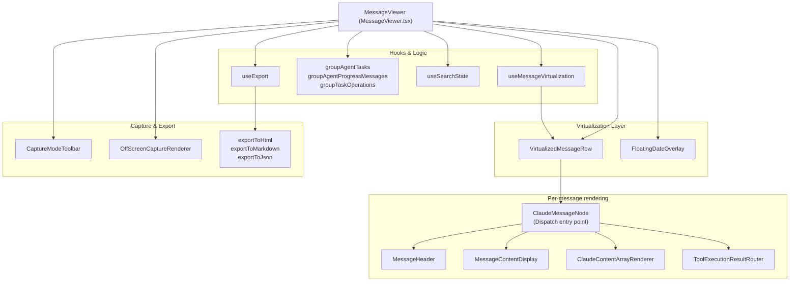
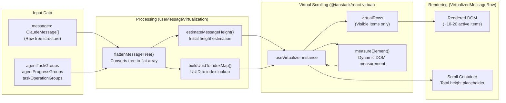

# Message Viewer

관련 소스 파일

다음 파일들은 이 위키 페이지를 생성하기 위한 컨텍스트로 사용되었습니다:

- [dev-mock-server.ts](dev-mock-server.ts)
- [docs/specs/ui-improvements-167-170.md](docs/specs/ui-improvements-167-170.md)
- [src-tauri/src/commands/project.rs](src-tauri/src/commands/project.rs)
- [src/components/MessageViewer/MessageViewer.tsx](src/components/MessageViewer/MessageViewer.tsx)
- [src/components/MessageViewer/components/CaptureModeToolbar.tsx](src/components/MessageViewer/components/CaptureModeToolbar.tsx)
- [src/components/MessageViewer/components/ClaudeMessageNode.tsx](src/components/MessageViewer/components/ClaudeMessageNode.tsx)
- [src/components/MessageViewer/components/DateDivider.tsx](src/components/MessageViewer/components/DateDivider.tsx)
- [src/components/MessageViewer/components/FilterToolbar.tsx](src/components/MessageViewer/components/FilterToolbar.tsx)
- [src/components/MessageViewer/components/FloatingDateOverlay.tsx](src/components/MessageViewer/components/FloatingDateOverlay.tsx)
- [src/components/MessageViewer/components/OffScreenCaptureRenderer.tsx](src/components/MessageViewer/components/OffScreenCaptureRenderer.tsx)
- [src/components/MessageViewer/components/VirtualizedMessageRow.tsx](src/components/MessageViewer/components/VirtualizedMessageRow.tsx)
- [src/components/MessageViewer/helpers/flattenMessageTree.ts](src/components/MessageViewer/helpers/flattenMessageTree.ts)
- [src/components/MessageViewer/helpers/heightEstimation.ts](src/components/MessageViewer/helpers/heightEstimation.ts)
- [src/components/MessageViewer/helpers/messageHelpers.ts](src/components/MessageViewer/helpers/messageHelpers.ts)
- [src/components/MessageViewer/types.ts](src/components/MessageViewer/types.ts)
- [src/components/common/Markdown.tsx](src/components/common/Markdown.tsx)
- [src/components/contentRenderer/CommandRenderer.tsx](src/components/contentRenderer/CommandRenderer.tsx)
- [src/components/messageRenderer/MessageContentDisplay.tsx](src/components/messageRenderer/MessageContentDisplay.tsx)
- [src/components/messageRenderer/SystemMessageRenderer.tsx](src/components/messageRenderer/SystemMessageRenderer.tsx)
- [src/components/toolResultRenderer/StringRenderer.tsx](src/components/toolResultRenderer/StringRenderer.tsx)
- [src/components/toolResultRenderer/WebSearchRenderer.tsx](src/components/toolResultRenderer/WebSearchRenderer.tsx)
- [src/hooks/useCapturePreview.ts](src/hooks/useCapturePreview.ts)
- [src/hooks/useCaptureScreenshot.ts](src/hooks/useCaptureScreenshot.ts)
- [src/hooks/useExport.ts](src/hooks/useExport.ts)
- [src/services/export/contentExtractor.ts](src/services/export/contentExtractor.ts)
- [src/services/export/htmlExporter.ts](src/services/export/htmlExporter.ts)
- [src/services/export/jsonExporter.ts](src/services/export/jsonExporter.ts)
- [src/services/export/markdownExporter.ts](src/services/export/markdownExporter.ts)
- [src/store/slices/captureModeSlice.ts](src/store/slices/captureModeSlice.ts)
- [src/store/slices/projectSlice.ts](src/store/slices/projectSlice.ts)
- [src/store/slices/types.ts](src/store/slices/types.ts)
- [src/test/export/contentExtractor.test.ts](src/test/export/contentExtractor.test.ts)
- [src/test/export/useExport.test.ts](src/test/export/useExport.test.ts)
- [tsconfig.app.json](tsconfig.app.json)
- [vite.config.ts](vite.config.ts)

## 목적 및 범위

Message Viewer는 사용자와 AI 에이전트 간의 대화 스레드를 표시하는 단일 세션 상세 보기입니다. 텍스트, 도구 사용, 도구 결과, thinking 블록, 특수 콘텐츠 타입을 포함해 개별 메시지를 전체 콘텐츠와 함께 렌더링합니다. 이 컴포넌트는 `@tanstack/react-virtual`을 통한 가상 스크롤링을 사용하여 수천 개의 메시지가 있는 세션도 효율적으로 처리합니다.

Message Viewer는 스크린샷을 위한 capture mode, 다중 형식 내보내기(HTML/Markdown/JSON), 통합 검색 내비게이션 등 상호작용 도구도 제공합니다.

**출처**: [src/components/MessageViewer/MessageViewer.tsx:1-17](), [src/components/MessageViewer/types.ts:16-27]()

---

## 컴포넌트 아키텍처

Message Viewer는 표시 로직, 가상화, 콘텐츠 렌더링을 명확히 분리한 모듈식 시스템으로 구성됩니다.

### 컴포넌트 계층

**컴포넌트 진입점**: `MessageViewer` [src/components/MessageViewer/MessageViewer.tsx:45]()는 가상 목록을 렌더링합니다. 보이는 각 항목은 `VirtualizedMessageRow` [src/components/MessageViewer/components/VirtualizedMessageRow.tsx:39]()로 전달되고, 이 컴포넌트는 `ClaudeMessageNode` [src/components/MessageViewer/components/ClaudeMessageNode.tsx:42]()를 감쌉니다. 노드는 콘텐츠별 렌더러에 위임하기 전에 메시지 타입 디스패치 계층으로 동작합니다.

**출처**: [src/components/MessageViewer/MessageViewer.tsx:45-134](), [src/components/MessageViewer/components/ClaudeMessageNode.tsx:42-60](), [src/components/MessageViewer/hooks/useMessageVirtualization.ts:55-75]()

---

## 가상 스크롤링 시스템

Message Viewer는 `@tanstack/react-virtual`을 사용해 보이는 메시지만 DOM에 마운트함으로써 대규모 대화 스레드를 효율적으로 렌더링합니다.

### 가상화 흐름

### 주요 함수

**`useMessageVirtualization`** [src/components/MessageViewer/hooks/useMessageVirtualization.ts:55]()
핵심 virtualizer 인스턴스, 평탄화된 메시지, `scrollToMessage(uuid)` 같은 프로그래밍 방식 스크롤 함수를 포함한 전체 가상화 상태를 반환합니다.

**구성 상수**:
- `VIRTUALIZER_OVERSCAN = 5`: 뷰포트 밖에 추가로 렌더링할 항목 수 [src/components/MessageViewer/helpers/heightEstimation.ts:94]().
- `MIN_ROW_HEIGHT = 20`: 높이가 0이 되는 문제를 방지하기 위한 최소 측정값 [src/components/MessageViewer/helpers/heightEstimation.ts:99]().

**출처**: [src/components/MessageViewer/hooks/useMessageVirtualization.ts:55-197](), [src/components/MessageViewer/helpers/heightEstimation.ts:94-99]()

---

## 메시지 평탄화 및 그룹화

메시지는 트리 구조(부모-자식 관계)로 저장되지만, 가상화를 위해 플랫 목록으로 렌더링됩니다. 또한 시스템은 더 깔끔한 표시를 위해 관련 에이전트 메시지를 그룹화합니다.

### 평탄화 과정

`flattenMessageTree` [src/components/MessageViewer/helpers/flattenMessageTree.ts:113]()는 계층 구조를 변환합니다:
1. **중복 제거**: 중복 UUID를 제거합니다 [src/components/MessageViewer/helpers/flattenMessageTree.ts:130]().
2. **명령 병합**: `mergeCommandOutputMessages`는 슬래시 명령(예: `/cost`)과 해당 stdout 결과를 하나의 항목으로 결합합니다 [src/components/MessageViewer/helpers/flattenMessageTree.ts:55-106]().
3. **순회**: 깊이와 시간순을 보존하기 위해 DFS 순회를 수행합니다 [src/components/MessageViewer/helpers/flattenMessageTree.ts:184-208]().

### 에이전트 그룹화 타입

| 그룹화 타입 | 목적 | 컴포넌트 |
|---------------|---------|-----------|
| **Agent Tasks** | tool_use + tool_result 쌍을 그룹화 | `AgentTaskGroupRenderer` [src/components/MessageViewer/components/ClaudeMessageNode.tsx:181]() |
| **Agent Progress** | 연속된 진행 업데이트를 그룹화 | `AgentProgressGroupRenderer` [src/components/MessageViewer/components/ClaudeMessageNode.tsx:204]() |
| **Task Operations** | 연속된 도구 작업을 그룹화 | `TaskOperationGroupRenderer` [src/components/MessageViewer/components/ClaudeMessageNode.tsx:232]() |

**출처**: [src/components/MessageViewer/helpers/flattenMessageTree.ts:55-208](), [src/components/MessageViewer/components/ClaudeMessageNode.tsx:166-235]()

---

## 콘텐츠 렌더링 시스템

Message Viewer는 `ClaudeMessageNode`를 통해 서로 다른 콘텐츠 타입을 전문 렌더러로 라우팅합니다.

### 전문 렌더러

- **CommandRenderer**: `<command-name>`, `<command-args>`, `<local-command-stdout>` 같은 시스템 명령 태그를 추출하고 렌더링합니다 [src/components/contentRenderer/CommandRenderer.tsx:74-161](). `AnsiText`를 통해 ANSI 색상 코드 렌더링을 지원합니다 [src/components/contentRenderer/CommandRenderer.tsx:10]().
- **MessageContentDisplay**: 텍스트 콘텐츠의 기본 렌더러입니다. 긴 메시지를 위한 줄 제한 로직과 "Show More" 기능을 포함하며 [src/components/messageRenderer/MessageContentDisplay.tsx:14-41](), 접을 수 있는 markdown 표를 처리합니다 [src/components/messageRenderer/MessageContentDisplay.tsx:44-109]().
- **FileHistorySnapshotRenderer**: 세션 중 기록된 파일 스냅샷과 백업을 표시합니다 [src/components/MessageViewer/components/ClaudeMessageNode.tsx:257]().

**출처**: [src/components/contentRenderer/CommandRenderer.tsx:74-161](), [src/components/messageRenderer/MessageContentDisplay.tsx:14-109](), [src/components/MessageViewer/components/ClaudeMessageNode.tsx:257]()

---

## Capture Mode 및 내보내기

뷰어에는 대화 구간을 캡처하고 전체 기록을 내보내기 위한 견고한 시스템이 포함되어 있습니다.

### Capture Mode
사용자는 "Capture Mode"에 진입하여 스크린샷에 사용할 특정 메시지를 선택할 수 있습니다.
- **선택**: `handleSelectionClick`은 Shift+Click을 통한 범위 선택을 허용합니다 [src/components/MessageViewer/components/ClaudeMessageNode.tsx:76-87]().
- **숨기기/표시**: 개별 메시지를 캡처 보기에서 숨길 수 있습니다 [src/components/MessageViewer/components/ClaudeMessageNode.tsx:95-123]().
- **화면 밖 렌더링**: 고해상도 이미지를 캡처하기 위해 `OffScreenCaptureRenderer` [src/components/MessageViewer/components/OffScreenCaptureRenderer.tsx:1]()가 `html-to-image`를 사용하기 전에 숨겨진 DOM 요소 안에 선택된 메시지를 렌더링합니다.

### 내보내기 시스템
`useExport` 훅 [src/hooks/useExport.ts:1]()은 다양한 형식으로의 변환을 조정합니다:
- **HTML**: `exportToHtml`은 인라인 CSS가 포함된 독립 실행형 파일을 생성합니다 [src/services/export/htmlExporter.ts:128]().
- **Markdown**: `exportToMarkdown`은 깔끔한 GFM 호환 파일을 생성합니다 [src/services/export/markdownExporter.ts:42]().
- **JSON**: `exportToJson`은 원시 메시지 객체를 내보냅니다 [src/services/export/jsonExporter.ts:1]().

**출처**: [src/components/MessageViewer/components/ClaudeMessageNode.tsx:76-123](), [src/services/export/htmlExporter.ts:128-152](), [src/services/export/markdownExporter.ts:42-98]()

---

## 내비게이션 및 검색

Message Viewer는 검색 및 세션 내비게이션을 위해 전역 상태와 통합됩니다.

- **검색 상태**: `useSearchState`는 검색 쿼리와 일치 항목 인덱싱을 관리합니다 [src/components/MessageViewer/hooks/useSearchState.ts:1](). 일치 항목은 `HighlightedText`를 사용해 UI에서 강조 표시됩니다 [src/components/messageRenderer/MessageContentDisplay.tsx:9]().
- **Floating Date Overlay**: 첫 번째로 보이는 가상 행을 추적하여 현재 대화 날짜를 sticky 스타일 헤더로 표시합니다 [src/components/MessageViewer/components/FloatingDateOverlay.tsx:52-124]().
- **Subagent 내비게이션**: 하위 세션(agent-within-agent)으로 이동하고 내비게이션 스택을 유지하는 기능을 지원합니다 [src/components/MessageViewer/MessageViewer.tsx:82-86]().

**출처**: [src/components/MessageViewer/hooks/useSearchState.ts:1-10](), [src/components/MessageViewer/components/FloatingDateOverlay.tsx:52-124](), [src/components/MessageViewer/MessageViewer.tsx:82-86]()
