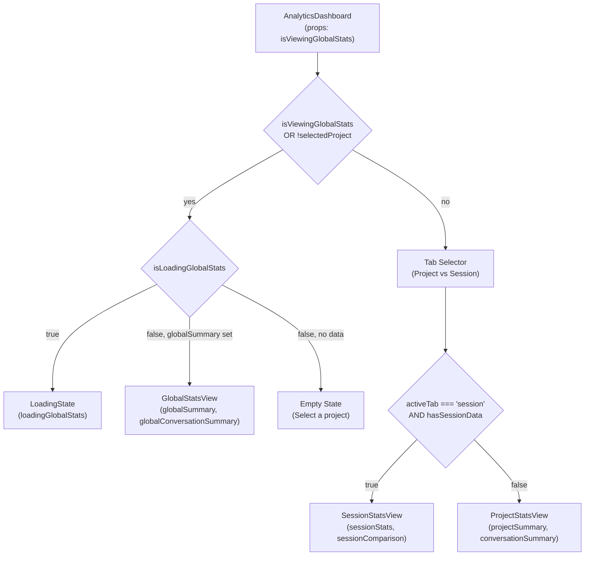
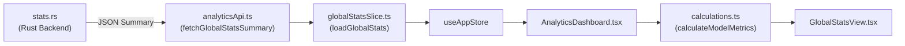

# Analytics Dashboard

<details>
<summary>관련 소스 파일</summary>

다음 파일들은 이 위키 페이지를 생성하기 위한 컨텍스트로 사용되었습니다:

- [src-tauri/benches/performance.rs](src-tauri/benches/performance.rs)
- [src-tauri/src/commands/stats.rs](src-tauri/src/commands/stats.rs)
- [src/components/AnalyticsDashboard/AnalyticsDashboard.tsx](src/components/AnalyticsDashboard/AnalyticsDashboard.tsx)
- [src/components/AnalyticsDashboard/components/ActivityHeatmap.tsx](src/components/AnalyticsDashboard/components/ActivityHeatmap.tsx)
- [src/components/AnalyticsDashboard/components/BillingBreakdownCard.tsx](src/components/AnalyticsDashboard/components/BillingBreakdownCard.tsx)
- [src/components/AnalyticsDashboard/utils/calculations.ts](src/components/AnalyticsDashboard/utils/calculations.ts)
- [src/components/AnalyticsDashboard/utils/projectCalculations.ts](src/components/AnalyticsDashboard/utils/projectCalculations.ts)
- [src/components/AnalyticsDashboard/views/GlobalStatsView.tsx](src/components/AnalyticsDashboard/views/GlobalStatsView.tsx)
- [src/components/AnalyticsDashboard/views/ProjectStatsView.tsx](src/components/AnalyticsDashboard/views/ProjectStatsView.tsx)
- [src/components/AnalyticsDashboard/views/SessionStatsView.tsx](src/components/AnalyticsDashboard/views/SessionStatsView.tsx)
- [src/hooks/useAnalytics.ts](src/hooks/useAnalytics.ts)
- [src/i18n/locales/en/analytics.json](src/i18n/locales/en/analytics.json)
- [src/i18n/locales/ja/analytics.json](src/i18n/locales/ja/analytics.json)
- [src/i18n/locales/ko/analytics.json](src/i18n/locales/ko/analytics.json)
- [src/i18n/locales/zh-CN/analytics.json](src/i18n/locales/zh-CN/analytics.json)
- [src/i18n/locales/zh-TW/analytics.json](src/i18n/locales/zh-TW/analytics.json)
- [src/services/analyticsApi.ts](src/services/analyticsApi.ts)
- [src/store/slices/globalStatsSlice.ts](src/store/slices/globalStatsSlice.ts)
- [src/store/slices/messageSlice.ts](src/store/slices/messageSlice.ts)
- [src/test/globalStatsSlice.test.ts](src/test/globalStatsSlice.test.ts)
- [src/test/projectCalculations.test.ts](src/test/projectCalculations.test.ts)

</details>


이 페이지는 `AnalyticsDashboard` 컴포넌트, `useAnalytics` 조정 훅, 그리고 이를 지원하는 공유 계산 유틸리티를 문서화합니다. 대시보드가 전역, 프로젝트, 세션 보기 사이를 선택하는 방식과 `useAnalytics` 훅이 데이터 로딩, 뷰 전환, 필터 변경에 대한 반응성을 관리하는 방식을 다룹니다.

세 하위 보기(`GlobalStatsView`, `ProjectStatsView`, `SessionStatsView`)와 `BillingBreakdownCard`의 상세 구현은 [Analytics Views](#3.4.1)를 참조하세요. 세션별/프로젝트별 페이지네이션 토큰 테이블을 표시하는 Token Statistics 뷰어는 [Token Stats Viewer](#3.5)를 참조하세요. 백엔드 통계 계산은 [Statistics and Analytics](#5.2)를 참조하세요.

---

## 컴포넌트 구조

공개 진입점은 [src/components/AnalyticsDashboard/AnalyticsDashboard.tsx]()의 구현입니다. 컴포넌트는 전문화된 보기, 공유 UI 컴포넌트, 계산 유틸리티를 포함하는 모듈 디렉터리로 구성됩니다.

```
src/components/AnalyticsDashboard/
├── AnalyticsDashboard.tsx       ← main component
├── types.ts                     ← AnalyticsDashboardProps, shared types
├── views/                       ← [See 3.4.1 Analytics Views]
│   ├── GlobalStatsView.tsx
│   ├── ProjectStatsView.tsx
│   └── SessionStatsView.tsx
├── components/                  ← Shared Dashboard UI
│   ├── ActivityHeatmap.tsx      ← Calendar-style heatmap
│   ├── BillingBreakdownCard.tsx ← Cost/Token split card
│   ├── MetricCard.tsx
│   ├── SectionCard.tsx
│   └── ...
└── utils/                       ← Calculation Logic
    ├── calculations.ts          ← Model pricing & global costs
    ├── projectCalculations.ts   ← Trend data & project metrics
    └── ...
```

출처: [src/components/AnalyticsDashboard/AnalyticsDashboard.tsx:1-187](), [src/components/AnalyticsDashboard/components/ActivityHeatmap.tsx:1-205]()

---

## 뷰 라우팅

`AnalyticsDashboard`는 애플리케이션 상태와 props를 기준으로 어떤 보기를 렌더링할지 결정합니다:

| Prop | Type | 기본값 | 설명 |
|------|------|---------|-------------|
| `isViewingGlobalStats` | `boolean` | `false` | `true`이거나 선택된 프로젝트가 없을 때 전역 보기를 렌더링 |

내부적으로 컴포넌트는 `activeTab` 상태(`"project" | "session"`)를 사용해 `ProjectStatsView`와 `SessionStatsView` 사이를 전환합니다 [src/components/AnalyticsDashboard/AnalyticsDashboard.tsx:35](). 세션 탭은 `hasSessionData`가 true일 때만 활성화됩니다. 이는 세션이 선택되어 있고 해당 비교/토큰 통계가 로드되었음을 의미합니다 [src/components/AnalyticsDashboard/AnalyticsDashboard.tsx:41-43]().

**AnalyticsDashboard의 뷰 라우팅**



출처: [src/components/AnalyticsDashboard/AnalyticsDashboard.tsx:49-180]()

---

## `useAnalytics` 훅 조정

`useAnalytics` 훅 [src/hooks/useAnalytics.ts:8]()은 대시보드의 컨트롤러 역할을 하며, UI를 `analyticsSlice` 및 `globalStatsSlice`에 연결합니다. 뷰 전환이나 필터 적용 시 필요한 복잡한 로딩 시퀀스를 조정합니다.

### 데이터 로딩 및 동기화
훅은 다음 흐름을 관리합니다:
1.  **Global Stats**: 백엔드에서 `billing_total`과 `conversation_only` 요약을 모두 가져오는 `loadGlobalStats`를 호출합니다 [src/store/slices/globalStatsSlice.ts:59-137]().
2.  **Project Stats**: 프로젝트가 선택되면 `loadProjectStatsSummary`를 트리거합니다 [src/store/slices/messageSlice.ts:68-70]().
3.  **Session Comparison**: 특정 세션이 프로젝트 평균과 어떻게 비교되는지 `loadSessionComparison`을 통해 가져옵니다 [src/store/slices/messageSlice.ts:71-74]().

### 필터 반응성
대시보드는 `dateFilter`에 반응합니다 [src/components/AnalyticsDashboard/AnalyticsDashboard.tsx:31](). `DatePickerHeader`에서 필터가 변경되면 `useAnalytics`는 현재 요청을 무효화하고 새 날짜 범위를 사용해 활성 보기의 데이터를 다시 로드합니다 [src/store/slices/globalStatsSlice.ts:69-76]().

출처: [src/hooks/useAnalytics.ts:1-9](), [src/store/slices/globalStatsSlice.ts:59-137](), [src/store/slices/messageSlice.ts:62-80]()

---

## 공유 UI 컴포넌트

### Activity Heatmap
`ActivityHeatmapComponent` [src/components/AnalyticsDashboard/components/ActivityHeatmap.tsx:205]()는 GitHub 스타일 contribution grid를 렌더링합니다. `DailyStats`를 월별로 그룹화하고 [src/components/AnalyticsDashboard/components/ActivityHeatmap.tsx:33-46](), 메시지 수를 기준으로 색상 intensity를 계산합니다 [src/components/AnalyticsDashboard/components/ActivityHeatmap.tsx:157-158]().

### Daily Trend Chart
`ProjectStatsView` 안에서 사용되며, 이 차트는 시간에 따른 메시지 및 토큰 추세를 표시합니다. 차트 라이브러리에 연속적인 타임라인을 제공하기 위해 활동이 없는 날의 공백을 채우는 `generateTrendData`에 의존합니다 [src/components/AnalyticsDashboard/utils/projectCalculations.ts:23-127]().

출처: [src/components/AnalyticsDashboard/components/ActivityHeatmap.tsx:8-201](), [src/components/AnalyticsDashboard/utils/projectCalculations.ts:23-127]()

---

## 계산 유틸리티

대시보드는 원시 백엔드 데이터를 표시 가능한 지표로 처리하기 위해 전문화된 유틸리티에 의존합니다.

### 모델 가격 및 비용 추정
`calculations.ts`는 여러 제공자와 모델 전반의 비용을 추정하는 데 사용되는 `MODEL_PRICING` 테이블을 유지합니다 [src/components/AnalyticsDashboard/utils/calculations.ts:34-52](). 다음을 포함한 복잡한 가격 구조를 처리합니다:
*   입력/출력 토큰 요율.
*   Claude 모델의 **Cache Creation** 및 **Cache Read** 요율 [src/components/AnalyticsDashboard/utils/calculations.ts:40-45]().

### 전역 요약 집계
`calculateGlobalCostSummary` [src/components/AnalyticsDashboard/utils/calculations.ts:145-175]()는 모델 분포를 순회하여 `GlobalStatsView`의 전체 "Estimated Cost"를 제공합니다 [src/components/AnalyticsDashboard/views/GlobalStatsView.tsx:54-59]().

**분석 데이터 흐름: 백엔드에서 대시보드까지**



출처: [src-tauri/src/commands/stats.rs:207-241](), [src/components/AnalyticsDashboard/utils/calculations.ts:1-175](), [src/components/AnalyticsDashboard/views/GlobalStatsView.tsx:50-77]()
