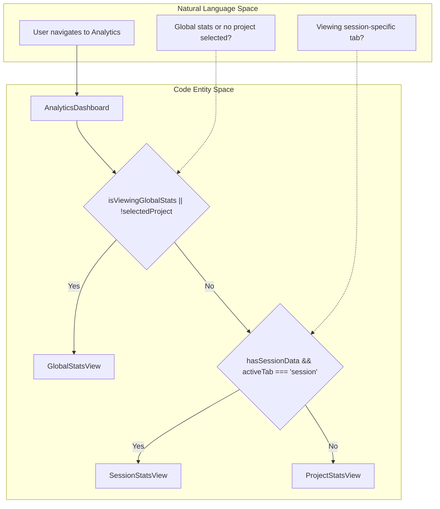
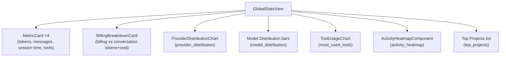
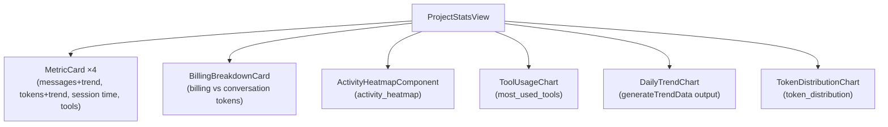
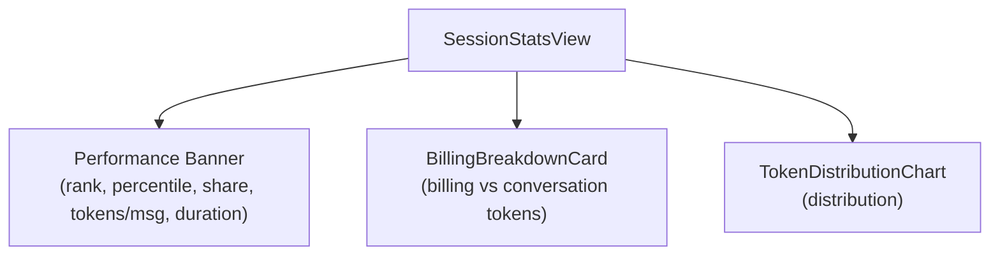
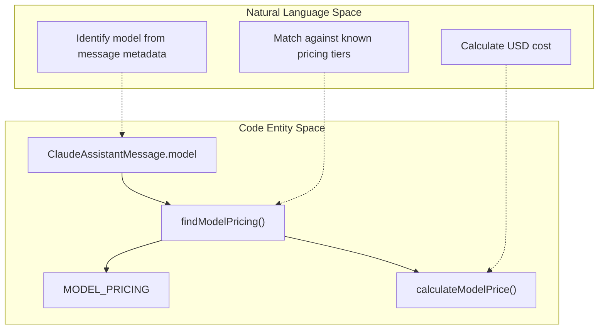

# Analytics Views

<details>
<summary>관련 소스 파일</summary>

다음 파일들은 이 위키 페이지를 생성하기 위한 컨텍스트로 사용되었습니다:

- [src-tauri/src/providers/mod.rs](src-tauri/src/providers/mod.rs)
- [src/components/AnalyticsDashboard/AnalyticsDashboard.tsx](src/components/AnalyticsDashboard/AnalyticsDashboard.tsx)
- [src/components/AnalyticsDashboard/components/ActivityHeatmap.tsx](src/components/AnalyticsDashboard/components/ActivityHeatmap.tsx)
- [src/components/AnalyticsDashboard/components/BillingBreakdownCard.tsx](src/components/AnalyticsDashboard/components/BillingBreakdownCard.tsx)
- [src/components/AnalyticsDashboard/components/ProviderDistributionChart.tsx](src/components/AnalyticsDashboard/components/ProviderDistributionChart.tsx)
- [src/components/AnalyticsDashboard/utils/calculations.ts](src/components/AnalyticsDashboard/utils/calculations.ts)
- [src/components/AnalyticsDashboard/views/GlobalStatsView.tsx](src/components/AnalyticsDashboard/views/GlobalStatsView.tsx)
- [src/components/AnalyticsDashboard/views/ProjectStatsView.tsx](src/components/AnalyticsDashboard/views/ProjectStatsView.tsx)
- [src/components/AnalyticsDashboard/views/SessionStatsView.tsx](src/components/AnalyticsDashboard/views/SessionStatsView.tsx)
- [src/components/MessageViewer/components/MessageHeader.tsx](src/components/MessageViewer/components/MessageHeader.tsx)
- [src/i18n/locales/en/analytics.json](src/i18n/locales/en/analytics.json)
- [src/i18n/locales/ja/analytics.json](src/i18n/locales/ja/analytics.json)
- [src/i18n/locales/ko/analytics.json](src/i18n/locales/ko/analytics.json)
- [src/i18n/locales/zh-CN/analytics.json](src/i18n/locales/zh-CN/analytics.json)
- [src/i18n/locales/zh-TW/analytics.json](src/i18n/locales/zh-TW/analytics.json)
- [src/utils/providers.ts](src/utils/providers.ts)

</details>


이 페이지는 analytics 패널이 활성화되었을 때 `AnalyticsDashboard`가 렌더링하는 세 가지 보기 컴포넌트인 `GlobalStatsView`, `ProjectStatsView`, `SessionStatsView`를 문서화합니다. 또한 공유 컴포넌트인 `BillingBreakdownCard`, `ProviderDistributionChart`, 그리고 `MODEL_PRICING` 기반 비용 계산 유틸리티도 다룹니다.

`AnalyticsDashboard`가 어떤 보기를 마운트할지 결정하고 데이터 로딩을 조정하는 방식은 [Analytics Dashboard](#3.4)를 참조하세요. 토큰 통계 목록 보기(페이지네이션되는 세션별 테이블)는 [Token Stats Viewer](#3.5)를 참조하세요. 이러한 보기가 소비하는 데이터를 생성하는 백엔드 통계 계산은 [Statistics and Analytics](#5.2)를 참조하세요.

---

## 뷰 라우팅

`AnalyticsDashboard`는 두 가지 조건, 즉 프로젝트가 선택되었는지 여부와 세션 데이터가 완전히 로드되었는지 여부에 따라 세 가지 보기 중 하나를 선택합니다.

**뷰 라우팅 로직**(`AnalyticsDashboard.tsx`)



`hasSessionData`는 `selectedSession`, `sessionTokenStats`(`SessionTokenStats`), `sessionComparison`(`SessionComparison`) 세 가지가 모두 null이 아닐 때만 `true`입니다 [src/components/AnalyticsDashboard/AnalyticsDashboard.tsx:41-42](). `hasSessionData`가 false이면 탭 바가 완전히 숨겨지고 `ProjectStatsView`가 조건 없이 렌더링됩니다 [src/components/AnalyticsDashboard/AnalyticsDashboard.tsx:165-171]().

출처: [src/components/AnalyticsDashboard/AnalyticsDashboard.tsx:19-177]()

---

## 데이터 구조

각 보기는 Zustand 스토어 slice에서 파생된 타입 지정 props를 받습니다.

| 보기 | 주요 Prop 타입 | 보조 Prop 타입 | 스토어 Slice |
|---|---|---|---|
| `GlobalStatsView` | `GlobalStatsSummary` | `GlobalStatsSummary \| null` (conversation) | `globalStatsSlice` |
| `ProjectStatsView` | `ProjectStatsSummary \| null` | `ProjectStatsSummary \| null` (conversation) | `analyticsSlice` |
| `SessionStatsView` | `SessionTokenStats` | `SessionComparison` | `messageSlice`, `analyticsSlice` |

"conversation" 대응 값은 `StatsMode.ConversationOnly`(사용자/어시스턴트 턴만)를 사용해 계산된 토큰 수를 담고, 주요 props는 `StatsMode.BillingTotal`(모든 청구 가능 트래픽)을 사용합니다. 둘 다 스토어 액션에서 병렬로 가져옵니다.

출처: [src/components/AnalyticsDashboard/views/GlobalStatsView.tsx:41-44](), [src/components/AnalyticsDashboard/views/ProjectStatsView.tsx:25-30](), [src/components/AnalyticsDashboard/AnalyticsDashboard.tsx:23-34]()

---

## GlobalStatsView

**컴포넌트:** [src/components/AnalyticsDashboard/views/GlobalStatsView.tsx]()의 `GlobalStatsView`

프로젝트가 선택되지 않았거나 `isViewingGlobalStats=true`일 때 렌더링됩니다.

**렌더링하는 내용:**



**비용 계산**은 `calculateGlobalCostSummary(model_distribution, total_tokens)`를 사용합니다. 이 함수는 각 `ModelStats` 항목을 순회하고 모델마다 `calculateModelPrice`를 호출한 다음, 결과를 `totalEstimatedCost`와 `coveragePercent`를 포함하는 `GlobalCostSummary`로 합산합니다 [src/components/AnalyticsDashboard/views/GlobalStatsView.tsx:52-69]().

`conversationBreakdownCoverage` 플래그는 `calculateConversationBreakdownCoverage(provider_distribution)`를 통해 계산되며, `BillingBreakdownCard` 내부에 제공자 제한 경고를 표시할지 결정하는 데 사용됩니다 [src/components/AnalyticsDashboard/views/GlobalStatsView.tsx:73-77]().

**상위 프로젝트 순위**는 상위 3개 항목에 메달 이모지(🥇🥈🥉)를 렌더링하기 위해 `getRankMedal(index)`를 사용합니다 [src/components/AnalyticsDashboard/views/GlobalStatsView.tsx:253-271]().

출처: [src/components/AnalyticsDashboard/views/GlobalStatsView.tsx:46-314](), [src/components/AnalyticsDashboard/utils/calculations.ts:75-90]()

---

## ProjectStatsView

**컴포넌트:** [src/components/AnalyticsDashboard/views/ProjectStatsView.tsx]()의 `ProjectStatsView`

"Project Overview" 탭이 활성 상태일 때 또는 세션이 로드되지 않았을 때 선택된 프로젝트에 대해 렌더링됩니다.

**렌더링하는 내용:**



**추세 데이터 생성:** `generateTrendData(projectSummary.daily_stats)`는 sparse 백엔드 `DailyStats[]`를 0으로 채워진 공백을 포함하는 연속 날짜 범위 배열로 변환합니다 [src/components/AnalyticsDashboard/views/ProjectStatsView.tsx:39-42]().

`MetricCard`의 **성장 표시기**는 시간에 따른 토큰과 메시지 변화를 분석하는 `extractProjectGrowth(projectSummary)`에서 나옵니다 [src/components/AnalyticsDashboard/views/ProjectStatsView.tsx:59-60]().

`projectSummary`가 `null`이면 이 보기는 빈 콘텐츠가 아니라 `LoadingState` 스피너를 렌더링합니다 [src/components/AnalyticsDashboard/views/ProjectStatsView.tsx:45-56]().

출처: [src/components/AnalyticsDashboard/views/ProjectStatsView.tsx:31-142]()

---

## SessionStatsView

**컴포넌트:** [src/components/AnalyticsDashboard/views/SessionStatsView.tsx]()의 `SessionStatsView`

"Session Details" 탭이 선택되어 있고 `sessionStats`, `conversationStats`, `sessionComparison` 세 가지가 모두 사용 가능할 때 렌더링됩니다.

**렌더링하는 내용:**



**파생 지표**는 두 개의 메모화된 호출을 통해 계산됩니다:

- `calculateSessionMetrics(sessionStats)` → `{ avgTokensPerMessage, durationMinutes, distribution }` — `SessionTokenStats`에서 분포를 추출하고 메시지당 평균 토큰을 계산합니다 [src/components/AnalyticsDashboard/views/SessionStatsView.tsx:38-41]().
- `calculateSessionComparisonMetrics(sessionComparison, totalProjectSessions)` → `{ isAboveAverage, statusColor, percentile }` — `rank_by_tokens`와 `totalProjectSessions`를 사용해 percentile을 계산하고 상태 색상을 선택합니다 [src/components/AnalyticsDashboard/views/SessionStatsView.tsx:43-47]().

**사용되는 `SessionComparison` 필드:**

| 필드 | 표시 방식 |
|---|---|
| `rank_by_tokens` | 토큰 순위 배지 [src/components/AnalyticsDashboard/views/SessionStatsView.tsx:82]() |
| `percentage_of_project_tokens` | "Project Share" 통계 [src/components/AnalyticsDashboard/views/SessionStatsView.tsx:97]() |
| `rank_by_duration` | 지속 시간 순위 하위 라벨 [src/components/AnalyticsDashboard/views/SessionStatsView.tsx:136]() |

출처: [src/components/AnalyticsDashboard/views/SessionStatsView.tsx:28-228]()

---

## 공유 컴포넌트

### BillingBreakdownCard

**컴포넌트:** [src/components/AnalyticsDashboard/components/BillingBreakdownCard.tsx]()의 `BillingBreakdownCard`

`BillingTotal`과 `ConversationOnly` 토큰 수 사이의 차이를 설명합니다.

**계산 값** [src/components/AnalyticsDashboard/components/BillingBreakdownCard.tsx:27-37]():

```
nonConversationTokenValue = max(0, billingTokens - conversationTokens)
conversationTokenRatio    = (conversationTokens / billingTokens) * 100
nonConversationTokenRatio = (nonConversationTokenValue / billingTokens) * 100
```

누적 진행 막대는 CSS `bg-metric-green`(conversation)과 `bg-metric-amber`(non-conversation)를 사용해 이러한 비율을 시각화합니다 [src/components/AnalyticsDashboard/components/BillingBreakdownCard.tsx:65-74]().

### ProviderDistributionChart

**컴포넌트:** [src/components/AnalyticsDashboard/components/ProviderDistributionChart.tsx]()의 `ProviderDistributionChart`

제공자별 토큰 사용량을 가로 막대 차트로 표시합니다. 각 제공자에 특정 색상(예: `aider: var(--metric-red)`, `claude: var(--metric-amber)`)을 할당하기 위해 `PROVIDER_COLORS` 매핑을 사용합니다 [src/components/AnalyticsDashboard/components/ProviderDistributionChart.tsx:12-20]().

출처: [src/components/AnalyticsDashboard/components/BillingBreakdownCard.tsx:1-138](), [src/components/AnalyticsDashboard/components/ProviderDistributionChart.tsx:12-101]()

---

## MODEL_PRICING 및 비용 계산

모든 비용 추정은 `src/components/AnalyticsDashboard/utils/calculations.ts`에서 클라이언트 측으로 계산됩니다.

**가격 조회 로직**



**가격표**(`MODEL_PRICING`, 백만 토큰당 USD 가격) [src/components/AnalyticsDashboard/utils/calculations.ts:34-52]():

| 모델 키(부분 문자열 매칭) | 입력 | 출력 | Cache Write | Cache Read |
|---|---|---|---|---|
| `claude-opus-4` | 15 | 75 | 18.75 | 1.50 |
| `claude-3-5-sonnet` | 3 | 15 | 3.75 | 0.30 |
| `claude-3-5-haiku` | 1 | 5 | 1.25 | 0.10 |
| `gpt-4.1` | 2 | 8 | 0 | 0 |
| `gemini-2.5-pro` | 1.25 | 10 | 0 | 0 |

**조회 전략**(`findModelPricing`): 항목은 `modelName.toLowerCase().includes(key)`로 확인됩니다. 부분 매칭 충돌을 방지하기 위해 가장 긴 매칭 키가 우선합니다 [src/components/AnalyticsDashboard/utils/calculations.ts:56-67]().

출처: [src/components/AnalyticsDashboard/utils/calculations.ts:27-90](), [src/components/AnalyticsDashboard/views/GlobalStatsView.tsx:52-69]()
