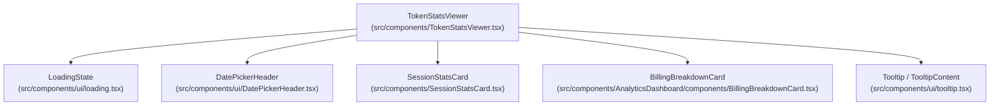
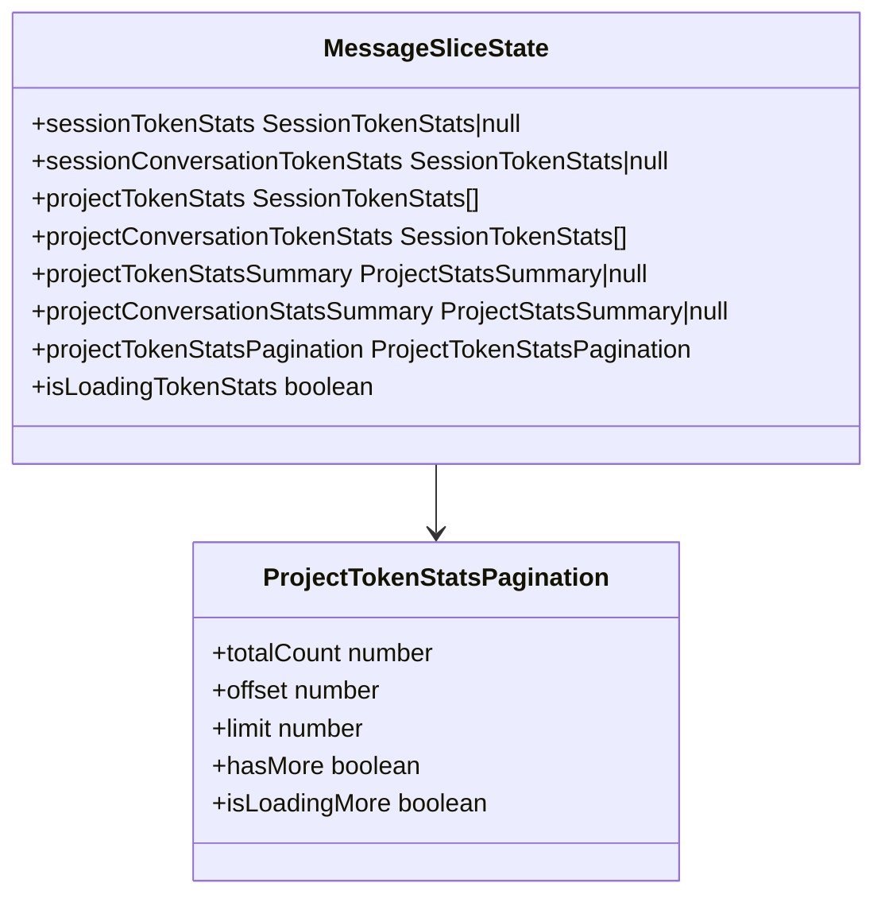
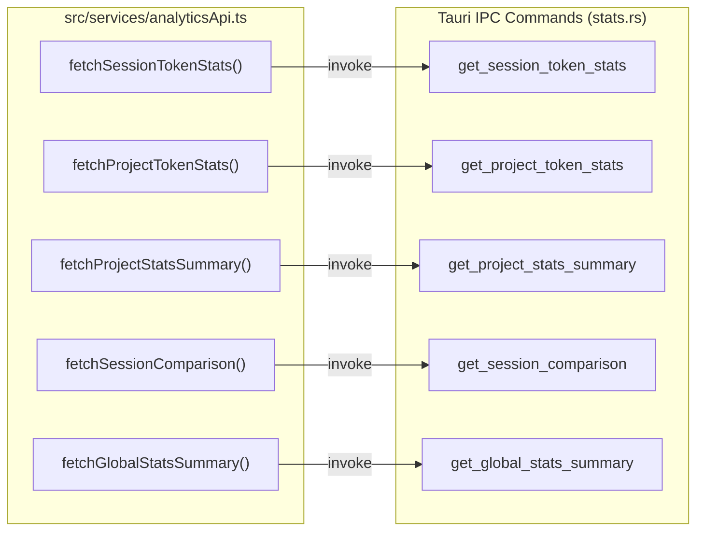
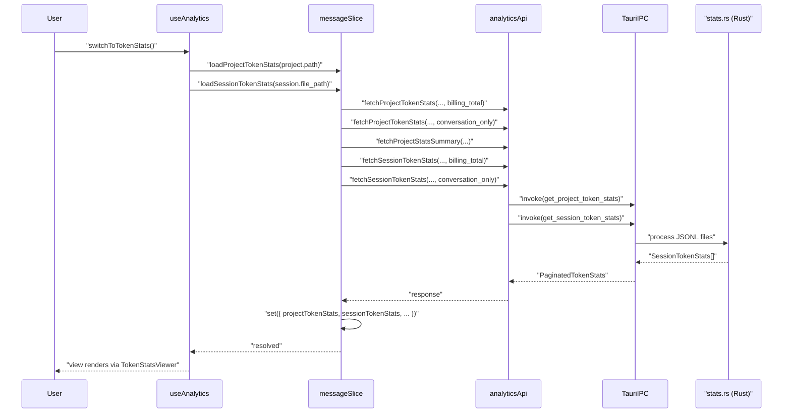
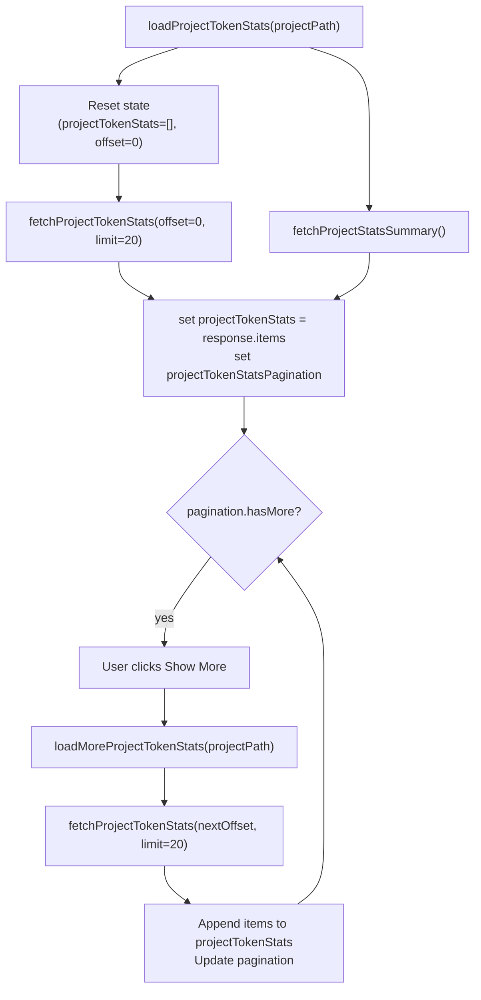

# Token Stats Viewer

<details>
<summary>관련 소스 파일</summary>

다음 파일들은 이 위키 페이지를 생성하기 위한 컨텍스트로 사용되었습니다:

- [src-tauri/benches/performance.rs](src-tauri/benches/performance.rs)
- [src-tauri/src/commands/stats.rs](src-tauri/src/commands/stats.rs)
- [src-tauri/src/models/stats.rs](src-tauri/src/models/stats.rs)
- [src/components/AnalyticsDashboard.tsx](src/components/AnalyticsDashboard.tsx)
- [src/components/AnalyticsDashboard/utils/projectCalculations.ts](src/components/AnalyticsDashboard/utils/projectCalculations.ts)
- [src/components/SessionStatsCard.tsx](src/components/SessionStatsCard.tsx)
- [src/components/TokenStatsViewer.tsx](src/components/TokenStatsViewer.tsx)
- [src/contexts/theme/ThemeProvider.tsx](src/contexts/theme/ThemeProvider.tsx)
- [src/contexts/theme/utils.ts](src/contexts/theme/utils.ts)
- [src/hooks/useAnalytics.ts](src/hooks/useAnalytics.ts)
- [src/services/analyticsApi.ts](src/services/analyticsApi.ts)
- [src/store/slices/analyticsSlice.ts](src/store/slices/analyticsSlice.ts)
- [src/store/slices/globalStatsSlice.ts](src/store/slices/globalStatsSlice.ts)
- [src/store/slices/messageSlice.ts](src/store/slices/messageSlice.ts)
- [src/store/useLanguageStore.ts](src/store/useLanguageStore.ts)
- [src/test/globalStatsSlice.test.ts](src/test/globalStatsSlice.test.ts)
- [src/test/messageSlice.tokenLoading.test.ts](src/test/messageSlice.tokenLoading.test.ts)
- [src/test/projectCalculations.test.ts](src/test/projectCalculations.test.ts)
- [src/types/stats.types.ts](src/types/stats.types.ts)
- [src/utils/time.ts](src/utils/time.ts)

</details>


이 페이지는 **Token Stats Viewer** 하위 시스템을 문서화합니다: `TokenStatsViewer`와 `SessionStatsCard` UI 컴포넌트, 프론트엔드와 백엔드를 연결하는 `analyticsApi` 서비스 계층, 그리고 모든 토큰 통계를 관리하는 `messageSlice` 상태를 다룹니다. 이 뷰어는 선택된 프로젝트 안에서 `"tokenStats"` analytics view로 전환하여 접근합니다.

이 뷰를 호스팅하는 더 넓은 analytics dashboard는 [Analytics Dashboard](3.4)를 참조하세요. 통계를 계산하는 백엔드 명령은 [Statistics and Analytics](5.2)를 참조하세요. 이 뷰어 내부에서 사용되는 `BillingBreakdownCard`는 [Analytics Views](3.4.1)를 참조하세요.

---

## 목적

`TokenStatsViewer`는 세션별 및 프로젝트별 토큰 소비량을 위한 전용 보기를 제공합니다. 표시하는 내용은 다음과 같습니다:

- 현재 선택된 세션의 **세션 수준 통계**.
- `SessionStatsCard` 타일의 페이지네이션 목록으로 표시되는 **프로젝트 수준 통계**(페이지당 20개, 요청 시 로드).
- 청구 목적으로 계산되는 토큰과 실제 대화에서 교환된 토큰을 구분하는 **billing vs conversation** 비교(`BillingBreakdownCard`).
- 계산 대상 메시지를 제한하는 `DatePickerHeader` 기반 **날짜 필터링**.

---

## 컴포넌트 아키텍처

**TokenStatsViewer 컴포넌트 계층**



출처: [src/components/TokenStatsViewer.tsx:1-93](), [src/components/SessionStatsCard.tsx:1-48]()

### `TokenStatsViewer`

최상위 컴포넌트입니다. 순수 표시 컴포넌트이며, 모든 데이터를 props로 받고 로딩은 부모를 통해 스토어에 위임합니다.

| Prop | Type | 설명 |
|---|---|---|
| `sessionStats` | `SessionTokenStats \| null` | 현재 세션의 billing-total 통계 |
| `sessionConversationStats` | `SessionTokenStats \| null` | 현재 세션의 conversation-only 통계 |
| `projectStats` | `SessionTokenStats[]` | 프로젝트 세션 통계의 현재 페이지(billing) |
| `projectConversationStats` | `SessionTokenStats[]` | 현재 페이지(conversation-only) |
| `projectStatsSummary` | `ProjectStatsSummary \| null` | 모든 세션에 걸친 집계 합계(billing) |
| `projectConversationStatsSummary` | `ProjectStatsSummary \| null` | 집계 합계(conversation-only) |
| `pagination` | `ProjectTokenStatsPagination` | 세션 목록의 offset/limit/hasMore |
| `onLoadMore` | `() => void` | 다음 페이지를 로드하는 콜백 |
| `dateFilter` | `{ start, end }` | 활성 날짜 창 |
| `setDateFilter` | setter | 사용자가 새 날짜 범위를 선택할 때 호출됨 |
| `onSessionClick` | `(stats) => void` | 세션 카드별 선택적 클릭 핸들러 |
| `providerId` | `ProviderId` | conversation breakdown 표시 여부 제어 |

컴포넌트는 `useAppStore`를 통해 Zustand 스토어의 `sessions`와 `userMetadata.sessions`를 교차 참조하여 각 `SessionTokenStats`의 표시 제목을 해석하고, `sessionDisplayById` 맵을 구축합니다. [src/components/TokenStatsViewer.tsx:99-115]()를 참조하세요.

프로젝트 요약 섹션은 `projectStatsSummary`(우선 사용, 모든 페이지를 포괄)에서 합계를 집계하거나, 요약이 없을 때 로드된 페이지를 합산합니다. [src/components/TokenStatsViewer.tsx:155-185]()를 참조하세요.

`pagination.hasMore`가 true이면 "Show More" 버튼이 나타나고 `onLoadMore`를 호출합니다. 남은 세션 수를 표시합니다. [src/components/TokenStatsViewer.tsx:316-347]()를 참조하세요.

### `SessionStatsCard`

단일 `SessionTokenStats` 레코드를 위한 압축된 memoized 타일입니다.

| Prop | Type | 설명 |
|---|---|---|
| `stats` | `SessionTokenStats` | 세션의 토큰 데이터 |
| `showSessionId` | `boolean` | 원시 UUID를 `<code>` 요소로 렌더링 |
| `compact` | `boolean` | 패딩 감소 |
| `summary` | `string` | 통계 아래에 표시되는 세션 설명 |
| `onClick` | `() => void` | 카드를 클릭 가능하게 만듦 |
| `hoverable` | `boolean` | 호버 스타일 추가 |

카드는 총 토큰, 메시지 수, 지속 시간(`first_message_time`과 `last_message_time`에서 파생)을 표시합니다. 그 아래에는 0이 아닌 토큰 범주(input, output, cache creation, cache read)와 전체 대비 비율을 표시하는 2열 그리드가 있습니다. [src/components/SessionStatsCard.tsx:50-126]()를 참조하세요.

---

## 상태 관리

모든 토큰 통계는 Zustand 스토어 내부의 `messageSlice`에 보관됩니다. 전체 slice 레이아웃은 [State Slices](4.2)를 참조하세요.

**토큰 통계를 위해 `messageSlice`가 관리하는 상태 필드**



출처: [src/store/slices/messageSlice.ts:42-60]()

`isLoadingTokenStats` 플래그는 내부 참조 카운팅 방식(`tokenStatsInFlight`)을 사용하므로, 동시 세션 및 프로젝트 로드가 모두 완료될 때까지 스피너가 활성 상태로 유지됩니다. [src/store/slices/messageSlice.ts:131-154]()를 참조하세요.

### 주요 액션

| 액션 | 시그니처 | 설명 |
|---|---|---|
| `loadSessionTokenStats` | `(sessionPath: string) => Promise<void>` | 한 세션의 billing 및 conversation 통계를 가져옴 |
| `loadProjectTokenStats` | `(projectPath: string) => Promise<void>` | 프로젝트 통계의 첫 페이지를 초기화하고 가져옴 |
| `loadMoreProjectTokenStats` | `(projectPath: string) => Promise<void>` | 기존 배열에 다음 페이지를 추가 |
| `clearTokenStats` | `() => void` | 모든 토큰 통계를 초기화하고 진행 중 요청을 취소 |

`loadProjectTokenStats`는 `projectStatsSummary`도 병렬로 가져와, 몇 페이지가 로드되었는지에 의존하지 않는 정확한 합계를 제공합니다. [src/store/slices/messageSlice.ts:253-271]()를 참조하세요.

`clearTokenStats`는 `nextRequestId`를 통해 `"sessionTokenStats"`와 `"projectTokenStats"` 요청 ID를 모두 증가시키며, 이로 인해 현재 진행 중인 응답 핸들러가 stale 상태를 감지하고 결과를 폐기합니다. [src/store/slices/messageSlice.ts:316-328]()를 참조하세요.

---

## `analyticsApi` 서비스 계층

`src/services/analyticsApi.ts`는 모든 통계 명령에 대해 프론트엔드와 Tauri IPC 사이의 단일 접점입니다. `invoke` 호출을 감싸고 `dedupeInFlight`를 통한 진행 중 요청 중복 제거를 추가합니다.

**analyticsApi 함수 → Tauri 명령 매핑**



출처: [src/services/analyticsApi.ts:50-255]()

### 중복 제거

`dedupeInFlight`는 모든 인자(경로, offset, limit, 날짜, stats mode)로 캐시 키를 만들고, 동일한 요청이 이미 진행 중이면 기존 `Promise`를 반환합니다. 이를 통해 여러 컴포넌트나 effect가 같은 파라미터로 동시에 가져오기를 트리거할 때 불필요한 백엔드 호출을 방지합니다. [src/services/analyticsApi.ts:27-41]()를 참조하세요.

### `StatsMode`

세션 및 프로젝트 가져오기 함수는 모두 `stats_mode` 파라미터를 받습니다:

| 값 | 의미 |
|---|---|
| `"billing_total"` | sidechain 메시지를 포함하며, Anthropic이 청구하는 내용을 반영 |
| `"conversation_only"` | sidechain 메시지를 제외하며, 사용자에게 보이는 교환을 반영 |

Rust 백엔드(`stats.rs`)는 이를 `StatsMode` enum인 `BillingTotal`과 `ConversationOnly`로 매핑합니다. [src-tauri/src/commands/stats.rs:27-48]()를 참조하세요.

### `FetchProjectTokenStatsOptions`

```typescript
export interface FetchProjectTokenStatsOptions {
  offset?: number;
  limit?: number;
  start_date?: string;
  end_date?: string;
  stats_mode: StatsMode;
}
```

[src/services/analyticsApi.ts:80-86]()를 참조하세요.

---

## 데이터 흐름

**token stats view로 전환할 때의 엔드투엔드 흐름**



출처: [src/services/analyticsApi.ts:50-124](), [src/store/slices/messageSlice.ts:253-271]()

---

## 페이지네이션

프로젝트 세션 통계는 서버 측에서 페이지네이션됩니다. 페이지 크기는 `TOKENS_STATS_PAGE_SIZE = 20`으로 고정되어 있습니다. [src/store/slices/messageSlice.ts:88-88]()를 참조하세요.



출처: [src/services/analyticsApi.ts:91-124](), [src/components/TokenStatsViewer.tsx:127-137]()

`src/utils/pagination.ts`의 `canLoadMore` 유틸리티는 더 이상 페이지가 없거나 페이지 로드가 이미 진행 중이면 `loadMoreProjectTokenStats`가 아무 작업도 하지 않도록 보호합니다. [src/store/slices/messageSlice.ts:285-288]()를 참조하세요.

---

## 제공자별 동작

모든 제공자가 sidechain 메타데이터를 지원하는 것은 아닙니다. `supportsConversationBreakdown(providerId)`는 두 번째 `"conversation_only"` 요청을 수행해야 하는지 런타임에 결정합니다. [src/components/TokenStatsViewer.tsx:97-97]()를 참조하세요.

| 제공자 | Conversation breakdown |
|---|---|
| `"claude"` | 예 — 로드당 두 개 요청 |
| `"codex"` | 아니오 — billing stats를 conversation stats로 재사용 |
| `"opencode"` | 예 |

제공자가 breakdown을 지원하지 않으면 `sessionConversationTokenStats`는 `sessionTokenStats`와 같은 값으로 설정됩니다. `TokenStatsViewer`는 `showProviderLimitHelp` 플래그를 통해 이를 감지합니다. [src/store/slices/messageSlice.ts:156-159](), [src/components/TokenStatsViewer.tsx:97-97]()를 참조하세요.

---

## 날짜 필터링

`dateFilter` 상태(`{ start: Date | null, end: Date | null }` 객체)는 `analyticsApi`로 전달됩니다. `globalStatsSlice`에서는 전체 날짜가 포함되도록 백엔드에 전송하기 전에 종료 날짜를 `23:59:59.999`로 확장합니다. [src/store/slices/globalStatsSlice.ts:71-76](), [src/test/globalStatsSlice.test.ts:146-177]()를 참조하세요.

백엔드는 필터링된 범위에 걸친 `daily_stats`를 반환합니다. 대시보드의 추세 차트는 이 값을 활용하여 시간에 따른 소비량을 렌더링합니다. [src-tauri/src/commands/stats.rs:10-14]()를 참조하세요.

---

## 요청 취소

`loadSessionTokenStats`와 `loadProjectTokenStats`는 모두 `nextRequestId` 및 `getRequestId`를 통한 요청 ID 메커니즘을 활용하여 오래된 업데이트를 방지합니다. 더 새로운 요청이 시작되거나 `clearTokenStats`가 호출되면, 이전에 진행 중이던 응답은 무시됩니다. [src/store/slices/messageSlice.ts:316-328](), [src/test/globalStatsSlice.test.ts:89-106]()를 참조하세요.
