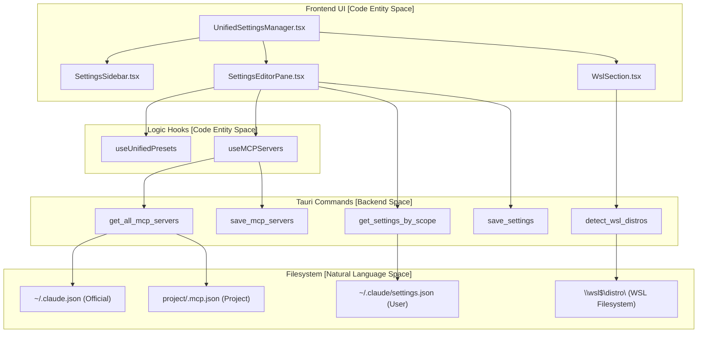
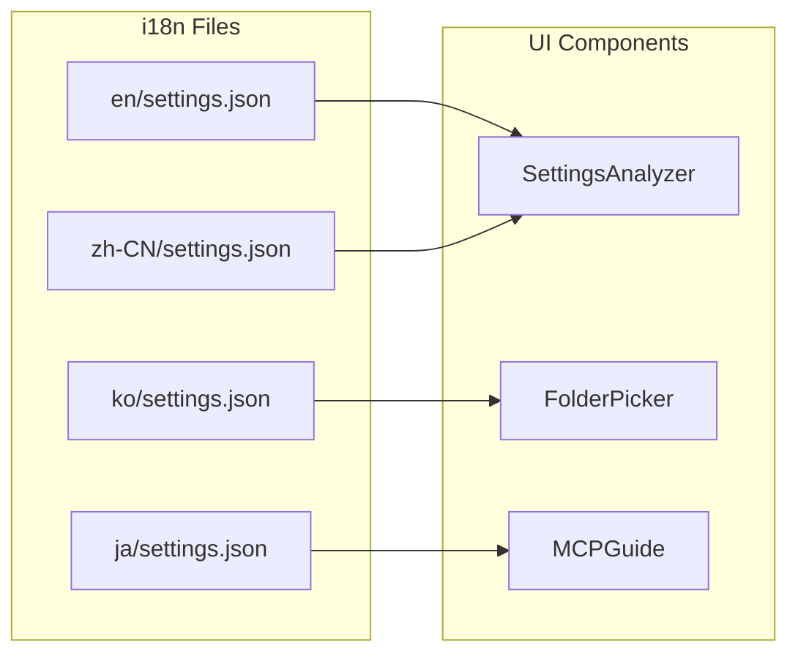

# Settings Manager

관련 소스 파일

다음 파일들은 이 위키 페이지를 생성하기 위한 컨텍스트로 사용되었습니다:

- [src-tauri/src/commands/claude_settings.rs](src-tauri/src/commands/claude_settings.rs)
- [src-tauri/src/commands/mcp_presets.rs](src-tauri/src/commands/mcp_presets.rs)
- [src-tauri/src/commands/settings.rs](src-tauri/src/commands/settings.rs)
- [src/components/SettingsManager/UnifiedSettingsManager.tsx](src/components/SettingsManager/UnifiedSettingsManager.tsx)
- [src/components/SettingsManager/components/EmptyState.tsx](src/components/SettingsManager/components/EmptyState.tsx)
- [src/components/SettingsManager/components/index.ts](src/components/SettingsManager/components/index.ts)
- [src/components/SettingsManager/editor/EditorFooter.tsx](src/components/SettingsManager/editor/EditorFooter.tsx)
- [src/components/SettingsManager/editor/EffectiveSummaryBanner.tsx](src/components/SettingsManager/editor/EffectiveSummaryBanner.tsx)
- [src/components/SettingsManager/editor/SettingsEditorPane.tsx](src/components/SettingsManager/editor/SettingsEditorPane.tsx)
- [src/components/SettingsManager/index.ts](src/components/SettingsManager/index.ts)
- [src/components/SettingsManager/sections/MCPServersSection.tsx](src/components/SettingsManager/sections/MCPServersSection.tsx)
- [src/components/SettingsManager/sections/WslSection.tsx](src/components/SettingsManager/sections/WslSection.tsx)
- [src/components/SettingsManager/sections/index.ts](src/components/SettingsManager/sections/index.ts)
- [src/components/modals/folderSelect/FolderSelector.tsx](src/components/modals/folderSelect/FolderSelector.tsx)
- [src/hooks/useMCPPresets.ts](src/hooks/useMCPPresets.ts)
- [src/hooks/useMCPServers.ts](src/hooks/useMCPServers.ts)
- [src/i18n/locales/en/settings.json](src/i18n/locales/en/settings.json)
- [src/i18n/locales/ja/settings.json](src/i18n/locales/ja/settings.json)
- [src/i18n/locales/ko/settings.json](src/i18n/locales/ko/settings.json)
- [src/i18n/locales/zh-CN/settings.json](src/i18n/locales/zh-CN/settings.json)
- [src/i18n/locales/zh-TW/settings.json](src/i18n/locales/zh-TW/settings.json)
- [src/i18n/types.generated.ts](src/i18n/types.generated.ts)
- [src/types/claudeSettings.ts](src/types/claudeSettings.ts)
- [src/types/mcpPreset.types.ts](src/types/mcpPreset.types.ts)

Settings Manager는 Claude Code 설정을 보고 편집하고, Model Context Protocol(MCP) 서버 구성을 관리하며, 통합 preset을 처리하기 위한 포괄적인 구성 인터페이스를 제공합니다. Claude Code의 네이티브 파일시스템 기반 구성과 뷰어 UI 사이를 연결하며, 여러 범위(user, project, local, managed)의 설정을 지원합니다.

## 개요

Settings Manager는 여러 기능 영역으로 구성됩니다:

1.  **Claude Code 설정**: `get_settings_by_scope`와 `save_settings`를 통해 여러 범위의 `settings.json` 및 `settings.local.json` 파일을 읽고 씁니다 [src-tauri/src/commands/claude_settings.rs:179-205]().
2.  **MCP 서버 관리**: 공식 `~/.claude.json`, 레거시 `.mcp.json`, 프로젝트별 구성 등 여러 소스의 MCP 서버를 관리하기 위한 통합 인터페이스입니다 [src-tauri/src/commands/claude_settings.rs:21-40]().
3.  **통합 Preset**: `useUnifiedPresets` 훅을 통해 저장하고 다시 적용할 수 있는 설정 및 MCP 구성의 스냅샷입니다 [src/hooks/useMCPPresets.ts:7-10]().
4.  **플랫폼 통합**: Windows의 WSL 스캔 및 사용자 지정 디렉터리 관리를 위한 특수 지원입니다 [src/components/SettingsManager/sections/WslSection.tsx:5-7]().

출처: [src/components/SettingsManager/UnifiedSettingsManager.tsx:1-9](), [src-tauri/src/commands/claude_settings.rs:1-5]()

## 시스템 아키텍처

다음 다이어그램은 React 프론트엔드 컴포넌트에서 전문화된 훅을 거쳐 파일시스템과 상호작용하는 Rust 백엔드 명령까지의 흐름을 보여줍니다.

### 설정 데이터 흐름
Title: Settings Management Pipeline

출처: [src/components/SettingsManager/UnifiedSettingsManager.tsx:11-31](), [src-tauri/src/commands/claude_settings.rs:179-205](), [src/components/SettingsManager/sections/WslSection.tsx:59-66]()

## 설정 범위 및 파일 위치

시스템은 네 가지 뚜렷한 범위에 걸쳐 설정을 관리합니다. 백엔드는 업데이트 중 파일 손상을 방지하기 위해 원자적 쓰기를 보장합니다 [src-tauri/src/commands/claude_settings.rs:145-168]().

| 범위 | 파일 경로 | 설명 |
| :--- | :--- | :--- |
| **User** | `~/.claude/settings.json` | 전역 사용자 선호도 [src-tauri/src/commands/claude_settings.rs:42-46](). |
| **Project** | `<project>/.claude/settings.json` | 프로젝트별 오버라이드 [src-tauri/src/commands/claude_settings.rs:120-124](). |
| **Local** | `<project>/.claude/settings.local.json` | 로컬 머신 오버라이드(git-ignored) [src-tauri/src/commands/claude_settings.rs:125-129](). |
| **Managed** | `/Library/.../managed-settings.json` | 읽기 전용 엔터프라이즈 설정(macOS 전용) [src-tauri/src/commands/macos.rs:102-109](). |

출처: [src-tauri/src/commands/claude_settings.rs:117-133]()

## MCP 서버 구성

`useMCPServers` 훅은 "Multi-Source MCP Configuration Manager"를 위한 통합 인터페이스를 제공합니다. Claude Code의 우선순위 로직과 일치하도록 다섯 가지 가능한 위치에서 서버를 집계합니다.

### MCP 소스(AllMCPServers)
백엔드의 `AllMCPServers` struct는 MCP 소스의 계층 구조를 정의합니다 [src-tauri/src/commands/claude_settings.rs:29-40]():

*   **user_claude_json**: `~/.claude.json`의 사용자 범위 MCP(공식).
*   **local_claude_json**: `~/.claude.json` → `projects.<path>.mcpServers`의 프로젝트 범위 MCP.
*   **user_settings**: `settings.json` `mcpServers`의 사용자 수준 MCP(레거시).
*   **user_mcp_file**: `~/.claude/.mcp.json`의 사용자 수준 MCP(레거시).
*   **project_mcp_file**: 프로젝트 루트의 `.mcp.json`에서 온 프로젝트 수준 MCP.

출처: [src-tauri/src/commands/claude_settings.rs:21-40](), [src/hooks/useMCPServers.ts:126-133]()

## 특수 섹션

### WSL 통합(`WslSection`)
Windows 사용자를 위해 `WslSection`은 Linux 배포판 내부의 Claude 프로젝트 스캔을 허용합니다. 사용 가능한 환경을 나열하기 위해 `detect_wsl_distros` 명령을 사용하고, 특정 배포판을 포함하거나 제외하도록 `userMetadata` 상태를 업데이트합니다 [src/components/SettingsManager/sections/WslSection.tsx:59-66]().

### 사용자 지정 디렉터리(`CustomDirectoriesSection`)
사용자가 Claude 데이터 스캔을 위한 비표준 경로를 추가할 수 있게 합니다. 이는 경로가 유효한 Claude 데이터나 `projects/` 하위 폴더를 포함하는지 검증한 뒤 사용자 지정 디렉터리로 추가할 수 있게 하는 `FolderSelector` 컴포넌트와 통합되어 있습니다 [src/components/modals/folderSelect/FolderSelector.tsx:83-95]().

## 국제화(i18n)

Settings Manager는 모든 UI 문자열에 전용 `settings` namespace를 사용하며, 영어, 한국어, 일본어, 중국어(간체/번체)를 지원합니다.

### Settings Namespace 매핑
Title: Settings i18n Mapping

출처: [src/i18n/types.generated.ts:20-20](), [src/i18n/locales/en/settings.json:1-70]()

## 구현 세부 정보

### 원자적 쓰기 패턴
백엔드는 데이터 손실을 방지하기 위해 `write_settings_file`에서 원자적 쓰기를 구현합니다:
1.  JSON 콘텐츠를 검증합니다 [src-tauri/src/commands/claude_settings.rs:147-148]().
2.  상위 디렉터리가 존재하는지 보장합니다 [src-tauri/src/commands/claude_settings.rs:151-154]().
3.  `.json.tmp` 파일에 씁니다 [src-tauri/src/commands/claude_settings.rs:157-161]().
4.  버퍼를 flush하기 위해 `sync_all()`을 호출합니다 [src-tauri/src/commands/claude_settings.rs:162-163]().
5.  최종 교체에는 `atomic_rename`을 사용합니다 [src-tauri/src/commands/claude_settings.rs:165]().

### Dirty State 추적
`UnifiedSettingsManager`는 저장되지 않은 변경 사항을 추적하기 위해 `pendingSettings` 상태를 사용합니다. "Save" 액션을 활성화해야 하는지 판단하기 위해 `pendingSettings`의 문자열화된 버전을 백엔드에서 로드한 `currentSettings`와 비교합니다 [src/components/SettingsManager/UnifiedSettingsManager.tsx:190-193]().

출처: [src/components/SettingsManager/UnifiedSettingsManager.tsx:104-123](), [src-tauri/src/commands/claude_settings.rs:145-168]()
