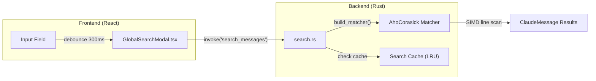
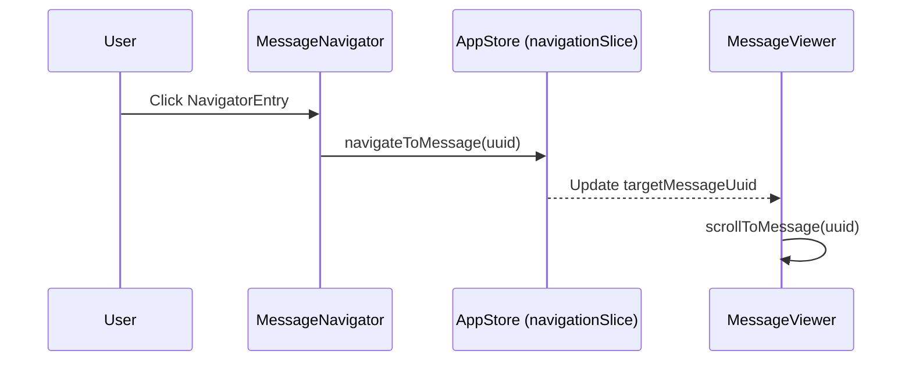
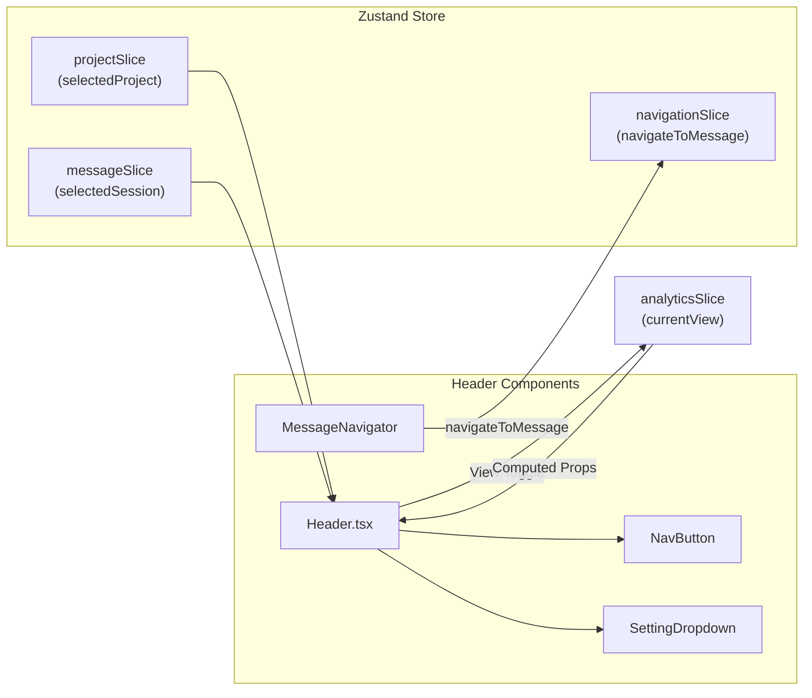

# Header and Navigation

<details>
<summary>관련 소스 파일</summary>

다음 파일들은 이 위키 페이지를 생성하기 위한 컨텍스트로 사용되었습니다:

- [src-tauri/src/commands/session/search.rs](src-tauri/src/commands/session/search.rs)
- [src/components/MessageNavigator/MessageNavigator.tsx](src/components/MessageNavigator/MessageNavigator.tsx)
- [src/components/modals/globalSearch/GlobalSearchModal.tsx](src/components/modals/globalSearch/GlobalSearchModal.tsx)
- [src/components/ui/switch.tsx](src/components/ui/switch.tsx)
- [src/i18n/locales/en/message.json](src/i18n/locales/en/message.json)
- [src/i18n/locales/ja/message.json](src/i18n/locales/ja/message.json)
- [src/i18n/locales/ko/message.json](src/i18n/locales/ko/message.json)
- [src/i18n/locales/zh-CN/message.json](src/i18n/locales/zh-CN/message.json)
- [src/i18n/locales/zh-TW/message.json](src/i18n/locales/zh-TW/message.json)
- [src/layouts/Header/Header.tsx](src/layouts/Header/Header.tsx)
- [src/layouts/Header/SettingDropdown/AccessibilityMenuGroup.tsx](src/layouts/Header/SettingDropdown/AccessibilityMenuGroup.tsx)
- [src/layouts/Header/SettingDropdown/FilterMenuGroup.tsx](src/layouts/Header/SettingDropdown/FilterMenuGroup.tsx)
- [src/layouts/Header/SettingDropdown/FontMenuGroup.tsx](src/layouts/Header/SettingDropdown/FontMenuGroup.tsx)
- [src/layouts/Header/SettingDropdown/LanguageMenuGroup.tsx](src/layouts/Header/SettingDropdown/LanguageMenuGroup.tsx)
- [src/layouts/Header/SettingDropdown/ThemeMenuGroup.tsx](src/layouts/Header/SettingDropdown/ThemeMenuGroup.tsx)
- [src/layouts/Header/SettingDropdown/index.tsx](src/layouts/Header/SettingDropdown/index.tsx)
- [src/store/slices/filterSlice.ts](src/store/slices/filterSlice.ts)
- [src/test/MessageNavigator.accessibility.test.tsx](src/test/MessageNavigator.accessibility.test.tsx)
- [src/types/analytics.ts](src/types/analytics.ts)

</details>


이 페이지는 `Header` 컴포넌트, `NavButton` 레이아웃 primitive, 뷰 전환을 구동하는 `AnalyticsView` 타입 시스템, `SettingDropdown` 컴포넌트, `MessageNavigator`를 문서화합니다. Header는 애플리케이션의 기본 내비게이션 표면입니다. 모든 화면의 상단에 위치하며 콘텐츠 영역에 렌더링될 메인 패널을 제어합니다.

Header가 전환하는 콘텐츠 패널에 대한 문서는 관련 컴포넌트 페이지를 참조하세요: [Message Viewer](3.3), [Analytics Dashboard](3.4), [Session Board](3.2), [Token Stats Viewer](3.5), [Settings Manager](3.6).

---

## 개요

`Header` 컴포넌트는 [src/layouts/Header/Header.tsx:34]()에 정의되어 있으며 애플리케이션의 최상위 수준에서 렌더링됩니다. 고정 높이(`h-12`)의 바이며 세 영역으로 나뉩니다:

| 영역 | 콘텐츠 | 조건 |
|---|---|---|
| 왼쪽 | 앱 아이콘, 앱 이름, 프로젝트 이름, 세션 요약 | 항상 [src/layouts/Header/Header.tsx:93-128]() |
| 가운데 | 세션 ID 배지(Terminal 아이콘 + 짧은 ID) | `selectedSession`이 존재하고 `isMessagesView`가 true [src/layouts/Header/Header.tsx:131-138]() |
| 오른쪽 | 검색 버튼, `NavButton` 그룹, `SettingDropdown` | 항상, 버튼은 컨텍스트에 따라 달라짐 [src/layouts/Header/Header.tsx:141-250]() |

---

## AnalyticsView 타입

활성 메인 패널은 [src/types/analytics.ts:19]()에 정의된 `AnalyticsView` union 타입을 통해 추적됩니다:

```typescript
export type AnalyticsView =
  | "messages"
  | "tokenStats"
  | "analytics"
  | "recentEdits"
  | "settings"
  | "board";
```

`AnalyticsState`의 `currentView` 필드는 활성 값을 보관합니다. `useAnalytics` 훅은 이 값에서 boolean computed flag를 파생하며, Header는 이를 사용해 활성 스타일을 적용합니다.

**`AnalyticsView`에서 파생되는 computed flag**([src/types/analytics.ts:140-152]() 기준):

| Computed Flag | `currentView` 값 |
|---|---|
| `isMessagesView` | `'messages'` |
| `isTokenStatsView` | `'tokenStats'` |
| `isAnalyticsView` | `'analytics'` |
| `isRecentEditsView` | `'recentEdits'` |
| `isSettingsView` | `'settings'` |
| `isBoardView` | `'board'` |

**AnalyticsView 상태 머신:**

전환 로직은 `useAnalytics` 훅에 구현되어 있으며, `switchToBoard` 또는 `switchToMessages` 같은 액션을 통해 스토어의 `currentView`를 업데이트합니다.

```mermaid
stateDiagram-v2
    [*] --> "messages"
    "messages" --> "analytics" : "switchToAnalytics()"
    "messages" --> "tokenStats" : "switchToTokenStats()"
    "messages" --> "recentEdits" : "switchToRecentEdits()"
    "messages" --> "board" : "switchToBoard()"
    "messages" --> "settings" : "switchToSettings()"
    "analytics" --> "messages" : "switchToMessages()"
    "tokenStats" --> "messages" : "switchToMessages()"
    "recentEdits" --> "messages" : "switchToMessages()"
    "board" --> "messages" : "switchToMessages()"
    "settings" --> "messages" : "switchToMessages()"
```

출처: [src/types/analytics.ts:19-20](), [src/types/analytics.ts:126-137](), [src/layouts/Header/Header.tsx:172-180]()

---

## 전역 검색 통합

Header는 전용 검색 버튼을 통해 `GlobalSearchModal` [src/components/modals/globalSearch/GlobalSearchModal.tsx:37]()에 접근할 수 있게 합니다.

- **단축키**: macOS에서는 `⌘+K`, Windows/Linux에서는 `Ctrl+K` [src/layouts/Header/Header.tsx:32]().
- **기능**: `openModal("globalSearch")` 액션을 트리거합니다 [src/layouts/Header/Header.tsx:144]().
- **백엔드 브리지**: 검색은 `search_messages` 또는 `search_all_providers` Tauri 명령을 활용합니다 [src/components/modals/globalSearch/GlobalSearchModal.tsx:117-121]().

**검색 실행 로직:**



출처: [src/components/modals/globalSearch/GlobalSearchModal.tsx:145-147](), [src-tauri/src/commands/session/search.rs:71-76](), [src-tauri/src/commands/session/search.rs:109-111]()

---

## SettingDropdown 및 메뉴

`SettingDropdown` [src/layouts/Header/SettingDropdown/index.tsx:28]()은 애플리케이션 구성과 접근성 옵션을 중앙화합니다.

### 메뉴 그룹
- **FilterMenuGroup**: `filterSlice`에서 시스템 메시지와 sidechain의 표시 여부를 제어합니다 [src/store/slices/filterSlice.ts]().
- **FontMenuGroup**: `fontScale`을 90%에서 130% 사이로 조정합니다 [src/layouts/Header/SettingDropdown/FontMenuGroup.tsx:12-18]().
- **ThemeMenuGroup**: `ThemeContext`를 사용해 `light`, `dark`, `system` 테마 사이를 전환합니다 [src/layouts/Header/SettingDropdown/ThemeMenuGroup.tsx:12-16]().
- **LanguageMenuGroup**: `useLanguageStore`를 통해 애플리케이션 locale을 업데이트합니다 [src/layouts/Header/SettingDropdown/LanguageMenuGroup.tsx:17-36]().
- **AccessibilityMenuGroup**: 고대비 모드 같은 접근성 기능을 관리합니다.

### 주요 액션
- **Change Folder**: 루트 `claudePath`를 변경하기 위해 `folderSelector` 모달을 엽니다 [src/layouts/Header/SettingDropdown/index.tsx:53-57]().
- **Check for Updates**: `updater` 훅을 통해 수동 업데이트 확인을 트리거합니다 [src/layouts/Header/SettingDropdown/index.tsx:79-94]().

출처: [src/layouts/Header/SettingDropdown/index.tsx:63-75](), [src/layouts/Header/SettingDropdown/FontMenuGroup.tsx:25-26](), [src/layouts/Header/SettingDropdown/ThemeMenuGroup.tsx:22-23]()

---

## MessageNavigator

`MessageNavigator` [src/components/MessageNavigator/MessageNavigator.tsx:26]()는 현재 세션의 대화 구조에 대한 상위 수준 개요를 제공하는 사이드바 컴포넌트입니다.

### 구현 세부 정보
- **가상화**: 대규모 대화를 효율적으로 처리하기 위해 `@tanstack/react-virtual`을 사용합니다 [src/components/MessageNavigator/MessageNavigator.tsx:81-86]().
- **높이 추정**: 미리보기 텍스트 길이와 `BASE_ENTRY_HEIGHT`(34px)를 기반으로 하는 휴리스틱을 사용합니다 [src/components/MessageNavigator/MessageNavigator.tsx:65-77]().
- **필터링**: 로컬 `filterText`와 `useAppStore`의 `userOnlyFilter` 토글을 지원합니다 [src/components/MessageNavigator/MessageNavigator.tsx:48-62]().
- **접근성**: 전체 키보드 내비게이션(화살표 키, Home, End, Enter)을 구현합니다 [src/components/MessageNavigator/MessageNavigator.tsx:125-155]().

### 내비게이션 데이터 흐름



출처: [src/components/MessageNavigator/MessageNavigator.tsx:88-93](), [src/components/MessageNavigator/MessageNavigator.tsx:142-150](), [src/store/slices/navigationSlice.ts]()

---

## 데이터 흐름 다이어그램: Header and Navigation

Header는 전역 `AppStore`와 특정 뷰 상태 사이의 브리지 역할을 합니다.



출처: [src/layouts/Header/Header.tsx:38-43](), [src/components/MessageNavigator/MessageNavigator.tsx:42](), [src/store/useAppStore.ts]()
