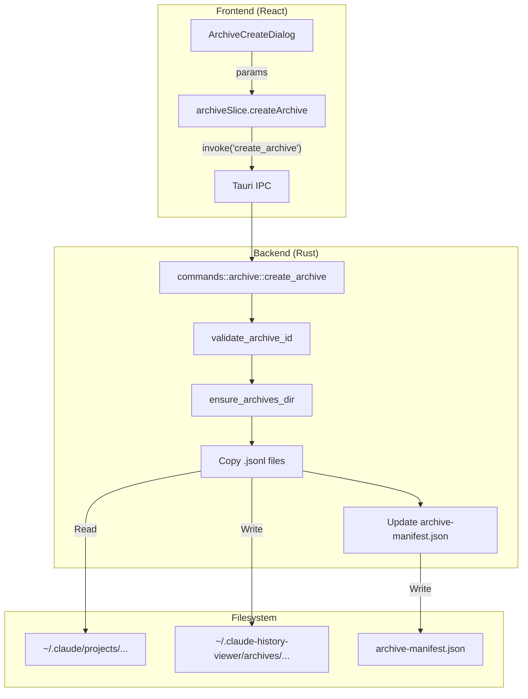
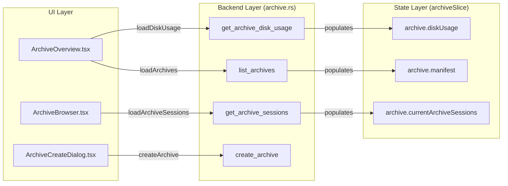

# Archive Manager

<details>
<summary>관련 소스 파일</summary>

다음 파일들은 이 위키 페이지를 생성하기 위한 컨텍스트로 사용되었습니다:

- [src-tauri/src/commands/archive.rs](src-tauri/src/commands/archive.rs)
- [src-tauri/src/commands/session/load.rs](src-tauri/src/commands/session/load.rs)
- [src-tauri/src/models/session.rs](src-tauri/src/models/session.rs)
- [src-tauri/src/models/snapshot_tests.rs](src-tauri/src/models/snapshot_tests.rs)
- [src-tauri/src/models/snapshots/claude_code_history_viewer_lib__models__snapshot_tests__session_snapshots__claude_session.snap](src-tauri/src/models/snapshots/claude_code_history_viewer_lib__models__snapshot_tests__session_snapshots__claude_session.snap)
- [src/components/ArchiveManager/ArchiveBrowser.tsx](src/components/ArchiveManager/ArchiveBrowser.tsx)
- [src/components/ArchiveManager/ArchiveOverview.tsx](src/components/ArchiveManager/ArchiveOverview.tsx)
- [src/hooks/useProjectSessions.ts](src/hooks/useProjectSessions.ts)
- [src/i18n/locales/en/archive.json](src/i18n/locales/en/archive.json)
- [src/i18n/locales/ja/archive.json](src/i18n/locales/ja/archive.json)
- [src/i18n/locales/ko/archive.json](src/i18n/locales/ko/archive.json)
- [src/i18n/locales/zh-CN/archive.json](src/i18n/locales/zh-CN/archive.json)
- [src/i18n/locales/zh-TW/archive.json](src/i18n/locales/zh-TW/archive.json)
- [src/store/slices/archiveSlice.ts](src/store/slices/archiveSlice.ts)
- [src/test/ArchiveBrowser.test.tsx](src/test/ArchiveBrowser.test.tsx)
- [src/test/archiveSlice.test.ts](src/test/archiveSlice.test.ts)
- [src/test/useProjectSessions.test.tsx](src/test/useProjectSessions.test.tsx)
- [src/types/archive.ts](src/types/archive.ts)
- [src/types/core/session.ts](src/types/core/session.ts)

</details>


Archive Manager는 AI 대화 기록을 보존, 구성, 탐색하기 위한 포괄적인 시스템을 제공합니다. Claude Code의 자동 정리 정책(일반적으로 30일 후 세션 삭제)으로 인한 데이터 손실을 완화하도록 특별히 설계되었으며, 사용자가 전용 저장 위치에 영구 아카이브를 만들 수 있게 합니다.

## 개요

Archive Manager는 파일시스템 작업을 처리하는 Rust 백엔드와 사용자 상호작용을 위한 React 프론트엔드로 구성됩니다. 아카이브는 제공자의 네이티브 저장소와 분리된 `~/.claude-history-viewer/archives/` [src-tauri/src/commands/archive.rs:135-138]()에 저장됩니다. 각 아카이브에는 세션 JSONL 파일의 복사본과 모든 아카이브의 메타데이터를 추적하는 전역 `archive-manifest.json`이 포함됩니다 [src-tauri/src/commands/archive.rs:158-160]().

### 주요 기능
- **아카이브 생성**: 임의 프로젝트에서 특정 세션을 선택하여 이름이 있는 아카이브로 묶습니다.
- **만료 추적**: Claude 설정의 `cleanupPeriodDays`를 기준으로 삭제 임계값에 가까워진 세션을 식별합니다 [src/components/ArchiveManager/ArchiveOverview.tsx:101-112]().
- **Subagent 지원**: 메인 세션을 아카이브할 때 subagent 대화 로그를 선택적으로 포함합니다 [src-tauri/src/commands/archive.rs:62-63]().
- **디스크 관리**: 생성된 모든 아카이브의 저장소 사용량 세부 내역을 제공합니다 [src-tauri/src/commands/archive.rs:92-99]().

---

## 데이터 모델

아카이브 시스템은 이식성과 성능을 유지하기 위해 구조화된 manifest를 사용합니다.

### ArchiveManifest
아카이브 디렉터리 루트에 저장되는 전역 manifest입니다.
| 필드 | 타입 | 설명 |
| :--- | :--- | :--- |
| `version` | `u32` | 마이그레이션을 위한 스키마 버전 [src-tauri/src/commands/archive.rs:36](). |
| `archives` | `Vec<ArchiveEntry>` | 시스템이 관리하는 모든 아카이브 목록 [src-tauri/src/commands/archive.rs:37](). |

### ArchiveEntry
단일 아카이브 폴더의 메타데이터입니다.
| 필드 | 타입 | 설명 |
| :--- | :--- | :--- |
| `id` | `String` | 파일시스템에 안전한 고유 식별자 [src-tauri/src/commands/archive.rs:53](). |
| `name` | `String` | 사람이 읽을 수 있는 이름 [src-tauri/src/commands/archive.rs:54](). |
| `source_project_path` | `String` | 세션이 복사된 원본 경로 [src-tauri/src/commands/archive.rs:58](). |
| `session_count` | `u32` | 아카이브에 포함된 세션 수 [src-tauri/src/commands/archive.rs:60](). |

### ArchiveSessionInfo
아카이브 내부의 개별 세션 파일 메타데이터이며, UI가 전체 JSONL 파일을 다시 파싱하지 않고 콘텐츠를 탐색할 수 있게 합니다 [src-tauri/src/commands/archive.rs:68-80]().

**출처:** [src-tauri/src/commands/archive.rs:32-80](), [src/types/archive.ts:6-36]()

---

## 백엔드 구현

백엔드 로직은 `src-tauri/src/commands/archive.rs`에 구현되어 있습니다. 파일의 물리적 이동과 manifest 무결성을 관리합니다.

### 아카이브 저장 구조
```text
~/.claude-history-viewer/archives/
├── archive-manifest.json
├── [archive_id_1]/
│   ├── sessions/
│   │   ├── session_1.jsonl
│   │   └── session_2.jsonl
│   └── subagents/
│       └── [session_1]/
│           └── subagent_a.jsonl
└── [archive_id_2]/
    └── ...
```

### 주요 명령
- `create_archive`: 아카이브 ID를 검증하고, 디렉터리 구조를 만들고, 세션 파일을 복사하며, manifest를 업데이트합니다 [src-tauri/src/commands/archive.rs:260-350]().
- `list_archives`: `archive-manifest.json`을 읽고 반환합니다 [src-tauri/src/commands/archive.rs:434-445]().
- `get_archive_sessions`: 아카이브 디렉터리를 스캔하고 각 파일에 대한 `ArchiveSessionInfo`를 생성합니다 [src-tauri/src/commands/archive.rs:498-550]().
- `export_session`: 아카이브된 JSONL 파일을 읽고 프론트엔드 다운로드용 문자열로 콘텐츠를 반환합니다 [src-tauri/src/commands/archive.rs:720-740]().

### 아카이브 로직 흐름
다음 다이어그램은 기존 제공자 세션에서 아카이브를 만드는 과정을 보여줍니다.

**아카이브 생성 데이터 흐름**

**출처:** [src-tauri/src/commands/archive.rs:260-350](), [src/store/slices/archiveSlice.ts:124-137](), [src/components/ArchiveManager/ArchiveCreateDialog.tsx]()

---

## 프론트엔드 컴포넌트

Archive Manager UI는 상태의 `archive.activeTab`이 관리하는 두 가지 기본 보기로 나뉩니다 [src/store/slices/archiveSlice.ts:33]().

### 1. ArchiveOverview
매니저의 시작 페이지입니다. 다음을 제공합니다:
- **디스크 사용량**: 전체 아카이브, 세션, 사용 바이트를 보여주는 시각적 카드 [src/components/ArchiveManager/ArchiveOverview.tsx:11-16]().
- **만료 예정 세션**: 현재 선택된 프로젝트에서 Claude Code에 의해 삭제되기까지 `thresholdDays` 이내인 세션 목록 [src/components/ArchiveManager/ArchiveOverview.tsx:87-98]().
- **설정**: `cleanupPeriodDays`(Claude 설정과 동기화됨) 및 `thresholdDays`(로컬 선호도) 구성 [src/components/ArchiveManager/ArchiveOverview.tsx:49-62]().

### 2. ArchiveBrowser
기존 아카이브를 관리하기 위한 파일 탐색기 형태의 인터페이스입니다:
- **확장**: 아카이브를 클릭하면 `loadArchiveSessions`를 통해 세션 목록이 로드됩니다 [src/components/ArchiveManager/ArchiveBrowser.tsx:98-108]().
- **관리**: 아카이브 이름 변경 또는 삭제 작업입니다. 아카이브 이름을 변경하면 디스크의 물리 디렉터리 이름도 변경됩니다 [src-tauri/src/commands/archive.rs:360-400]().
- **내보내기**: 개별 세션을 JSON 파일로 파일시스템에 다시 내보낼 수 있습니다 [src/components/ArchiveManager/ArchiveBrowser.tsx:142-178]().

### 컴포넌트 연결 맵
이 다이어그램은 UI 컴포넌트를 기반 상태 및 백엔드 명령에 연결합니다.

**아카이브 컴포넌트-명령 맵**

**출처:** [src/store/slices/archiveSlice.ts:46-66](), [src/components/ArchiveManager/ArchiveBrowser.tsx:50-60](), [src/components/ArchiveManager/ArchiveOverview.tsx:30-41]()

---

## 상태 관리(archiveSlice)

`archiveSlice`는 아카이브 데이터의 생명주기와 비동기 작업 상태를 관리합니다.

### 상태 형태
이 slice는 세분화된 UI 피드백을 제공하기 위해 여러 로딩 상태(예: `isCreatingArchive`, `isLoadingSessions`)를 추적합니다 [src/store/slices/archiveSlice.ts:34-41]().

### 주요 액션
- `loadArchives()`: 백엔드에서 manifest를 가져옵니다 [src/store/slices/archiveSlice.ts:110-122]().
- `loadArchiveSessions(id)`: 특정 아카이브의 세션을 가져옵니다. 사용자가 아카이브를 빠르게 전환할 때 race condition을 방지하기 위해 `requestId` 카운터를 사용합니다 [src/store/slices/archiveSlice.ts:185-215]().
- `createArchive(params)`: 세션 경로를 백엔드로 보내고 성공 시 manifest를 다시 로드합니다 [src/store/slices/archiveSlice.ts:124-137]().

**출처:** [src/store/slices/archiveSlice.ts:24-92]()
