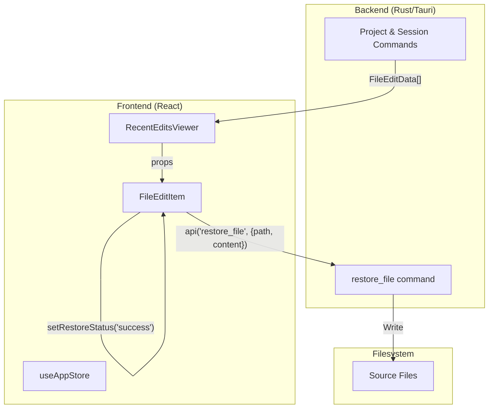
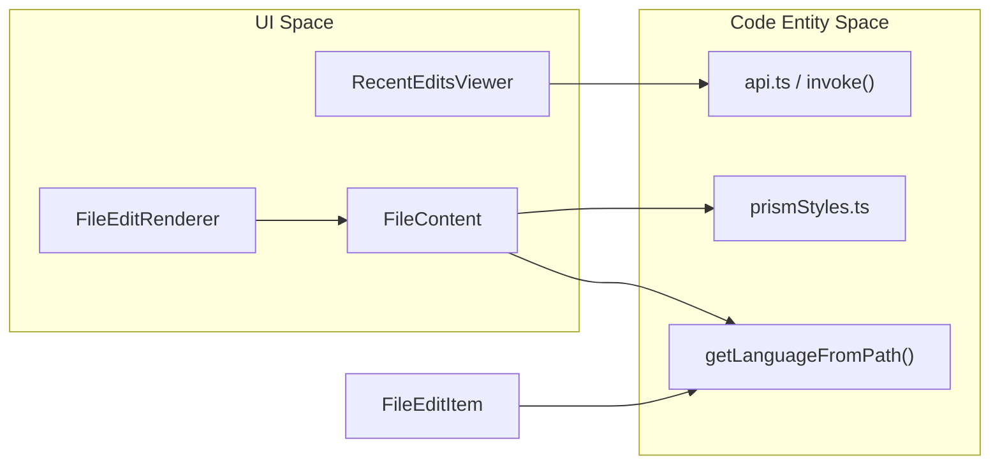

# Recent Edits Viewer

관련 소스 파일

다음 파일들은 이 위키 페이지를 생성하기 위한 컨텍스트로 사용되었습니다:

- [src/components/FileContent.tsx](src/components/FileContent.tsx)
- [src/components/RecentEditsViewer/FileEditItem.tsx](src/components/RecentEditsViewer/FileEditItem.tsx)
- [src/components/RecentEditsViewer/RecentEditsViewer.tsx](src/components/RecentEditsViewer/RecentEditsViewer.tsx)
- [src/components/SessionBoard/ExpandedCard.tsx](src/components/SessionBoard/ExpandedCard.tsx)
- [src/components/common/index.ts](src/components/common/index.ts)
- [src/components/contentRenderer/TaskNotificationRenderer.tsx](src/components/contentRenderer/TaskNotificationRenderer.tsx)
- [src/components/contentRenderer/WebFetchToolResultRenderer.tsx](src/components/contentRenderer/WebFetchToolResultRenderer.tsx)
- [src/components/messageRenderer/SummaryMessageRenderer.tsx](src/components/messageRenderer/SummaryMessageRenderer.tsx)
- [src/components/toolResultRenderer/ClaudeSessionHistoryRenderer.tsx](src/components/toolResultRenderer/ClaudeSessionHistoryRenderer.tsx)
- [src/components/toolResultRenderer/FileEditRenderer.tsx](src/components/toolResultRenderer/FileEditRenderer.tsx)
- [src/components/toolResultRenderer/StructuredPatchRenderer.tsx](src/components/toolResultRenderer/StructuredPatchRenderer.tsx)
- [src/test/ClaudeContentArrayRenderer.test.tsx](src/test/ClaudeContentArrayRenderer.test.tsx)
- [src/test/FileEditItem.test.tsx](src/test/FileEditItem.test.tsx)

**Recent Edits Viewer**는 코딩 세션 전반에서 AI 에이전트가 수행한 파일 수정을 추적, 검토, 되돌리기 위한 특수 인터페이스를 제공합니다. 편집 내역을 통합 보기로 집계하여 사용자가 syntax-highlighted 미리보기로 코드 변경을 검사하고, 직접적인 백엔드 통합을 통해 이전 파일 버전을 복원할 수 있게 합니다.

## 컴포넌트 개요

시스템은 두 개의 주요 프론트엔드 컴포넌트와 백엔드 명령 브리지로 구성됩니다.

### RecentEditsViewer
수정 목록, 검색 상태, 페이지네이션 로직을 관리하는 최상위 컨테이너입니다. 대량의 세션 기록을 성능 저하 없이 처리하기 위해 실제 백엔드 페이지네이션을 지원합니다 [src/components/RecentEditsViewer/RecentEditsViewer.tsx:1-6]().

### FileEditItem
단일 파일 수정을 나타내는 세분화된 컴포넌트입니다. 확장, 클립보드로 콘텐츠 복사, 파일 복원 워크플로 트리거를 위한 로컬 UI 상태를 처리합니다 [src/components/RecentEditsViewer/FileEditItem.tsx:1-5]().

### 데이터 흐름 및 상호작용
다음 다이어그램은 파일 편집 데이터가 백엔드에서 UI로 흐르는 방식과 복원 요청이 처리되는 방식을 보여줍니다.

**파일 편집 및 복원 흐름**

출처: [src/components/RecentEditsViewer/RecentEditsViewer.tsx:19-26](), [src/components/RecentEditsViewer/FileEditItem.tsx:64-85]()

## 기술 구현

### 파일 편집 데이터 모델
편집은 `FileEditData` 구조로 표현되며, 파일 경로, 작업 타입(write vs edit), diff 통계, 변경 후 전체 콘텐츠를 포함합니다.

| 필드 | 설명 |
| :--- | :--- |
| `file_path` | 수정된 파일의 절대 또는 상대 경로. |
| `operation_type` | `write`(새 파일) 또는 `edit`(수정)로 분류됨. |
| `lines_added` | 삽입된 줄 수. |
| `lines_removed` | 삭제된 줄 수. |
| `content_after_change`| 결과 파일의 전체 콘텐츠. |

출처: [src/test/FileEditItem.test.tsx:16-24](), [src/components/RecentEditsViewer/FileEditItem.tsx:152-163]()

### 콘텐츠 렌더링 로직
`FileEditItem`은 최적의 가독성을 보장하기 위해 파일 확장자를 기준으로 렌더러를 동적으로 선택합니다:
*   **Markdown 파일**: `.md` 또는 `.markdown`으로 끝나는 파일은 formatted prose, 표, 목록을 표시하기 위해 `Markdown` 컴포넌트로 렌더링됩니다 [src/components/RecentEditsViewer/FileEditItem.tsx:11-11](), [src/test/FileEditItem.test.tsx:70-88]().
*   **코드 파일**: 다른 확장자는 line number와 token을 위한 사용자 지정 스타일을 포함하여 syntax highlighting에 `prism-react-renderer`의 `Prism`을 사용합니다 [src/components/RecentEditsViewer/FileEditItem.tsx:24-35](), [src/test/FileEditItem.test.tsx:57-68]().

### 복원 워크플로
복원 프로세스는 `restore_file` 백엔드 명령을 사용합니다:
1.  **확인**: 사용자가 `handleRestoreClick`을 트리거하면 `showConfirmDialog`가 true로 설정됩니다 [src/components/RecentEditsViewer/FileEditItem.tsx:60-62]().
2.  **실행**: 확인 후 `handleRestoreConfirm`은 파일 경로와 `content_after_change`를 포함해 백엔드 `api`를 호출합니다 [src/components/RecentEditsViewer/FileEditItem.tsx:64-72]().
3.  **상태 관리**: 컴포넌트는 `RestoreStatus`(`idle` | `loading` | `success` | `error`)를 추적하여 `RotateCcw` 및 `Loader2` 아이콘으로 시각적 피드백을 제공합니다 [src/components/RecentEditsViewer/FileEditItem.tsx:42-44](), [src/components/RecentEditsViewer/FileEditItem.tsx:68-84]().

## 다른 시스템과의 통합

Recent Edits Viewer는 여러 하위 시스템을 연결하여 일관된 경험을 제공합니다.

**시스템 엔티티 연결**

출처: [src/components/RecentEditsViewer/FileEditItem.tsx:46-46](), [src/components/FileContent.tsx:45-134](), [src/components/toolResultRenderer/FileEditRenderer.tsx:7-8]()

### Message View와의 관계
`RecentEditsViewer`가 편집의 전역 기록을 제공하는 반면, `FileEditRenderer`는 `MessageViewer` 내부에서 대화 흐름 중 발생한 특정 편집을 표시하는 데 사용됩니다 [src/components/toolResultRenderer/FileEditRenderer.tsx:17-51](). 두 컴포넌트는 `EnhancedDiffViewer`를 통해 경로 형식 지정 및 diff 시각화 로직을 공유합니다 [src/components/toolResultRenderer/FileEditRenderer.tsx:120-126]().

### 페이지네이션 및 필터링
뷰어는 현재 로드된 결과에 대해 클라이언트 측 필터링을 구현하며, 추가 배치 가져오기는 백엔드에 의존합니다.
*   **검색**: `file_path`와 `content_after_change` 모두로 필터링합니다 [src/components/RecentEditsViewer/RecentEditsViewer.tsx:44-54]().
*   **더 보기**: `handleShowMore` 콜백은 `onLoadMore` prop을 트리거하며, 이는 현재 `pagination` 상태를 기준으로 다음 편집 세트를 가져오기 위해 Rust 백엔드와 통신합니다 [src/components/RecentEditsViewer/RecentEditsViewer.tsx:37-41]().

출처: [src/components/RecentEditsViewer/RecentEditsViewer.tsx:9-17](), [src/components/RecentEditsViewer/FileEditItem.tsx:1-35](), [src/components/FileContent.tsx:1-21]()
