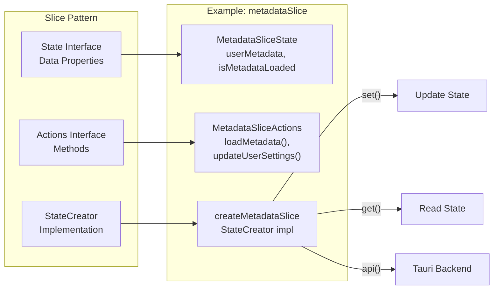

# 상태 관리

<details>
<summary>관련 소스 파일</summary>

다음 파일들은 이 위키 페이지를 생성하기 위한 컨텍스트로 사용되었습니다.

- [src-tauri/src/commands/mod.rs](src-tauri/src/commands/mod.rs)
- [src-tauri/src/lib.rs](src-tauri/src/lib.rs)
- [src-tauri/src/models.rs](src-tauri/src/models.rs)
- [src/App.tsx](src/App.tsx)
- [src/components/MessageViewer.tsx](src/components/MessageViewer.tsx)
- [src/components/ProjectTree.tsx](src/components/ProjectTree.tsx)
- [src/components/SettingsManager/sections/CustomDirectoriesSection.tsx](src/components/SettingsManager/sections/CustomDirectoriesSection.tsx)
- [src/hooks/index.ts](src/hooks/index.ts)
- [src/store/slices/metadataSlice.ts](src/store/slices/metadataSlice.ts)
- [src/store/slices/providerSlice.ts](src/store/slices/providerSlice.ts)
- [src/store/slices/searchSlice.ts](src/store/slices/searchSlice.ts)
- [src/store/useAppStore.ts](src/store/useAppStore.ts)
- [src/test/ProjectTree.worktree.test.tsx](src/test/ProjectTree.worktree.test.tsx)
- [src/test/metadataSlice.test.ts](src/test/metadataSlice.test.ts)
- [src/types/core/project.ts](src/types/core/project.ts)
- [src/types/index.ts](src/types/index.ts)

</details>


이 문서는 Claude Code History Viewer 애플리케이션 전반에서 사용되는 상태 관리 시스템을 설명합니다. 이 시스템은 Zustand를 기반으로 구축되었으며, 15개의 특화된 도메인 slice에 걸쳐 애플리케이션 상태를 관리하기 위해 모듈식 slice 패턴을 따릅니다.

백엔드 데이터 접근과 명령 실행에 대해서는 [Backend Systems](#5)를 참조하세요. 컴포넌트 수준 사용 패턴에 대해서는 [Core Components](#3)를 참조하세요.

---

## 아키텍처 개요

애플리케이션은 단일 store가 여러 도메인별 slice로 구성되는 **결합된 Zustand store** 패턴을 사용합니다. 각 slice는 애플리케이션 상태의 고유한 영역을 소유하며, 상태 속성과 action 메서드를 모두 노출합니다.

### 결합 Store 패턴

```mermaid
graph TB
    useAppStore["useAppStore<br/>(Combined Store)"]
    
    subgraph "Domain Slices"
        ProjectSlice["projectSlice<br/>Projects & Sessions"]
        MessageSlice["messageSlice<br/>Messages & Pagination"]
        SearchSlice["searchSlice<br/>Search State"]
        AnalyticsSlice["analyticsSlice<br/>View Routing"]
        BoardSlice["boardSlice<br/>Board State"]
        MetadataSlice["metadataSlice<br/>User Preferences"]
        SettingsSlice["settingsSlice<br/>App Settings"]
        GlobalStatsSlice["globalStatsSlice<br/>Global Stats"]
        CaptureModeSlice["captureModeSlice<br/>Capture Mode"]
        FilterSlice["filterSlice<br/>Date Filters"]
        NavigationSlice["navigationSlice<br/>Nav History"]
        WatcherSlice["watcherSlice<br/>File Watcher"]
        NavigatorSlice["navigatorSlice<br/>TOC Panel"]
        ProviderSlice["providerSlice<br/>Multi-Provider"]
        ArchiveSlice["archiveSlice<br/>Archive Mgmt"]
    end
    
    subgraph "Components"
        App["App.tsx"]
        ProjectTree["ProjectTree"]
        SessionBoard["SessionBoard"]
        MessageViewer["MessageViewer"]
        Analytics["AnalyticsDashboard"]
    end
    
    ProjectSlice --> useAppStore
    MessageSlice --> useAppStore
    SearchSlice --> useAppStore
    AnalyticsSlice --> useAppStore
    BoardSlice --> useAppStore
    MetadataSlice --> useAppStore
    SettingsSlice --> useAppStore
    GlobalStatsSlice --> useAppStore
    CaptureModeSlice --> useAppStore
    FilterSlice --> useAppStore
    NavigationSlice --> useAppStore
    WatcherSlice --> useAppStore
    NavigatorSlice --> useAppStore
    ProviderSlice --> useAppStore
    ArchiveSlice --> useAppStore
    
    App --> useAppStore
    ProjectTree --> useAppStore
    SessionBoard --> useAppStore
    MessageViewer --> useAppStore
    Analytics --> useAppStore
```



**출처:** [src/store/useAppStore.ts:1-118](), [src/App.tsx:23-68]()

결합 store는 [src/store/useAppStore.ts:101-117]()에서 모든 slice를 병합해 생성됩니다.

```typescript
export const useAppStore = create<AppStore>()((...args) => ({
  ...createProjectSlice(...args),
  ...createMessageSlice(...args),
  ...createSearchSlice(...args),
  // ... 12 more slices
}));
```

각 컴포넌트는 selector 함수를 통해 필요한 상태와 action에만 접근하여 불필요한 재렌더링을 최소화합니다. 이러한 slice가 구성되는 방식에 대한 자세한 내용은 [Store Architecture](#4.1)를 참조하세요.

---

## Slice 아키텍처

각 slice는 **State Interface**, **Actions Interface**, **Slice Creator**라는 세 가지 주요 부분으로 이루어진 일관된 패턴을 따릅니다.

### Slice 패턴 구조



**출처:** [src/store/slices/metadataSlice.ts:25-86]()

### State Interface 패턴

각 slice는 TypeScript interface로 자신의 상태 구조를 정의합니다. 예를 들어 metadata slice는 [src/store/slices/metadataSlice.ts:25-34]()에서 사용자 환경설정을 정의합니다.

```typescript
export interface MetadataSliceState {
  userMetadata: UserMetadata;
  isMetadataLoaded: boolean;
  isMetadataLoading: boolean;
  metadataError: string | null;
}
```

### Actions Interface 패턴

Action은 상태를 수정하거나 부수 효과를 트리거하는 메서드입니다 [src/store/slices/metadataSlice.ts:40-84]().

```typescript
export interface MetadataSliceActions {
  loadMetadata: () => Promise<void>;
  updateSessionMetadata: (sessionId: string, update: Partial<SessionMetadata>) => Promise<void>;
  updateUserSettings: (update: Partial<UserSettings>) => Promise<void>;
  // ...
}
```

### Slice Creator 패턴

slice creator는 Zustand의 `StateCreator` 타입을 사용하며 `set` 및 `get` 함수를 받습니다 [src/store/slices/metadataSlice.ts:103-108]().

```typescript
export const createMetadataSlice: StateCreator<
  FullAppStore,
  [],
  [],
  MetadataSlice
> = (set, get) => ({
  ...initialMetadataState,
  // ... action implementations
});
```

전체 15개 slice와 각각의 책임 목록은 [State Slices](#4.2)를 참조하세요.

---

## 상태 Slice 개요

### Project 및 Provider 관리
이 시스템은 여러 AI provider(Claude Code, Aider, Cline 등)를 지원하며, 각 provider의 데이터를 통합된 project tree로 집계합니다.
- **Project Slice**: project와 session의 계층 구조를 관리합니다 [src/store/useAppStore.ts:10-12]().
- **Provider Slice**: 시스템에서 활성화되고 감지된 provider를 추적합니다 [src/store/useAppStore.ts:62-64]().

### 콘텐츠 및 검색
- **Message Slice**: 대화 message의 로딩과 pagination을 처리합니다 [src/store/useAppStore.ts:14-16]().
- **Search Slice**: 전역 및 session 수준 검색 상태를 관리합니다 [src/store/useAppStore.ts:18-20]().

### Metadata 및 Settings
- **Metadata Slice**: session 이름, star, 숨겨진 project 같은 사용자 정의 데이터를 관리합니다 [src/store/slices/metadataSlice.ts:1-7]().
- **Settings Slice**: provider별 구성 파일을 관리하기 위해 백엔드와 상호작용합니다 [src/store/useAppStore.ts:26-28]().

각 slice에 대한 자세한 문서는 [State Slices](#4.2)를 참조하세요.

---

## 상태 접근 패턴

### 직접 접근 패턴

컴포넌트는 store에서 필요한 상태와 action을 구조 분해합니다 [src/App.tsx:24-68]().

```typescript
const {
  projects,
  sessions,
  selectedProject,
  updateUserSettings,
  getEffectiveGroupingMode,
  // ... more destructured items
} = useAppStore();
```

### 계산된 속성

일부 slice는 action 메서드 내부 로직이나 전용 getter 함수를 통해 계산된 속성을 노출합니다 [src/store/slices/metadataSlice.ts:57-63]().

```typescript
// Example usage in App.tsx
const groupingMode = getEffectiveGroupingMode();
const { groups: worktreeGroups } = getGroupedProjects();
```

**출처:** [src/App.tsx:163-165](), [src/store/slices/metadataSlice.ts:209-216]()

---

## 백엔드 통합

상태 slice는 Tauri의 IPC 메커니즘을 통해 Rust 백엔드와 통합됩니다.

### 명령 호출 흐름

```mermaid
sequenceDiagram
    participant Component
    participant Store["useAppStore<br/>(Zustand)"]
    participant Action["Slice Action<br/>(e.g., loadMetadata)"]
    participant API["api.ts"]
    participant Backend["Rust Backend<br/>(commands)"]
    participant FileSystem["File System"]
    
    Component->>Store: "useAppStore()"
    Store-->>Component: "{ loadMetadata, ... }"
    Component->>Action: "loadMetadata()"
    Action->>Action: "set({ isMetadataLoading: true })"
    Action->>API: "api('load_user_metadata')"
    API->>Backend: "IPC: load_user_metadata"
    Backend->>FileSystem: "Read user-data.json"
    FileSystem-->>Backend: "JSON Data"
    Backend-->>API: "UserMetadata"
    API-->>Action: "UserMetadata object"
    Action->>Action: "set({ userMetadata, isMetadataLoaded: true })"
    Action-->>Component: "State updated"
```

**출처:** [src/store/slices/metadataSlice.ts:111-130](), [src-tauri/src/lib.rs:141-146]()

### 일반적인 백엔드 명령

| Slice | Action | Tauri Command | Backend File |
|-------|--------|---------------|--------------|
| metadataSlice | `loadMetadata()` | `load_user_metadata` | [src-tauri/src/lib.rs:142]() |
| projectSlice | `scanProjects()` | `scan_all_projects` | [src-tauri/src/lib.rs:186]() |
| messageSlice | `selectSession()` | `load_provider_messages` | [src-tauri/src/lib.rs:188]() |
| settingsSlice | `loadSettings()` | `get_all_settings` | [src-tauri/src/lib.rs:167]() |

---

## 데이터 모델

상태 관리 시스템은 Rust 백엔드와 TypeScript 프론트엔드 사이의 간극을 연결하는 통합 데이터 모델 집합에 의존합니다.

- **Frontend Types**: `src/types/`에 위치하며, 상태 속성의 구조를 정의합니다 [src/types/index.ts:1-271]().
- **Backend Models**: `src-tauri/src/models/`에 위치하며, Rust에서 사용되는 직렬화 가능한 구조를 정의합니다 [src-tauri/src/models.rs:1-20]().

이러한 구조의 전체 분석은 [Data Models](#4.3)를 참조하세요.
