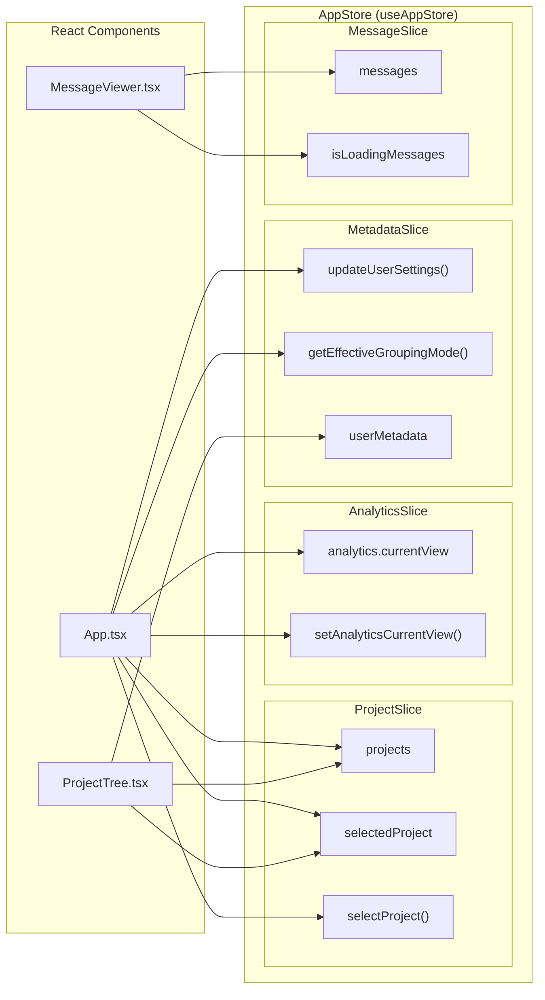

# Store 아키텍처

<details>
<summary>관련 소스 파일</summary>

다음 파일들은 이 위키 페이지를 생성하기 위한 컨텍스트로 사용되었습니다.

- [src-tauri/src/commands/mod.rs](src-tauri/src/commands/mod.rs)
- [src-tauri/src/lib.rs](src-tauri/src/lib.rs)
- [src-tauri/src/models.rs](src-tauri/src/models.rs)
- [src/App.tsx](src/App.tsx)
- [src/components/MessageViewer.tsx](src/components/MessageViewer.tsx)
- [src/components/ProjectTree.tsx](src/components/ProjectTree.tsx)
- [src/components/SettingsManager/sections/CustomDirectoriesSection.tsx](src/components/SettingsManager/sections/CustomDirectoriesSection.tsx)
- [src/hooks/index.ts](src/hooks/index.ts)
- [src/store/slices/metadataSlice.ts](src/store/slices/metadataSlice.ts)
- [src/store/slices/providerSlice.ts](src/store/slices/providerSlice.ts)
- [src/store/slices/searchSlice.ts](src/store/slices/searchSlice.ts)
- [src/store/useAppStore.ts](src/store/useAppStore.ts)
- [src/test/ProjectTree.worktree.test.tsx](src/test/ProjectTree.worktree.test.tsx)
- [src/test/metadataSlice.test.ts](src/test/metadataSlice.test.ts)
- [src/types/core/project.ts](src/types/core/project.ts)
- [src/types/index.ts](src/types/index.ts)

</details>


이 페이지는 `useAppStore`가 조합 가능한 slice 모듈로부터 어떻게 구성되는지, 각 slice가 충족해야 하는 타입 계약, 그리고 컴포넌트가 상태를 읽고 쓰는 데 사용하는 접근 패턴을 설명합니다.

---

## 개요

모든 프론트엔드 애플리케이션 상태는 [src/store/useAppStore.ts:101-117]()에서 `useAppStore`로 export되는 단일 Zustand store에 보관됩니다. store는 생성 시점에 15개의 독립적인 *slice creator*를 하나의 객체로 펼쳐 조립됩니다. 각 slice는 고유한 상태 도메인을 소유하며, 상태 형태와 action 함수 집합을 모두 선언합니다.

slice는 별도의 store가 아닙니다. 하나의 Zustand atom을 공유하므로, 모든 slice action은 `StateCreator` 패턴이 제공하는 공유 `get()` 및 `set()` 클로저를 통해 다른 slice의 상태를 읽거나 변경할 수 있습니다.

출처: [src/store/useAppStore.ts:1-6](), [src/store/useAppStore.ts:101-117]()

---

## 결합 Store 타입

export되는 `AppStore` 타입은 모든 slice 타입의 평면 교차 타입입니다.

[src/store/useAppStore.ts:81-95]()

```typescript
export type AppStore = ProjectSlice &
  MessageSlice &
  SearchSlice &
  AnalyticsSlice &
  SettingsSlice &
  GlobalStatsSlice &
  MetadataSlice &
  CaptureModeSlice &
  BoardSlice &
  FilterSlice &
  NavigationSlice &
  WatcherSlice &
  NavigatorSlice &
  ProviderSlice &
  ArchiveSlice;
```

각 `*Slice` 타입은 일반적으로 해당 slice 파일 안에 정의된 상태 interface(예: `MetadataSliceState`)와 actions interface(예: `MetadataSliceActions`)의 교차 타입입니다.

출처: [src/store/useAppStore.ts:81-95](), [src/store/slices/metadataSlice.ts:25-86]()

---

## Slice 목록

아래 표는 store 생성 중 펼쳐지는 순서대로 모든 slice를 나열합니다.

| Slice Type | Creator Function | Source File |
|---|---|---|
| `ProjectSlice` | `createProjectSlice` | `src/store/slices/projectSlice.ts` |
| `MessageSlice` | `createMessageSlice` | `src/store/slices/messageSlice.ts` |
| `SearchSlice` | `createSearchSlice` | `src/store/slices/searchSlice.ts` |
| `AnalyticsSlice` | `createAnalyticsSlice` | `src/store/slices/analyticsSlice.ts` |
| `SettingsSlice` | `createSettingsSlice` | `src/store/slices/settingsSlice.ts` |
| `GlobalStatsSlice` | `createGlobalStatsSlice` | `src/store/slices/globalStatsSlice.ts` |
| `MetadataSlice` | `createMetadataSlice` | `src/store/slices/metadataSlice.ts` |
| `CaptureModeSlice` | `createCaptureModeSlice` | `src/store/slices/captureModeSlice.ts` |
| `BoardSlice` | `createBoardSlice` | `src/store/slices/boardSlice.ts` |
| `FilterSlice` | `createFilterSlice` | `src/store/slices/filterSlice.ts` |
| `NavigationSlice` | `createNavigationSlice` | `src/store/slices/navigationSlice.ts` |
| `WatcherSlice` | `createWatcherSlice` | `src/store/slices/watcherSlice.ts` |
| `NavigatorSlice` | `createNavigatorSlice` | `src/store/slices/navigatorSlice.ts` |
| `ProviderSlice` | `createProviderSlice` | `src/store/slices/providerSlice.ts` |
| `ArchiveSlice` | `createArchiveSlice` | `src/store/slices/archiveSlice.ts` |

출처: [src/store/useAppStore.ts:10-68](), [src/store/useAppStore.ts:101-117]()

---

## Store 구성 다이어그램

아래 다이어그램은 개별 코드 엔터티로부터 모듈 수준에서 store가 어떻게 조립되는지 보여줍니다.

**Store 구성: slice creator → AppStore**

```mermaid
graph TD
  subgraph "useAppStore.ts"
    AS["useAppStore (Zustand)"]
  end

  subgraph "Slice creators (store/slices/)"
    S1["createProjectSlice"]
    S2["createMessageSlice"]
    S3["createSearchSlice"]
    S4["createAnalyticsSlice"]
    S5["createSettingsSlice"]
    S6["createGlobalStatsSlice"]
    S7["createMetadataSlice"]
    S8["createCaptureModeSlice"]
    S9["createBoardSlice"]
    S10["createFilterSlice"]
    S11["createNavigationSlice"]
    S12["createWatcherSlice"]
    S13["createNavigatorSlice"]
    S14["createProviderSlice"]
    S15["createArchiveSlice"]
  end

  S1 --> AS
  S2 --> AS
  S3 --> AS
  S4 --> AS
  S5 --> AS
  S6 --> AS
  S7 --> AS
  S8 --> AS
  S9 --> AS
  S10 --> AS
  S11 --> AS
  S12 --> AS
  S13 --> AS
  S14 --> AS
  S15 --> AS
```



출처: [src/store/useAppStore.ts:101-117]()

---

## Slice 내부 구조

각 slice 파일은 상태와 action이 병합되는 일관된 내부 레이아웃을 따릅니다. `FullAppStore` 타입(대개 `./slices/types`에서 import됨)을 통해 각 slice는 creator의 `get()` 매개변수로 전체 store 상태에 접근할 수 있습니다.

**Slice 구조 패턴(예: MetadataSlice)**

```mermaid
classDiagram
  class "MetadataSliceState" {
    +userMetadata: UserMetadata
    +isMetadataLoaded: boolean
    +isMetadataLoading: boolean
    +metadataError: string | null
  }
  class "MetadataSliceActions" {
    +loadMetadata() Promise~void~
    +saveMetadata() Promise~void~
    +updateSessionMetadata(sessionId, update) Promise~void~
    +updateUserSettings(update) Promise~void~
  }
  class "MetadataSlice" {
  }
  class "createMetadataSlice" {
    <<StateCreator>>
    +set: SetState~FullAppStore~
    +get: GetState~FullAppStore~
  }

  "MetadataSliceState" <|-- "MetadataSlice"
  "MetadataSliceActions" <|-- "MetadataSlice"
  "createMetadataSlice" ..> "MetadataSlice" : returns
```

출처: [src/store/slices/metadataSlice.ts:25-86](), [src/store/slices/metadataSlice.ts:103-108]()

---

## 컴포넌트의 Store 접근 패턴

컴포넌트는 `useAppStore` hook을 사용해 store에 접근합니다.

### 1. 구조 분해된 hook(전체 상태 읽기)

메인 `App.tsx` 컴포넌트는 일반적으로 레이아웃과 초기화 로직을 구동하기 위해 많은 상태 변수와 action을 hook에서 직접 구조 분해합니다.

[src/App.tsx:24-68]()

```typescript
const {
  projects,
  sessions,
  selectedProject,
  selectedSession,
  selectProject,
  selectSession,
  updateUserSettings,
  getEffectiveGroupingMode,
  // ...
} = useAppStore();
```

### 2. 직접 상태 접근(React 외부)

`useAppStore.getState()`는 event handler 내부나 async 작업 중 현재 상태를 비교해 closure staleness를 피해야 하는 경우처럼 명령형 읽기에 사용됩니다.

[src/App.tsx:185](), [src/App.tsx:220](), [src/App.tsx:227]()

```typescript
const currentProject = useAppStore.getState().selectedProject;
const activeView = useAppStore.getState().analytics.currentView;
```

---

## Component-Store 연결 다이어그램

아래 다이어그램은 주요 UI 컴포넌트를 이들이 사용하는 store 필드와 action에 매핑하여, UI 공간을 store의 코드 엔터티와 연결합니다.

**컴포넌트와 store 접근**



출처: [src/App.tsx:24-68](), [src/App.tsx:163-177](), [src/App.tsx:185-199](), [src/test/ProjectTree.worktree.test.tsx:17-37]()

---

## 재export된 타입

`useAppStore.ts`는 깊은 import를 피할 수 있도록 slice 정의에서 자주 쓰는 검색 관련 타입을 편의상 재export합니다.

[src/store/useAppStore.ts:71-75]()

```typescript
export type {
  SearchMatch,
  SearchFilterType,
  SearchState,
} from "./slices/types";
```

출처: [src/store/useAppStore.ts:71-75]()
