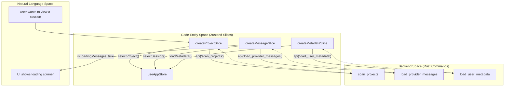
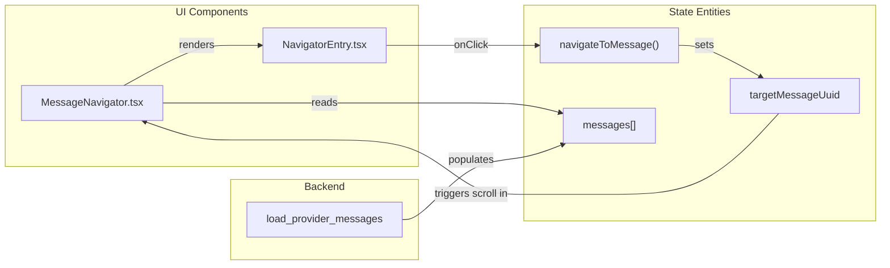

# 상태 Slice

관련 소스 파일

다음 파일들은 이 위키 페이지를 생성하기 위한 컨텍스트로 사용되었습니다.

- [src-tauri/benches/performance.rs](src-tauri/benches/performance.rs)
- [src-tauri/src/commands/project.rs](src-tauri/src/commands/project.rs)
- [src-tauri/src/commands/stats.rs](src-tauri/src/commands/stats.rs)
- [src/components/AnalyticsDashboard/utils/projectCalculations.ts](src/components/AnalyticsDashboard/utils/projectCalculations.ts)
- [src/components/ArchiveManager/ArchiveBrowser.tsx](src/components/ArchiveManager/ArchiveBrowser.tsx)
- [src/components/ArchiveManager/ArchiveOverview.tsx](src/components/ArchiveManager/ArchiveOverview.tsx)
- [src/components/MessageNavigator/MessageNavigator.tsx](src/components/MessageNavigator/MessageNavigator.tsx)
- [src/components/MessageViewer/MessageViewer.tsx](src/components/MessageViewer/MessageViewer.tsx)
- [src/components/SettingsManager/sections/CustomDirectoriesSection.tsx](src/components/SettingsManager/sections/CustomDirectoriesSection.tsx)
- [src/hooks/useAnalytics.ts](src/hooks/useAnalytics.ts)
- [src/hooks/useProjectSessions.ts](src/hooks/useProjectSessions.ts)
- [src/i18n/locales/en/message.json](src/i18n/locales/en/message.json)
- [src/i18n/locales/ja/message.json](src/i18n/locales/ja/message.json)
- [src/i18n/locales/ko/message.json](src/i18n/locales/ko/message.json)
- [src/i18n/locales/zh-CN/message.json](src/i18n/locales/zh-CN/message.json)
- [src/i18n/locales/zh-TW/message.json](src/i18n/locales/zh-TW/message.json)
- [src/services/analyticsApi.ts](src/services/analyticsApi.ts)
- [src/store/slices/archiveSlice.ts](src/store/slices/archiveSlice.ts)
- [src/store/slices/filterSlice.ts](src/store/slices/filterSlice.ts)
- [src/store/slices/globalStatsSlice.ts](src/store/slices/globalStatsSlice.ts)
- [src/store/slices/messageSlice.ts](src/store/slices/messageSlice.ts)
- [src/store/slices/metadataSlice.ts](src/store/slices/metadataSlice.ts)
- [src/store/slices/projectSlice.ts](src/store/slices/projectSlice.ts)
- [src/store/slices/providerSlice.ts](src/store/slices/providerSlice.ts)
- [src/store/slices/searchSlice.ts](src/store/slices/searchSlice.ts)
- [src/store/slices/types.ts](src/store/slices/types.ts)
- [src/test/ArchiveBrowser.test.tsx](src/test/ArchiveBrowser.test.tsx)
- [src/test/MessageNavigator.accessibility.test.tsx](src/test/MessageNavigator.accessibility.test.tsx)
- [src/test/archiveSlice.test.ts](src/test/archiveSlice.test.ts)
- [src/test/globalStatsSlice.test.ts](src/test/globalStatsSlice.test.ts)
- [src/test/metadataSlice.test.ts](src/test/metadataSlice.test.ts)
- [src/test/projectCalculations.test.ts](src/test/projectCalculations.test.ts)
- [src/test/useProjectSessions.test.tsx](src/test/useProjectSessions.test.tsx)

이 페이지는 애플리케이션의 Zustand store를 구성하는 개별 도메인 slice를 문서화합니다. 각 slice는 전용 상태 속성과 action으로 애플리케이션 상태의 특정 도메인을 관리합니다. 전체 store 아키텍처와 slice 패턴에 대한 정보는 [4.1 Store Architecture]()를 참조하세요.

---

## 개요

애플리케이션은 상태 관리를 구성하기 위해 **slice pattern**을 사용합니다. 각 slice는 상태 속성을 정의하고, 해당 상태를 수정하는 action을 노출하며, `api` 서비스를 통해 Tauri 백엔드 명령과의 통신을 처리하는 독립적인 모듈입니다.

모든 slice는 `useAppStore.ts`에서 Zustand의 composition pattern을 사용해 단일 store로 결합됩니다.

**출처:** [src/store/slices/types.ts:95-188](), [src/store/slices/projectSlice.ts:112-117]()

---

## Slice 아키텍처 패턴

다음 다이어그램은 "App State"라는 자연어 개념을 Zustand store에서 사용되는 특정 코드 엔터티와 연결합니다.

Title: State Slice Composition and Data Flow

**패턴 세부 사항:**
각 slice는 타입 안전성을 보장하고 순환 의존성을 방지하기 위해 엄격한 구조를 따릅니다.
1.  **State Interface**: 타입이 지정된 상태 속성을 정의합니다.
2.  **Actions Interface**: async/sync action 메서드를 정의합니다.
3.  **Combined Type**: 상태와 action의 합집합입니다(예: `ProjectSlice = ProjectSliceState & ProjectSliceActions`).
4.  **Creator Function**: 초기 상태와 action 구현을 반환하는 `StateCreator<FullAppStore, ...>`입니다 [src/store/slices/projectSlice.ts:112-117]().

**출처:** [src/store/slices/projectSlice.ts:28-54](), [src/store/slices/messageSlice.ts:45-82](), [src/store/slices/types.ts:63-69]()

---

## 핵심 데이터 Slice

### ProjectSlice
여러 provider에 걸친 project discovery와 folder scanning을 관리합니다.

**상태 구조:**
| Property | Type | Purpose |
|----------|------|---------|
| `claudePath` | `string` | provider 데이터의 기본 경로 [src/store/slices/projectSlice.ts:29]() |
| `projects` | `ClaudeProject[]` | scan된 모든 project 목록 [src/store/slices/projectSlice.ts:30]() |
| `selectedProject` | `ClaudeProject \| null` | 현재 활성 project [src/store/slices/projectSlice.ts:31]() |
| `sessions` | `ClaudeSession[]` | 선택된 project에 속한 session [src/store/slices/projectSlice.ts:32]() |

**주요 Action:**
*   `scanProjects()`: 사용 가능한 모든 provider에 대해 백엔드 scan을 트리거합니다. 즉각적인 클라이언트 측 tab 전환을 가능하게 하려고 모든 provider의 project를 의도적으로 로드합니다 [src/store/slices/projectSlice.ts:190-201]().
*   `selectProject(project)`: 선택된 project를 업데이트하고 `load_project_sessions`를 통해 session 로딩을 트리거합니다 [src/store/slices/projectSlice.ts:221-233]().
*   `getGroupedProjects()`: `detectWorktreeGroupsHybrid`를 활용해 Git worktree별로 project를 구성합니다 [src/store/slices/projectSlice.ts:49]().

**출처:** [src/store/slices/projectSlice.ts:28-54](), [src/store/slices/projectSlice.ts:190-233]()

### MessageSlice
message 로딩, pagination, session 수준 token analytics를 처리합니다.

**상태 구조:**
| Property | Type | Purpose |
|----------|------|---------|
| `messages` | `ClaudeMessage[]` | 선택된 session의 message [src/store/slices/messageSlice.ts:46]() |
| `isLoadingMessages` | `boolean` | message fetch 상태 [src/store/slices/messageSlice.ts:48]() |
| `sessionTokenStats` | `SessionTokenStats \| null` | 현재 session의 token 사용량 [src/store/slices/messageSlice.ts:50]() |
| `parentSessionStack` | `ClaudeSession[]` | SubAgent navigation을 위한 stack [src/store/slices/messageSlice.ts:59]() |

**주요 Action:**
*   `selectSession(session)`: `load_provider_messages`를 통해 message를 가져오고, sidechain/system filter를 적용하며, search index를 초기화합니다 [src/store/slices/messageSlice.ts:164-200]().
*   `navigateToSubagent(subagent)`: 현재 session을 `parentSessionStack`에 push하고 subagent의 conversation을 로드합니다 [src/store/slices/messageSlice.ts:78]().

**출처:** [src/store/slices/messageSlice.ts:45-82](), [src/store/slices/messageSlice.ts:164-200]()

---

## 유틸리티 및 Navigation Slice

### SearchSlice & FilterSlice
"KakaoTalk-style" 검색과 message visibility를 관리합니다.
*   **SearchSlice**: `matches`(UUID 및 index)와 `currentMatchIndex`를 포함한 `sessionSearch`를 추적합니다 [src/store/slices/types.ts:49-57]().
*   **FilterSlice**: role(user/assistant)과 content type(text/thinking/toolCalls/commands)에 대한 `messageFilter`를 관리합니다 [src/components/MessageViewer/MessageViewer.tsx:89-92]().

### MetadataSlice
`user-data.json`에 저장되는 사용자 정의 metadata(rename, hidden projects)를 관리합니다.
*   **Actions**: `updateSessionMetadata`는 session의 custom renaming을 허용하며, 이는 백엔드 `update_session_metadata` 명령을 통해 유지됩니다 [src/store/slices/metadataSlice.ts:143-164]().
*   **Custom Paths**: 표준이 아닌 directory에 history를 저장하는 사용자를 위해 `customClaudePaths`를 관리합니다 [src/store/slices/metadataSlice.ts:72-77]().

### GlobalStatsSlice
모든 project에 걸쳐 token 사용량과 activity를 집계합니다.
*   **State**: `globalSummary`(billing total)와 `globalConversationSummary`(conversation only) [src/store/slices/globalStatsSlice.ts:21-22]().
*   **Logic**: `scanProjects`와 달리, aggregation은 비용이 크기 때문에 `loadGlobalStats`는 server side에서 `activeProviders`로 filter합니다 [src/store/slices/globalStatsSlice.ts:55-58]().

**출처:** [src/store/slices/globalStatsSlice.ts:20-31](), [src/store/slices/metadataSlice.ts:40-84]()

---

## 상태 매핑: Message Navigation
이 다이어그램은 `MessageNavigator` UI와 `MessageSlice` / `NavigationSlice` 상태 사이의 상호작용을 매핑합니다.

Title: Message Navigator Code Entity Mapping

**출처:** [src/components/MessageNavigator/MessageNavigator.tsx:42-45](), [src/store/slices/types.ts:177-198]()

---

## 백엔드 명령 매핑
Zustand slice action과 그에 대응하는 Rust 백엔드 엔터티의 매핑입니다.

| Slice Action | Rust Command / Entity | Implementation Reference |
|--------------|-----------------------|--------------------------|
| `scanProjects` | `scan_projects` | [src-tauri/src/commands/project.rs:159]() |
| `loadGlobalStats` | `stats.rs` logic | [src-tauri/src/commands/stats.rs:208-241]() |
| `selectSession` | `load_provider_messages` | [src/store/slices/messageSlice.ts:192]() |
| `saveMetadata` | `save_user_metadata` | [src/store/slices/metadataSlice.ts:132]() |
| `getGitLog` | `get_git_log` | [src-tauri/src/commands/project.rs:12]() |

**출처:** [src/store/slices/projectSlice.ts:190](), [src/store/slices/messageSlice.ts:192](), [src/store/slices/metadataSlice.ts:132](), [src-tauri/src/commands/stats.rs:208-241]()
