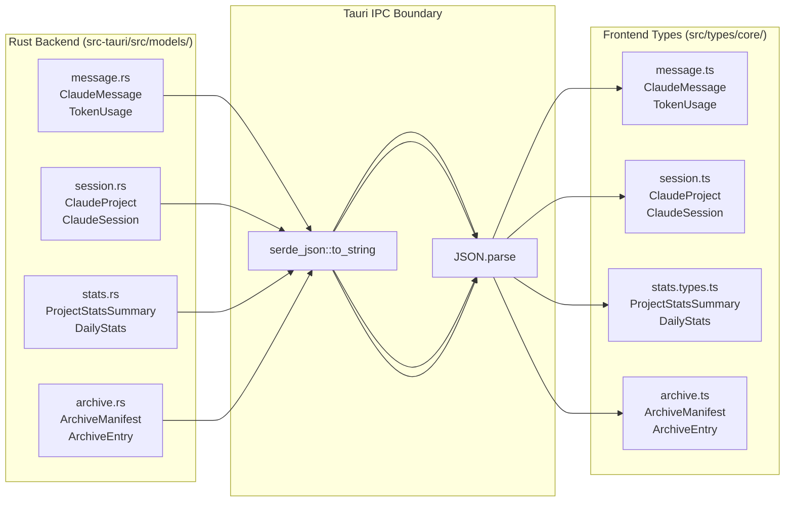
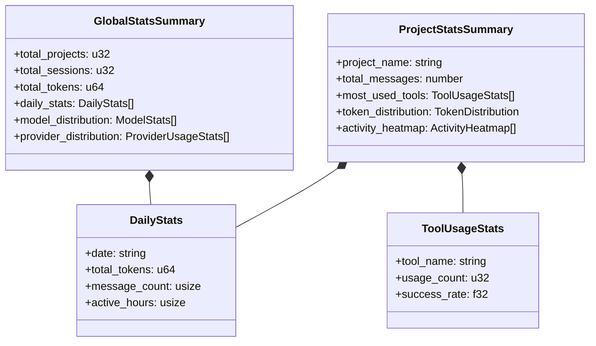

# 데이터 모델

관련 소스 파일

다음 파일들은 이 위키 페이지를 생성하기 위한 컨텍스트로 사용되었습니다.

- [src-tauri/src/commands/archive.rs](src-tauri/src/commands/archive.rs)
- [src-tauri/src/commands/session/load.rs](src-tauri/src/commands/session/load.rs)
- [src-tauri/src/models/metadata.rs](src-tauri/src/models/metadata.rs)
- [src-tauri/src/models/session.rs](src-tauri/src/models/session.rs)
- [src-tauri/src/models/snapshot_tests.rs](src-tauri/src/models/snapshot_tests.rs)
- [src-tauri/src/models/snapshots/claude_code_history_viewer_lib__models__snapshot_tests__session_snapshots__claude_session.snap](src-tauri/src/models/snapshots/claude_code_history_viewer_lib__models__snapshot_tests__session_snapshots__claude_session.snap)
- [src-tauri/src/models/stats.rs](src-tauri/src/models/stats.rs)
- [src/components/MessageViewer/helpers/agentTaskHelpers.ts](src/components/MessageViewer/helpers/agentTaskHelpers.ts)
- [src/components/contentRenderer/ContainerUploadRenderer.tsx](src/components/contentRenderer/ContainerUploadRenderer.tsx)
- [src/components/contentRenderer/index.ts](src/components/contentRenderer/index.ts)
- [src/store/slices/analyticsSlice.ts](src/store/slices/analyticsSlice.ts)
- [src/types/content.types.ts](src/types/content.types.ts)
- [src/types/core/content.ts](src/types/core/content.ts)
- [src/types/core/session.ts](src/types/core/session.ts)
- [src/types/core/tool.ts](src/types/core/tool.ts)
- [src/types/message.types.ts](src/types/message.types.ts)
- [src/types/stats.types.ts](src/types/stats.types.ts)
- [src/types/tool.types.ts](src/types/tool.types.ts)
- [src/utils/contentTypeGuards.ts](src/utils/contentTypeGuards.ts)

이 페이지는 Claude Code History Viewer 전반에서 사용되는 핵심 데이터 모델을 문서화합니다. 이 모델들은 provider 파일 시스템에서 Rust 백엔드를 거쳐 React 프론트엔드로 데이터가 흐를 때의 데이터 구조를 정의합니다.

이 모델들이 애플리케이션을 통과하는 방식은 2.4 페이지(Data Flow)를 참조하세요. 런타임에 이 모델들을 보관하는 상태 slice는 4.2 페이지(State Slices)를 참조하세요.

## 개요

애플리케이션은 여러 provider(Claude Code, Codex CLI, OpenCode, Gemini CLI, Cline, Cursor, Aider)를 지원합니다. 모든 provider는 데이터를 공유 Rust struct 집합으로 정규화하며, 이 struct들은 Tauri IPC 경계를 넘어 프론트엔드의 동등한 TypeScript 타입으로 직렬화됩니다.

모델 계층:

1.  **Provider별 원시 데이터** — disk의 JSONL line, SQLite database 또는 JSON file이며 provider마다 다릅니다.
2.  **Core Rust structs** — `ClaudeProject`, `ClaudeSession`, `ClaudeMessage`, `TokenUsage`, `GitInfo`이며 `src-tauri/src/models/`에 정의됩니다.
3.  **Frontend TypeScript types** — Rust struct를 mirror하며 `src/types/core/`에 정의됩니다.
4.  **UI-augmented types** — core type 위에 구축된 `MessageNode`, `BoardSessionData`, analytics view입니다.
5.  **Statistics models** — `SessionTokenStats`, `ProjectStatsSummary` 등입니다.
6.  **Archive models** — 장기 session storage를 위한 `ArchiveManifest`, `ArchiveEntry`입니다.

**Rust model module layout:**

`src-tauri/src/models/` directory는 백엔드 데이터 구조의 source of truth를 포함합니다.

| Submodule | Contents |
| :--- | :--- |
| `models/message.rs` | `ClaudeMessage`, `TokenUsage`, `RawLogEntry`, `MessageContent` |
| `models/session.rs` | `ClaudeSession`, `ClaudeProject`, `GitInfo`, `GitCommit`, `GitWorktreeType` |
| `models/metadata.rs` | `UserMetadata`, `SessionMetadata`, `ProjectMetadata`, `UserSettings` |
| `models/stats.rs` | `SessionTokenStats`, `ProjectStatsSummary`, `DailyStats`, `ToolUsageStats`, `GlobalStatsSummary` |

출처: [src-tauri/src/models/session.rs:1-81](), [src-tauri/src/models/stats.rs:1-131](), [src-tauri/src/models/metadata.rs:1-32]()

**Rust-to-TypeScript model mapping:**

Title: Model Serialization Bridge

출처: [src-tauri/src/models/session.rs:26-72](), [src/types/core/session.ts:45-83](), [src-tauri/src/commands/archive.rs:32-63]()

## 핵심 데이터 모델

### `ClaudeProject`

하나 이상의 session을 포함하는 project directory를 나타냅니다. local Claude Code directory와 virtual provider path 사이의 차이를 추상화합니다.

| Field | Type (Rust/TS) | Description |
| :--- | :--- | :--- |
| `name` | `String` / `string` | project의 표시 이름입니다. |
| `path` | `String` / `string` | 내부 storage path입니다(예: `codex://path` 또는 `~/.claude/projects/...`). |
| `actual_path` | `String` / `string` | decode된 실제 filesystem path입니다. |
| `session_count` | `usize` / `number` | 발견된 전체 session 수입니다. |
| `message_count` | `usize` / `number` | 전체 message 수입니다(성능을 위해 추정되는 경우가 많음). |
| `git_info` | `Option<GitInfo>` | Git worktree metadata입니다. |
| `provider` | `Option<String>` | `claude`, `codex`, `opencode`, `aider`, `cline`, `cursor`, `gemini`. |
| `custom_directory_label`| `Option<String>` | custom Claude directory source를 위한 label입니다. |

출처: [src-tauri/src/models/session.rs:27-48](), [src/types/core/session.ts:45-62]()

### `ClaudeSession`

단일 conversation session을 나타냅니다.

| Field | Type (Rust/TS) | Description |
| :--- | :--- | :--- |
| `session_id` | `String` / `string` | 일반적으로 file path에서 파생되는 unique ID입니다. |
| `actual_session_id` | `String` / `string` | conversation data 내부에서 발견되는 UUID입니다. |
| `file_path` | `String` / `string` | source file(JSONL/JSON/SQLite)의 전체 path입니다. |
| `has_tool_use` | `bool` / `boolean` | tool이 실행되었는지 나타내는 flag입니다. |
| `summary` | `Option<String>` | AI가 생성했거나 파생된 session title입니다. |
| `is_renamed` | `bool` / `boolean` | session이 `/rename` command를 통해 rename되었는지 여부입니다. |

출처: [src-tauri/src/models/session.rs:51-72](), [src/types/core/session.ts:64-83]()

### `ClaudeMessage`

conversation의 기본 단위입니다. text, tool call, tool result를 포함한 여러 content type을 지원합니다.

| Field | Type (Rust/TS) | Description |
| :--- | :--- | :--- |
| `uuid` | `String` / `string` | unique message ID입니다. |
| `parent_uuid` | `Option<String>` | conversation threading을 위한 참조입니다. |
| `message_type` | `String` / `string` | `user`, `assistant`, `system`, `summary`, `progress`, `file-history-snapshot`. |
| `content` | `Option<Value>` | message body입니다(string 또는 `ContentItem[]`). |
| `usage` | `Option<TokenUsage>` | token consumption metric입니다. |
| `cost_usd` | `Option<f64>` | USD 기준 추정 비용입니다(2025 metric). |
| `duration_ms` | `Option<u64>` | turn에 대한 performance metric입니다. |

출처: [src-tauri/src/models/snapshot_tests.rs:18-51](), [src/types/message.types.ts:157-240]()

### `TokenUsage`

token consumption의 상세 breakdown입니다.

| Field | Type (Rust/TS) | Description |
| :--- | :--- | :--- |
| `input_tokens` | `u32` / `number` | 표준 input token입니다. |
| `output_tokens` | `u32` / `number` | 생성된 output token입니다. |
| `cache_creation_input_tokens` | `u32` / `number` | prompt cache에 기록된 token입니다. |
| `cache_read_input_tokens` | `u32` / `number` | prompt cache에서 읽은 token입니다. |

출처: [src-tauri/src/models/snapshot_tests.rs:169-175](), [src/types/message.types.ts:104-110]()

## Analytics 및 Statistics 모델

`stats.rs` module은 집계 데이터용 구조를 정의합니다.

Title: Analytics Data Hierarchy

출처: [src-tauri/src/models/stats.rs:48-131](), [src/types/stats.types.ts:100-171]()

## 사용자 Metadata 모델

애플리케이션은 사용자별 customization을 `~/.claude-history-viewer/user-data.json`에 저장합니다.

*   **`UserMetadata`**: `sessions`, `projects`, 전역 `settings`용 map을 포함하는 root structure입니다. [src-tauri/src/models/metadata.rs:14-32]()
*   **`SessionMetadata`**: `custom_name`, `starred` status, `tags`, `notes`를 저장합니다. [src-tauri/src/models/metadata.rs:143-161]()
*   **`ProjectMetadata`**: worktree grouping을 위한 `hidden` flag, `alias`, `parent_project`를 저장합니다. [src-tauri/src/models/metadata.rs:174-188]()
*   **`UserSettings`**: `theme`, `language`, `hidden_patterns`, `mcp_presets` 같은 전역 preference입니다. [src-tauri/src/models/metadata.rs:218-235]()

출처: [src-tauri/src/models/metadata.rs:1-240]()

## Archive 모델

`archive.rs` command module을 통해 관리되는 이 모델들은 session 보존을 처리합니다.

*   **`ArchiveManifest`**: disk에 저장된 모든 archive의 전역 목록입니다. [src-tauri/src/commands/archive.rs:33-38]()
*   **`ArchiveEntry`**: 단일 archive의 metadata(source project, session count, total size)입니다. [src-tauri/src/commands/archive.rs:50-63]()
*   **`ArchiveSessionInfo`**: subagent 정보를 포함하여 archive 내 session file에 대한 상세 metadata입니다. [src-tauri/src/commands/archive.rs:66-80]()

출처: [src-tauri/src/commands/archive.rs:32-109]()

## Git Integration 모델

애플리케이션은 project를 정확히 group하기 위해 git worktree를 감지합니다.

*   **`GitWorktreeType`**: `Main`, `Linked`, `NotGit`을 나타내는 enum입니다. [src-tauri/src/models/session.rs:6-13]()
*   **`GitInfo`**: worktree type과, linked worktree인 경우 main repository의 path를 포함합니다. [src-tauri/src/models/session.rs:17-24]()
*   **`GitCommit`**: `hash`, `author`, `date`, `message`를 포함하는 git log entry용 structure입니다. [src-tauri/src/models/session.rs:75-81]()

## UI 및 Frontend 전용 모델

### `AgentTask` 및 `AgentTaskGroupResult`
여러 message에 걸쳐 있는 비동기 agent operation(`bash` 또는 `mcp` call 등)을 group하는 데 사용됩니다.
*   **`AgentTask`**: `agentId`, `description`, `status`(`completed`|`error`|`async_launched`), `prompt`를 포함합니다. [src/components/MessageViewer/helpers/agentTaskHelpers.ts:74-86]()
*   **`AgentTaskGroupResult`**: 특정 temporal group(일반적으로 2초 window 이내)에 속하는 task collection과 message UUID의 `Set`입니다. [src/components/MessageViewer/helpers/agentTaskHelpers.ts:92-95]()

### Cache 모델
session loading 속도를 높이기 위해 백엔드는 각 project directory 안에서 JSON 기반 cache(`.session_cache.json`)를 사용합니다.
*   **`CachedSessionMetadata`**: JSONL file이 변경되지 않는 한 재parsing을 피하기 위해 file modification time, size, last processed offset, serialized `ClaudeSession`을 저장합니다. [src-tauri/src/commands/session/load.rs:18-45]()
*   **`SessionMetadataCache`**: file path를 metadata entry에 매핑하는 versioned map입니다. [src-tauri/src/commands/session/load.rs:48-54]()

출처: [src-tauri/src/commands/session/load.rs:1-54](), [src/components/MessageViewer/helpers/agentTaskHelpers.ts:1-140]()
