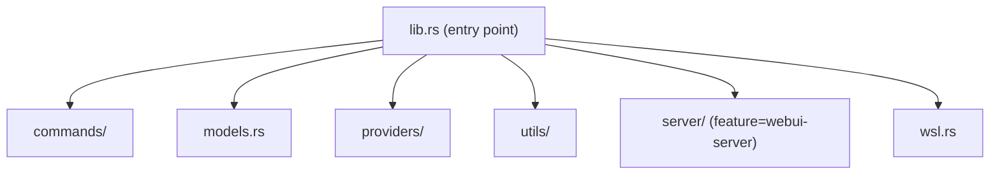
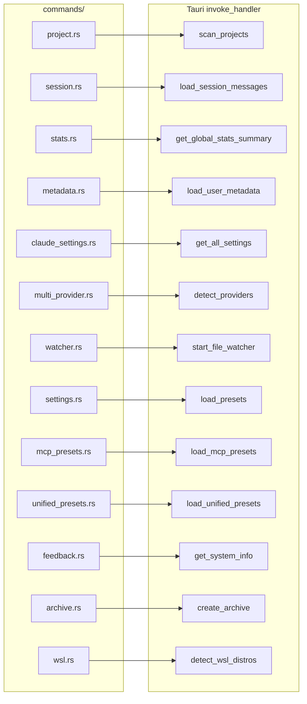
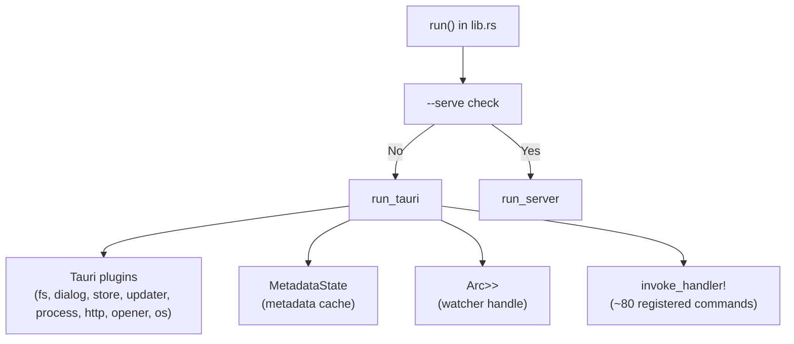
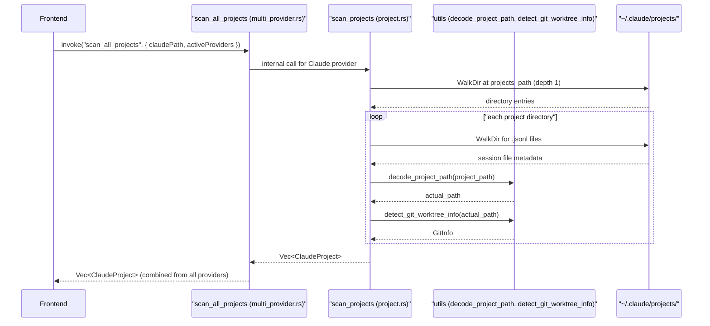

# 백엔드 시스템

관련 소스 파일

다음 파일들은 이 위키 페이지를 생성하기 위한 컨텍스트로 사용되었습니다.

- [src-tauri/src/commands/mod.rs](src-tauri/src/commands/mod.rs)
- [src-tauri/src/lib.rs](src-tauri/src/lib.rs)
- [src-tauri/src/main.rs](src-tauri/src/main.rs)
- [src-tauri/src/models.rs](src-tauri/src/models.rs)
- [src/App.tsx](src/App.tsx)
- [src/components/MessageViewer.tsx](src/components/MessageViewer.tsx)
- [src/components/ProjectTree.tsx](src/components/ProjectTree.tsx)
- [src/hooks/index.ts](src/hooks/index.ts)
- [src/store/useAppStore.ts](src/store/useAppStore.ts)
- [src/test/ProjectTree.worktree.test.tsx](src/test/ProjectTree.worktree.test.tsx)
- [src/types/core/project.ts](src/types/core/project.ts)
- [src/types/index.ts](src/types/index.ts)

이 페이지는 Claude Code History Viewer를 구동하는 Rust 백엔드의 개요를 제공합니다. 전체 모듈 구조, Tauri 명령 등록 표면, 관리되는 애플리케이션 상태, 그리고 명령이 도메인별로 구성되는 방식을 다룹니다. 또한 headless WebUI server mode를 소개합니다.

특정 하위 시스템의 자세한 문서는 다음을 참조하세요.
- [Project and Session Commands](#5.1)
- [Statistics and Analytics](#5.2)
- [Settings Management](#5.3)
- [File Watcher](#5.4)
- [Provider Implementations](#5.5)
- [WebUI Server Mode](#5.6)
- [WSL Support](#5.7)
- IPC 경계와 end-to-end data flow는 [Data Flow](#2.4)를 참조하세요.
- command 결과를 소비하는 프론트엔드 store는 [State Management](#4)를 참조하세요.

---

## 모듈 구조

백엔드는 전부 `src-tauri/src/` 내부에 있습니다. 여러 최상위 Rust module로 나뉩니다.

| Module | Path | Purpose |
|---|---|---|
| `commands` | `src-tauri/src/commands/` | 모든 `#[tauri::command]` handler function |
| `models` | `src-tauri/src/models.rs` | 프론트엔드와 공유되는 직렬화 가능 data struct |
| `providers` | `src-tauri/src/providers/` | provider별 scanning 및 loading logic |
| `utils` | `src-tauri/src/utils/` | path decoding, git detection, parsing helper |
| `server` | `src-tauri/src/server/` | headless mode용 Axum HTTP server(optional feature) |
| `wsl` | `src-tauri/src/wsl.rs` | Windows Subsystem for Linux detection 및 interop |

출처: [src-tauri/src/lib.rs:1-9](), [src-tauri/src/commands/mod.rs:1-14]()

---

**최상위 모듈 레이아웃**

출처: [src-tauri/src/lib.rs:1-9]()

---

## Commands 모듈

`commands` module은 도메인별로 세분화되어 있습니다. 각 submodule은 하나의 feature 영역에 대한 `#[tauri::command]` function을 소유합니다.

| Submodule | File | Key Commands |
|---|---|---|
| `project` | `commands/project.rs` | `scan_projects`, `get_claude_folder_path`, `validate_claude_folder`, `get_git_log` |
| `session` | `commands/session.rs` | `load_project_sessions`, `load_session_messages`, `load_session_messages_paginated`, `search_messages`, `get_recent_edits`, `restore_file`, `rename_session_native`, `reset_session_native_name`, `rename_opencode_session_title` |
| `stats` | `commands/stats.rs` | `get_session_token_stats`, `get_project_token_stats`, `get_project_stats_summary`, `get_session_comparison`, `get_global_stats_summary` |
| `metadata` | `commands/metadata.rs` | `load_user_metadata`, `save_user_metadata`, `update_session_metadata`, `update_project_metadata`, `update_user_settings`, `is_project_hidden`, `get_session_display_name` |
| `claude_settings` | `commands/claude_settings.rs` | `get_settings_by_scope`, `save_settings`, `get_all_settings`, `get_mcp_servers`, `get_all_mcp_servers`, `save_mcp_servers`, `get_claude_json_config`, `read_text_file`, `write_text_file` |
| `multi_provider` | `commands/multi_provider.rs` | `detect_providers`, `scan_all_projects`, `load_provider_sessions`, `load_provider_messages`, `search_all_providers` |
| `watcher` | `commands/watcher.rs` | `start_file_watcher`, `stop_file_watcher` |
| `settings` | `commands/settings.rs` | `save_preset`, `load_presets`, `get_preset`, `delete_preset` |
| `mcp_presets` | `commands/mcp_presets.rs` | `save_mcp_preset`, `load_mcp_presets`, `get_mcp_preset`, `delete_mcp_preset` |
| `unified_presets` | `commands/unified_presets.rs` | `save_unified_preset`, `load_unified_presets`, `get_unified_preset`, `delete_unified_preset` |
| `feedback` | `commands/feedback.rs` | `get_system_info`, `open_github_issues`, `send_feedback` |
| `archive` | `commands/archive.rs` | `create_archive`, `list_archives`, `get_archive_sessions`, `export_session` |
| `wsl` | `commands/wsl.rs` | `detect_wsl_distros`, `is_wsl_available` |

출처: [src-tauri/src/lib.rs:13-55](), [src-tauri/src/commands/mod.rs:1-14]()

---

**Command module에서 Tauri command로의 매핑**

출처: [src-tauri/src/lib.rs:117-193](), [src-tauri/src/commands/mod.rs:1-14]()

---

## 애플리케이션 진입점과 관리 상태

`lib.rs`에는 Tauri 애플리케이션을 구성하는 `run()` function이 포함되어 있습니다. 이 function은 Tauri plugin과 두 가지 전역 관리 상태를 등록합니다.

| Managed Type | Usage |
|---|---|
| `MetadataState` | cache된 user metadata(custom session name, hidden project, settings). `commands/metadata.rs`에 정의됩니다. |
| `Arc<Mutex<Option<Debouncer<RecommendedWatcher>>>>` | file watcher의 live handle입니다. `start_file_watcher`가 호출될 때까지 `None`으로 유지됩니다. |

출처: [src-tauri/src/lib.rs:58-116]()

---

## Models 모듈

`models.rs`는 `pub use`를 통해 다섯 개 submodule을 평면적인 public namespace로 집계합니다.

| Submodule | Exports |
|---|---|
| `session` | `ClaudeProject`, `ClaudeSession`, `GitInfo`, `GitWorktreeType`, `ProviderInfo` |
| `message` | `ClaudeMessage`, `RawClaudeMessage`, `ContentItem`, tool result types |
| `stats` | `SessionTokenStats`, `ProjectStatsSummary`, `GlobalStatsSummary`, `StatsMode` |
| `metadata` | `UserMetadata`, `UserSettings`, `SessionMetadata`, `ProjectMetadata` |
| `edit` | `RecentFileEdit`, `RecentEditsResult` |

이 모든 타입은 `serde::Serialize` / `serde::Deserialize`를 derive하며, IPC 경계(Tauri) 또는 HTTP API(Server)를 넘어 JSON으로 전송됩니다.

출처: [src-tauri/src/models.rs:1-20]()

---

## Project Scanning 흐름

`commands/project.rs`의 `scan_projects`는 disk에서 Claude Code conversation data를 발견하기 위한 주요 진입점입니다. multi-provider 지원을 위해 `commands/multi_provider.rs`의 `scan_all_projects`가 사용 가능한 provider 전반을 조율합니다.

출처: [src-tauri/src/commands/project.rs:35-38](), [src-tauri/src/commands/multi_provider.rs:31-33](), [src-tauri/src/lib.rs:31-38]()

주요 동작:
- `.jsonl` file이 하나도 없는 directory는 Claude project scanning 중 완전히 건너뜁니다.
- scanning 속도를 유지하기 위해 message count는 file size에서 추정됩니다.
- `decode_project_path`는 encode된 directory name(예: `-Users-jack-myproject`)을 실제 filesystem path로 다시 변환합니다.
- `detect_git_worktree_info`는 project가 main git repo인지 linked worktree인지 판별합니다.

출처: [src-tauri/src/commands/project.rs:35-38](), [src-tauri/src/lib.rs:31-38]()

---

## Headless Server Mode

`webui-server` feature로 compile된 경우 애플리케이션은 headless REST API server로 실행될 수 있습니다. 이는 `--serve` flag를 전달하면 트리거됩니다.

- **Engine**: Axum HTTP server.
- **Endpoints**: Tauri command를 mirror합니다(예: `POST /api/scan_projects`).
- **Real-time**: file watcher update를 위한 Server-Sent Events(SSE).
- **Auth**: Bearer token authentication.

자세한 내용은 [WebUI Server Mode](#5.6)를 참조하세요.

출처: [src-tauri/src/lib.rs:7-9](), [src-tauri/src/lib.rs:60-67]()

---

## 등록된 Tauri Plugin

`run_tauri()` function은 app을 build하기 전에 다음 Tauri plugin을 로드합니다.

| Plugin | Crate | Purpose |
|---|---|---|
| `tauri_plugin_fs` | `tauri-plugin-fs` | frontend JS에서의 filesystem access |
| `tauri_plugin_dialog` | `tauri-plugin-dialog` | native file/folder dialog |
| `tauri_plugin_store` | `tauri-plugin-store` | persistent key-value store |
| `tauri_plugin_updater` | `tauri-plugin-updater` | in-app update checking |
| `tauri_plugin_process` | `tauri-plugin-process` | process management(restart, exit) |
| `tauri_plugin_http` | `tauri-plugin-http` | feedback/update용 HTTP client |
| `tauri_plugin_opener` | `tauri-plugin-opener` | URL과 file을 외부에서 열기 |
| `tauri_plugin_os` | `tauri-plugin-os` | system info용 OS detection |

출처: [src-tauri/src/lib.rs:102-109]()
