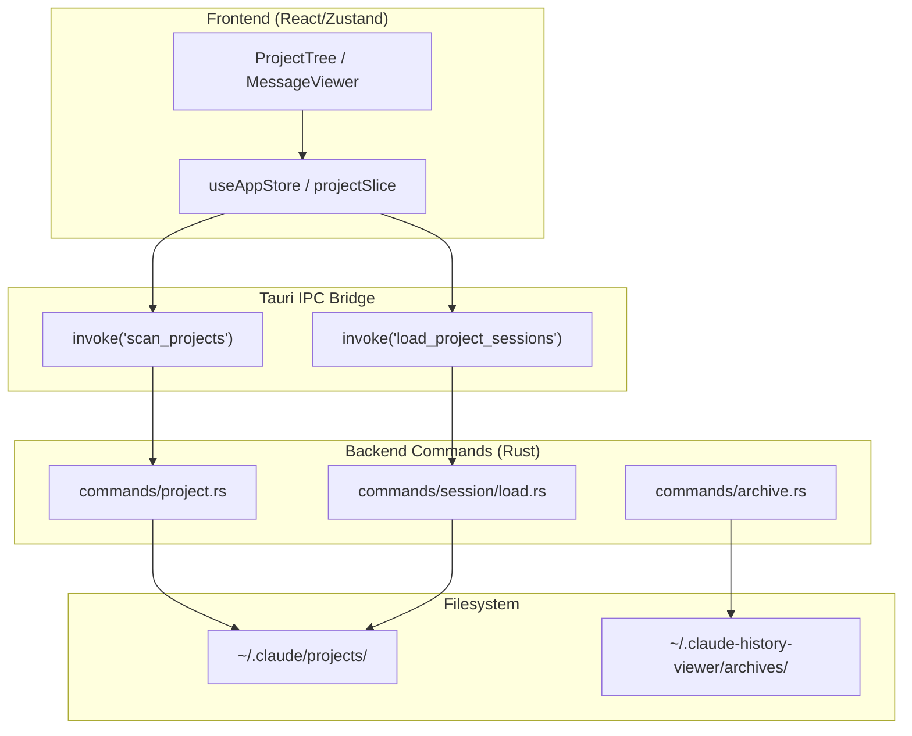
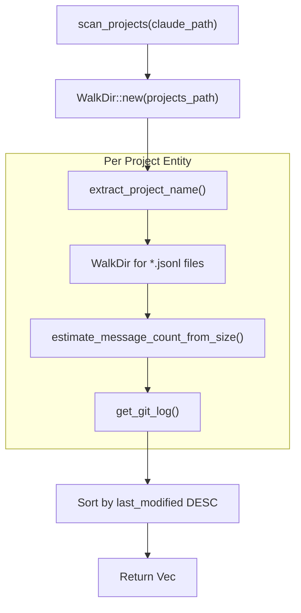

# Project 및 Session 명령

<details>
<summary>관련 소스 파일</summary>

다음 파일들은 이 위키 페이지를 생성하기 위한 컨텍스트로 사용되었습니다.

- [.spec-placeholder](.spec-placeholder)
- [docs/specs/issue-80-session-sorting-search.md](docs/specs/issue-80-session-sorting-search.md)
- [src-tauri/src/commands/archive.rs](src-tauri/src/commands/archive.rs)
- [src-tauri/src/commands/project.rs](src-tauri/src/commands/project.rs)
- [src-tauri/src/commands/session/delete.rs](src-tauri/src/commands/session/delete.rs)
- [src-tauri/src/commands/session/load.rs](src-tauri/src/commands/session/load.rs)
- [src-tauri/src/commands/session/rename.rs](src-tauri/src/commands/session/rename.rs)
- [src-tauri/src/models/session.rs](src-tauri/src/models/session.rs)
- [src-tauri/src/models/snapshot_tests.rs](src-tauri/src/models/snapshot_tests.rs)
- [src-tauri/src/models/snapshots/claude_code_history_viewer_lib__models__snapshot_tests__session_snapshots__claude_session.snap](src-tauri/src/models/snapshots/claude_code_history_viewer_lib__models__snapshot_tests__session_snapshots__claude_session.snap)
- [src/components/MessageViewer/MessageViewer.tsx](src/components/MessageViewer/MessageViewer.tsx)
- [src/components/NativeRenameDialog.tsx](src/components/NativeRenameDialog.tsx)
- [src/components/ProjectTree/components/SessionList.tsx](src/components/ProjectTree/components/SessionList.tsx)
- [src/components/ProjectTree/components/__tests__/SessionList.test.tsx](src/components/ProjectTree/components/__tests__/SessionList.test.tsx)
- [src/components/contentRenderer/UnifiedToolExecutionRenderer.tsx](src/components/contentRenderer/UnifiedToolExecutionRenderer.tsx)
- [src/components/contentRenderer/unifiedCards/AgentCard.tsx](src/components/contentRenderer/unifiedCards/AgentCard.tsx)
- [src/components/contentRenderer/unifiedCards/BashCard.tsx](src/components/contentRenderer/unifiedCards/BashCard.tsx)
- [src/components/contentRenderer/unifiedCards/DefaultCard.tsx](src/components/contentRenderer/unifiedCards/DefaultCard.tsx)
- [src/components/contentRenderer/unifiedCards/EditCard.tsx](src/components/contentRenderer/unifiedCards/EditCard.tsx)
- [src/components/contentRenderer/unifiedCards/GlobCard.tsx](src/components/contentRenderer/unifiedCards/GlobCard.tsx)
- [src/components/contentRenderer/unifiedCards/GrepCard.tsx](src/components/contentRenderer/unifiedCards/GrepCard.tsx)
- [src/components/contentRenderer/unifiedCards/ReadCard.tsx](src/components/contentRenderer/unifiedCards/ReadCard.tsx)
- [src/components/contentRenderer/unifiedCards/ResultBlock.tsx](src/components/contentRenderer/unifiedCards/ResultBlock.tsx)
- [src/components/contentRenderer/unifiedCards/StatusBadge.tsx](src/components/contentRenderer/unifiedCards/StatusBadge.tsx)
- [src/components/contentRenderer/unifiedCards/shared.ts](src/components/contentRenderer/unifiedCards/shared.ts)
- [src/hooks/useNativeRename.ts](src/hooks/useNativeRename.ts)
- [src/store/slices/projectSlice.ts](src/store/slices/projectSlice.ts)
- [src/store/slices/types.ts](src/store/slices/types.ts)
- [src/types/core/session.ts](src/types/core/session.ts)
- [src/types/metadata.types.ts](src/types/metadata.types.ts)

</details>


## 목적과 범위

이 문서는 다음을 담당하는 Rust 백엔드 Tauri 명령을 다룹니다.

- **Project discovery**: Claude Code, Codex CLI, OpenCode 및 기타 지원 provider의 conversation history source를 찾고, 검증하고, scan합니다.
- **Session loading**: project별 JSONL session file을 열거하며, `rayon`을 통한 incremental caching과 parallel parsing을 사용합니다.
- **Message pagination**: SIMD 가속 line detection으로 session JSONL file에서 개별 message page를 읽습니다.
- **Session management**: file 수준에서 session title을 rename하고 session을 system trash로 이동해 삭제합니다.
- **Archive management**: 사용자 home directory에 persistent session archive를 생성, 나열, 관리합니다.

출처: [src-tauri/src/commands/project.rs:1-10](), [src-tauri/src/commands/session/load.rs:1-15](), [src-tauri/src/commands/session/rename.rs:1-15](), [src-tauri/src/commands/session/delete.rs:1-11](), [src-tauri/src/commands/archive.rs:1-15]()

---

## 명령 아키텍처

Project 및 session 명령은 Tauri의 IPC bridge pattern을 따릅니다. Frontend TypeScript component는 `invoke()` API를 통해 백엔드 Rust function을 호출하고, 이 호출은 적절한 command module로 route됩니다.

### 시스템 데이터 흐름: Provider에서 UI까지



출처: [src-tauri/src/commands/project.rs:159-160](), [src/store/slices/projectSlice.ts:190-205](), [src-tauri/src/commands/archive.rs:135-138]()

---

## Project Discovery 명령

### scan_projects

제공된 `claude_path`(일반적으로 `~/.claude`)를 recursive하게 scan하여 project를 발견합니다. 발견된 각 project에 대해 message count를 추정하고 Git 정보를 감지합니다.

**Function Signature:** [src-tauri/src/commands/project.rs:159-160]()

```rust
#[tauri::command]
pub async fn scan_projects(claude_path: String) -> Result<Vec<ClaudeProject>, String>
```

**Scanning Pipeline**



**성능 최적화:**
- **File Size Estimation:** 초기 scan 중 file content를 읽지 않도록 `estimate_message_count_from_size()`를 사용합니다 [src-tauri/src/commands/project.rs:200-201]().
- **WalkDir:** project directory를 효율적으로 나열하기 위해 `min_depth(1)` 및 `max_depth(1)`과 함께 `WalkDir`을 사용합니다 [src-tauri/src/commands/project.rs:170-172]().

출처: [src-tauri/src/commands/project.rs:159-215](), [src-tauri/src/utils.rs:66-70]()

---

## Session Loading 및 Caching

### load_project_sessions

특정 project의 session metadata를 로드합니다. 수천 개의 session에서도 높은 성능을 유지하기 위해 local JSON cache(`.session_cache.json`)와 parallel processing을 활용합니다.

**Caching Mechanism:**
- **Cache Structure**: 변경을 감지하기 위해 `modified_time`, `file_size`, `last_byte_offset`을 저장합니다 [src-tauri/src/commands/session/load.rs:18-45]().
- **Incremental Parsing**: file size가 증가했지만 `mtime`이 최근이면 `last_byte_offset`부터 parsing을 재개합니다 [src-tauri/src/commands/session/load.rs:113-141]().
- **Parallelism**: 여러 session file을 동시에 parse하기 위해 `rayon`의 `par_iter()`를 사용합니다 [src-tauri/src/commands/session/load.rs:773-775]().

### Message Pagination (`get_message_page`)

대형 session의 경우 message는 page 단위로 로드됩니다. 백엔드는 memory mapping(`Mmap`)과 SIMD 최적화 line detection을 사용해 전체 file을 memory에 로드하지 않고 message boundary를 빠르게 찾습니다.

출처: [src-tauri/src/commands/session/load.rs:18-96](), [src-tauri/src/commands/session/load.rs:703-850](), [src-tauri/src/utils.rs:16-34]()

---

## Session Management

### Session Deletion (`delete_session`)

session의 `.jsonl` file과 관련 directory(subagent log 또는 tool result 포함)를 system trash로 이동합니다.

**Safety Checks:** [src-tauri/src/commands/session/delete.rs:14-43]()
1. path가 absolute인지 검증합니다.
2. extension이 정확히 `.jsonl`인지 확인합니다.
3. 외부 data의 accidental deletion을 방지하기 위해 file이 symlink가 아닌지 확인합니다.

### Session Renaming (`rename_session_native`)

Claude 및 OpenCode provider의 rename을 지원합니다. Claude Code의 경우 `.jsonl` file 안의 첫 번째 user message에 `[Title]` prefix를 주입합니다.

출처: [src-tauri/src/commands/session/delete.rs:11-58](), [src-tauri/src/commands/session/rename.rs:93-195]()

---

## Archive 명령

archive system은 사용자가 session을 `~/.claude-history-viewer/archives/`의 관리 storage area로 이동할 수 있게 합니다.

### 데이터 모델
- **ArchiveManifest**: 모든 archive의 전역 목록입니다 [src-tauri/src/commands/archive.rs:33-38]().
- **ArchiveEntry**: source provider와 session count를 포함한 단일 archive의 metadata입니다 [src-tauri/src/commands/archive.rs:50-63]().

### 주요 Archive 작업
| Command | Purpose |
|---------|---------|
| `create_archive` | session file과 subagent log를 새 archive directory로 copy합니다 [src-tauri/src/commands/archive.rs:360-365]() |
| `list_archives` | 사용 가능한 archive를 나열하기 위해 `archive-manifest.json`을 읽습니다 [src-tauri/src/commands/archive.rs:253-257]() |
| `get_archive_sessions` | 특정 archive 안에 저장된 session metadata를 나열합니다 [src-tauri/src/commands/archive.rs:641-645]() |
| `delete_archive` | archive directory를 제거하고 manifest를 update합니다 [src-tauri/src/commands/archive.rs:604-608]() |

출처: [src-tauri/src/commands/archive.rs:33-119](), [src-tauri/src/commands/archive.rs:253-645]()

---

## Git Integration

백엔드는 project의 Git history를 가져오는 명령을 제공하며, UI에서는 이를 사용해 AI session과 code commit을 연결합니다.

### get_git_log

project의 `actual_path`에서 `git log` command를 실행해 recent commit 목록을 가져옵니다.

**Logic:** [src-tauri/src/commands/project.rs:12-61]()
1. directory path를 검증합니다.
2. `git log -n {limit} --pretty=format:%H|%an|%at|%s`를 실행합니다.
3. output을 `Vec<GitCommit>` structure로 parse합니다.

출처: [src-tauri/src/commands/project.rs:12-61](), [src-tauri/src/models/session.rs:75-81]()
