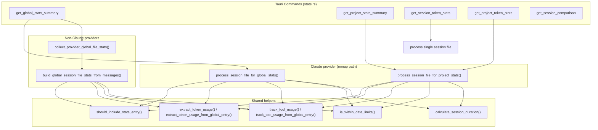
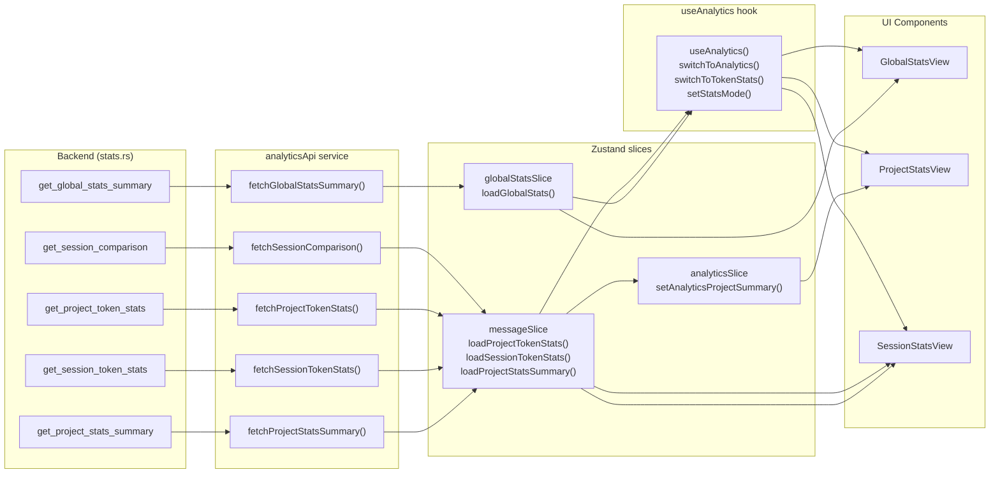

# 통계 및 Analytics

<details>
<summary>관련 소스 파일</summary>

다음 파일들은 이 위키 페이지를 생성하기 위한 컨텍스트로 사용되었습니다.

- [src-tauri/benches/performance.rs](src-tauri/benches/performance.rs)
- [src-tauri/src/commands/stats.rs](src-tauri/src/commands/stats.rs)
- [src-tauri/src/models/stats.rs](src-tauri/src/models/stats.rs)
- [src/components/AnalyticsDashboard/utils/projectCalculations.ts](src/components/AnalyticsDashboard/utils/projectCalculations.ts)
- [src/hooks/useAnalytics.ts](src/hooks/useAnalytics.ts)
- [src/services/analyticsApi.ts](src/services/analyticsApi.ts)
- [src/store/slices/analyticsSlice.ts](src/store/slices/analyticsSlice.ts)
- [src/store/slices/globalStatsSlice.ts](src/store/slices/globalStatsSlice.ts)
- [src/store/slices/messageSlice.ts](src/store/slices/messageSlice.ts)
- [src/test/globalStatsSlice.test.ts](src/test/globalStatsSlice.test.ts)
- [src/test/projectCalculations.test.ts](src/test/projectCalculations.test.ts)
- [src/types/stats.types.ts](src/types/stats.types.ts)

</details>


이 페이지는 `src-tauri/src/commands/stats.rs`의 Rust 백엔드 로직을 문서화합니다. 이 로직은 session별, project별, global(provider 전반의 모든 project)이라는 세 가지 범위에서 token usage, tool usage, activity heatmap, session duration metric을 계산합니다. 또한 프론트엔드 Zustand slice와 `useAnalytics` hook이 이러한 결과를 소비하는 방식도 다룹니다.

이 결과를 렌더링하는 UI component는 [Analytics Dashboard (3.4)]() 및 [Analytics Views (3.4.1)]()를 참조하세요. session별 token statistics list UI는 [Token Stats Viewer (3.5)]()를 참조하세요. statistics pipeline에 입력을 제공하는 multi-provider scanning은 [Multi-Provider System (2.5)]() 및 [Provider Implementations (5.5)]()를 참조하세요.

---

## StatsMode 및 Message Filtering

모든 statistics computation은 어떤 log entry가 total에 기여할지 제어하는 `StatsMode`로 parameterize됩니다.

[src-tauri/src/commands/stats.rs:27-48]()

| `StatsMode` variant | String key | `include_sidechain()` | Included message types |
|---|---|---|---|
| `BillingTotal` (default) | `"billing_total"` | `true` | `user`, `assistant`, `system`, usage data가 있는 모든 noise type |
| `ConversationOnly` | `"conversation_only"` | `false` | `user`, `assistant`만 |

`parse_stats_mode`는 frontend의 optional string parameter를 enum으로 변환합니다. 알 수 없는 string은 warning과 함께 `BillingTotal`로 fallback됩니다. [src-tauri/src/commands/stats.rs:39-48]()

entry-point gate는 `should_include_stats_entry`입니다.

[src-tauri/src/commands/stats.rs:95-122]()

```rust
should_include_stats_entry(message_type, is_sidechain, has_usage, mode)
```

순서대로 적용되는 규칙:
1. 항상 `"summary"` type entry를 건너뜁니다. [src-tauri/src/commands/stats.rs:101-103]()
2. `ConversationOnly` mode에서는 sidechain message(`isSidechain == true`)를 건너뜁니다. [src-tauri/src/commands/stats.rs:105-107]()
3. `ConversationOnly` mode에서는 `user` / `assistant`만 통과시킵니다. [src-tauri/src/commands/stats.rs:109-111]()
4. `BillingTotal` mode에서는 core type(`user`, `assistant`, `system`)을 항상 통과시킵니다. [src-tauri/src/commands/stats.rs:113-115]()
5. noise type(`progress`, `queue-operation`, `file-history-snapshot`)의 경우 entry에 token field가 하나 이상 설정되어 있을 때만 포함합니다. [src-tauri/src/commands/stats.rs:117-119]()

출처: [src-tauri/src/commands/stats.rs:27-122]()

---

## Provider 범위 지정

stats module에는 각 결과가 어떤 data source에서 왔는지 tag하는 자체 internal `StatsProvider` enum이 있습니다(더 넓은 provider system과는 별개).

[src-tauri/src/commands/stats.rs:19-56]()

| `StatsProvider` | String ID | Detection |
|---|---|---|
| `Claude` | `"claude"` | default; path가 다른 prefix와 match되지 않음 [src-tauri/src/commands/stats.rs:163-171]() |
| `Codex` | `"codex"` | file path가 `rollout-*.jsonl`이거나 project path가 `"codex://"`로 시작함 [src-tauri/src/commands/stats.rs:178-193]() |
| `OpenCode` | `"opencode"` | session 또는 project path가 `"opencode://"`로 시작함 [src-tauri/src/commands/stats.rs:173-176]() |

`detect_project_provider`와 `detect_session_provider`가 runtime에 이 분류를 수행합니다. [src-tauri/src/commands/stats.rs:163-193]()

`parse_active_stats_providers`는 frontend의 `active_providers: Vec<String>` parameter를 `HashSet<StatsProvider>`로 변환합니다. `active_providers`가 `None`이면 세 provider가 모두 포함됩니다. [src-tauri/src/commands/stats.rs:134-161]()

출처: [src-tauri/src/commands/stats.rs:19-193]()

---

## 중간 데이터 구조

**다이어그램: parallel processing 중 사용되는 internal struct**

```mermaid
classDiagram
    class "SessionFileStats"["SessionFileStats"] {
        +u32 total_messages
        +u64 total_tokens
        +TokenDistribution token_distribution
        +HashMap tool_usage
        +HashMap daily_stats
        +HashMap activity_data
        +HashMap model_usage
        +u64 session_duration_minutes
        +Option first_message
        +Option last_message
        +String project_name
        +StatsProvider provider
    }
    class "ProjectSessionFileStats"["ProjectSessionFileStats"] {
        +u32 total_messages
        +TokenDistribution token_distribution
        +HashMap tool_usage
        +HashMap daily_stats
        +HashMap activity_data
        +u32 session_duration_minutes
        +HashSet session_dates
        +Vec timestamps
    }
    class "GlobalStatsLogEntry"["GlobalStatsLogEntry"] {
        +String message_type
        +Option timestamp
        +Option is_sidechain
        +Option message
        +Option tool_use
        +Option tool_use_result
    }
    class "GlobalStatsMessageContent"["GlobalStatsMessageContent"] {
        +String role
        +Option content
        +Option model
        +Option usage
    }
    class "TokenDistribution"["TokenDistribution"] {
        +u64 input
        +u64 output
        +u64 cache_creation
        +u64 cache_read
    }
    "SessionFileStats" --> "TokenDistribution"
    "ProjectSessionFileStats" --> "TokenDistribution"
    "GlobalStatsLogEntry" --> "GlobalStatsMessageContent"
```

`SessionFileStats`는 global-scope aggregation에 사용됩니다. `ProjectSessionFileStats`는 project-scope aggregation에 사용됩니다. 둘 다 Rayon을 사용해 session file 전반에서 parallel하게 수집됩니다.

`GlobalStatsLogEntry`는 `RawLogEntry`에 존재하는 비용이 큰 field(snapshot, hook info, full content array)를 건너뛰는 **lightweight** deserialization target입니다. 이는 의도적인 성능 최적화입니다. global stats에는 timestamp, usage count, model name, tool name만 필요합니다. [src-tauri/src/commands/stats.rs:207-241]()

출처: [src-tauri/src/commands/stats.rs:207-241](), [src-tauri/src/commands/stats.rs:383-397](), [src-tauri/src/commands/stats.rs:763-773]()

---

## 처리 Pipeline

**다이어그램: Stats computation call graph**



출처: [src-tauri/src/commands/stats.rs:402-534](), [src-tauri/src/commands/stats.rs:570-760](), [src-tauri/src/commands/stats.rs:777-895]()

### Per-Session File Processing (Claude / global scope)

`process_session_file_for_global_stats`는 memory-mapped I/O(`memmap2::Mmap`)와 SIMD 가속 JSON parsing(`simd_json`)을 사용해 `.jsonl` session file을 읽습니다. `find_line_ranges` utility는 line별 string을 allocation하지 않고 newline boundary를 찾습니다. [src-tauri/src/commands/stats.rs:402-425]()

line별 단계:
1. `parse_global_stats_entry_simd`를 통해 `GlobalStatsLogEntry`로 parse합니다. [src-tauri/src/commands/stats.rs:444]()
2. `extract_token_usage_from_global_entry`로 `TokenUsage`를 추출합니다. [src-tauri/src/commands/stats.rs:457]()
3. `should_include_stats_entry`를 확인합니다. [src-tauri/src/commands/stats.rs:462]()
4. `is_within_date_limits`로 date-range filter를 적용합니다. [src-tauri/src/commands/stats.rs:467]()
5. `total_messages`, `total_tokens`, `token_distribution`, `model_usage`, `activity_data`(hour × day), `daily_stats`를 누적합니다. [src-tauri/src/commands/stats.rs:475-508]()
6. `track_tool_usage_from_global_entry`로 tool name을 추적합니다. [src-tauri/src/commands/stats.rs:510-513]()

### Per-Session File Processing (non-Claude providers)

Codex와 OpenCode의 경우 `collect_provider_global_file_stats`는 provider별 `load_messages` function을 사용해 `Vec<ClaudeMessage>`를 얻은 다음 `build_global_session_file_stats_from_messages`를 호출합니다. 이 provider들은 raw JSONL line parsing 대신 자체 deserialization logic이 필요한 format으로 data를 저장하기 때문에 필요합니다. [src-tauri/src/commands/stats.rs:698-760]()

### Per-Session File Processing (project scope)

`process_session_file_for_project_stats`는 lightweight `GlobalStatsLogEntry`가 아니라 full `RawLogEntry` → `ClaudeMessage` path를 사용합니다. project stats command는 특정 field를 위해 complete message content도 필요하기 때문입니다. [src-tauri/src/commands/stats.rs:777-895]()

### Parallelism

global 및 project-scoped processing은 모두 session file을 parallel하게 처리하기 위해 `rayon::prelude::*`를 사용합니다. [src-tauri/src/commands/stats.rs:738-757]()

---

## Token Extraction

`extract_token_usage`(full `ClaudeMessage`용)와 `extract_token_usage_from_global_entry`(`GlobalStatsLogEntry`용)는 모두 fallback chain을 구현합니다.

1. `message.usage` field(assistant message에서 가장 흔함). [src-tauri/src/commands/stats.rs:288]()
2. `message.content.usage` object(일부 provider는 usage를 content 안에 embed함). [src-tauri/src/commands/stats.rs:305]()
3. `tool_use_result.usage` object. [src-tauri/src/commands/stats.rs:314]()
4. `tool_use_result.totalTokens` scalar fallback(assistant의 경우 `output_tokens`, 그 외에는 `input_tokens`로 할당됨). [src-tauri/src/commands/stats.rs:324]()

`token_usage_totals`는 다섯 값 `(input, output, cache_creation, cache_read, total)`을 추출하며 각 `Option<u32>`에 `unwrap_or(0)`을 적용합니다. [src-tauri/src/commands/stats.rs:80-93]()

출처: [src-tauri/src/commands/stats.rs:73-93](), [src-tauri/src/commands/stats.rs:943-988](), [src-tauri/src/commands/stats.rs:282-335]()

---

## Session Duration Calculation

`calculate_session_duration`은 120분 idle threshold(`SESSION_BREAK_THRESHOLD_MINUTES = 120`)가 있는 active-minutes algorithm을 구현합니다. [src-tauri/src/commands/stats.rs:537-568]()

**Algorithm:**
1. 모든 message timestamp를 sort합니다.
2. consecutive pair를 순회합니다. gap이 120분을 초과하면 현재 activity period를 닫고 새 period를 시작합니다. [src-tauri/src/commands/stats.rs:555-558]()
3. 각 period는 `max(period_duration_minutes, 1)`을 total에 기여합니다. [src-tauri/src/commands/stats.rs:563]()
4. 정확히 하나의 message만 있는 session은 1분을 기여합니다. [src-tauri/src/commands/stats.rs:548]()

이 방식은 별도의 work session 사이 idle time이 reported duration을 부풀리는 것을 방지합니다. 동일한 logic이 세 곳에 나타나며, direct session-scoped query를 위해 standalone `calculate_session_active_minutes` helper로 추출되어 있습니다. [src-tauri/src/commands/stats.rs:1025-1055]()

---

## Tool Usage Tracking

`track_tool_usage`(`ClaudeMessage`용)와 `track_tool_usage_from_global_entry`(`GlobalStatsLogEntry`용)는 모두 tool invocation을 찾기 위해 두 위치를 scan합니다.

1. `assistant` message의 `content` array — `type == "tool_use"`인 item. [src-tauri/src/commands/stats.rs:905-917]()
2. log entry의 explicit `tool_use` field이며, `tool_use_result.is_error`와 cross-reference됩니다. [src-tauri/src/commands/stats.rs:920-928]()

accumulator는 `HashMap<String, (u32, u32)>`이며 tuple은 `(usage_count, success_count)`입니다. [src-tauri/src/commands/stats.rs:898]()

`build_tool_usage_stats`는 이 map을 `usage_count` 내림차순으로 sort된 `Vec<ToolUsageStats>`로 변환하며, `success_rate = (success / usage) * 100.0`을 계산합니다. [src-tauri/src/commands/stats.rs:1057-1074]()

---

## Date Filtering

date filtering은 session level이 아니라 individual message level에 적용되므로 date range 내 partial-session data가 정확히 capture됩니다. [src-tauri/src/commands/stats.rs:990-1023]()

| Function | Purpose |
|---|---|
| `parse_date_limit` | frontend의 RFC3339 string을 `Option<DateTime<Utc>>`로 parse합니다 |
| `parse_timestamp_utc` | message의 `timestamp` field를 parse합니다 |
| `is_within_date_limits` | timestamp가 `[s_limit, e_limit]` 안에 있으면 `true`를 반환합니다. 두 limit이 모두 `None`이면 모든 message를 통과시킵니다 |

`has_date_filter`가 true이지만 message에 parse 가능한 timestamp가 없으면, 해당 message는 date-filtered result에서 제외됩니다. date filtering이 없으면 timestamp가 없는 message도 tool usage와 token count aggregate에 계속 기여합니다. [src-tauri/src/commands/stats.rs:1008-1022]()

---

## 프론트엔드 통합

**다이어그램: Tauri command에서 UI까지의 data flow**



출처: [src/store/slices/globalStatsSlice.ts:59-137](), [src/store/slices/messageSlice.ts:328-647](), [src/hooks/useAnalytics.ts:1-9]()

### `globalStatsSlice`

`globalStatsSlice`의 `loadGlobalStats`는 `fetchGlobalStatsSummary`를 parallel하게 두 번 호출합니다. 한 번은 `"billing_total"`로, 한 번은 `"conversation_only"`로 호출하며, 결과를 `globalSummary`와 `globalConversationSummary`에 저장합니다. [src/store/slices/globalStatsSlice.ts:84-113]()

- Parallelism guard: `await` 이후 request ID(`nextRequestId("globalStats")`)를 확인하며, stale response는 버립니다. [src/store/slices/globalStatsSlice.ts:114-116]()
- `hasAnyConversationBreakdownProvider(activeProviders)`가 `false`를 반환하면 `"conversation_only"` fetch는 완전히 건너뜁니다. [src/store/slices/globalStatsSlice.ts:81-83]()
- project tree tab의 `activeProviders`는 provider scope로 backend에 직접 전달됩니다. [src/store/slices/globalStatsSlice.ts:88-90]()

### `messageSlice`

stats 관련 action 네 가지를 제공합니다.

| Action | Backend command | Description |
|---|---|---|
| `loadSessionTokenStats` | `get_session_token_stats` | 단일 session; billing과 conversation variant를 모두 가져옵니다 [src/store/slices/messageSlice.ts:328-390]() |
| `loadProjectTokenStats` | `get_project_token_stats` | paginated list(page size 20); 새 project에서 pagination을 reset합니다 [src/store/slices/messageSlice.ts:392-454]() |
| `loadMoreProjectTokenStats` | `get_project_token_stats` | 다음 page를 기존 list에 append합니다 [src/store/slices/messageSlice.ts:456-521]() |
| `loadProjectStatsSummary` | `get_project_stats_summary` | project에 대한 summary total입니다 [src/store/slices/messageSlice.ts:523-605]() |

### `useAnalytics` hook

`useAnalytics`는 view transition과 data loading을 orchestrate합니다. `currentView`(예: `messages`, `tokenStats`, `analytics`)를 관리하고 `isLoadingAnalytics` 같은 computed property를 제공합니다. [src/hooks/useAnalytics.ts:1-9]()

---

## Performance Benchmarking

codebase에는 session processing과 stats calculation의 효율성을 측정하기 위한 performance benchmark suite가 `src-tauri/benches/performance.rs`에 포함되어 있습니다.

[src-tauri/benches/performance.rs:1-146]()

benchmark는 realistic sample data를 생성합니다.
- `generate_sample_jsonl`: realistic token usage 및 tool use entry를 포함하여 user와 assistant message가 번갈아 나오는 JSONL file을 생성합니다. [src-tauri/benches/performance.rs:16-81]()
- `generate_project_structure`: multi-file scanning performance를 test하기 위해 project와 session hierarchy를 생성합니다. [src-tauri/benches/performance.rs:84-146]()

이 benchmark는 global stats pipeline에서 사용되는 memory-mapped I/O 및 SIMD parsing 같은 최적화를 검증하는 데 사용됩니다.

---

## 출력 데이터 타입

다음 타입들은 stats backend가 생성하고 frontend가 소비합니다.

| Type | Description |
|---|---|
| `GlobalStatsSummary` | total token/message/session, date range, daily stats, heatmap, top project, model 및 provider distribution, tool usage [src-tauri/src/models/stats.rs:117-131]() |
| `ProjectStatsSummary` | global과 동일하지만 하나의 project로 scope됨; `avg_session_duration`, `total_session_duration`을 추가합니다 [src-tauri/src/models/stats.rs:48-61]() |
| `SessionTokenStats` | session별 total: `total_tokens`, `message_count`, `first_message_time`, `last_message_time`, `summary`, `most_used_tools` [src-tauri/src/models/stats.rs:4-18]() |
| `SessionComparison` | project 내 session의 rank: `rank_by_tokens`, `rank_by_duration`, `percentage_of_project_tokens` [src-tauri/src/models/stats.rs:72-79]() |
| `TokenDistribution` | `input`, `output`, `cache_creation`, `cache_read` token count로 breakdown [src-tauri/src/models/stats.rs:64-69]() |
| `DailyStats` | 일별 total: `date`(YYYY-MM-DD), `total_tokens`, `input_tokens`, `output_tokens`, `message_count`, `session_count`, `active_hours` [src-tauri/src/models/stats.rs:21-29]() |
| `ActivityHeatmap` | activity count 및 token count가 포함된 `(hour, day)` grid entry [src-tauri/src/models/stats.rs:40-45]() |
| `ToolUsageStats` | `tool_name`, `usage_count`, `success_rate`, `avg_execution_time` [src-tauri/src/models/stats.rs:32-37]() |
| `ModelStats` | `model_name`, `token_count`, `input_tokens`, `output_tokens`, `cache_creation_tokens`, `cache_read_tokens` [src-tauri/src/models/stats.rs:89-97]() |
| `ProviderUsageStats` | `provider_id`, `projects`, `sessions`, `messages`, `tokens` [src-tauri/src/models/stats.rs:108-114]() |
| `ProjectRanking` | `project_name`, `sessions`, `messages`, `tokens` [src-tauri/src/models/stats.rs:100-105]() |

출처: [src-tauri/src/models/stats.rs:1-131](), [src/types/stats.types.ts:1-171]()
