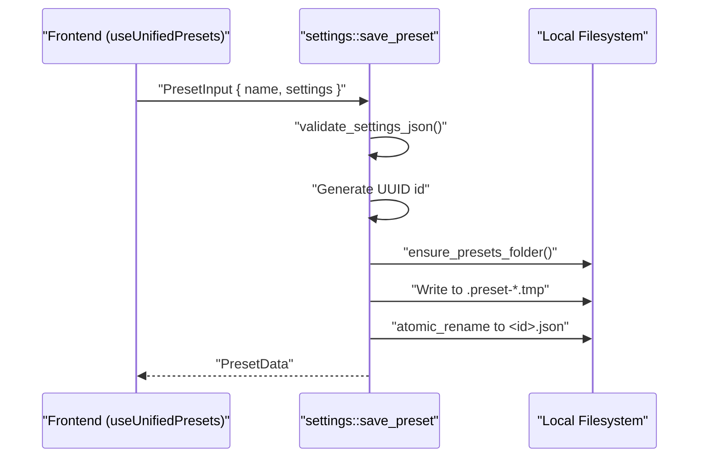
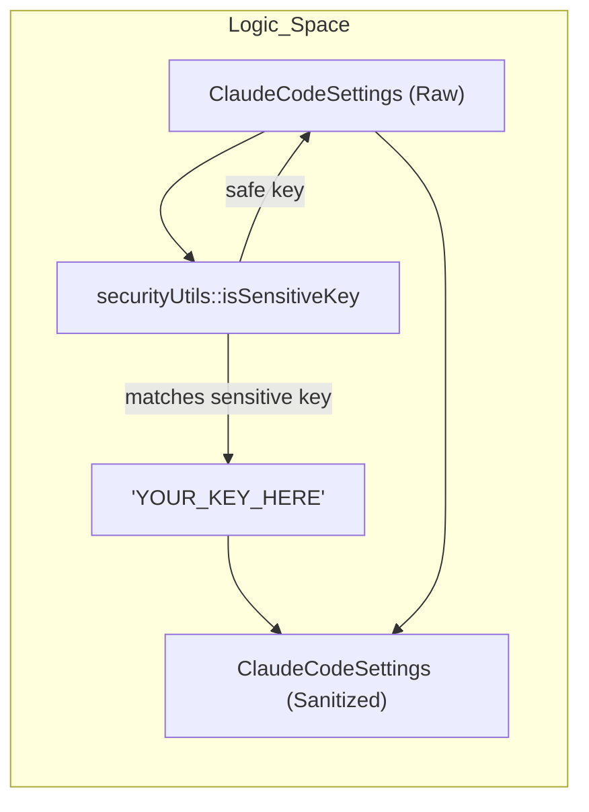

# Settings 관리

<details>
<summary>관련 소스 파일</summary>

다음 파일들은 이 위키 페이지를 생성하기 위한 컨텍스트로 사용되었습니다.

- [src-tauri/src/commands/claude_settings.rs](src-tauri/src/commands/claude_settings.rs)
- [src-tauri/src/commands/mcp_presets.rs](src-tauri/src/commands/mcp_presets.rs)
- [src-tauri/src/commands/metadata.rs](src-tauri/src/commands/metadata.rs)
- [src-tauri/src/commands/settings.rs](src-tauri/src/commands/settings.rs)
- [src-tauri/src/commands/watcher.rs](src-tauri/src/commands/watcher.rs)
- [src/components/SettingsManager/components/EmptyState.tsx](src/components/SettingsManager/components/EmptyState.tsx)
- [src/components/SettingsManager/components/ExportImport.tsx](src/components/SettingsManager/components/ExportImport.tsx)
- [src/components/SettingsManager/components/index.ts](src/components/SettingsManager/components/index.ts)
- [src/components/SettingsManager/index.ts](src/components/SettingsManager/index.ts)
- [src/hooks/__tests__/useFileWatcher.test.ts](src/hooks/__tests__/useFileWatcher.test.ts)
- [src/hooks/useFileWatcher.ts](src/hooks/useFileWatcher.ts)
- [src/hooks/useMCPPresets.ts](src/hooks/useMCPPresets.ts)
- [src/hooks/useMCPServers.ts](src/hooks/useMCPServers.ts)
- [src/main.tsx](src/main.tsx)
- [src/services/api.ts](src/services/api.ts)
- [src/types/claudeSettings.ts](src/types/claudeSettings.ts)
- [src/types/mcpPreset.types.ts](src/types/mcpPreset.types.ts)

</details>


이 페이지는 Claude Code settings file, MCP server configuration, unified preset, user metadata를 읽고 쓰는 Rust 백엔드 명령을 문서화합니다. file location, scope resolution, safety mechanism, persistence system을 포함한 전체 백엔드 표면을 다룹니다.

UI에서 이러한 명령을 구동하는 프론트엔드 `SettingsManager` component의 문서는 [3.6]()을 참조하세요. viewer 자체의 애플리케이션 상태(session name, grouping preference, hidden project)를 처리하는 metadata command는 이 페이지 끝에 설명된 metadata subsystem을 참조하세요.

---

## Settings Scope 및 File Location

Claude Code는 네 가지 scope level에 걸쳐 settings를 구성합니다. 백엔드는 각 scope name을 disk의 구체적인 file path로 매핑합니다.

**Settings scope → file path mapping**

| Scope | File Path | Writable |
|---|---|---|
| `user` | `~/.claude/settings.json` | ✓ |
| `project` | `<project>/.claude/settings.json` | ✓ |
| `local` | `<project>/.claude/settings.local.json` | ✓ |
| `managed` | `/Library/Application Support/ClaudeCode/managed-settings.json` (macOS only) | ✗ |

`managed` scope는 항상 read-only입니다. `save_settings`를 통해 여기에 쓰려고 하면 error를 반환합니다 [src-tauri/src/commands/claude_settings.rs:207-209]().

**Scope priority**(Claude Code가 scope를 merge할 때 더 높은 값이 우선함):

| Scope | Priority |
|---|---|
| `managed` | 100 |
| `local` | 30 |
| `project` | 20 |
| `user` | 10 |

이 priority table은 [src/types/claudeSettings.ts:399-404]()의 `SCOPE_PRIORITY`에 정의되어 있습니다.

---

## MCP Server Source

MCP(Model Context Protocol) server는 다섯 가지 서로 다른 file location에서 구성될 수 있으며, *official* source와 *legacy* source로 나뉩니다.

| Source Key | File Location | Scope |
|---|---|---|
| `user_claude_json` | `~/.claude.json` → `mcpServers` | User, cross-project (official) [src-tauri/src/commands/claude_settings.rs:36-37]() |
| `local_claude_json` | `~/.claude.json` → `projects.<path>.mcpServers` | Project-specific (official) [src-tauri/src/commands/claude_settings.rs:38-39]() |
| `user_settings` | `~/.claude/settings.json` → `mcpServers` | User (legacy) [src-tauri/src/commands/claude_settings.rs:30-31]() |
| `user_mcp_file` | `~/.claude/.mcp.json` | User (legacy) [src-tauri/src/commands/claude_settings.rs:32-33]() |
| `project_mcp_file` | `<project>/.mcp.json` | Project-specific [src-tauri/src/commands/claude_settings.rs:34-35]() |

출처: [src-tauri/src/commands/claude_settings.rs:28-40](), [src/hooks/useMCPServers.ts:67-83]()

---

## 백엔드 명령 아키텍처

다음 다이어그램은 Tauri command name을 해당 source module 및 동작 대상 file에 매핑합니다.

**Settings Management Command Architecture**

```mermaid
graph TD
    subgraph "Frontend_Space"
        FE1["\"get_settings_by_scope\""]
        FE2["\"save_settings\""]
        FE3["\"get_all_settings\""]
        FE4["\"get_mcp_servers\""]
        FE5["\"get_all_mcp_servers\""]
        FE6["\"save_mcp_servers\""]
        FE7["\"save_preset\""]
        FE8["\"load_presets\""]
        FE9["\"load_user_metadata\""]
        FE10["\"save_user_metadata\""]
    end

    subgraph "Rust_Command_Layer"
        CS1["claude_settings::get_settings_by_scope"]
        CS2["claude_settings::save_settings"]
        CS3["claude_settings::get_all_settings"]
        CS4["claude_settings::get_mcp_servers"]
        CS5["claude_settings::get_all_mcp_servers"]
        CS6["claude_settings::save_mcp_servers"]
        SR1["settings::save_preset"]
        SR2["settings::load_presets"]
        MR1["metadata::load_user_metadata"]
        MR2["metadata::save_user_metadata"]
    end

    subgraph "Filesystem_Entities"
        F1["~/.claude/settings.json"]
        F2["~/.claude.json"]
        F3["project/.mcp.json"]
        F4["~/.claude-history-viewer/presets/*.json"]
        F5["~/.claude-history-viewer/user-data.json"]
    end

    FE1 --> CS1
    FE2 --> CS2
    FE3 --> CS3
    FE4 --> CS4
    FE5 --> CS5
    FE6 --> CS6
    FE7 --> SR1
    FE8 --> SR2
    FE9 --> MR1
    FE10 --> MR2

    CS1 & CS2 & CS3 --> F1
    CS4 & CS5 & CS6 --> F2
    CS5 & CS6 --> F3
    SR1 & SR2 --> F4
    MR1 & MR2 --> F5
```



출처: [src-tauri/src/commands/claude_settings.rs:178-500](), [src-tauri/src/commands/settings.rs:93-200](), [src-tauri/src/commands/metadata.rs:92-163](), [src/services/api.ts:31-39]()

---

## `claude_settings.rs` — Claude Code Settings 명령

모든 명령은 `src-tauri/src/commands/claude_settings.rs`에 있으며 Claude의 configuration file에 대한 raw access를 제공합니다.

### Path Resolution Helper

private helper function은 scope name에서 구체적인 file path를 resolve합니다.

| Helper | Resolves to |
|---|---|
| `get_user_settings_path()` | `~/.claude/settings.json` [src-tauri/src/commands/claude_settings.rs:43-46]() |
| `get_user_mcp_path()` | `~/.claude/.mcp.json` [src-tauri/src/commands/claude_settings.rs:49-52]() |
| `get_claude_json_path()` | `~/.claude.json` [src-tauri/src/commands/claude_settings.rs:55-58]() |
| `get_managed_settings_path()` | `/Library/Application Support/ClaudeCode/managed-settings.json` (macOS) [src-tauri/src/commands/claude_settings.rs:105-109]() |
| `get_project_mcp_path(project_path)` | `<project>/.mcp.json` [src-tauri/src/commands/claude_settings.rs:97-100]() |

모든 project-path argument는 `validate_project_path()`를 거치며, 이 함수는 absolute path를 강제하고 `..` traversal을 방지합니다 [src-tauri/src/commands/claude_settings.rs:72-94]().

### Atomic Write Pattern

모든 file write는 data corruption을 방지하기 위해 atomic write pattern을 사용합니다. `write_settings_file` function [src-tauri/src/commands/claude_settings.rs:145-168]()은 다음을 수행합니다.
1. JSON content를 검증합니다 [src-tauri/src/commands/claude_settings.rs:147-148]().
2. `.json.tmp` extension을 가진 temporary file을 생성합니다 [src-tauri/src/commands/claude_settings.rs:157]().
3. file을 physical storage에 sync합니다(`sync_all`) [src-tauri/src/commands/claude_settings.rs:162-163]().
4. `atomic_rename`을 사용해 original file을 교체합니다 [src-tauri/src/commands/claude_settings.rs:165]().

### Settings 명령

**`get_settings_by_scope(scope, project_path)`** [src-tauri/src/commands/claude_settings.rs:178-189]()
하나의 scope settings JSON을 읽습니다. file이 존재하지 않으면 `"{}"`를 반환합니다 [src-tauri/src/commands/claude_settings.rs:137-139]().

**`save_settings(scope, content, project_path)`** [src-tauri/src/commands/claude_settings.rs:201-213]()
JSON을 검증하고, `"managed"` scope를 거부하며, atomic하게 write합니다.

**`get_all_settings(project_path)`** [src-tauri/src/commands/claude_settings.rs:224-235]()
네 scope 각각에 대한 `Option<String>`을 포함하는 `AllSettings` struct [src-tauri/src/commands/claude_settings.rs:12-18]()를 반환합니다.

---

## `settings.rs` — Settings Preset 명령

Preset을 통해 사용자는 Claude Code settings의 이름 있는 group을 save하고 restore할 수 있습니다. 이들은 `~/.claude-history-viewer/presets/`에 JSON file로 저장됩니다 [src-tauri/src/commands/settings.rs:40-44]().

**Preset Data Model**
`PresetData` struct는 저장된 preset의 schema를 정의합니다.
```rust
pub struct PresetData {
    pub id: String,
    pub name: String,
    pub description: Option<String>,
    pub settings: String,   // JSON string of UserSettings
    pub created_at: String, // ISO 8601 timestamp
    pub updated_at: String,
}
```
[src-tauri/src/commands/settings.rs:18-26]()

**Preset Lifecycle Management**



출처: [src-tauri/src/commands/settings.rs:93-168](), [src-tauri/src/commands/settings.rs:172-208](), [src/hooks/useMCPPresets.ts:7-10]()

---

## User Metadata 관리

viewer app은 session별 display name과 project grouping preference를 추적하기 위해 자체 metadata file인 `user-data.json` [src-tauri/src/commands/metadata.rs:65-67]()을 유지합니다.

**Metadata State Management**
백엔드는 빠른 access를 위해 metadata를 memory에 cache하는 `Mutex<Option<UserMetadata>>` [src-tauri/src/commands/metadata.rs:45-48]()가 포함된 `MetadataState` struct를 사용합니다.

| Command | Role |
|---|---|
| `load_user_metadata` | disk에서 읽거나 default `UserMetadata`를 생성합니다 [src-tauri/src/commands/metadata.rs:93-117]() |
| `save_user_metadata` | 전체 metadata object를 atomic하게 persist합니다 [src-tauri/src/commands/metadata.rs:144-163]() |
| `update_session_metadata` | 특정 session key(예: rename)를 mutate하고 save합니다 [src-tauri/src/commands/metadata.rs:167-198]() |
| `update_project_metadata` | validation 후 project key를 mutate합니다 [src-tauri/src/commands/metadata.rs:201-213]() |

출처: [src-tauri/src/commands/metadata.rs:1-213]()

---

## 프론트엔드 Hook 및 통합

### `useMCPServers` Hook
`useMCPServers` hook은 모든 source 전반의 MCP server 관리를 위한 unified interface를 제공합니다 [src/hooks/useMCPServers.ts:112](). 이 hook은 `api` service [src/services/api.ts:31]()를 사용해 `get_all_mcp_servers` [src/hooks/useMCPServers.ts:138]()와 `save_mcp_servers` [src/hooks/useMCPServers.ts:179]()를 호출합니다.

### `ExportImport` Logic
`ExportImport` component [src/components/SettingsManager/components/ExportImport.tsx:48]()는 backup을 위한 settings serialization을 처리합니다. 여기에는 sensitive key(API key, token)를 식별하고 export 전에 placeholder로 교체하는 sanitization step인 `sanitizeSettings` [src/components/SettingsManager/components/ExportImport.tsx:80-116]()가 포함됩니다.

**Sensitive Data Sanitization**


출처: [src/components/SettingsManager/components/ExportImport.tsx:80-116](), [src/hooks/useMCPServers.ts:133-198](), [src/services/api.ts:31-56]()
