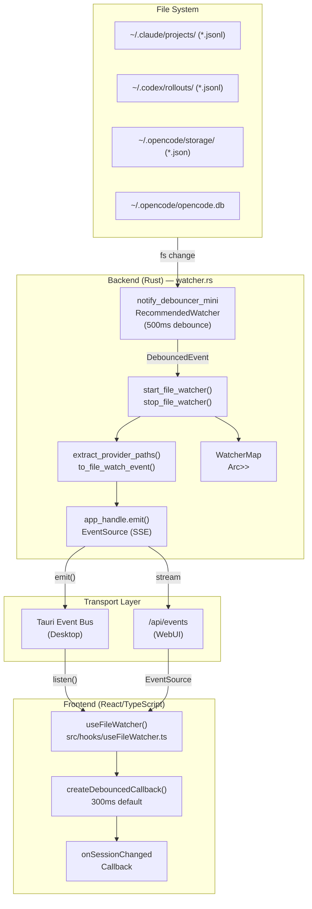
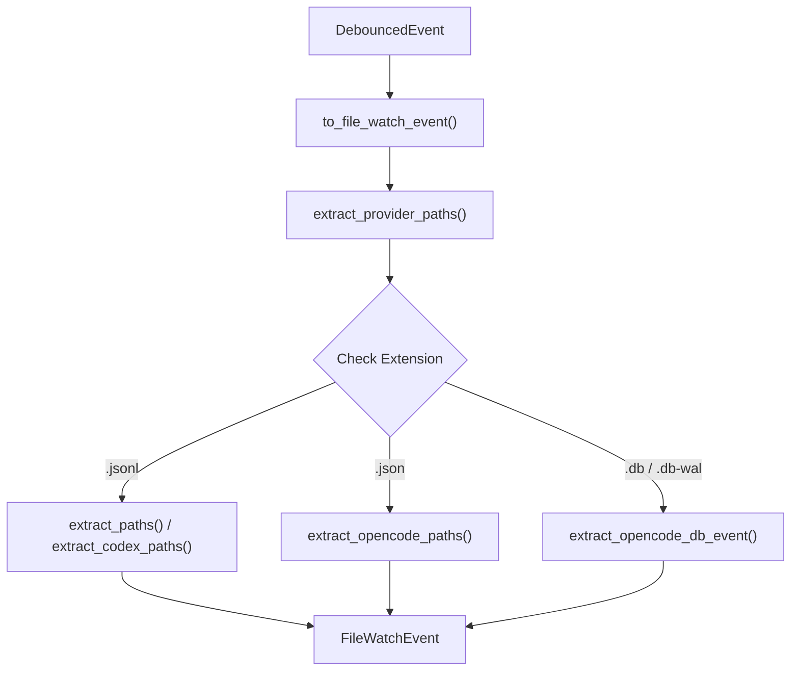

# File Watcher

관련 소스 파일

다음 파일들은 이 위키 페이지를 생성하기 위한 컨텍스트로 사용되었습니다.

- [.dockerignore](.dockerignore)
- [Dockerfile](Dockerfile)
- [contrib/cchv.service](contrib/cchv.service)
- [docker-compose.yml](docker-compose.yml)
- [src-tauri/src/commands/metadata.rs](src-tauri/src/commands/metadata.rs)
- [src-tauri/src/commands/watcher.rs](src-tauri/src/commands/watcher.rs)
- [src-tauri/src/server/handlers.rs](src-tauri/src/server/handlers.rs)
- [src-tauri/src/server/mod.rs](src-tauri/src/server/mod.rs)
- [src/components/SettingsManager/components/ExportImport.tsx](src/components/SettingsManager/components/ExportImport.tsx)
- [src/hooks/__tests__/useFileWatcher.test.ts](src/hooks/__tests__/useFileWatcher.test.ts)
- [src/hooks/useFileWatcher.ts](src/hooks/useFileWatcher.ts)
- [src/main.tsx](src/main.tsx)
- [src/services/api.ts](src/services/api.ts)
- [src/utils/fileDialog.ts](src/utils/fileDialog.ts)

File Watcher 시스템은 session file을 실시간으로 monitoring하며, 여러 provider(Claude Code, Codex, OpenCode)에 걸쳐 data file이 생성, 수정 또는 삭제될 때 자동으로 감지합니다. 이를 통해 애플리케이션은 수동 refresh 없이 표시된 data를 file system과 동기화된 상태로 유지할 수 있습니다. 이 시스템은 backend에서 debounced file watcher를 사용하며, Tauri event system 또는 WebUI mode의 Server-Sent Events(SSE)를 통해 frontend로 event를 emit합니다.

---

## 시스템 아키텍처

File Watcher는 file system과 application UI 사이의 bridge로 동작하며, Tauri desktop environment와 WebUI environment를 모두 지원합니다.

**설명:** 이 아키텍처는 file system change가 `notify` library에서 Rust backend를 거쳐 흐르는 방식을 보여줍니다. `extract_provider_paths` function은 서로 다른 provider(Claude, Codex, OpenCode)에 대한 logic을 처리합니다. event는 desktop mode에서는 Tauri의 native event bus를 통해, WebUI mode에서는 SSE를 통해 dispatch됩니다. `useFileWatcher` hook은 frontend를 위해 이 두 transport layer를 추상화합니다.

**출처:** [src-tauri/src/commands/watcher.rs:2-166](), [src/hooks/useFileWatcher.ts:130-203]()

---

## Backend 구현

### File Watcher Lifecycle

backend는 Tauri state를 사용해 `notify` debouncer의 lifecycle을 관리합니다. server mode에서는 file watcher logic은 존재하지만, communication은 Axum이 관리하는 SSE stream으로 전환됩니다.

| Command | Function | File Reference |
|---------|----------|----------------|
| `start_file_watcher` | Claude projects directory에 대한 monitoring을 초기화합니다. symlink 및 traversal security check를 수행합니다. | [src-tauri/src/commands/watcher.rs:27-120]() |
| `stop_file_watcher` | `WatcherMap`에 저장된 debouncer를 drop하여 monitoring을 중지합니다. | [src-tauri/src/commands/watcher.rs:124-135]() |

### Provider Path Extraction

watcher는 file extension과 path structure를 기반으로 어떤 project와 session이 변경되었는지 식별합니다.

**설명:** `extract_provider_paths`는 change 식별을 위한 중앙 dispatcher입니다. 
- **Claude/Codex:** `projects/` 또는 `rollouts/` directory의 `.jsonl` file을 monitoring합니다 [src-tauri/src/commands/watcher.rs:166-174]().
- **OpenCode:** `.json` storage file을 monitoring합니다 [src-tauri/src/commands/watcher.rs:176-176]().
- **OpenCode DB:** SQLite database change(`.db`, `.db-wal`)를 monitoring하여 broad refresh를 trigger합니다 [src-tauri/src/commands/watcher.rs:178-178]().

**출처:** [src-tauri/src/commands/watcher.rs:142-181]()

---

## Server Mode 및 SSE

headless server mode(`cchv-server`)에서는 file watcher event가 Server-Sent Events(SSE) endpoint를 통해 노출됩니다.

- **Endpoint:** `/api/events` [src-tauri/src/server/mod.rs:66-66]()
- **Implementation:** `sse_handler`(`get(sse_handler)`를 통해 호출됨)는 internal broadcast event를 SSE stream으로 변환합니다 [src-tauri/src/server/mod.rs:21-30]().
- **Authentication:** WebUI mode에서는 표준 `EventSource`가 custom header를 지원하지 않기 때문에 `EventSource` connection에 auth token이 query parameter로 포함됩니다 [src/hooks/useFileWatcher.ts:163-165]().

**출처:** [src-tauri/src/server/mod.rs:64-66](), [src/hooks/useFileWatcher.ts:158-182]()

---

## Frontend 통합

### useFileWatcher Hook

`useFileWatcher` hook은 Tauri와 Web environment 모두를 위한 unified interface를 제공합니다.

| Feature | Implementation | File Reference |
|---------|----------------|----------------|
| **Environment Detection** | `isTauri()`를 사용해 `listen()`과 `EventSource` 사이를 전환합니다. | [src/hooks/useFileWatcher.ts:136-167]() |
| **Debouncing** | `createDebouncedCallback`은 `eventType-sessionPath`를 key로 하는 timer `Map`을 사용해 rapid change를 batch 처리합니다(default 300ms). | [src/hooks/useFileWatcher.ts:77-96]() |
| **Cleanup** | `stopWatching`은 모든 timer를 clear하고 SSE connection을 닫거나 Tauri event listener를 unlisten합니다. | [src/hooks/useFileWatcher.ts:101-122]() |
| **Cancellation** | `watchVersionRef`는 `stopWatching` call 이후 stale async `startWatching` call이 listener를 등록하지 못하게 합니다. | [src/hooks/useFileWatcher.ts:72-146]() |

**출처:** [src/hooks/useFileWatcher.ts:60-204]()

---

## 데이터 모델

### FileWatchEvent (Rust/TypeScript)

backend에서 frontend로 전송되는 event payload입니다.

| Field | Type | Description |
|-------|------|-------------|
| `projectPath` | `string` | project의 unique identifier 또는 filesystem path입니다. |
| `sessionPath` | `string` | 변경된 session의 구체적인 file path입니다. |
| `eventType` | `string` | 현재 기본값은 `"session-file-changed"`입니다. |

**출처:** [src-tauri/src/commands/watcher.rs:11-17](), [src/hooks/useFileWatcher.ts:10-14]()

---

## 보안 및 안전성

watcher는 의도한 directory만 monitoring하고 file을 안전하게 처리하도록 여러 check를 구현합니다.

1.  **Symlink Rejection:** `start_file_watcher`는 symlink 기반 directory traversal attack을 방지하기 위해 symlink인 path를 거부합니다 [src-tauri/src/commands/watcher.rs:35-46]().
2.  **Canonicalization:** watch하기 전에 path를 canonicalize하여 relative segment를 resolve하고 allowed base directory 내부에 남아 있는지 검증합니다 [src-tauri/src/commands/watcher.rs:49-56]().
3.  **Storage ID Validation:** OpenCode event를 처리할 때 malicious path injection을 방지하기 위해 `is_safe_storage_id`로 ID를 확인합니다 [src-tauri/src/commands/watcher.rs:1-1]().

**출처:** [src-tauri/src/commands/watcher.rs:32-64](), [src-tauri/src/commands/watcher.rs:1-1]()

---

## Testing

file watcher system은 Vitest frontend test를 통해 검증됩니다.

- **Initial State:** `enabled is false`이면 listener가 setup되지 않는지 확인합니다 [src/hooks/__tests__/useFileWatcher.test.ts:51-58]().
- **Cleanup:** hook을 unmount하면 Tauri `unlisten` function이 호출되는지 검증합니다 [src/hooks/__tests__/useFileWatcher.test.ts:97-111]().
- **Debouncing:** `vi.useFakeTimers()`를 사용해 여러 rapid file event가 단 한 번의 callback execution으로 이어지는지 확인합니다 [src/hooks/__tests__/useFileWatcher.test.ts:152-201]().
- **Manual Control:** `startWatching`과 `stopWatching`이 `isWatching` state를 올바르게 toggle하는지 검증합니다 [src/hooks/__tests__/useFileWatcher.test.ts:205-230]().

**출처:** [src/hooks/__tests__/useFileWatcher.test.ts:1-230]()
