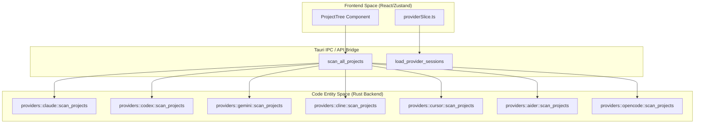
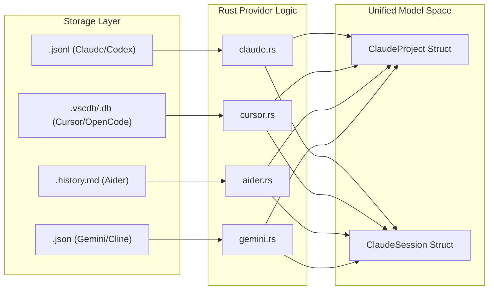

# Provider 구현

관련 소스 파일

다음 파일들은 이 위키 페이지를 생성하기 위한 컨텍스트로 사용되었습니다.

- [docs/superpowers/specs/2026-03-28-wsl-support-design.md](docs/superpowers/specs/2026-03-28-wsl-support-design.md)
- [src-tauri/src/commands/multi_provider.rs](src-tauri/src/commands/multi_provider.rs)
- [src-tauri/src/providers/aider.rs](src-tauri/src/providers/aider.rs)
- [src-tauri/src/providers/cline.rs](src-tauri/src/providers/cline.rs)
- [src-tauri/src/providers/codex.rs](src-tauri/src/providers/codex.rs)
- [src-tauri/src/providers/cursor.rs](src-tauri/src/providers/cursor.rs)
- [src-tauri/src/providers/gemini.rs](src-tauri/src/providers/gemini.rs)
- [src-tauri/src/providers/opencode.rs](src-tauri/src/providers/opencode.rs)
- [src-tauri/src/utils.rs](src-tauri/src/utils.rs)
- [src/components/MessageViewer/helpers/agentProgressHelpers.ts](src/components/MessageViewer/helpers/agentProgressHelpers.ts)
- [src/components/SimpleUpdateManager.tsx](src/components/SimpleUpdateManager.tsx)
- [src/components/contentRenderer/toolUseRenderers/ApplyPatchToolRenderer.tsx](src/components/contentRenderer/toolUseRenderers/ApplyPatchToolRenderer.tsx)
- [src/components/contentRenderer/toolUseRenderers/TaskToolRenderer.tsx](src/components/contentRenderer/toolUseRenderers/TaskToolRenderer.tsx)
- [src/components/contentRenderer/toolUseRenderers/UpdatePlanToolRenderer.tsx](src/components/contentRenderer/toolUseRenderers/UpdatePlanToolRenderer.tsx)
- [src/test/updateSettings.test.ts](src/test/updateSettings.test.ts)
- [src/types/updateSettings.ts](src/types/updateSettings.ts)
- [src/utils/updateSettings.ts](src/utils/updateSettings.ts)

이 페이지는 지원되는 일곱 AI assistant provider인 **Claude Code**, **Codex CLI**, **OpenCode**, **Gemini CLI**, **Cline**, **Cursor**, **Aider**에 대한 backend Rust 구현을 문서화합니다. 각 provider의 filesystem layout, data format, 그리고 해당 module의 scanning/loading logic을 다룹니다.

---

## Provider Interface

각 provider module은 공통 public function 집합을 노출합니다. 이 interface를 강제하는 Rust trait은 없으며, `src-tauri/src/providers/` directory 전반에서 유지되는 convention입니다.

### Provider Discovery
`detect_providers` command는 사용자 system에서 지원되는 모든 tool의 discovery를 orchestrate합니다 [src-tauri/src/commands/multi_provider.rs:17-20]().

**`ProviderInfo` fields:**
| Field | Type | Description |
|---|---|---|
| `id` | `String` | machine identifier(예: `"claude"`, `"aider"`, `"cursor"`) |
| `display_name` | `String` | UI display용 human-readable name |
| `base_path` | `String` | local disk에서 resolve된 root path |
| `is_available` | `bool` | 필요한 file/directory가 존재하는지 여부 |

출처: [src-tauri/src/providers/codex.rs:14-26](), [src-tauri/src/providers/opencode.rs:23-34](), [src-tauri/src/providers/gemini.rs:9-19](), [src-tauri/src/providers/cursor.rs:10-21]()

---

## Provider별 세부 사항

### 1. Claude Code
주요 provider입니다. 표준 `.claude` directory를 읽습니다.
- **Layout:** `~/.claude/projects/{url-encoded-path}/{uuid}.jsonl` [src-tauri/src/commands/project.rs:108-206]().
- **Decoding:** `decode_project_path` utility는 `sessions-index.json` 또는 filesystem existence check를 사용해 URL-encoded directory name을 되돌립니다 [src-tauri/src/utils.rs:181-192]().
- **WSL Support:** Claude는 현재 `resolve_active_wsl_distros`를 통한 명시적 WSL scanning support가 있는 유일한 provider입니다 [src-tauri/src/commands/multi_provider.rs:153-182]().

### 2. Codex CLI
OpenAI의 Codex CLI에서 rollout file을 읽습니다.
- **Layout:** `~/.codex/sessions/rollout-*.jsonl` [src-tauri/src/providers/codex.rs:16-24]().
- **Grouping:** Codex에는 native project concept가 없으므로, session은 `cwd`(Current Working Directory) field를 기준으로 virtual project로 group됩니다 [src-tauri/src/providers/codex.rs:145-162]().
- **Security:** `validate_session_path`는 요청된 file이 canonicalize된 `.codex` directory 내부에 있는지 보장합니다 [src-tauri/src/providers/codex.rs:75-106]().

### 3. OpenCode
legacy JSON storage와 modern SQLite database storage를 모두 지원합니다.
- **Layout:** `~/.local/share/opencode/opencode.db` 또는 `storage/` [src-tauri/src/providers/opencode.rs:24-33]().
- **Normalization:** `epoch_ms_to_rfc3339`를 통해 epoch millisecond를 RFC 3339로 변환합니다 [src-tauri/src/providers/opencode.rs:12-20]().
- **Scanning:** SQLite(`scan_projects_from_db`)를 우선 사용하고 JSON fallback과 merge합니다 [src-tauri/src/providers/opencode.rs:82-111]().

### 4. Gemini CLI
Gemini CLI tool의 chat JSON file을 읽습니다.
- **Layout:** `~/.gemini/tmp/{project_name}/chats/*.json` [src-tauri/src/providers/gemini.rs:10-18]().
- **Filtering:** project list의 noise를 방지하기 위해 scanning 중 `subagent` file을 명시적으로 건너뜁니다 [src-tauri/src/providers/gemini.rs:86-88]().
- **Validation:** file access를 Gemini data root로 제한하기 위해 `validate_gemini_path`를 사용합니다 [src-tauri/src/providers/gemini.rs:135-136]().

### 5. Cline (및 Roo Code)
VS Code extension "Cline"과 fork인 "Roo Code"를 지원합니다.
- **Layout:** `~/Library/Application Support/Code/User/globalStorage/saoudrizwan.claude-dev/` [src-tauri/src/providers/cline.rs:12-15]().
- **Mechanism:** global task history에서 찾은 각 task ID에 대해 `ui_messages.json`을 parse합니다 [src-tauri/src/providers/cline.rs:166-181]().
- **Estimation:** 모든 JSON file을 읽는 작업은 느리므로, initial scan 중 token count를 message count의 proxy로 사용합니다 [src-tauri/src/providers/cline.rs:126-132]().

### 6. Cursor
Cursor editor가 사용하는 internal SQLite database에서 읽습니다.
- **Layout:** `workspaceStorage/{hash}/state.vscdb` [src-tauri/src/providers/cursor.rs:44-50]().
- **Mechanism:** VS Code state database에서 `workbench.panel.composer.model.composerData` key를 query합니다 [src-tauri/src/providers/cursor.rs:204-206]().
- **Virtualization:** internal database row를 file처럼 참조하기 위해 `cursor://` URI scheme을 사용합니다 [src-tauri/src/providers/cursor.rs:167-169]().

### 7. Aider
Markdown 기반 chat history를 parse합니다.
- **Layout:** git repository root에 위치한 `.aider.chat.history.md` [src-tauri/src/providers/aider.rs:7-8]().
- **Parsing:** 단일 Markdown file을 `# aider chat started at` header를 기준으로 여러 session으로 segment하기 위해 `split_sessions`를 사용합니다 [src-tauri/src/providers/aider.rs:129-132]().
- **Shallow Scan:** 성능을 유지하기 위해 `detect()`는 common directory에 대한 depth-1 check만 수행합니다 [src-tauri/src/providers/aider.rs:12-26]().

---

## 아키텍처 및 데이터 흐름

다음 다이어그램은 system이 raw provider data를 unified application state로 연결하는 방식을 보여줍니다.

**Diagram: Provider Command Mapping**
이 다이어그램은 system name을 "Code Entity Space"에서 logic을 실행하는 특정 Rust function에 매핑합니다.

출처: [src-tauri/src/commands/multi_provider.rs:24-149](), [src-tauri/src/providers/aider.rs:40-45](), [src-tauri/src/providers/cursor.rs:44-48]()

**Diagram: Provider Storage to Model Mapping**
provider별 storage type을 unified `ClaudeProject` 및 `ClaudeSession` entity와 연결합니다.

출처: [src-tauri/src/models/mod.rs:1-10](), [src-tauri/src/providers/opencode.rs:184-195](), [src-tauri/src/providers/aider.rs:81-92]()

---

## Tool Name 정규화

provider backend의 중요한 작업은 서로 다른 tool name을 frontend renderer용 unified format으로 정규화하는 것입니다.

- **Codex/OpenCode:** tool call과 result를 별도 message로 emit하는 경우가 많습니다. `multi_provider.rs`의 `merge_tool_execution_messages` function은 message를 순회하며 `assistant` tool request와 이후 `user` result를 pair로 묶습니다 [src-tauri/src/commands/multi_provider.rs:228-284]().
- **Cline:** custom tool name(예: `execute_command`, `read_file`)을 많이 사용합니다. 이는 `convert_cline_message`에서 conversion 중 `ClaudeMessage` content block으로 map됩니다 [src-tauri/src/providers/cline.rs:186-189]().
- **Aider:** Markdown blockquote(`> `)를 사용해 tool interaction을 표현하며, 이는 `has_tool_use` flag를 통해 감지됩니다 [src-tauri/src/providers/aider.rs:145-145]().

출처: [src-tauri/src/commands/multi_provider.rs:228-284](), [src-tauri/src/providers/cline.rs:186-192](), [src-tauri/src/providers/aider.rs:145-145]()
