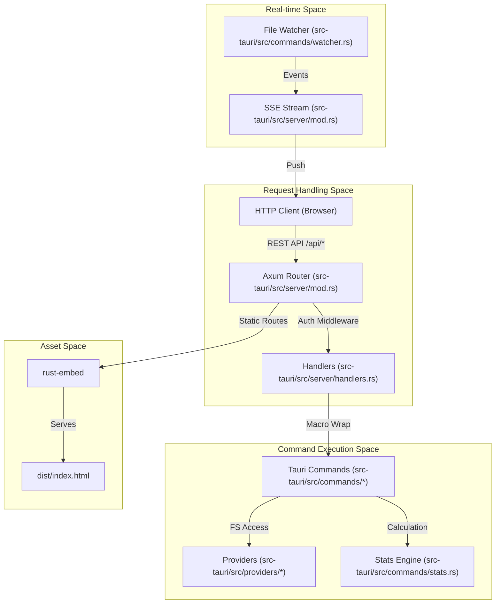
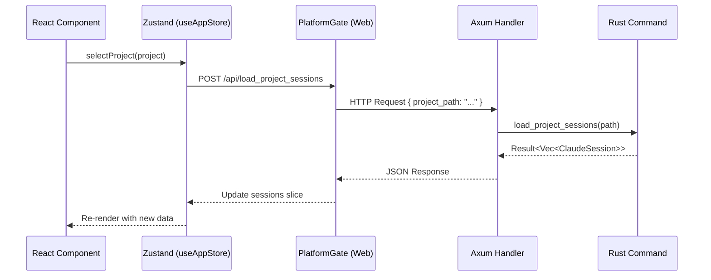

# WebUI Server Mode

<details>
<summary>관련 소스 파일</summary>

다음 파일들은 이 위키 페이지를 생성하기 위한 컨텍스트로 사용되었습니다.

- [.dockerignore](.dockerignore)
- [.github/workflows/server-release.yml](.github/workflows/server-release.yml)
- [Dockerfile](Dockerfile)
- [contrib/cchv.service](contrib/cchv.service)
- [docker-compose.yml](docker-compose.yml)
- [docs/server-guide.ko.md](docs/server-guide.ko.md)
- [docs/server-guide.md](docs/server-guide.md)
- [index.html](index.html)
- [install-server.sh](install-server.sh)
- [src-tauri/src/commands/mod.rs](src-tauri/src/commands/mod.rs)
- [src-tauri/src/lib.rs](src-tauri/src/lib.rs)
- [src-tauri/src/models.rs](src-tauri/src/models.rs)
- [src-tauri/src/server/handlers.rs](src-tauri/src/server/handlers.rs)
- [src-tauri/src/server/mod.rs](src-tauri/src/server/mod.rs)
- [src/App.tsx](src/App.tsx)
- [src/components/MessageViewer.tsx](src/components/MessageViewer.tsx)
- [src/components/ProjectTree.tsx](src/components/ProjectTree.tsx)
- [src/hooks/index.ts](src/hooks/index.ts)
- [src/store/useAppStore.ts](src/store/useAppStore.ts)
- [src/test/ProjectTree.worktree.test.tsx](src/test/ProjectTree.worktree.test.tsx)
- [src/types/core/project.ts](src/types/core/project.ts)
- [src/types/index.ts](src/types/index.ts)
- [src/utils/fileDialog.ts](src/utils/fileDialog.ts)

</details>


WebUI Server Mode는 Claude Code History Viewer(CCHV)를 위한 headless execution mode로, 애플리케이션을 remote server 또는 VPS에서 persistent background service로 실행할 수 있게 합니다. 이 mode에서 애플리케이션은 HTTP를 통해 web interface를 제공하며, local graphical environment 없이도 desktop application의 기능을 mirror합니다.

## 개요

server mode는 전용 binary인 `cchv-server`로 구동됩니다. 이 binary에는 React frontend의 embedded version과 Axum web framework로 구축된 REST API backend가 포함됩니다 [src-tauri/src/lib.rs:7-8](). Bearer token authentication과 Server-Sent Events(SSE)를 통한 real-time update를 갖춘 multi-user-capable environment를 제공합니다.

### 핵심 컴포넌트
| Component | Technology | Role |
| :--- | :--- | :--- |
| **HTTP Server** | Axum (Rust) | routing, middleware, request/response cycle을 처리합니다 [src-tauri/src/server/mod.rs](). |
| **REST API** | Rust Macros | 기존 Tauri command를 HTTP endpoint로 wrap합니다 [src-tauri/src/server/handlers.rs:37-61](). |
| **Real-time Events** | SSE | file system change와 status update를 browser로 push합니다 [src-tauri/src/server/mod.rs](). |
| **Frontend** | React / Vite | `rust-embed`를 사용해 binary에 직접 embed됩니다 [Dockerfile:29-31](). |
| **Auth** | Bearer Token | remote access를 위한 단순 token 기반 security입니다 [src-tauri/src/server/mod.rs](). |

## 시스템 아키텍처

server architecture는 desktop 중심의 Tauri command와 standard web environment 사이의 간극을 연결합니다. `commands` module의 core logic을 재사용하면서 Tauri IPC bridge를 Axum HTTP layer로 대체합니다.

### Server Entity Mapping
다음 다이어그램은 server-side entity가 codebase에 어떻게 매핑되는지 보여줍니다.

**Title: WebUI Server Entity Mapping**

출처: [src-tauri/src/server/mod.rs](), [src-tauri/src/server/handlers.rs](), [src-tauri/src/lib.rs:117-193]()

## REST API 및 Command Mirroring

server는 desktop app에서 사용하는 Tauri `invoke` handler에 직접 대응하는 endpoint를 노출합니다. 이는 async command function을 wrap할 때 boilerplate를 최소화하는 Rust macro를 통해 구현됩니다.

### 구현 패턴
handler는 `handler_json!` 또는 `handler_no_params!` macro를 사용해 정의됩니다 [src-tauri/src/server/handlers.rs:39-61](). 이 macro들은 다음을 수행합니다.
1. 들어오는 JSON body를 특정 parameter struct(예: `ProjectTokenStatsParams`)로 deserialize합니다 [src-tauri/src/server/handlers.rs:170-182]().
2. `crate::commands`의 underlying command function을 호출합니다 [src-tauri/src/server/handlers.rs:55]().
3. command의 `Result`를 JSON response로 다시 serialize합니다 [src-tauri/src/server/handlers.rs:56]().

### Endpoint 예시
| Endpoint | Tauri Command | Description |
| :--- | :--- | :--- |
| `POST /api/scan_projects` | `scan_projects` | Claude project를 찾기 위해 directory를 scan합니다 [src-tauri/src/lib.rs:122](). |
| `POST /api/load_session_messages` | `load_session_messages` | 특정 session의 message를 가져옵니다 [src-tauri/src/lib.rs:125](). |
| `POST /api/get_global_stats_summary` | `get_global_stats_summary` | 모든 provider 전반의 token usage를 aggregate합니다 [src-tauri/src/lib.rs:136](). |

출처: [src-tauri/src/server/handlers.rs](), [src-tauri/src/lib.rs:117-193]()

## 배포 및 설정

### Docker 배포
project는 minimal runtime image(~100MB)를 build하기 위한 multi-stage `Dockerfile`을 제공합니다.
1. **Stage 1 (Frontend):** `pnpm build`를 사용해 React asset을 build합니다 [Dockerfile:5-15]().
2. **Stage 2 (Backend):** `webui-server` feature를 enable한 상태로 Rust binary를 compile하고 `dist/` folder를 embed합니다 [Dockerfile:17-31]().
3. **Stage 3 (Runtime):** 필요한 GTK dependency(shared Tauri logic에 필요)가 포함된 `debian:bookworm-slim` base를 사용합니다 [Dockerfile:34-43]().

### install-server.sh
Linux 사용자를 위해 `install-server.sh` script는 다음을 자동화합니다.
- GitHub Releases에서 최신 `cchv-server` binary를 download합니다 [.github/workflows/server-release.yml:96-103]().
- random secure access token을 생성합니다.
- process management를 위한 systemd service file(`cchv.service`)을 생성합니다 [contrib/cchv.service]().

### Systemd Configuration
service는 일반적으로 port `3727`에서 실행되고, reverse proxy 뒤에 있는 경우 `0.0.0.0` 또는 `127.0.0.1`에 bind되도록 구성됩니다 [Dockerfile:55-56]().

```ini
[Service]
ExecStart=/usr/local/bin/cchv-server --serve --port 3727 --token YOUR_SECRET_TOKEN
Restart=always
User=cchv
```
출처: [Dockerfile](), [install-server.sh](), [contrib/cchv.service](), [.github/workflows/server-release.yml]()

## 데이터 흐름: WebUI vs Desktop

frontend는 communication layer를 추상화하기 위해 `PlatformProvider`를 사용합니다. WebUI mode에서 `useAppStore` action은 `window.__TAURI__.invoke` 대신 HTTP client를 통해 route됩니다.

**Title: WebUI Request-Response Data Flow**

출처: [src/App.tsx:180-199](), [src/store/useAppStore.ts:101-117](), [src-tauri/src/server/handlers.rs:98-102]()
