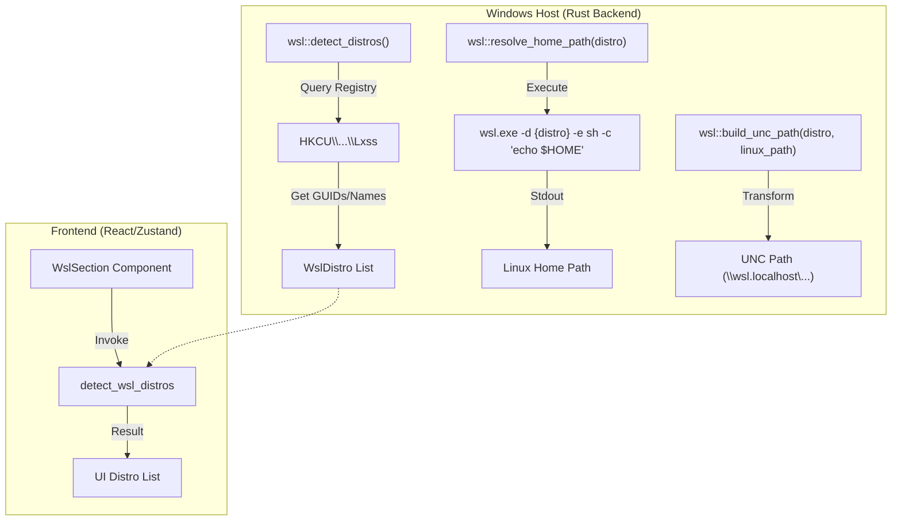
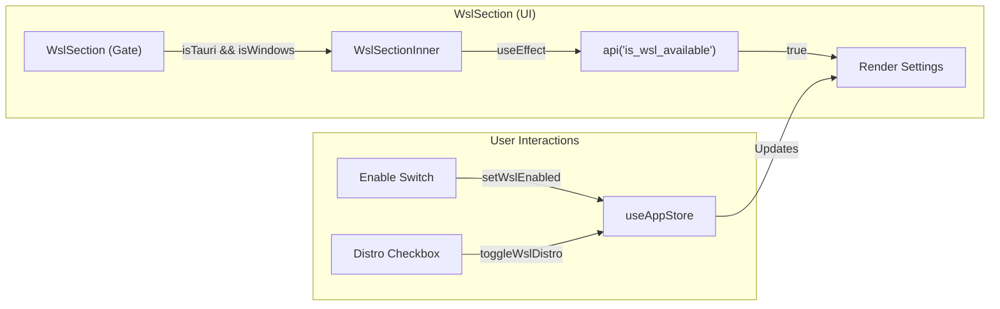

# WSL 지원

관련 소스 파일

다음 파일들은 이 위키 페이지를 생성하기 위한 컨텍스트로 사용되었습니다.

- [src-tauri/src/commands/wsl.rs](src-tauri/src/commands/wsl.rs)
- [src-tauri/src/wsl.rs](src-tauri/src/wsl.rs)
- [src/components/SettingsManager/sections/WslSection.tsx](src/components/SettingsManager/sections/WslSection.tsx)
- [src/components/modals/folderSelect/FolderSelector.tsx](src/components/modals/folderSelect/FolderSelector.tsx)
- [src/i18n/locales/en/settings.json](src/i18n/locales/en/settings.json)
- [src/i18n/locales/ja/settings.json](src/i18n/locales/ja/settings.json)
- [src/i18n/locales/ko/settings.json](src/i18n/locales/ko/settings.json)
- [src/i18n/locales/zh-CN/settings.json](src/i18n/locales/zh-CN/settings.json)
- [src/i18n/locales/zh-TW/settings.json](src/i18n/locales/zh-TW/settings.json)
- [src/i18n/types.generated.ts](src/i18n/types.generated.ts)

Claude Code History Viewer는 **Windows Subsystem for Linux (WSL)**를 위한 특화된 통합을 제공하여, Windows 사용자가 Linux distribution 내부에 저장된 AI coding history를 탐색하고 분석할 수 있게 합니다. 이 통합에는 자동 distribution detection, Windows와 Linux 사이의 filesystem path translation, 전용 configuration interface가 포함됩니다.

## WSL 통합 개요

WSL 지원은 Windows 기반 Tauri host와 Claude Code 또는 Aider 같은 tool이 실행될 수 있는 Linux guest filesystem 사이의 간극을 연결하도록 설계되었습니다. 시스템은 Windows Registry를 통해 설치된 distribution을 감지하고 `wsl.exe` command-line utility를 사용해 상호작용합니다 [src-tauri/src/wsl.rs:25-32]().

### 주요 기능
*   **Distribution Detection**: 설치된 WSL distro(예: Ubuntu, Debian)를 자동으로 식별하고 default distribution을 판별합니다 [src-tauri/src/wsl.rs:40-73]().
*   **Path Translation**: Linux absolute path(예: `/home/user/.claude`)를 cross-system file access를 위한 Windows UNC path(예: `\\wsl.localhost\Ubuntu\home\user\.claude`)로 변환합니다 [src-tauri/src/wsl.rs:11-23]().
*   **Home Directory Resolution**: 특정 distribution의 `$HOME` path를 동적으로 resolve하여 configuration file을 찾습니다 [src-tauri/src/wsl.rs:81-112]().
*   **Selective Scanning**: 사용자는 WSL scanning을 전역적으로 또는 특정 distribution별로 enable/disable할 수 있습니다 [src/components/SettingsManager/sections/WslSection.tsx:39-44]().

---

## 시스템 아키텍처 및 데이터 흐름

WSL 통합은 OS-level interaction을 위한 Rust backend와 user configuration을 위한 React frontend에 걸쳐 있습니다.

### WSL Logic Flow
다음 다이어그램은 시스템이 distribution을 감지하고 path를 resolve하는 방식을 보여줍니다.

**Diagram: WSL Distribution and Path Resolution**

출처: `[src-tauri/src/wsl.rs:40-73]()`, `[src-tauri/src/wsl.rs:81-112]()`, `[src-tauri/src/commands/wsl.rs:3-6]()`, `[src/components/SettingsManager/sections/WslSection.tsx:59-66]()`

---

## Backend 구현

backend logic은 Windows subsystem과 상호작용하기 위한 core utility를 제공하는 `wsl.rs` 안에 포함되어 있습니다.

### Distribution Detection
`detect_distros` function은 등록된 모든 distribution을 찾기 위해 Windows Registry key `HKEY_CURRENT_USER\SOFTWARE\Microsoft\Windows\CurrentVersion\Lxss`를 읽습니다 [src-tauri/src/wsl.rs:40-48](). `DistributionName`을 추출하고 GUID를 `DefaultDistribution`과 비교하여 default distro를 표시합니다 [src-tauri/src/wsl.rs:50-65]().

### Path Mapping
Windows application에서 WSL 내부 file에 접근하기 위해 backend는 두 형식을 사용해 path를 변환합니다.
1.  **Primary**: `\\wsl.localhost\{distro}\{path}` [src-tauri/src/wsl.rs:12-16]()
2.  **Fallback**: `\\wsl$\{distro}\{path}` [src-tauri/src/wsl.rs:19-23]()

`resolve_wsl_provider_path` function은 primary UNC path를 먼저 시도하고, filesystem에 primary가 존재하지 않으면 legacy `wsl$` format으로 fallback합니다 [src-tauri/src/wsl.rs:138-148]().

### Command Interface
다음 Tauri command는 WSL 기능을 frontend에 노출합니다.

| Command | Return Type | Description |
| :--- | :--- | :--- |
| `detect_wsl_distros` | `Result<Vec<WslDistro>, String>` | 설치된 모든 WSL distribution 목록을 반환합니다 [src-tauri/src/commands/wsl.rs:4-6](). |
| `is_wsl_available` | `Result<bool, String>` | host system에 WSL registry key가 존재하는지 확인합니다 [src-tauri/src/commands/wsl.rs:9-11](). |

출처: `[src-tauri/src/wsl.rs:1-148]()`, `[src-tauri/src/commands/wsl.rs:1-12]()`

---

## Frontend 통합: WslSection

Settings Manager의 `WslSection` component는 WSL 통합을 관리하기 위한 interface를 제공합니다. 이 component는 애플리케이션이 Windows에서 Tauri로 실행 중일 때만 render되도록 보장하는 "Gate"로 보호됩니다 [src/components/SettingsManager/sections/WslSection.tsx:194-203]().

### 구현 세부 사항
*   **Availability Check**: mount 시 component는 UI를 표시해야 하는지 판단하기 위해 `is_wsl_available`을 호출합니다 [src/components/SettingsManager/sections/WslSection.tsx:206-209]().
*   **State Management**: `useAppStore`를 활용해 `userMetadata.settings.wsl`에 접근하며, 이는 `enabled` status와 `excludedDistros` list를 추적합니다 [src/components/SettingsManager/sections/WslSection.tsx:39-44]().
*   **Dynamic Loading**: enable되면 사용자가 toggle할 수 있는 available distribution 목록을 채우기 위해 `detect_wsl_distros`를 trigger합니다 [src/components/SettingsManager/sections/WslSection.tsx:59-66]().

**Diagram: WslSection Component Logic**

출처: `[src/components/SettingsManager/sections/WslSection.tsx:37-188]()`, `[src/components/SettingsManager/sections/WslSection.tsx:194-210]()`

### Localization
WSL 관련 string은 `settings.wsl` namespace 아래 i18n system을 통해 관리되며, title, description, scanning status, 많은 distribution을 scan할 때 발생할 수 있는 performance impact에 대한 warning의 번역을 제공합니다 [src/i18n/types.generated.ts:20-28]().

출처: `[src/components/SettingsManager/sections/WslSection.tsx:110-178]()`, `[src/i18n/locales/en/settings.json]()` (namespace reference를 통해).
