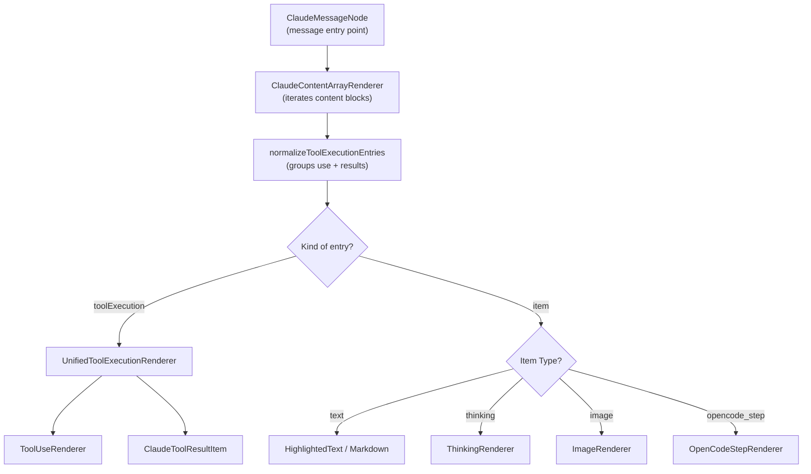
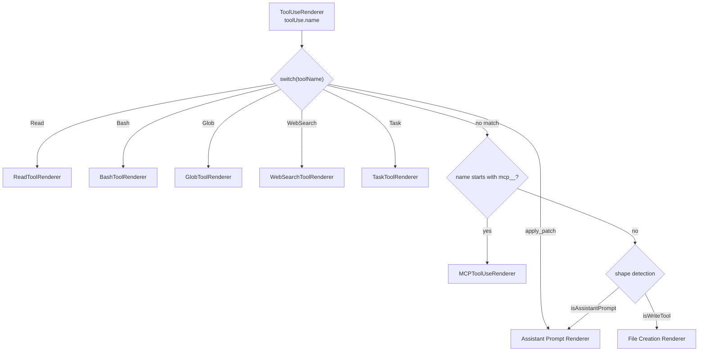

# Content Rendering

관련 소스 파일

다음 파일들은 이 위키 페이지를 생성하기 위한 컨텍스트로 사용되었습니다.

- [src/components/ErrorBoundary.tsx](src/components/ErrorBoundary.tsx)
- [src/components/contentRenderer/ClaudeContentArrayRenderer.tsx](src/components/contentRenderer/ClaudeContentArrayRenderer.tsx)
- [src/components/contentRenderer/OpenCodeStepRenderer.tsx](src/components/contentRenderer/OpenCodeStepRenderer.tsx)
- [src/components/contentRenderer/ToolUseRenderer.tsx](src/components/contentRenderer/ToolUseRenderer.tsx)
- [src/components/messageRenderer/ClaudeToolUseDisplay.tsx](src/components/messageRenderer/ClaudeToolUseDisplay.tsx)
- [src/components/messageRenderer/CommandOutputDisplay.tsx](src/components/messageRenderer/CommandOutputDisplay.tsx)
- [src/components/toolResultRenderer/ClaudeToolResultItem.tsx](src/components/toolResultRenderer/ClaudeToolResultItem.tsx)
- [src/components/toolResultRenderer/FallbackRenderer.tsx](src/components/toolResultRenderer/FallbackRenderer.tsx)
- [src/i18n/locales/en/renderers.json](src/i18n/locales/en/renderers.json)
- [src/i18n/locales/ja/renderers.json](src/i18n/locales/ja/renderers.json)
- [src/i18n/locales/ko/renderers.json](src/i18n/locales/ko/renderers.json)
- [src/i18n/locales/zh-CN/renderers.json](src/i18n/locales/zh-CN/renderers.json)
- [src/i18n/locales/zh-TW/renderers.json](src/i18n/locales/zh-TW/renderers.json)

이 페이지는 raw Claude message data를 formatted UI component로 변환하는 pipeline인 content rendering system의 개요를 제공합니다. rendering system은 Message Viewer에 표시되는 message text display, tool invocation card, tool execution result panel을 다룹니다.

이 renderer들을 hosting하는 Message Viewer의 자세한 내용은 [Message Viewer](#3.3)를 참조하세요. ANSI terminal output rendering에 대해서는 [ANSI and Terminal Rendering](#6.4)을 참조하세요. tool icon styling과 variant mapping은 [Tool Icons and Display](#6.3)를 참조하세요. Session Board의 brushing/filtering system은 [Brushing System](#6.2)을 참조하세요.

---

## 시스템 개요

rendering system은 표시되는 content block의 종류에 따라 두 개의 parallel pipeline으로 구성됩니다. 핵심 entry point는 `ClaudeContentArrayRenderer`이며, 이제 `tool_use` call과 해당 `tool_results`를 unified execution block으로 group하는 normalization step을 수행합니다 [src/components/contentRenderer/ClaudeContentArrayRenderer.tsx:88-136]().

- **Tool-use pipeline**: Claude의 tool *invocation*(Claude가 tool에 요청한 내용)을 rendering하며, `ToolUseRenderer`가 dispatch합니다.
- **Tool-result pipeline**: tool execution의 *response*를 rendering하며, `ClaudeToolResultItem` 또는 specialized sub-renderer가 dispatch합니다.
- **Unified pipeline**: `UnifiedToolExecutionRenderer`는 향상된 context를 위해 use와 result를 하나의 visual card로 결합합니다 [src/components/contentRenderer/ClaudeContentArrayRenderer.tsx:164-174]().

**Rendering pipeline — high level**

출처: [src/components/contentRenderer/ClaudeContentArrayRenderer.tsx:88-136](), [src/components/contentRenderer/ClaudeContentArrayRenderer.tsx:164-216]()

---

## Message Content Display

`ClaudeContentArrayRenderer`는 raw text와 specialized metadata block을 처리합니다. text의 경우 standard Markdown과 search-highlighted text를 모두 지원합니다 [src/components/contentRenderer/ClaudeContentArrayRenderer.tsx:188-211]().

**주요 specialized renderer:**

| Component | File | Role |
|---|---|---|
| `ThinkingRenderer` | `src/components/contentRenderer/ThinkingRenderer.tsx` | AI reasoning/thought block을 표시합니다 [src/components/contentRenderer/ClaudeContentArrayRenderer.tsx:15](). |
| `OpenCodeStepRenderer` | `src/components/contentRenderer/OpenCodeStepRenderer.tsx` | snapshot, cost, token breakdown(input, output, reasoning, cache)을 포함한 OpenCode-specific step을 표시합니다 [src/components/contentRenderer/OpenCodeStepRenderer.tsx:20-69](). |
| `ImageRenderer` | `src/components/contentRenderer/ImageRenderer.tsx` | base64 또는 URL 기반 image를 rendering합니다 [src/components/contentRenderer/ClaudeContentArrayRenderer.tsx:18](). |

출처: [src/components/contentRenderer/ClaudeContentArrayRenderer.tsx:188-211](), [src/components/contentRenderer/OpenCodeStepRenderer.tsx:7-18]()

---

## Tool-Use Rendering

`ToolUseRenderer`는 tool-use content block의 `name` field를 기준으로 dispatch합니다. tool name을 특정 UI component에 mapping하고, `getToolVariant`를 통해 visual variant(예: `success`, `info`, `warning`)를 적용합니다 [src/components/contentRenderer/ToolUseRenderer.tsx:91-92]().

**Tool-use dispatch diagram**

출처: [src/components/contentRenderer/ToolUseRenderer.tsx:111-178](), [src/components/contentRenderer/ToolUseRenderer.tsx:180-213]()

---

## Tool-Result Rendering

Tool result는 주로 `ClaudeToolResultItem`이 rendering하며, environment가 반환하는 다양한 data format을 처리합니다. file content, search result, error state에 대한 specific layout을 지원합니다 [src/components/toolResultRenderer/ClaudeToolResultItem.tsx:43-56]().

**Specialized Result Handling:**
- **Numbered File Content**: line number가 포함된 string에서 code를 자동으로 감지하고 추출하며, syntax highlighting과 copy button을 제공합니다 [src/components/toolResultRenderer/ClaudeToolResultItem.tsx:150-192]().
- **File Search Results**: directory/filename 분리를 포함한 file path 목록을 rendering합니다 [src/components/toolResultRenderer/ClaudeToolResultItem.tsx:105-147]().
- **System Reminders**: tool output에 embed된 warning 또는 system message를 parse하고 표시합니다 [src/components/toolResultRenderer/ClaudeToolResultItem.tsx:79-102]().
- **Fallback**: `FallbackRenderer`를 통해 알려지지 않은 object structure에 대한 generic JSON highlighting을 제공합니다 [src/components/toolResultRenderer/FallbackRenderer.tsx:13-62]().

출처: [src/components/toolResultRenderer/ClaudeToolResultItem.tsx:150-192](), [src/components/toolResultRenderer/FallbackRenderer.tsx:25-30]()

---

## Command Output Display

`CommandOutputDisplay`는 terminal output(`stdout`) rendering에 사용됩니다. 더 나은 visual context를 위해 heuristic detection으로 output을 categorize합니다 [src/components/messageRenderer/CommandOutputDisplay.tsx:35-52]().

| Output Category | Detection Condition | Component / Style |
|---|---|---|
| **Test Results** | `Test Suites:`, `jest`, `coverage` | `TestTube` icon, `success` variant [src/components/messageRenderer/CommandOutputDisplay.tsx:118-143](). |
| **Build Output** | `webpack`, `build`, `compile` | `Hammer` icon, `terminal` variant [src/components/messageRenderer/CommandOutputDisplay.tsx:146-173](). |
| **Package Management** | `npm`, `yarn`, `pnpm` | `Package` icon, `terminal` variant [src/components/messageRenderer/CommandOutputDisplay.tsx:176-203](). |
| **JSON Output** | Starts with `{`, ends with `}` | `prism-react-renderer` JSON block [src/components/messageRenderer/CommandOutputDisplay.tsx:60-111](). |
| **Table Output** | Contains `\|` and `-` | `BarChart3` icon [src/components/messageRenderer/CommandOutputDisplay.tsx:206-230](). |

모든 terminal-like output은 color formatting을 보존하기 위해 `AnsiText`를 거칩니다 [src/components/messageRenderer/CommandOutputDisplay.tsx:139]().

출처: [src/components/messageRenderer/CommandOutputDisplay.tsx:35-52](), [src/components/messageRenderer/CommandOutputDisplay.tsx:22-23]()

---

## Shared Infrastructure

### Design Tokens 및 Layout
시스템은 renderer 전반에서 일관된 padding, icon, color를 보장하기 위해 central `layout` object와 `getVariantStyles`에 의존합니다 [src/components/renderers/index.ts](). renderer는 standardized header와 content area를 제공하기 위해 `Renderer`(`src/shared/RendererHeader`에서 가져옴)를 wrapper로 사용합니다 [src/components/toolResultRenderer/ClaudeToolResultItem.tsx:155-171]().

### Syntax Highlighting
Syntax highlighting은 `prism-react-renderer`로 구동됩니다. light 및 dark mode 모두에서 readability를 보장하기 위해 `getPreStyles`, `getLineStyles`, `getTokenStyles` utility를 사용해 theme-aware style이 적용됩니다 [src/components/messageRenderer/ClaudeToolUseDisplay.tsx:43-65]().

### Localization
모든 label과 title은 `i18next` namespace, 특히 `renderers.json`과 `tools.json`을 사용해 localize됩니다.
출처: [src/i18n/locales/en/renderers.json:1-139](), [src/components/contentRenderer/OpenCodeStepRenderer.tsx:50-65]()

---

## Renderer Component Map

| Component | File | Handles |
|---|---|---|
| `ClaudeContentArrayRenderer` | `src/components/contentRenderer/ClaudeContentArrayRenderer.tsx` | Main entry point; use/result normalization. |
| `UnifiedToolExecutionRenderer` | `src/components/contentRenderer/UnifiedToolExecutionRenderer.tsx` | grouped tool call과 result를 위한 container. |
| `ToolUseRenderer` | `src/components/contentRenderer/ToolUseRenderer.tsx` | 모든 `tool_use` block용 dispatcher. |
| `ClaudeToolResultItem` | `src/components/toolResultRenderer/ClaudeToolResultItem.tsx` | `tool_result` content용 primary renderer. |
| `OpenCodeStepRenderer` | `src/components/contentRenderer/OpenCodeStepRenderer.tsx` | OpenCode execution step용 metadata. |
| `CommandOutputDisplay` | `src/components/messageRenderer/CommandOutputDisplay.tsx` | intelligent terminal output formatting. |
| `ClaudeToolUseDisplay` | `src/components/messageRenderer/ClaudeToolUseDisplay.tsx` | generic JSON-based tool input display. |

출처: [src/components/contentRenderer/ClaudeContentArrayRenderer.tsx:13-33](), [src/components/contentRenderer/ToolUseRenderer.tsx:41-56]()
