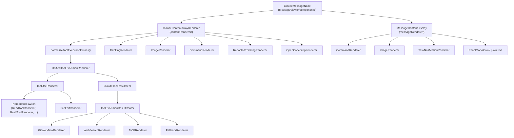
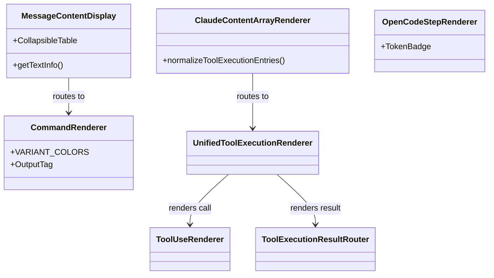

# Content Renderer

관련 소스 파일

다음 파일들은 이 위키 페이지를 생성하기 위한 컨텍스트로 사용되었습니다.

- [src-tauri/src/commands/session/delete.rs](src-tauri/src/commands/session/delete.rs)
- [src/App.css](src/App.css)
- [src/components/AdvancedTextDiff.tsx](src/components/AdvancedTextDiff.tsx)
- [src/components/EnhancedDiffViewer.tsx](src/components/EnhancedDiffViewer.tsx)
- [src/components/MessageViewer/components/ClaudeMessageNode.tsx](src/components/MessageViewer/components/ClaudeMessageNode.tsx)
- [src/components/MessageViewer/helpers/messageHelpers.ts](src/components/MessageViewer/helpers/messageHelpers.ts)
- [src/components/common/Markdown.tsx](src/components/common/Markdown.tsx)
- [src/components/contentRenderer/ClaudeContentArrayRenderer.tsx](src/components/contentRenderer/ClaudeContentArrayRenderer.tsx)
- [src/components/contentRenderer/CommandRenderer.tsx](src/components/contentRenderer/CommandRenderer.tsx)
- [src/components/contentRenderer/OpenCodeStepRenderer.tsx](src/components/contentRenderer/OpenCodeStepRenderer.tsx)
- [src/components/contentRenderer/UnifiedToolExecutionRenderer.tsx](src/components/contentRenderer/UnifiedToolExecutionRenderer.tsx)
- [src/components/contentRenderer/unifiedCards/AgentCard.tsx](src/components/contentRenderer/unifiedCards/AgentCard.tsx)
- [src/components/contentRenderer/unifiedCards/BashCard.tsx](src/components/contentRenderer/unifiedCards/BashCard.tsx)
- [src/components/contentRenderer/unifiedCards/DefaultCard.tsx](src/components/contentRenderer/unifiedCards/DefaultCard.tsx)
- [src/components/contentRenderer/unifiedCards/EditCard.tsx](src/components/contentRenderer/unifiedCards/EditCard.tsx)
- [src/components/contentRenderer/unifiedCards/GlobCard.tsx](src/components/contentRenderer/unifiedCards/GlobCard.tsx)
- [src/components/contentRenderer/unifiedCards/GrepCard.tsx](src/components/contentRenderer/unifiedCards/GrepCard.tsx)
- [src/components/contentRenderer/unifiedCards/ReadCard.tsx](src/components/contentRenderer/unifiedCards/ReadCard.tsx)
- [src/components/contentRenderer/unifiedCards/ResultBlock.tsx](src/components/contentRenderer/unifiedCards/ResultBlock.tsx)
- [src/components/contentRenderer/unifiedCards/StatusBadge.tsx](src/components/contentRenderer/unifiedCards/StatusBadge.tsx)
- [src/components/contentRenderer/unifiedCards/shared.ts](src/components/contentRenderer/unifiedCards/shared.ts)
- [src/components/messageRenderer/MessageContentDisplay.tsx](src/components/messageRenderer/MessageContentDisplay.tsx)
- [src/components/messageRenderer/SystemMessageRenderer.tsx](src/components/messageRenderer/SystemMessageRenderer.tsx)
- [src/components/messageRenderer/ToolExecutionResultRouter.tsx](src/components/messageRenderer/ToolExecutionResultRouter.tsx)
- [src/components/toolResultRenderer/CodebaseContextRenderer.tsx](src/components/toolResultRenderer/CodebaseContextRenderer.tsx)
- [src/components/toolResultRenderer/ContentArrayRenderer.tsx](src/components/toolResultRenderer/ContentArrayRenderer.tsx)
- [src/components/toolResultRenderer/ErrorRenderer.tsx](src/components/toolResultRenderer/ErrorRenderer.tsx)
- [src/components/toolResultRenderer/FileListRenderer.tsx](src/components/toolResultRenderer/FileListRenderer.tsx)
- [src/components/toolResultRenderer/GitWorkflowRenderer.tsx](src/components/toolResultRenderer/GitWorkflowRenderer.tsx)
- [src/components/toolResultRenderer/MCPRenderer.tsx](src/components/toolResultRenderer/MCPRenderer.tsx)
- [src/components/toolResultRenderer/StringRenderer.tsx](src/components/toolResultRenderer/StringRenderer.tsx)
- [src/components/toolResultRenderer/TodoUpdateRenderer.tsx](src/components/toolResultRenderer/TodoUpdateRenderer.tsx)
- [src/components/toolResultRenderer/WebSearchRenderer.tsx](src/components/toolResultRenderer/WebSearchRenderer.tsx)
- [src/i18n/locales/en/renderers.json](src/i18n/locales/en/renderers.json)
- [src/i18n/locales/ja/renderers.json](src/i18n/locales/ja/renderers.json)
- [src/i18n/locales/ko/renderers.json](src/i18n/locales/ko/renderers.json)
- [src/i18n/locales/zh-CN/renderers.json](src/i18n/locales/zh-CN/renderers.json)
- [src/i18n/locales/zh-TW/renderers.json](src/i18n/locales/zh-TW/renderers.json)

이 페이지는 Claude API message, tool invocation, tool execution result를 표시하기 위해 Message Viewer에서 사용하는 content rendering pipeline을 문서화합니다. entry-point component, dispatch logic, specialized sub-renderer suite를 다룹니다.

이 pipeline을 호출하는 외부 message scroll 및 virtual row management는 Message Viewer([3.3]())를 참조하세요. tool icon styling과 variant classification은 Tool Icons and Display([6.3]())를 참조하세요. ANSI terminal output rendering은 ANSI and Terminal Rendering([6.4]())을 참조하세요.

---

## Pipeline 개요

rendering pipeline에는 specialized leaf renderer의 공유 집합으로 수렴하는 두 개의 parallel entry point가 있습니다. `ClaudeContentArrayRenderer`는 structured array content(Claude API의 표준)를 처리하고, `MessageContentDisplay`는 embedded tag를 감지하여 legacy 또는 flat string content를 처리합니다.

**Pipeline: Message Viewer to Leaf Renderers**

출처: [src/components/MessageViewer/components/ClaudeMessageNode.tsx:14-25](), [src/components/contentRenderer/ClaudeContentArrayRenderer.tsx:13-33](), [src/components/messageRenderer/MessageContentDisplay.tsx:1-12]()

---

## `ClaudeContentArrayRenderer`

**File:** `src/components/contentRenderer/ClaudeContentArrayRenderer.tsx`

modern Claude message의 primary entry point입니다. `content: unknown[]` array를 받아 각 item을 rendering합니다. [src/components/contentRenderer/ClaudeContentArrayRenderer.tsx:138-150]()

### Normalization Step

rendering 전에 `normalizeToolExecutionEntries()` [src/components/contentRenderer/ClaudeContentArrayRenderer.tsx:88-136]()는 array를 scan하여 각 `tool_use` item을 같은 `tool_use_id`를 공유하는 이후의 `tool_result` item과 pair로 묶습니다. 이를 통해 UI는 tool call과 그 result를 하나의 unified card 안에서 rendering할 수 있습니다.

| `kind` | Meaning |
|---|---|
| `"toolExecution"` | `tool_use` item과 0개 이상의 matching `tool_result` item을 함께 묶은 것 |
| `"item"` | 개별적으로 rendering되는 기타 content item |

### Content Type Dispatch

각 `item` entry는 `item.type`에 대한 `switch`로 dispatch됩니다. [src/components/contentRenderer/ClaudeContentArrayRenderer.tsx:187-320]()

| `item.type` | Renderer component |
|---|---|
| `"text"` | inline `HighlightedText` 또는 `Markdown` [src/components/contentRenderer/ClaudeContentArrayRenderer.tsx:188-211]() |
| `"image"` | `ImageRenderer` [src/components/contentRenderer/ClaudeContentArrayRenderer.tsx:215-224]() |
| `"thinking"` | `ThinkingRenderer` [src/components/contentRenderer/ClaudeContentArrayRenderer.tsx:227-236]() |
| `"redacted_thinking"` | `RedactedThinkingRenderer` [src/components/contentRenderer/ClaudeContentArrayRenderer.tsx:238-246]() |
| `"command"` | `CommandRenderer` [src/components/contentRenderer/ClaudeContentArrayRenderer.tsx:268-276]() |
| `"opencode_step"` | `OpenCodeStepRenderer` [src/components/contentRenderer/ClaudeContentArrayRenderer.tsx:288-293]() |

출처: [src/components/contentRenderer/ClaudeContentArrayRenderer.tsx:88-320]()

---

## `MessageContentDisplay`

**File:** `src/components/messageRenderer/MessageContentDisplay.tsx`

flat string `content`를 처리합니다. 일부 provider가 structured content array 대신 사용하는 embedded XML-like tag를 rendering하는 데 특히 중요합니다. [src/components/messageRenderer/MessageContentDisplay.tsx:119-125]()

**Dispatch sequence**(우선순위 순):

1. **Task Notifications**: `hasTaskNotification(content)`이면 → `TaskNotificationRenderer`. [src/components/messageRenderer/MessageContentDisplay.tsx:148-150]()
2. **Commands**: XML command tag가 존재하면(예: `<command-name>`) → `CommandRenderer`. [src/components/messageRenderer/MessageContentDisplay.tsx:152-162]()
3. **Images**: content가 image URL 또는 base64 data URI와 match되면 → `ImageRenderer`. [src/components/messageRenderer/MessageContentDisplay.tsx:164-166]()
4. **Markdown**: `remark-gfm`과 custom `CollapsibleTable` support를 포함한 표준 `ReactMarkdown`. [src/components/messageRenderer/MessageContentDisplay.tsx:238-285]()

출처: [src/components/messageRenderer/MessageContentDisplay.tsx:141-285]()

---

## Specialized Sub-Renderer

### `CommandRenderer`
**File:** `src/components/contentRenderer/CommandRenderer.tsx`

XML-tagged command record를 포함하는 user 및 system message를 처리합니다(예: Claude Code 또는 Gemini CLI에서 온 것).
* **Extraction**: regex를 사용해 `<command-name>`, `<command-args>`, `<command-message>`를 추출합니다. [src/components/contentRenderer/CommandRenderer.tsx:74-92]()
* **Output Handling**: terminal-style display를 위해 `<stdout>`, `<stderr>`, `<local-command-stdout>` tag를 구체적으로 capture합니다. [src/components/contentRenderer/CommandRenderer.tsx:108-161]()
* **Variants**: assistant context용 `"accent"`(blue)와 system notification용 `"system"`(amber)을 지원합니다. [src/components/contentRenderer/CommandRenderer.tsx:38-53]()

### `OpenCodeStepRenderer`
**File:** `src/components/contentRenderer/OpenCodeStepRenderer.tsx`

OpenCode provider의 execution step을 위한 specialized renderer입니다.
* **Metadata**: reasoning, snapshot hash, step cost를 표시합니다. [src/components/contentRenderer/OpenCodeStepRenderer.tsx:21-47]()
* **Token Badges**: `TokenBadge` component를 사용해 세분화된 token usage(input, output, reasoning, cache)를 표시합니다. [src/components/contentRenderer/OpenCodeStepRenderer.tsx:53-67]()

### `UnifiedToolExecutionRenderer`
**File:** `src/components/contentRenderer/UnifiedToolExecutionRenderer.tsx`

tool invocation과 result를 group하는 modern "card" renderer입니다. tool name을 기준으로 specific card에 route합니다.
* **File Operations**: `ReadCard`, `EditCard`, `GlobCard`.
* **System**: `BashCard`, `GrepCard`.
* **Fallback**: unknown tool용 `DefaultCard`.

출처: [src/components/contentRenderer/CommandRenderer.tsx:38-161](), [src/components/contentRenderer/OpenCodeStepRenderer.tsx:20-83](), [src/components/contentRenderer/ClaudeContentArrayRenderer.tsx:163-174]()

---

## Shared Components 및 데이터 흐름

renderer는 provider마다 일관된 UI/UX를 제공하기 위해 shared utility에 의존합니다.

**Entity Mapping: Rendering Logic to Code Entities**

* **Expansion State**: code block 또는 command output이 open 상태인지 persist하기 위해 `useCaptureExpandState`로 관리됩니다. [src/components/contentRenderer/CommandRenderer.tsx:63](), [src/components/messageRenderer/MessageContentDisplay.tsx:127]()
* **Highlighting**: rendered content 안의 search match를 표시하기 위해 전반적으로 `HighlightedText`가 사용됩니다. [src/components/contentRenderer/ClaudeContentArrayRenderer.tsx:198-203](), [src/components/contentRenderer/CommandRenderer.tsx:9]()
* **I18n**: 모든 renderer는 localized label에 `renderers` namespace를 사용합니다(예: `advancedTextDiff.added`, `commandRenderer.command`). [src/i18n/locales/en/renderers.json:1-150]()

출처: [src/components/contentRenderer/ClaudeContentArrayRenderer.tsx:198-203](), [src/components/contentRenderer/CommandRenderer.tsx:63](), [src/components/messageRenderer/MessageContentDisplay.tsx:127](), [src/i18n/locales/en/renderers.json:1-150]()
