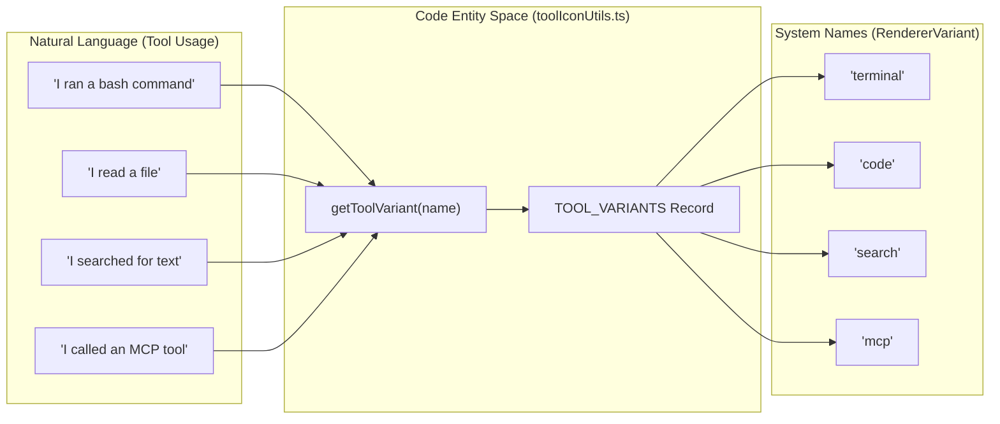
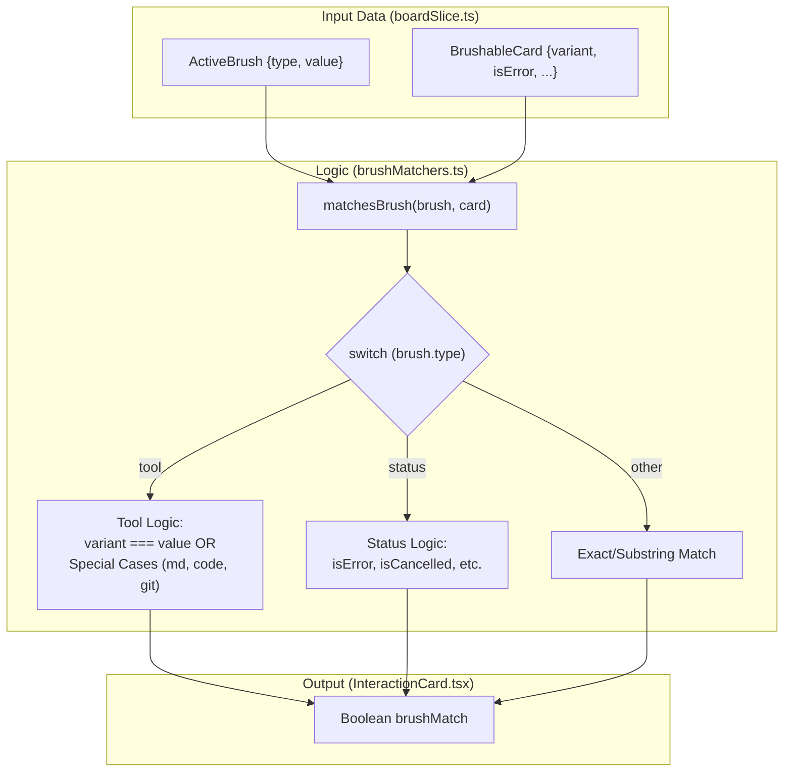

# Brushing System

<details>
<summary>관련 소스 파일</summary>

다음 파일들은 이 위키 페이지를 생성하기 위한 컨텍스트로 사용되었습니다.

- [docs/BRUSHING_SPEC.md](docs/BRUSHING_SPEC.md)
- [src/components/SessionBoard/BoardControls.tsx](src/components/SessionBoard/BoardControls.tsx)
- [src/components/SessionBoard/InteractionCard.tsx](src/components/SessionBoard/InteractionCard.tsx)
- [src/components/SessionBoard/SessionBoard.tsx](src/components/SessionBoard/SessionBoard.tsx)
- [src/components/SessionBoard/SessionLane.tsx](src/components/SessionBoard/SessionLane.tsx)
- [src/components/SessionItem.tsx](src/components/SessionItem.tsx)
- [src/components/SmartJsonDisplay.tsx](src/components/SmartJsonDisplay.tsx)
- [src/components/ToolIcon.tsx](src/components/ToolIcon.tsx)
- [src/components/renderers/index.ts](src/components/renderers/index.ts)
- [src/components/renderers/types.ts](src/components/renderers/types.ts)
- [src/store/slices/boardSlice.ts](src/store/slices/boardSlice.ts)
- [src/test/SessionItem.test.tsx](src/test/SessionItem.test.tsx)
- [src/types/board.types.ts](src/types/board.types.ts)
- [src/utils/brushMatchers.ts](src/utils/brushMatchers.ts)
- [src/utils/sessionAnalytics.ts](src/utils/sessionAnalytics.ts)
- [src/utils/toolIconUtils.ts](src/utils/toolIconUtils.ts)
- [src/utils/toolSummaries.ts](src/utils/toolSummaries.ts)

</details>


Brushing System은 `SessionBoard` view 전반에서 interactive filtering을 제공하여, 사용자가 여러 session에 걸친 관련 interaction을 동시에 highlight할 수 있게 합니다. brush가 active 상태이면 matching card는 강조되고 non-matching card는 흐리게 처리되어 timeline 전반의 pattern recognition을 가능하게 합니다(예: "어떤 session이 이 file을 건드렸는가?", "error가 어디에 몰렸는가?", "tool mix는 어땠는가?").

SessionBoard component 자체에 대한 정보는 [Session Board](#3.2)를 참조하세요. 개별 message card rendering은 [Content Renderers](#6.1)를 참조하세요.

---

## 핵심 개념

**Brushing**은 한 view에서 attribute를 선택하거나 hover하면 모든 view에서 해당 attribute를 가진 모든 item을 highlight하는 information visualization technique입니다. 이 애플리케이션에서는 brush(예: "terminal" tool type)를 활성화하면 표시된 모든 session lane 전반에서 terminal 관련 interaction이 highlight되고, 관련 없는 interaction은 흐리게 처리됩니다.

시스템은 두 가지 interaction mode를 지원합니다.
- **Transient brush** (hover): mouse가 벗어날 때까지 filter를 일시적으로 활성화합니다.
- **Sticky brush** (click): 명시적으로 clear될 때까지(Escape key 또는 다시 click) filter를 lock합니다.

Brushing은 session lane 내부의 card level에서 동작하며, 각 `ClaudeMessage`에서 추출된 semantic attribute를 기준으로 filtering합니다. SessionBoard는 timeline view로 유지됩니다. brushing은 session을 reorder하거나 group하지 않고, 기존 layout 안에서 card를 강조하거나 덜 강조할 뿐입니다.

**출처:** [docs/BRUSHING_SPEC.md:1-7](), [src/utils/brushMatchers.ts:4-55](), [src/components/SessionBoard/SessionBoard.tsx:43-52]()

---

## Brush 차원

시스템은 message content에서 추출된 semantic attribute에 mapping되는 여러 brush dimension을 지원합니다.

| Dimension | Type | Values | Description |
|-----------|------|--------|-------------|
| `tool` | `string` | `terminal`, `file`, `code`, `search`, `web`, `git`, `document`, `mcp`, `task` | `getToolVariant()`에서 나온 tool variant category |
| `file` | `string` | File paths | edit되거나 reference된 특정 file |
| `command` | `string` | Shell commands | 실행된 terminal command(frecency로 filter됨) |
| `mcp` | `string` | Server names | MCP server identifier 또는 "all" |
| `model` | `string` | Model names | 사용된 Claude model(예: "sonnet", "opus", "haiku") |
| `status` | `string` | `error`, `cancelled`, `commit` | execution status indicator |

### Tool Category

tool variant는 `src/components/renderers/types.ts`의 `TOOL_VARIANTS` mapping을 통해 normalize됩니다 [src/components/renderers/types.ts:1-128](). `getToolVariant` utility [src/utils/toolIconUtils.ts:8-54]()는 unknown 또는 MCP tool에 대한 fuzzy fallback을 포함해 mapping을 처리합니다.

**Natural Language to Code Entity Mapping (Tools):**



`matchesBrush`에 구현된 **특수 matching rule** [src/utils/brushMatchers.ts:12-30]():
- **`document` brush**: `variant === "document"` 또는 `.md`나 `.markdown`으로 끝나는 edit file과 match됩니다.
- **`code` brush**: `variant === "code"` 또는 `isFileEdit === true`와 match됩니다(`file` variant를 가지지만 의미적으로 code edit인 `create_file`을 capture합니다).
- **`git` brush**: `variant === "git"` 또는 `isGit === true`와 match됩니다(generic git command detection).

**출처:** [src/utils/brushMatchers.ts:1-56](), [src/utils/toolIconUtils.ts:8-54](), [docs/BRUSHING_SPEC.md:9-30]()

---

## Type Definition

### ActiveBrush

`ActiveBrush` interface는 board에 적용된 현재 active filter를 나타냅니다.

```typescript
export interface ActiveBrush {
    type: "model" | "status" | "tool" | "file" | "hook" | "command" | "mcp";
    value: string; // for mcp type, can be "all" or "server_name"
}
```

**출처:** [src/types/board.types.ts:57-60]()

### BrushableCard

`BrushableCard` interface는 card를 highlight해야 하는지 matching engine이 평가하는 데 필요한 속성을 정의합니다.

```typescript
export interface BrushableCard {
    role: string;
    model?: string;
    variant: RendererVariant;
    isError: boolean;
    isCancelled: boolean;
    isCommit: boolean;
    isGit: boolean;
    isShell: boolean;
    isFileEdit: boolean;
    editedFiles: string[];
    hasHook: boolean;
    shellCommands: string[];
    mcpServers: string[];
}
```

**출처:** [src/types/board.types.ts:62-76](), [docs/BRUSHING_SPEC.md:73-86]()

---

## Matching Logic

### Match Predicate

핵심 matching function인 `matchesBrush` [src/utils/brushMatchers.ts:4-55]()는 모든 brush dimension에 대한 logic을 구현합니다.

| Brush Type | Matching Logic | Code Reference |
|:---|:---|:---|
| `model` | `card.model`에 대한 substring match | [src/utils/brushMatchers.ts:8-9]() |
| `tool` | specialized variant matching(code, document, git) | [src/utils/brushMatchers.ts:10-30]() |
| `status` | boolean flag check(`isError`, `isCancelled`, `isCommit`) | [src/utils/brushMatchers.ts:31-37]() |
| `file` | `card.editedFiles`에 대한 exact match 또는 suffix match | [src/utils/brushMatchers.ts:38-40]() |
| `command` | `card.shellCommands`에 대한 exact match | [src/utils/brushMatchers.ts:43-45]() |
| `mcp` | `card.mcpServers` list 확인; "all"은 모든 server와 match | [src/utils/brushMatchers.ts:46-51]() |

### Match Computation Flow



**출처:** [src/utils/brushMatchers.ts:4-55](), [src/components/SessionBoard/InteractionCard.tsx:108-117]()

---

## Visual Interaction Model

### Hover vs. Sticky

시스템은 일시적 관심(hover)과 지속적 filtering(sticky)을 구분합니다.

1.  **Hover Brush**: 사용자가 `SessionLane`의 tool icon 또는 status badge 위에 hover하면 `onHover`가 호출되고, store의 `setActiveBrush`가 trigger됩니다 [src/components/SessionBoard/SessionLane.tsx:45]().
2.  **Sticky Brush**: attribute를 click하면 `stickyBrush`를 true로 설정하여 brush를 "lock"합니다 [src/store/slices/boardSlice.ts:25](). `BoardControls`의 control은 sticky brush를 manual selection할 수 있게 합니다 [src/components/SessionBoard/BoardControls.tsx:103-160]().
3.  **Clearing**: `Escape`를 누르거나 active brush를 다시 click하면 state가 clear됩니다 [src/components/SessionBoard/SessionBoard.tsx:43-52]().

### Zoom Level별 Visual Treatment

readability를 유지하기 위해 brushing effect는 zoom level에 따라 달라집니다.

-   **Pixel View (Zoom 0)**: matching card는 semantic background color를 유지하고, non-matching card는 흐리게 처리됩니다. `SessionLane`은 lane header에 brush match의 density를 표시하기 위해 `matchStats` ratio를 계산합니다 [src/components/SessionBoard/SessionLane.tsx:118-141]().
-   **Skim/Read View (Zoom 1-2)**: matching card에는 뚜렷한 blue ring(`!ring-4 !ring-blue-500`)과 증가한 z-index가 적용됩니다 [src/components/SessionBoard/InteractionCard.tsx:142]().

**출처:** [src/components/SessionBoard/InteractionCard.tsx:137-149](), [src/components/SessionBoard/SessionLane.tsx:118-141](), [docs/BRUSHING_SPEC.md:163-237]()

---

## 구현 세부 사항

### Card Semantics Extraction

hover로 인한 re-render 중 expensive re-calculation을 피하기 위해 `InteractionCard`는 `getCardSemantics`를 통해 semantic data를 `semantics` object로 추출합니다 [src/components/SessionBoard/InteractionCard.tsx:108-117](). 이 object에는 다음이 포함됩니다.
-   `variant`: `getToolVariant`에서 derive됩니다 [src/utils/toolIconUtils.ts:8]().
-   `isShell`: git commit이 아닌 terminal command를 구체적으로 식별합니다 [docs/BRUSHING_SPEC.md:112-117]().
-   `isFileEdit`: file modification tool을 감지합니다.
-   `brushMatch`: `matchesBrush(activeBrush, semantics)`의 결과입니다.

### Brush Option Discovery

`SessionBoard` component는 표시되는 모든 session의 message를 scan하여 사용 가능한 brushing option(tool, file, MCP server, command)을 동적으로 발견합니다 [src/components/SessionBoard/SessionBoard.tsx:81-155]().
-   **Frecency Scoring**: command는 brush dropdown에 가장 관련성 높은 shell activity를 표시하기 위해 "frecency"(frequency + recency)로 rank됩니다 [src/components/SessionBoard/SessionBoard.tsx:158-164]().

**출처:** [src/components/SessionBoard/SessionBoard.tsx:81-164](), [src/components/SessionBoard/InteractionCard.tsx:108-117](), [src/utils/brushMatchers.ts:10-30]()
