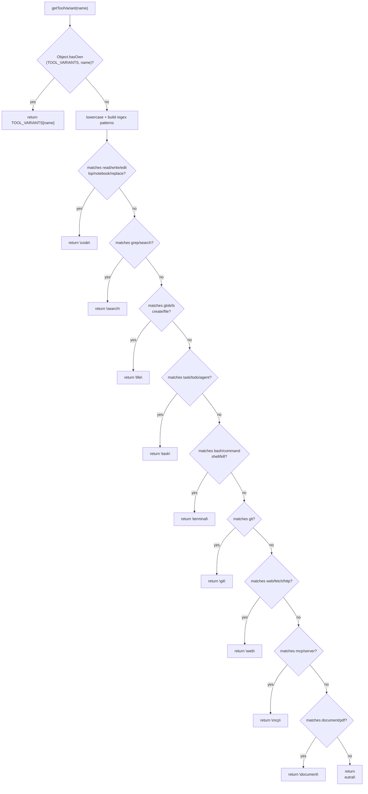
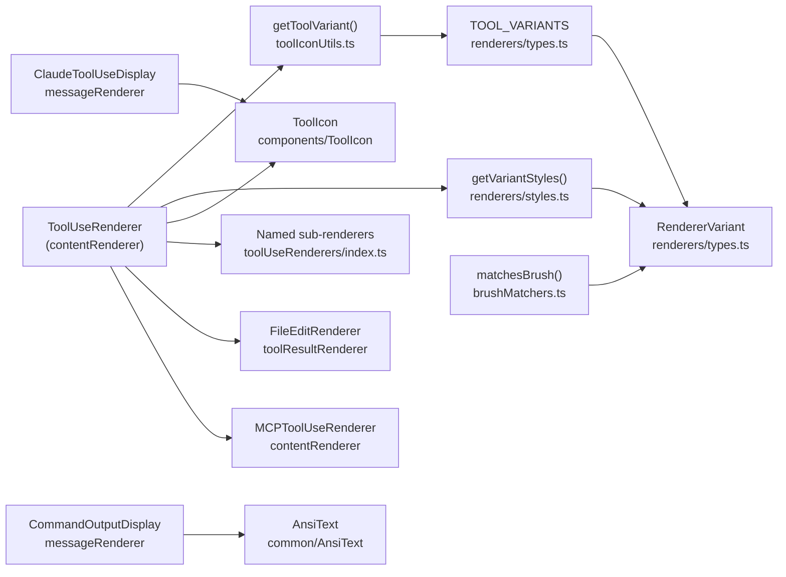

# Tool Icon 및 Display

<details>
<summary>관련 소스 파일</summary>

다음 파일들은 이 위키 페이지를 생성하기 위한 컨텍스트로 사용되었습니다.

- [docs/BRUSHING_SPEC.md](docs/BRUSHING_SPEC.md)
- [src/components/ErrorBoundary.tsx](src/components/ErrorBoundary.tsx)
- [src/components/SessionItem.tsx](src/components/SessionItem.tsx)
- [src/components/contentRenderer/ToolUseRenderer.tsx](src/components/contentRenderer/ToolUseRenderer.tsx)
- [src/components/messageRenderer/ClaudeToolUseDisplay.tsx](src/components/messageRenderer/ClaudeToolUseDisplay.tsx)
- [src/components/messageRenderer/CommandOutputDisplay.tsx](src/components/messageRenderer/CommandOutputDisplay.tsx)
- [src/components/renderers/index.ts](src/components/renderers/index.ts)
- [src/components/renderers/types.ts](src/components/renderers/types.ts)
- [src/components/toolResultRenderer/ClaudeToolResultItem.tsx](src/components/toolResultRenderer/ClaudeToolResultItem.tsx)
- [src/components/toolResultRenderer/FallbackRenderer.tsx](src/components/toolResultRenderer/FallbackRenderer.tsx)
- [src/test/SessionItem.test.tsx](src/test/SessionItem.test.tsx)
- [src/utils/brushMatchers.ts](src/utils/brushMatchers.ts)
- [src/utils/toolIconUtils.ts](src/utils/toolIconUtils.ts)

</details>


이 페이지는 tool type이 식별되고, visual category로 분류되며, message viewer에서 rendering되는 방식을 문서화합니다. `RendererVariant` type, `TOOL_VARIANTS` map, `getToolVariant` function, `ToolUseRenderer` component dispatch logic을 다룹니다.

content를 `ToolUseRenderer`로 route하는 더 넓은 rendering pipeline은 [Content Renderers (6.1)]()를 참조하세요. `RendererVariant` 값이 session board의 brushing / filtering system을 구동하는 방식은 [Brushing System (6.2)]()을 참조하세요.

---

## RendererVariant: 의미적 Style Category

모든 tool은 정확히 하나의 `RendererVariant` string에 mapping됩니다. 이 type은 visual styling(border color, background tint, icon)과 session board의 brush filtering 모두에 대한 single source of truth입니다.

[src/components/renderers/types.ts:68-84]()에 정의되어 있습니다.

| Variant | Intended Tools | CSS Token |
|---|---|---|
| `code` | Read, Write, Edit, MultiEdit, NotebookEdit, LSP | `--tool-code` |
| `file` | Glob, LS | `--tool-file` |
| `search` | Grep | `--tool-search` |
| `task` | Task, TodoWrite, TodoRead | `--tool-task` |
| `terminal` | Bash, KillShell | `--tool-terminal` |
| `git` | git | `--tool-git` |
| `web` | WebSearch, WebFetch, web_search | `--tool-web` |
| `mcp` | MCP server tools | `--tool-mcp` |
| `document` | PDF, markdown documents | _(teal)_ |
| `thinking` | Thinking/reasoning blocks | _(gold)_ |
| `success` | Successful operation results | _(green)_ |
| `error` | Failed results | _(red)_ |
| `warning` | System reminders | _(amber)_ |
| `info` | Generic tool use, task descriptions | _(blue-grey)_ |
| `neutral` | Unknown/unclassified tools | _(grey)_ |

> **Note:** `system` variant name은 codebase의 이전 version에서 `Bash`/`KillShell`에 사용되었습니다. 현재는 `terminal`로 대체되었습니다. 현재 mapping은 [src/components/renderers/types.ts:117-118]()를 참조하세요.

출처: [src/components/renderers/types.ts:68-128]()

---

## TOOL_VARIANTS: 표준 Name-to-Variant Map

`TOOL_VARIANTS`는 types module에서 export되는 plain `Record<string, RendererVariant>` object입니다. 알려진 모든 Claude Code tool name에 대한 표준 exact-match registry입니다.

```typescript
export const TOOL_VARIANTS: Record<string, RendererVariant> = {
  Read: "code",
  Write: "code",
  Edit: "code",
  MultiEdit: "code",
  NotebookEdit: "code",
  LSP: "code",
  Glob: "file",
  LS: "file",
  Grep: "search",
  WebSearch: "web",
  WebFetch: "web",
  web_search: "web",
  Task: "task",
  TodoWrite: "task",
  TodoRead: "task",
  Bash: "terminal",
  KillShell: "terminal",
  git: "git",
  mcp: "mcp",
  default: "info",
}
```

출처: [src/components/renderers/types.ts:90-128]()

---

## getToolVariant: Name Resolution

`getToolVariant(name: string): RendererVariant`는 [src/utils/toolIconUtils.ts:8]()에 정의되어 있으며, raw tool name string을 `RendererVariant`로 resolve하는 단일 entry point입니다.

**Resolution order:**

1. **Canonical exact match** — `Object.hasOwn(TOOL_VARIANTS, name)`을 확인합니다 [src/utils/toolIconUtils.ts:10](). 발견되면 즉시 반환합니다.
2. **Fuzzy fallback** — unknown/MCP/custom tool에 대해 tool name에 `RegExp` pattern matching을 적용합니다(case-insensitive, `underscore_case`와 `PascalCase` word boundary 처리) [src/utils/toolIconUtils.ts:14-52]().
3. **Default** — pattern match가 없으면 `"neutral"`을 반환합니다 [src/utils/toolIconUtils.ts:53]().

**Fuzzy keyword rules**(exact match 실패 시에만 적용):

| Matched keywords | Returns |
|---|---|
| `read`, `write`, `edit`, `lsp`, `notebook`, `replace` | `"code"` |
| `grep`, `search` | `"search"` |
| `glob`, `ls`, `create`, `file` | `"file"` |
| `task`, `todo`, `agent` | `"task"` |
| `bash`, `command`, `shell`, `kill` | `"terminal"` |
| `git` | `"git"` |
| `web`, `fetch`, `http` | `"web"` |
| `mcp`, `server` | `"mcp"` |
| `document`, `pdf` | `"document"` |
| _(no match)_ | `"neutral"` |

출처: [src/utils/toolIconUtils.ts:1-54]()

---

**Variant Resolution Flow**

Title: getToolVariant Logic Flow


출처: [src/utils/toolIconUtils.ts:8-54]()

---

## ToolUseRenderer: Dispatch Logic

`ToolUseRenderer`는 [src/components/contentRenderer/ToolUseRenderer.tsx:62]()의 `memo`로 감싼 React component입니다. raw `toolUse: Record<string, unknown>` object를 받아 적절한 renderer로 dispatch합니다.

**Dispatch order:**

Title: ToolUseRenderer Component Dispatch
```mermaid
flowchart TD
    A["ToolUseRenderer\n(toolUse)"] --> B["getToolVariant(toolName)\n→ variant + styles"]
    B --> C{"toolName in named\nswitch statement?"}
    C -- "Read/Bash/Glob/Grep\nWebFetch/WebSearch\nMultiEdit/TodoWrite\nNotebookEdit/Task*\napply_patch/update_plan" --> D["Named sub-renderer\n(e.g. BashToolRenderer)"]
    C -- "no" --> E{"starts with \"mcp__\"?"}
    E -- "yes" --> F["parseMcpTool()\n→ MCPToolUseRenderer"]
    E -- "no" --> G{"isWriteTool?\n(file_path + content)"}
    G -- "yes" --> H["Inline Write renderer\nwith FilePlus icon\nprism-react-renderer code block"]
    G -- "no" --> I{"isEditTool?\n(file_path + old_string\n+ new_string)"}
    I -- "yes" --> J["FileEditRenderer"]
    I -- "no" --> K{"isAssistantPrompt?\n(description + prompt)"}
    K -- "yes" --> L["Inline prompt renderer\nwith MessageSquare icon"]
    K -- "no" --> M["Default renderer\nToolIcon + JSON code block"]
```

출처: [src/components/contentRenderer/ToolUseRenderer.tsx:62-404]()

### Named Tool Sub-Renderer

`ToolUseRenderer`의 첫 번째 `switch` block은 잘 알려진 tool name을 전용 renderer component로 delegate합니다 [src/components/contentRenderer/ToolUseRenderer.tsx:111-142]().

| `toolName` | Component |
|---|---|
| `Read` | `ReadToolRenderer` |
| `Bash` | `BashToolRenderer` |
| `Glob` | `GlobToolRenderer` |
| `Grep` | `GrepToolRenderer` |
| `WebFetch` | `WebFetchToolRenderer` |
| `WebSearch` | `WebSearchToolRenderer` |
| `MultiEdit` | `MultiEditToolRenderer` |
| `TodoWrite` | `TodoWriteToolRenderer` |
| `NotebookEdit` | `NotebookEditToolRenderer` |
| `TaskCreate` | `TaskCreateToolRenderer` |
| `TaskUpdate` | `TaskUpdateToolRenderer` |
| `TaskOutput` | `TaskOutputToolRenderer` |
| `Task` | `TaskToolRenderer` |
| `apply_patch` | `ApplyPatchToolRenderer` |
| `update_plan` | `UpdatePlanToolRenderer` |

출처: [src/components/contentRenderer/ToolUseRenderer.tsx:111-142]()

### MCP Tool Parsing

`toolName`이 `"mcp__"`로 시작하면 `parseMcpTool()`은 나머지 부분을 첫 번째 `__` separator 기준으로 split하여 `serverName`과 `toolName`을 추출한 뒤, 이를 `MCPToolUseRenderer`에 전달합니다 [src/components/contentRenderer/ToolUseRenderer.tsx:75-88]().

예: `"mcp__my_server__do_thing"` → `{ serverName: "my_server", toolName: "do_thing" }`.

### Input-Shape Fallback Detection

name 또는 MCP prefix로 match되지 않는 tool에 대해 `ToolUseRenderer`는 `toolInput` structure를 검사합니다 [src/components/contentRenderer/ToolUseRenderer.tsx:160-178]().

- **Write tool**: `file_path` + `content` field가 존재함 → `FilePlus` icon과 함께 `prism-react-renderer`를 사용한 inline syntax-highlighted file creation view [src/components/contentRenderer/ToolUseRenderer.tsx:180-264]().
- **Edit tool**: `file_path` + `old_string` + `new_string` field가 존재함 → `FileEditRenderer`로 delegate [src/components/contentRenderer/ToolUseRenderer.tsx:266-271]().
- **Assistant prompt**: `description` + `prompt` string field → `MessageSquare` icon이 있는 two-section prompt display [src/components/contentRenderer/ToolUseRenderer.tsx:273-337]().

---

## ToolIcon Component

`ToolIcon`은 [src/components/ToolIcon.tsx:133]()의 presentational component입니다. `toolName`과 `className`을 받아 internal `getIcon` mapping [src/components/ToolIcon.tsx:60-131]()을 기준으로 tool category에 적합한 Lucide icon을 rendering합니다.

`ToolIcon`의 핵심 logic:
- `getIcon(toolName)`을 호출해 Lucide icon component(예: `Terminal`, `Edit`, `Search`)를 선택합니다 [src/components/ToolIcon.tsx:134]().
- `getToolVariant(toolName)`을 호출해 semantic color를 결정합니다 [src/components/ToolIcon.tsx:135]().
- `colored` prop이 true이면 `VARIANT_COLORS` mapping을 통해 Tailwind color class를 적용합니다 [src/components/ToolIcon.tsx:31-48]().

출처: [src/components/ToolIcon.tsx:1-145]()

---

## Command Output Display

`CommandOutputDisplay` component는 `Bash` 같은 tool execution의 stdout/stderr rendering을 처리합니다. detection logic을 기준으로 content를 지능적으로 format합니다.

- **JSON Output**: curly brace로 감지되며 syntax highlighting과 함께 rendering됩니다 [src/components/messageRenderer/CommandOutputDisplay.tsx:47-115]().
- **Test Results**: `Test Suites:` 또는 `jest` 같은 keyword로 감지되며 `TestTube` icon과 ANSI color support로 rendering됩니다 [src/components/messageRenderer/CommandOutputDisplay.tsx:35-143]().
- **Build Output**: `webpack` 또는 `compile` 같은 keyword로 감지되며 `Hammer` icon으로 rendering됩니다 [src/components/messageRenderer/CommandOutputDisplay.tsx:39-174]().
- **ANSI Support**: 모든 terminal-like output(test, build, package management)은 terminal color code를 처리하기 위해 raw text를 `AnsiText` component로 감쌉니다 [src/components/messageRenderer/CommandOutputDisplay.tsx:139](), [src/components/messageRenderer/CommandOutputDisplay.tsx:168]().

출처: [src/components/messageRenderer/CommandOutputDisplay.tsx:1-227]()

---

## Component 및 Data Dependency Map

Title: Tool Display Dependency Graph


출처: [src/components/contentRenderer/ToolUseRenderer.tsx:1-57](), [src/utils/toolIconUtils.ts:1-2](), [src/components/renderers/types.ts:68-128](), [src/components/messageRenderer/ClaudeToolUseDisplay.tsx:4-5](), [src/utils/brushMatchers.ts:1-2](), [src/components/messageRenderer/CommandOutputDisplay.tsx:22]()
