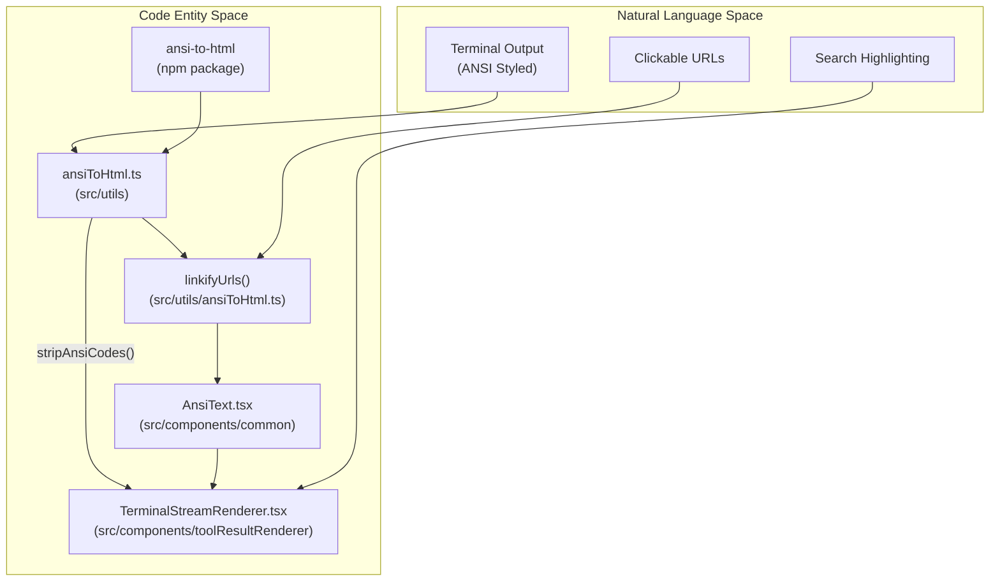
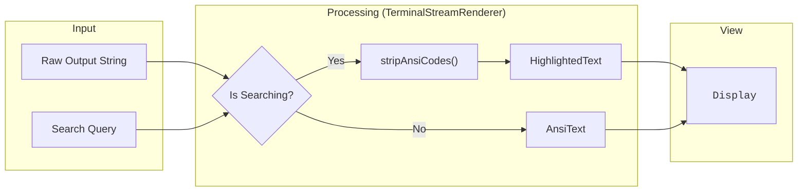

# ANSI 및 Terminal Rendering

관련 소스 파일

다음 파일들은 이 위키 페이지를 생성하기 위한 컨텍스트로 사용되었습니다.

- [.gitignore](.gitignore)
- [docs/specs/issue-109-ansi-rendering.md](docs/specs/issue-109-ansi-rendering.md)
- [src/components/common/AnsiText.tsx](src/components/common/AnsiText.tsx)
- [src/components/toolResultRenderer/TerminalStreamRenderer.tsx](src/components/toolResultRenderer/TerminalStreamRenderer.tsx)
- [src/test/AnsiText.test.tsx](src/test/AnsiText.test.tsx)
- [src/test/ansiToHtml.test.ts](src/test/ansiToHtml.test.ts)
- [src/types/ansi-to-html.d.ts](src/types/ansi-to-html.d.ts)
- [src/utils/ansiToHtml.ts](src/utils/ansiToHtml.ts)

이 페이지는 history viewer 안에서 styled terminal output을 표시하는 데 사용되는 ANSI escape code rendering system을 문서화합니다. `ansiToHtml` utility, `AnsiText` component, `escapeXML`을 통한 XSS safety, URL linkification, 그리고 `TerminalStreamRenderer` 같은 component와의 통합을 다룹니다.

---

## 배경

`/context` 또는 `/cost` 같은 Claude Code command는 ANSI SGR(Select Graphic Rendition) escape sequence를 포함하는 terminal output을 생성합니다. 예를 들어 `\x1b[38;2;136;136;136m` for RGB gray [docs/specs/issue-109-ansi-rendering.md:11-15]()처럼 RGB 회색을 나타냅니다. 처리하지 않으면 이 sequence는 UI에 raw control character로 나타나 output을 읽기 어렵게 만듭니다.

시스템은 이러한 sequence를 styled HTML `` element로 변환하는 동시에 URL을 식별하고 linkify하여, web interface 안에서 풍부한 terminal-like experience를 보장합니다 [src/utils/ansiToHtml.ts:138-149]().

---

## 아키텍처

rendering pipeline은 utility function과 specialized renderer 집합을 통해 raw terminal data를 React component로 연결합니다.

**Component and Utility Relationships**

출처: [src/utils/ansiToHtml.ts:1-149](), [src/components/common/AnsiText.tsx:1-27](), [src/components/toolResultRenderer/TerminalStreamRenderer.tsx:1-103](), [src/types/ansi-to-html.d.ts:1-15]()

---

## `ansiToHtml` Utility

**File:** [src/utils/ansiToHtml.ts]()

module-level singleton `Convert` instance는 import 시점에 생성되며 모든 변환에 재사용됩니다. CSS variable을 사용하여 application theme을 존중하도록 구성됩니다 [src/utils/ansiToHtml.ts:3-8]().

| Function | Signature | Purpose |
|---|---|---|
| `hasAnsiCodes` | `(text: string) => boolean` | string에 SGR escape sequence가 포함되어 있는지 test합니다 [src/utils/ansiToHtml.ts:25-27]() |
| `stripAnsiCodes` | `(text: string) => string` | 모든 SGR escape sequence를 제거하고 plain text를 반환합니다 [src/utils/ansiToHtml.ts:33-35]() |
| `linkifyUrls` | `(html: string) => string` | HTML attribute 안의 URL은 건너뛰면서 URL을 `<a>` tag로 감쌉니다 [src/utils/ansiToHtml.ts:110-136]() |
| `ansiToHtml` | `(text: string) => string` | main entry point입니다. ANSI를 HTML span으로 변환한 뒤 결과를 linkify합니다 [src/utils/ansiToHtml.ts:146-149]() |

### ANSI_REGEX 범위
regex `ANSI_REGEX = /\x1b\[[\d;]*m/`는 SGR sequence(`m`으로 끝나는 code)만 match합니다. static history viewing과 관련 없는 cursor movement 또는 screen clearing sequence는 의도적으로 무시합니다 [src/utils/ansiToHtml.ts:11-20]().

### URL Linkification Logic
`linkifyUrls` function은 `URL_OR_TAG_REGEX`를 사용해 text 안의 URL과 HTML tag 내부의 URL(예: ``)을 구분합니다. 다음에 대한 정교한 처리를 포함합니다.
*   **Balanced Parentheses**: `https://wiki/Rust_(lang)` 같은 Wikipedia-style URL은 보존하면서, `(see https://example.com)` 같은 prose의 trailing paren은 제거합니다 [src/utils/ansiToHtml.ts:84-100]().
*   **HTML Entities**: URL이 주변 HTML로 "bleeding"되는 것을 방지하기 위해 `&lt;` 또는 `&quot;` 같은 entity로 escape된 character에서 URL을 truncate합니다 [src/utils/ansiToHtml.ts:68-72]().

---

## `AnsiText` Component

**File:** [src/components/common/AnsiText.tsx]()

`AnsiText`는 ANSI-colored text를 rendering하기 위한 primary React component입니다. 성능 최적화를 위해 conversion result를 memoize합니다 [src/components/common/AnsiText.tsx:18-20]().

**XSS Safety Mechanism**
`dangerouslySetInnerHTML`이 사용되지만, underlying `ansi-to-html` converter가 `escapeXML: true`로 초기화되어 있어 안전합니다 [src/utils/ansiToHtml.ts:6](). 이는 다음을 보장합니다.
1.  모든 user-provided HTML tag가 string 처리 전에 escape됩니다 [src/components/common/AnsiText.tsx:9-17]().
2.  존재하는 유일한 "dangerous" HTML은 utility가 명시적으로 생성한 `` 및 `<a>` tag입니다 [src/utils/ansiToHtml.ts:132]().

---

## `TerminalStreamRenderer` 통합

**File:** [src/components/toolResultRenderer/TerminalStreamRenderer.tsx]()

이 component는 bash command와 terminal stream의 output을 처리합니다. search가 active인지에 따라 conditional rendering strategy를 구현합니다.

**Terminal Rendering Data Flow**

[src/components/toolResultRenderer/TerminalStreamRenderer.tsx:87-98]()

**근거**: 사용자가 search할 때 ANSI escape sequence는 text matching logic을 방해할 수 있습니다. 따라서 시스템은 깨끗한 search experience를 제공하기 위해 ANSI code를 제거하고, default view에서는 color를 보존합니다 [src/components/toolResultRenderer/TerminalStreamRenderer.tsx:88-91]().

---

## Testing 및 Verification

이 시스템은 utility logic, component rendering, XSS safety를 다루는 포괄적인 test로 뒷받침됩니다.

| Test File | Focus Area | Key Validations |
|---|---|---|
| `src/test/ansiToHtml.test.ts` | Utilities | `linkifyUrls` boundary detection, balanced parens, SGR detection을 검증합니다 [src/test/ansiToHtml.test.ts:1-166](). |
| `src/test/AnsiText.test.tsx` | Component | `<script>` tag가 ANSI code와 섞여 있어도 escape되는지 보장합니다 [src/test/AnsiText.test.tsx:48-60](). |

출처: [src/utils/ansiToHtml.ts:1-149](), [src/components/common/AnsiText.tsx:1-27](), [src/components/toolResultRenderer/TerminalStreamRenderer.tsx:1-103](), [src/test/ansiToHtml.test.ts:1-166](), [src/test/AnsiText.test.tsx:1-191]()
