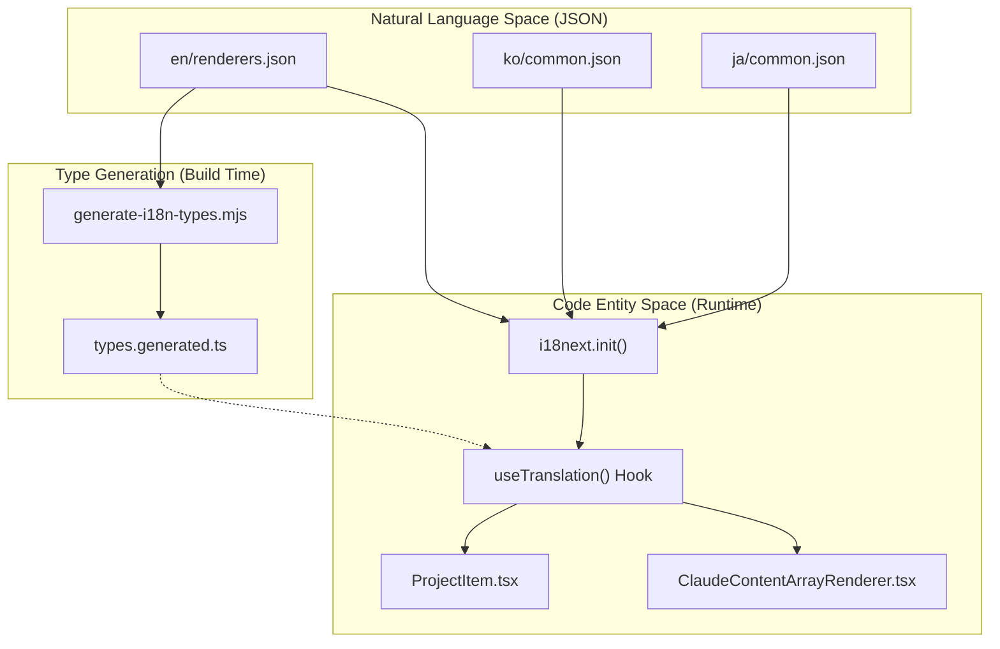
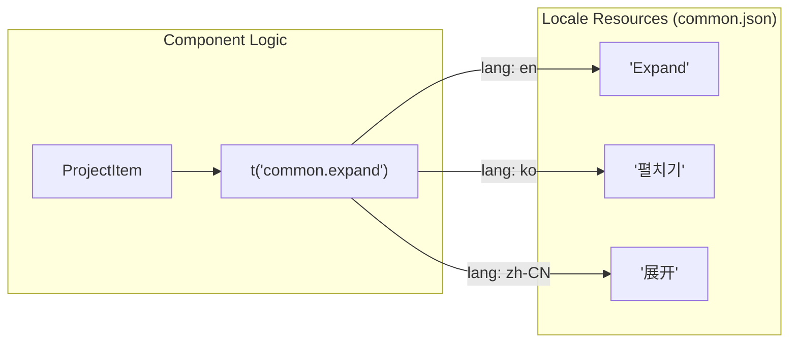

# Internationalization

관련 소스 파일

다음 파일들은 이 위키 페이지를 생성하기 위한 컨텍스트로 사용되었습니다.

- [src/components/ProjectTree/components/ProjectItem.tsx](src/components/ProjectTree/components/ProjectItem.tsx)
- [src/components/ProjectTree/index.tsx](src/components/ProjectTree/index.tsx)
- [src/components/contentRenderer/ClaudeContentArrayRenderer.tsx](src/components/contentRenderer/ClaudeContentArrayRenderer.tsx)
- [src/components/contentRenderer/OpenCodeStepRenderer.tsx](src/components/contentRenderer/OpenCodeStepRenderer.tsx)
- [src/i18n/locales/en/common.json](src/i18n/locales/en/common.json)
- [src/i18n/locales/en/renderers.json](src/i18n/locales/en/renderers.json)
- [src/i18n/locales/ja/common.json](src/i18n/locales/ja/common.json)
- [src/i18n/locales/ja/renderers.json](src/i18n/locales/ja/renderers.json)
- [src/i18n/locales/ko/common.json](src/i18n/locales/ko/common.json)
- [src/i18n/locales/ko/renderers.json](src/i18n/locales/ko/renderers.json)
- [src/i18n/locales/zh-CN/common.json](src/i18n/locales/zh-CN/common.json)
- [src/i18n/locales/zh-CN/renderers.json](src/i18n/locales/zh-CN/renderers.json)
- [src/i18n/locales/zh-TW/common.json](src/i18n/locales/zh-TW/common.json)
- [src/i18n/locales/zh-TW/renderers.json](src/i18n/locales/zh-TW/renderers.json)

이 문서는 Claude Code History Viewer의 internationalization(i18n) system에 대한 high-level overview를 제공합니다. 이 시스템은 UI string을 component logic에서 분리하여 English, Korean, Japanese, Simplified Chinese, Traditional Chinese 사용자를 위한 localized experience를 제공하도록 설계되었습니다.

## 목적과 범위

i18n system은 error message, tool description, analytics label, settings를 포함한 모든 user-facing text가 locale별 JSON file로 externalize되도록 보장합니다. 이를 통해 애플리케이션은 다음을 수행할 수 있습니다.
- global user를 native language로 지원합니다 [src/i18n/locales/en/common.json:1-159]().
- `common.settings.language.title` interface를 통해 애플리케이션을 재시작하지 않고 runtime에 language를 dynamic하게 switch합니다 [src/i18n/locales/ko/common.json:83-85]().
- `renderers`, `common`, `analytics` 같은 다양한 UI namespace 전반에서 translation key에 대한 type safety를 유지합니다.

## 지원 Locale

애플리케이션은 현재 여러 namespace에 걸쳐 다섯 개의 주요 locale을 지원합니다.

| Locale Code | Language | Source File (Common) | Source File (Renderers) |
|:---|:---|:---|:---|
| `en` | English | [src/i18n/locales/en/common.json:1-159]() | [src/i18n/locales/en/renderers.json:1-138]() |
| `ko` | Korean | [src/i18n/locales/ko/common.json:1-159]() | [src/i18n/locales/ko/renderers.json:1-138]() |
| `ja` | Japanese | [src/i18n/locales/ja/common.json:1-159]() | [src/i18n/locales/ja/renderers.json:1-156]() |
| `zh-CN` | Simplified Chinese | [src/i18n/locales/zh-CN/common.json:1-159]() | [src/i18n/locales/zh-CN/renderers.json:1-161]() |
| `zh-TW` | Traditional Chinese | [src/i18n/locales/zh-TW/common.json:1-159]() | [src/i18n/locales/zh-TW/renderers.json:1-164]() |

## 시스템 아키텍처

i18n system은 "Natural Language Space"(JSON resource file)와 "Code Entity Space"(React component 및 TypeScript type)를 연결합니다.

### i18n Data Flow Diagram

이 다이어그램은 JSON file의 raw translation string이 `ProjectItem` 또는 `ClaudeContentArrayRenderer` 같은 UI component에 도달하는 방식을 보여줍니다.

출처: [src/components/ProjectTree/components/ProjectItem.tsx:4-21](), [src/components/contentRenderer/ClaudeContentArrayRenderer.tsx:36-151]()

### Component Integration

component는 `react-i18next`의 `useTranslation` hook을 사용해 translation을 소비합니다. 예를 들어 `ProjectItem` component는 `t` function을 사용해 provider label과 expand/collapse action을 localize합니다 [src/components/ProjectTree/components/ProjectItem.tsx:21-79]().

출처: [src/components/ProjectTree/components/ProjectItem.tsx:79-89](), [src/i18n/locales/en/common.json:34-34](), [src/i18n/locales/ko/common.json:34-34](), [src/i18n/locales/zh-CN/common.json:34-34]()

## 핵심 하위 시스템

i18n implementation은 두 가지 주요 영역으로 나뉩니다.

### 7.1 Translation System
애플리케이션은 수백 개의 translation key를 관리하기 위해 namespace 기반 organization(예: `common`, `analytics`, `session`, `settings`, `tools`, `renderers`)을 사용합니다. 이 구성은 key collision을 방지하고 UI string을 논리적으로 분리할 수 있게 합니다. 시스템은 pluralization(예: `{{count}} messages`) 및 dynamic interpolation 같은 복잡한 기능을 지원합니다 [src/i18n/locales/en/renderers.json:38-38]().

자세한 내용은 [Translation System](#7.1)을 참조하세요.

### 7.2 Type Generation
누락되거나 잘못 입력된 translation key로 인한 runtime error를 방지하기 위해, project는 `generate-i18n-types.mjs`를 포함한 script suite를 사용합니다. 이 script는 locale file을 parse하고 `types.generated.ts`를 생성하여, developer가 `t()` function을 사용할 때 IDE autocompletion과 compile-time check를 받을 수 있도록 보장합니다. `sync-i18n-keys.mjs` 같은 다른 script는 지원되는 모든 language 간 consistency를 보장합니다.

자세한 내용은 [Type Generation](#7.2)을 참조하세요.

## 일반적인 Translation Pattern

다음 표는 일반적인 UI element가 i18n system 전반에서 어떻게 mapping되는지 보여줍니다.

| Feature | Key Example | Usage in Code |
|:---|:---|:---|
| **Status** | `status.scanning` | project discovery 중 표시됩니다 [src/i18n/locales/en/common.json:144-144]() |
| **Time** | `common.time.daysAgo` | relative timestamp를 format합니다 [src/i18n/locales/en/common.json:94-94]() |
| **Providers** | `common.provider.claude` | AI source(Claude Code)에 label을 붙입니다 [src/i18n/locales/en/common.json:119-119]() |
| **Rendering** | `advancedTextDiff.added` | diff viewer에서 addition에 label을 붙입니다 [src/i18n/locales/en/renderers.json:2-2]() |
| **Errors** | `common.error.unexpected` | generic error boundary message [src/i18n/locales/en/common.json:29-29]() |

출처: [src/i18n/locales/en/common.json:1-159](), [src/i18n/locales/en/renderers.json:1-138](), [src/components/ProjectTree/components/ProjectItem.tsx:35-41]()
