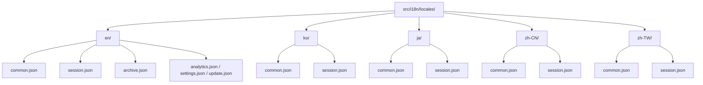
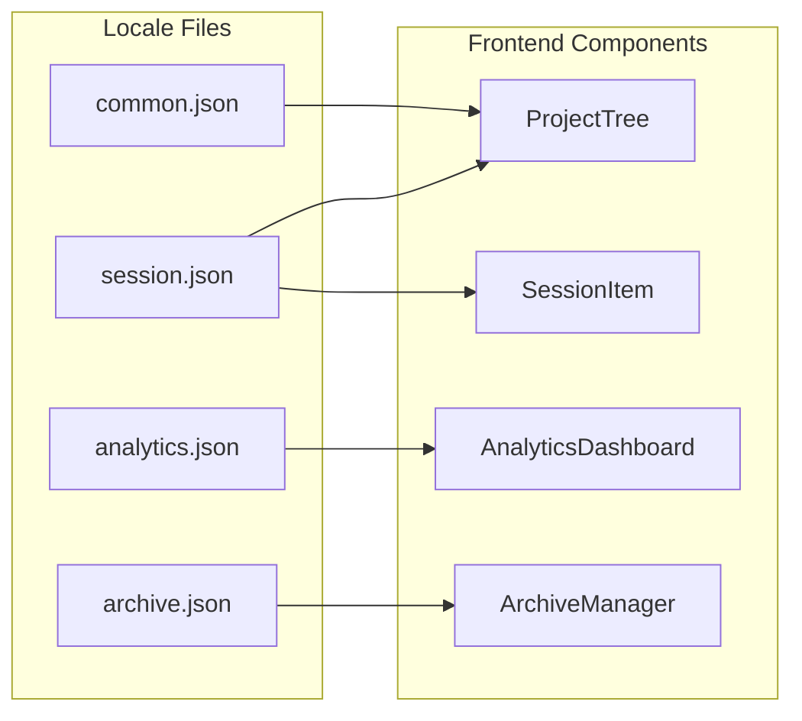
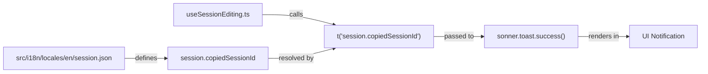

# Translation System

<details>
<summary>관련 소스 파일</summary>

다음 파일들은 이 위키 페이지를 생성하기 위한 컨텍스트로 사용되었습니다.

- [src/components/AnalyticsDashboard/components/ActivityHeatmap.tsx](src/components/AnalyticsDashboard/components/ActivityHeatmap.tsx)
- [src/components/AnalyticsDashboard/views/ProjectStatsView.tsx](src/components/AnalyticsDashboard/views/ProjectStatsView.tsx)
- [src/components/ProjectTree/components/ProjectItem.tsx](src/components/ProjectTree/components/ProjectItem.tsx)
- [src/components/ProjectTree/index.tsx](src/components/ProjectTree/index.tsx)
- [src/components/SessionItem/SessionItem.tsx](src/components/SessionItem/SessionItem.tsx)
- [src/components/SessionItem/components/SessionContextMenu.tsx](src/components/SessionItem/components/SessionContextMenu.tsx)
- [src/components/SessionItem/components/SessionNameEditor.tsx](src/components/SessionItem/components/SessionNameEditor.tsx)
- [src/components/SessionItem/hooks/useSessionEditing.ts](src/components/SessionItem/hooks/useSessionEditing.ts)
- [src/components/SessionItem/types.ts](src/components/SessionItem/types.ts)
- [src/i18n/locales/en/analytics.json](src/i18n/locales/en/analytics.json)
- [src/i18n/locales/en/archive.json](src/i18n/locales/en/archive.json)
- [src/i18n/locales/en/common.json](src/i18n/locales/en/common.json)
- [src/i18n/locales/en/session.json](src/i18n/locales/en/session.json)
- [src/i18n/locales/en/update.json](src/i18n/locales/en/update.json)
- [src/i18n/locales/ja/analytics.json](src/i18n/locales/ja/analytics.json)
- [src/i18n/locales/ja/archive.json](src/i18n/locales/ja/archive.json)
- [src/i18n/locales/ja/common.json](src/i18n/locales/ja/common.json)
- [src/i18n/locales/ja/session.json](src/i18n/locales/ja/session.json)
- [src/i18n/locales/ja/update.json](src/i18n/locales/ja/update.json)
- [src/i18n/locales/ko/analytics.json](src/i18n/locales/ko/analytics.json)
- [src/i18n/locales/ko/archive.json](src/i18n/locales/ko/archive.json)
- [src/i18n/locales/ko/common.json](src/i18n/locales/ko/common.json)
- [src/i18n/locales/ko/session.json](src/i18n/locales/ko/session.json)
- [src/i18n/locales/ko/update.json](src/i18n/locales/ko/update.json)
- [src/i18n/locales/zh-CN/analytics.json](src/i18n/locales/zh-CN/analytics.json)
- [src/i18n/locales/zh-CN/archive.json](src/i18n/locales/zh-CN/archive.json)
- [src/i18n/locales/zh-CN/common.json](src/i18n/locales/zh-CN/common.json)
- [src/i18n/locales/zh-CN/session.json](src/i18n/locales/zh-CN/session.json)
- [src/i18n/locales/zh-CN/update.json](src/i18n/locales/zh-CN/update.json)
- [src/i18n/locales/zh-TW/analytics.json](src/i18n/locales/zh-TW/analytics.json)
- [src/i18n/locales/zh-TW/archive.json](src/i18n/locales/zh-TW/archive.json)
- [src/i18n/locales/zh-TW/common.json](src/i18n/locales/zh-TW/common.json)
- [src/i18n/locales/zh-TW/session.json](src/i18n/locales/zh-TW/session.json)
- [src/i18n/locales/zh-TW/update.json](src/i18n/locales/zh-TW/update.json)
- [src/types/archive.ts](src/types/archive.ts)

</details>


이 페이지는 internationalization(i18n) infrastructure를 문서화합니다. namespace layout, locale file organization, key naming convention, 그리고 `react-i18next`가 UI component에 연결되는 방식을 다룹니다. locale file에서 파생되는 auto-generated TypeScript type은 [Type Generation](7.2)을 참조하세요.

---

## 개요

애플리케이션은 여러 translation namespace에 걸쳐 다섯 개 locale을 지원합니다. 모든 translation은 `src/i18n/locales/` 아래에 있으며 `react-i18next`가 runtime에 로드합니다. TypeScript type safety는 이러한 JSON definition에서 파생된 auto-generated file이 제공합니다.

---

## 지원 Locale

| Code | Language | Source |
|------|----------|--------|
| `en` | English (base) | [src/i18n/locales/en/common.json:1-159]() |
| `ko` | Korean | [src/i18n/locales/ko/common.json:1-159]() |
| `ja` | Japanese | [src/i18n/locales/ja/common.json:1-159]() |
| `zh-CN` | Simplified Chinese | [src/i18n/locales/zh-CN/common.json:1-159]() |
| `zh-TW` | Traditional Chinese | [src/i18n/locales/zh-TW/common.json:1-159]() |

---

## Namespace 구조

i18n system은 translation file을 관리하기 쉽고 scope가 명확하게 유지되도록 logical namespace로 나뉩니다.

| Namespace | Purpose |
|-----------|---------|
| `common` | 공유 UI label: button(Add, Cancel), status message(Scanning, Loading), time formatting, provider name(Claude Code, Cursor 등), watcher state. |
| `session` | Project tree management, session list control, session board analysis, session item context menu. |
| `analytics` | Analytics dashboard: chart, token count, cost breakdown, activity heatmap. |
| `renderers` | Content renderer component: diff viewer, git workflow, web search, MCP result, terminal stream output. |
| `message` | Message viewer UI, header, 특정 message role label. |
| `archive` | Archive manager UI: archive 생성, archived session 탐색, manifest label. |
| `update` | Auto-updater UI: release note, download status, version comparison. |
| `error` | 상세 error message와 troubleshooting guide. |
| `feedback` | Feedback submission form 및 status message. |

출처: [src/i18n/locales/en/common.json:1-159](), [src/i18n/locales/en/session.json:1-133](), [src/i18n/locales/en/archive.json:1-40](), [src/i18n/locales/en/update.json:1-20]()

---

## File Organization

모든 namespace에는 locale별 JSON file이 하나씩 있습니다. path pattern은 `src/i18n/locales/{locale}/{namespace}.json`입니다.

**Directory layout diagram:**



출처: [src/i18n/locales/en/common.json:1-159](), [src/i18n/locales/ko/common.json:1-159](), [src/i18n/locales/ja/common.json:1-159](), [src/i18n/locales/zh-CN/common.json:1-159](), [src/i18n/locales/zh-TW/common.json:1-159]()

---

## Key Naming Convention

### 구조
key는 top-level JSON property로 저장되는 **flat dot-notation string**을 사용합니다.

```json
// Example from src/i18n/locales/en/common.json
{
  "common.add": "Add",
  "status.scanning": "Scanning projects...",
  "time.today": "Today"
}
```

### Grouping Pattern
namespace file 안에서 key는 namespace 또는 특정 sub-feature를 mirror하는 group name으로 prefix됩니다.

| Prefix | Namespace File | Scope |
|--------|----------------|-------|
| `common.*` | `common.json` | Global label(Add, Cancel, Save) [src/i18n/locales/en/common.json:2-138]() |
| `status.*` | `common.json` | App-wide loading state [src/i18n/locales/en/common.json:139-146]() |
| `project.*` | `session.json` | Sidebar project explorer label [src/i18n/locales/en/session.json:2-35]() |
| `session.*` | `session.json` | Session board 및 list item [src/i18n/locales/en/session.json:36-133]() |
| `archive.*` | `archive.json` | Archive manager 및 browser [src/i18n/locales/en/archive.json:2-40]() |

---

## Interpolation 및 Pluralization

### Variable Interpolation
value는 `{{variable}}` syntax를 사용합니다.
- `common.time.daysAgo`: `"{{count}} day ago"` [src/i18n/locales/en/common.json:94]()
- `common.update.current`: `"Current version: {{current}} → {{latest}}"` [src/i18n/locales/en/common.json:110]()

### Pluralization
codebase는 `i18next` pluralization logic을 사용합니다. English의 경우 `_plural` suffix가 사용됩니다.
- `common.update.deadline`: `"Update deadline: {{days}} day left"` [src/i18n/locales/en/common.json:111]()
- `common.update.deadline_plural`: `"Update deadline: {{days}} days left"` [src/i18n/locales/en/common.json:112]()

출처: [src/i18n/locales/en/common.json:94-112]()

---

## react-i18next 통합

component는 `useTranslation` hook을 통해 translation을 소비합니다.

### Component Implementation
`ProjectTree/index.tsx`에서 hook은 `t` function과 `i18n` instance를 제공하도록 초기화됩니다. 이는 time formatting을 위한 current locale retrieval 같은 language-specific logic에 사용됩니다.

[src/components/ProjectTree/index.tsx:69-69]()

```tsx
const { t, i18n } = useTranslation();
```

### Namespace-to-Component Mapping
아래 다이어그램은 namespace를 이를 소비하는 UI subsystem과 연결합니다.



출처: [src/components/ProjectTree/index.tsx:69-69](), [src/components/SessionItem/hooks/useSessionEditing.ts:40-40](), [src/components/AnalyticsDashboard/views/ProjectStatsView.tsx:1-20]()

---

## Translation Data Flow

이 다이어그램은 `SessionItem` rename feature를 예시로 사용해 JSON definition에서 rendered UI element까지의 flow를 추적합니다.



출처: [src/i18n/locales/en/session.json:94-94](), [src/components/SessionItem/hooks/useSessionEditing.ts:170-178]()
