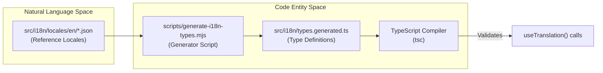
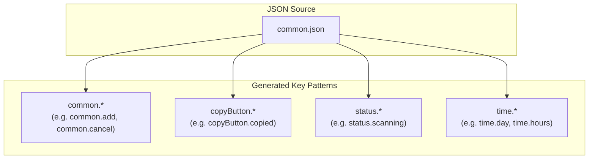
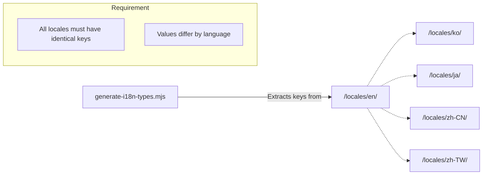

# Type Generation

<details>
<summary>관련 소스 파일</summary>

다음 파일들은 이 위키 페이지를 생성하기 위한 컨텍스트로 사용되었습니다.

- [src/components/SettingsManager/sections/WslSection.tsx](src/components/SettingsManager/sections/WslSection.tsx)
- [src/components/modals/folderSelect/FolderSelector.tsx](src/components/modals/folderSelect/FolderSelector.tsx)
- [src/i18n/locales/en/settings.json](src/i18n/locales/en/settings.json)
- [src/i18n/locales/ja/settings.json](src/i18n/locales/ja/settings.json)
- [src/i18n/locales/ko/settings.json](src/i18n/locales/ko/settings.json)
- [src/i18n/locales/zh-CN/settings.json](src/i18n/locales/zh-CN/settings.json)
- [src/i18n/locales/zh-TW/settings.json](src/i18n/locales/zh-TW/settings.json)
- [src/i18n/types.generated.ts](src/i18n/types.generated.ts)

</details>


이 페이지는 i18n system을 위한 auto-generated TypeScript type definition을 다룹니다. 특히 `types.generated.ts` file과 translation key 및 type safety를 관리하는 script suite를 설명합니다.

---

## 목적

`src/i18n/types.generated.ts`는 모든 namespace의 모든 translation key에 대해 compile-time TypeScript type을 제공합니다. 이 type을 통해 editor와 TypeScript compiler는 runtime 전에 철자가 틀렸거나 누락된 translation key를 포착할 수 있습니다. 이 file은 절대 손으로 수정하지 않으며, locale JSON file이 변경될 때마다 다시 생성됩니다.

---

## 생성 방식

generation process는 source of truth인 English locale file을 parse하고, 그 구조를 TypeScript union type으로 mapping하는 Node.js script에 의해 구동됩니다.

**Generation pipeline diagram**



출처: [src/i18n/types.generated.ts:1-11](), [src/i18n/types.generated.ts:44-45]()

script는 English locale file을 key의 authoritative source로 읽습니다. `src/i18n/locales/en/` 아래에서 찾은 각 namespace JSON file에 대해 모든 JSON key를 수집하고 TypeScript union type을 emit합니다. output file header는 generation run에 대한 metadata를 기록합니다.

| Metadata field | Current Value (Example) |
|---|---|
| Generator script | `scripts/generate-i18n-types.mjs` |
| Run command | `pnpm run generate:i18n-types` |
| Total keys | 1722 |
| Namespace count | 11 |

출처: [src/i18n/types.generated.ts:1-11]()

---

## Output 구조

generated file은 두 category의 type을 export합니다.

1.  **`I18nNamespace`**: `react-i18next`에서 사용하는 모든 유효한 namespace string literal의 union입니다.
2.  **Per-namespace key types**: 해당 namespace에서 발견되는 모든 dotted key path를 포함하는 개별 union type(예: `CommonKeys`, `AnalyticsKeys`)입니다.

**Type export map**

```mermaid
classDiagram
    class "types.generated.ts" {
        +I18nNamespace
        +CommonKeys
        +AnalyticsKeys
        +SessionKeys
        +SettingsKeys
        +ToolsKeys
        +ErrorKeys
        +MessageKeys
        +RenderersKeys
        +UpdateKeys
        +FeedbackKeys
        +RecentEditsKeys
    }
    
    class "Namespace Definitions" {
        <<type>>
        common
        analytics
        session
        settings
        tools
        error
        message
        renderers
        update
        feedback
        recentEdits
    }

    "types.generated.ts" ..> "Namespace Definitions" : defines
```

출처: [src/i18n/types.generated.ts:29-40]()

### `I18nNamespace`

`I18nNamespace` type은 component가 translation namespace를 요청할 때 system이 인식하는 유효한 identifier를 사용하도록 보장합니다.

```ts
export type I18nNamespace =
  | 'common'
  | 'analytics'
  | 'session'
  | 'settings'
  | 'tools'
  | 'error'
  | 'message'
  | 'renderers'
  | 'update'
  | 'feedback'
  | 'recentEdits';
```

출처: [src/i18n/types.generated.ts:29-40]()

### Per-namespace key types

각 namespace에는 대응하는 exported union type이 있습니다. key는 JSON file에 나타나는 full dotted path입니다.

| Type name | Source file | Key count |
|---|---|---|
| `CommonKeys` | `locales/{lang}/common.json` | 156 |
| `AnalyticsKeys` | `locales/{lang}/analytics.json` | 179 |
| `SessionKeys` | `locales/{lang}/session.json` | ~116 |
| `SettingsKeys` | `locales/{lang}/settings.json` | ~501 |
| `ToolsKeys` | `locales/{lang}/tools.json` | ~69 |
| `ErrorKeys` | `locales/{lang}/error.json` | ~37 |
| `MessageKeys` | `locales/{lang}/message.json` | ~66 |
| `RenderersKeys` | `locales/{lang}/renderers.json` | ~255 |
| `UpdateKeys` | `locales/{lang}/update.json` | ~65 |
| `FeedbackKeys` | `locales/{lang}/feedback.json` | ~32 |
| `RecentEditsKeys` | `locales/{lang}/recentEdits.json` | ~20 |

출처: [src/i18n/types.generated.ts:13-28](), [src/i18n/types.generated.ts:43-46](), [src/i18n/types.generated.ts:205-208]()

---

## Key Naming Convention

JSON file의 key와 generated type의 key는 대개 namespace name으로 시작하지만 항상 그런 것은 아닌 dotted path를 따릅니다. 

### Common Namespace Exceptions
`common` namespace는 전체 애플리케이션에서 공유 UI element와 status에 사용되는 여러 top-level prefix를 포함합니다.

**Key prefix patterns in `CommonKeys`**



출처: [src/i18n/types.generated.ts:46-202]()

### Standard Namespace Patterns
다른 namespace에서는 isolation을 유지하기 위해 prefix가 namespace name과 엄격히 일치합니다. 예를 들어 `AnalyticsKeys`의 모든 key는 `analytics.`로 시작합니다.

```ts
export type AnalyticsKeys =
  | 'analytics.Analytics Dashboard'
  | 'analytics.Avg Session Time'
  | 'analytics.billingBreakdown'
  // ...
```

출처: [src/i18n/types.generated.ts:208-233]()

---

## Locale JSON File과의 관계

generator는 English locale(`/locales/en/`)을 key name의 source of truth로 취급합니다. 애플리케이션은 English, Korean, Japanese, Simplified Chinese, Traditional Chinese를 지원하지만, type system은 English file을 기반으로만 key를 생성합니다.

**Locale file synchronization**



출처: [src/i18n/types.generated.ts:44-45](), [src/i18n/types.generated.ts:206-207]()

---

## Supporting i18n Scripts

`generate-i18n-types.mjs` 외에도 i18n lifecycle을 관리하기 위해 여러 maintenance script가 사용됩니다.

*   **`flatten-i18n.mjs`**: nested JSON translation file을 flat structure로 변환합니다(예: `{"a": {"b": "c"}}`가 `{"a.b": "c"}`가 됨). type generation 전에 필요합니다.
*   **`split-i18n-namespaces.mjs`**: 큰 translation file을 `I18nNamespace`에 나열된 관리 가능한 11개 namespace로 분할합니다. 이를 통해 LLM이 context limit에 걸리지 않고 개별 translation file을 처리할 수 있습니다.
*   **`sync-i18n-keys.mjs`**: 모든 language 전반에서 key를 synchronize합니다. `en/settings.json`에 key가 추가되면 `ko/settings.json`, `ja/settings.json` 등에도 추가되도록 보장합니다.
*   **`validate-i18n.mjs`**: 모든 locale file이 English source of truth와 정확히 동일한 key set을 갖는지 검증하고, empty value 또는 syntax error를 확인합니다.

출처: [src/i18n/types.generated.ts:1-11](), [src/i18n/types.generated.ts:16-28]()

---

## Type 재생성

translation key가 locale JSON file에서 추가, 제거 또는 rename되면 type safety를 유지하기 위해 generated type을 update해야 합니다.

### Generation Command
다음 command는 generation script를 호출합니다.

```sh
pnpm run generate:i18n-types
```

이 command는 `node scripts/generate-i18n-types.mjs`를 실행하며, `src/i18n/types.generated.ts`를 overwrite합니다.

### Maintenance Rules
1.  **`types.generated.ts`를 손으로 수정하지 마세요**: file header는 `직접 수정하지 마세요`("Do not modify directly")라고 명시적으로 경고합니다. manual change는 다음 generation run에서 사라집니다.
2.  **generation 후 commit하세요**: 다른 developer 환경에서 CI build failure나 type mismatch가 발생하지 않도록 updated `types.generated.ts`를 locale JSON change와 함께 항상 commit합니다.

출처: [src/i18n/types.generated.ts:1-11]()
