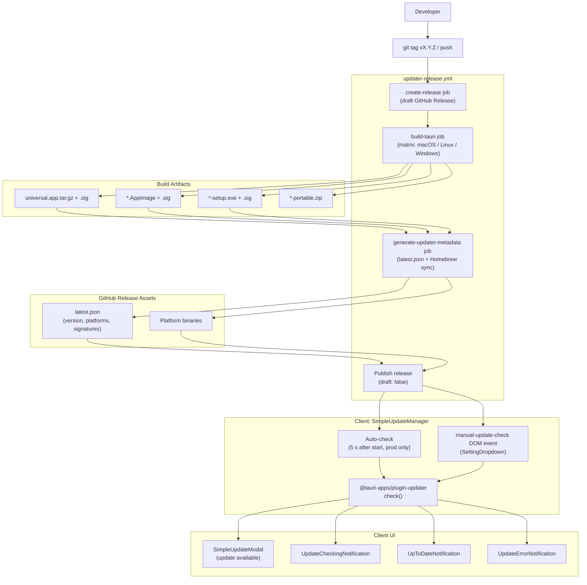
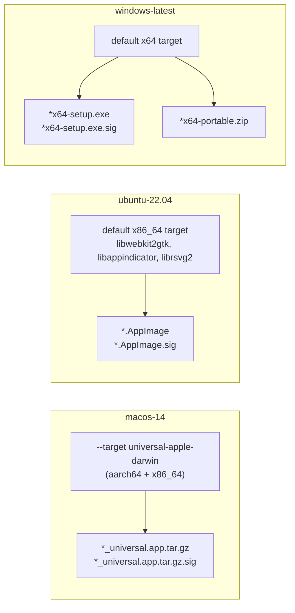

# Update System

<details>
<summary>관련 소스 파일</summary>

다음 파일들은 이 위키 페이지를 생성하기 위한 컨텍스트로 사용되었습니다.

- [.github/workflows/updater-release.yml](.github/workflows/updater-release.yml)
- [justfile](justfile)
- [pnpm-lock.yaml](pnpm-lock.yaml)
- [src-tauri/.cargo/config.toml](src-tauri/.cargo/config.toml)
- [src-tauri/capabilities/default.json](src-tauri/capabilities/default.json)
- [src-tauri/tests/capabilities.test.ts](src-tauri/tests/capabilities.test.ts)
- [src/components/SimpleUpdateModal.tsx](src/components/SimpleUpdateModal.tsx)
- [src/hooks/useUpdater.test.ts](src/hooks/useUpdater.test.ts)
- [src/hooks/useUpdater.ts](src/hooks/useUpdater.ts)
- [src/index.css](src/index.css)
- [src/test/SimpleUpdateManager.test.tsx](src/test/SimpleUpdateManager.test.tsx)
- [src/test/SimpleUpdateModal.test.tsx](src/test/SimpleUpdateModal.test.tsx)
- [src/test/updateDiagnostics.test.ts](src/test/updateDiagnostics.test.ts)
- [src/utils/updateDiagnostics.ts](src/utils/updateDiagnostics.ts)
- [src/utils/updateError.ts](src/utils/updateError.ts)
- [tailwind.config.js](tailwind.config.js)

</details>


Update System은 애플리케이션 update를 자동으로 전달하고 설치합니다. 두 가지 주요 component로 구성됩니다. platform-specific binary를 build하고, sign하고, update metadata를 생성하는 **Release Workflow**(GitHub Actions), 그리고 configurable schedule에 따라 update를 확인하고 custom UI component를 통해 표시하는 **Auto-Updater** client입니다.

development build process에 대한 정보는 [Build System](#9.1)을 참조하세요. manual testing procedure에 대한 정보는 [Testing](#9.2)를 참조하세요. release workflow(`updater-release.yml`)와 in-app updater(`SimpleUpdateManager`, `useUpdater`)는 각각 8.1 및 8.2 페이지에서 자세히 설명합니다.

## 개요

Update System은 Windows, macOS, Linux platform 전반의 desktop user에게 automatic update를 제공합니다. git repository에 새 version이 tag되면 GitHub Actions가 모든 platform용 binary를 자동으로 build하고, cryptographic signature로 sign하고, update manifest(`latest.json`)를 생성한 뒤 release를 publish합니다. client application은 주기적으로 이 manifest를 확인하고, 사용자에게 manual intervention을 요구하지 않고 update를 download 및 install할 수 있습니다.

### Update Flow Architecture

**End-to-end update pipeline: tag push에서 in-app notification까지**



출처: [.github/workflows/updater-release.yml:1-394](), [src/test/SimpleUpdateManager.test.tsx:108-131]()

### Version Management

version 정보는 세 개의 synchronized file에 유지되며, `package.json`이 single source of truth 역할을 합니다. `justfile`의 `sync-version` script는 이들이 lockstep 상태를 유지하도록 보장합니다.

| File | Field | Purpose |
|------|-------|---------|
| `package.json` | `version` | single source of truth |
| `src-tauri/Cargo.toml` | `package.version` | Rust backend version |
| `src-tauri/tauri.conf.json` | `version` | Tauri bundle version |

출처: [package.json:4](), [justfile:79-80]()

## Platform-Specific Build Targets

`updater-release.yml`의 `build-tauri` job은 matrix strategy를 사용해 세 platform을 동시에 build합니다.

**Build matrix definition: platform별 runner, Rust target, output artifact**



- **macOS Universal Binary:** `universal-apple-darwin`을 target으로 합니다 [.github/workflows/updater-release.yml:61](). Apple Silicon과 Intel 모두에서 native로 실행되는 단일 binary를 생성합니다.
- **Linux AppImage:** bundled GPU-driver-dependent lib를 제거하여 rolling-release distro(예: Arch Linux)에서 발생하는 EGL crash를 수정하는 post-processing step을 포함합니다 [.github/workflows/updater-release.yml:186-210]().
- **Windows:** standard NSIS setup executable과 standalone "portable" zip을 생성합니다 [.github/workflows/updater-release.yml:132-164]().

출처: [.github/workflows/updater-release.yml:53-140]()

## Cryptographic Signing

모든 updater artifact는 Tauri의 minisign 기반 signing mechanism을 사용해 cryptographically sign됩니다.

### Signature Generation

workflow의 `tauri-action`은 secret으로 제공된 key를 사용해 artifact를 sign합니다 [.github/workflows/updater-release.yml:112-124]().

| Secret | Purpose |
|--------|---------|
| `TAURI_SIGNING_PRIVATE_KEY` | Base64-encoded minisign private key |
| `TAURI_SIGNING_PRIVATE_KEY_PASSWORD` | private key를 보호하는 password |

출처: [.github/workflows/updater-release.yml:116-117]()

### Signature Verification

`@tauri-apps/plugin-updater` [pnpm-lock.yaml:76-78]()는 installation 전에 `.sig` signature를 app bundle configuration에 embed된 public key와 대조해 verify합니다.

## Client-Side Update Flow

**app start부터 update installation까지의 event sequence**

```mermaid
sequenceDiagram
    participant SM["SimpleUpdateManager"]
    participant Hook["useUpdater hook"]
    participant Plugin["@tauri-apps/plugin-updater"]
    participant UI["SimpleUpdateModal"]
    participant User

    SM->>Hook: checkForUpdates()
    Hook->>Plugin: check()
    Plugin-->>Hook: UpdateInfo
    Hook-->>SM: state.hasUpdate = true
    SM->>UI: Render Modal (isVisible=true)
    
    User->>UI: Click "Download & Install"
    UI->>Hook: downloadAndInstall()
    Hook->>Plugin: download(onDownloadEvent)
    Plugin-->>Hook: 'progress' events
    Hook-->>UI: state.downloadProgress
    
    Hook->>Plugin: install()
    Plugin->>Plugin: Relaunch Application
```

### `useUpdater` hook state machine

`useUpdater` hook은 progress tracking과 error handling을 포함한 update의 복잡한 lifecycle을 관리합니다 [src/hooks/useUpdater.ts:77-156](). update check와 20초 timeout 사이의 race condition을 포함합니다 [src/hooks/useUpdater.ts:7]().

| State Field | Type | Description |
|-------------|------|-------------|
| `isChecking` | `boolean` | 현재 update server에 query 중 |
| `hasUpdate` | `boolean` | 새 version이 사용 가능함 |
| `isDownloading` | `boolean` | payload가 transfer 중 |
| `isInstalling` | `boolean` | binary가 disk에 write 중 |
| `downloadProgress` | `number` | download의 0-100 percentage [src/hooks/useUpdater.ts:201-205]() |
| `error` | `string \| null` | 모든 stage에서 발생한 error message |

출처: [src/hooks/useUpdater.ts:35-47](), [src/hooks/useUpdater.test.ts:207-220]()

### `SimpleUpdateModal` UI

`SimpleUpdateModal`은 update process를 위한 상세 interface를 제공합니다.
- **Release Notes:** update metadata에서 추출된 `body` 또는 `notes`를 표시합니다 [src/components/SimpleUpdateModal.tsx:44-54]().
- **Progress Tracking:** download 중 progress bar를 표시합니다 [src/components/SimpleUpdateModal.tsx:204-215]().
- **Issue Reporting:** failed update에 대한 one-click reporting을 제공하며, diagnostics를 feedback modal에 미리 채웁니다 [src/components/SimpleUpdateModal.tsx:103-128]().

출처: [src/components/SimpleUpdateModal.tsx:1-260]()

## Permission Configuration

updater는 Tauri capability system에서 explicit permission이 필요합니다.
- `updater:default`
- `updater:allow-check`
- `process:allow-restart`

출처: [src-tauri/capabilities/default.json:14-16]()

## Child Pages

깊은 기술적 구현 세부 사항은 다음을 참조하세요.
- [Release Workflow](#8.1) — GitHub Actions logic과 metadata generation의 상세 breakdown.
- [Auto-Updater](#8.2) — frontend state management와 update lifecycle orchestration 심층 분석.
