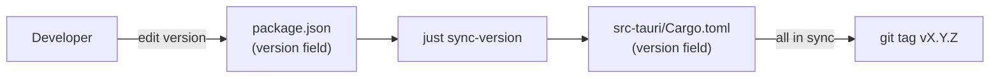
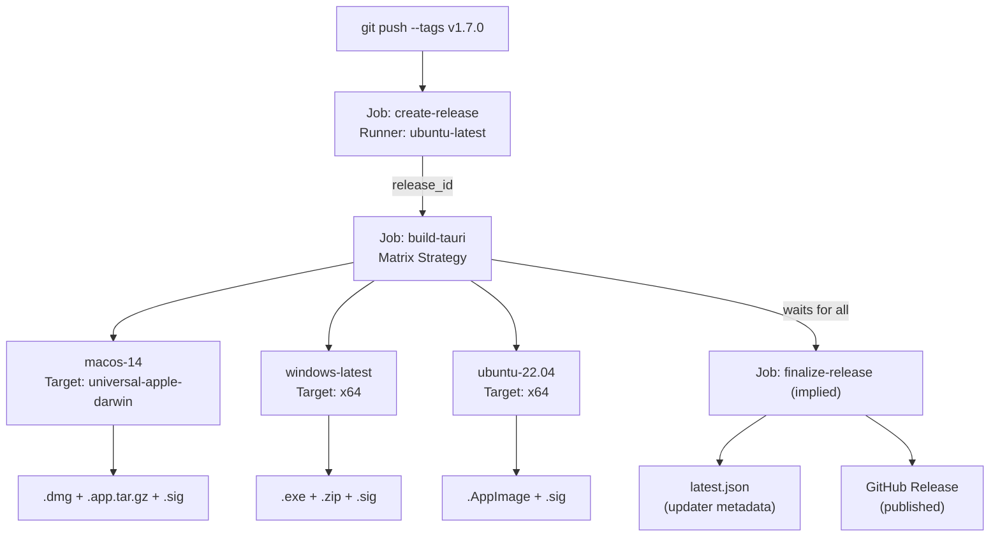
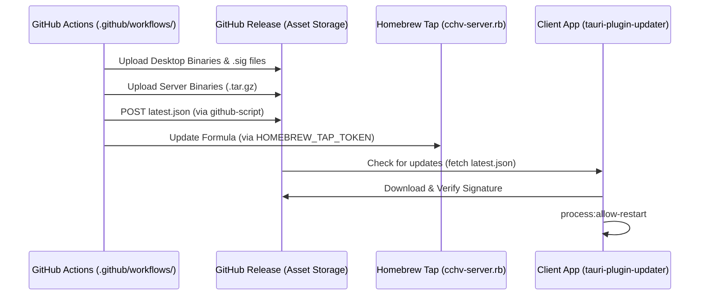

# Release Workflow

<details>
<summary>관련 소스 파일</summary>

다음 파일들은 이 위키 페이지를 생성하기 위한 컨텍스트로 사용되었습니다.

- [.github/workflows/server-release.yml](.github/workflows/server-release.yml)
- [.github/workflows/updater-release-retry.yml](.github/workflows/updater-release-retry.yml)
- [.github/workflows/updater-release.yml](.github/workflows/updater-release.yml)
- [docs/server-guide.ko.md](docs/server-guide.ko.md)
- [docs/server-guide.md](docs/server-guide.md)
- [index.html](index.html)
- [install-server.sh](install-server.sh)
- [justfile](justfile)
- [pnpm-lock.yaml](pnpm-lock.yaml)
- [src-tauri/.cargo/config.toml](src-tauri/.cargo/config.toml)
- [src-tauri/capabilities/default.json](src-tauri/capabilities/default.json)
- [src/index.css](src/index.css)
- [tailwind.config.js](tailwind.config.js)

</details>


## 목적과 범위

이 문서는 platform-specific binary를 build하고, cryptographic signature를 생성하며, updater metadata를 만들고, GitHub에 release를 publish하는 automated CI/CD pipeline을 설명합니다. 이 시스템은 Tauri desktop application과 standalone WebUI server binary의 전달을 모두 자동화합니다.

| Workflow File | Trigger | Purpose |
|------|---------|---------|
| [.github/workflows/updater-release.yml]() | `v*` tag에 대한 `push` | Desktop release: multi-platform build, signing, `latest.json` generation. |
| [.github/workflows/server-release.yml]() | `v*` tag에 대한 `push` | Server release: headless binary build, `cchv-server`용 Homebrew tap sync. |
| [.github/workflows/updater-release-retry.yml]() | manual `workflow_dispatch` | 기존 `release_id`에서 desktop release를 다시 finalize. |

**출처:** [.github/workflows/updater-release.yml:1-10](), [.github/workflows/server-release.yml:1-12](), [.github/workflows/updater-release-retry.yml:1-10]()

---

## Trigger Mechanism

release workflow는 `v*` pattern과 match되는 **git tag push**(예: `v1.7.0`)를 통해서만 활성화됩니다.

```yaml
on:
  push:
    tags:
      - "v*"
```

tag name은 version을 결정하는 데 사용됩니다. manifest file 전반의 consistency를 보장하기 위해 tagging 전에 [package.json:4]()의 version을 수동으로 bump합니다.

**출처:** [.github/workflows/updater-release.yml:4-7](), [.github/workflows/server-release.yml:8-11](), [package.json:4]()

---

## Version Management: Single Source of Truth

애플리케이션은 [package.json]()이 authoritative version number를 정의하는 **single source of truth** pattern을 따릅니다. 이 version은 `sync-version` script를 사용해 manifest file 전반에 synchronize되어야 합니다.

| File | Field | Location |
|------|-------|----------|
| [package.json]() | `"version"` | [package.json:4]() |
| [src-tauri/Cargo.toml]() | `version` | [src-tauri/Cargo.toml:3]() |

**Version synchronization flow:**

"Natural Language Space" to "Code Entity Space" - Versioning:


`just sync-version` recipe [justfile:79-80]()는 root `package.json`의 version을 Rust backend manifest로 propagate하기 위해 `node scripts/sync-version.cjs`를 실행합니다.

**출처:** [package.json:4](), [src-tauri/Cargo.toml:3](), [justfile:79-80]()

---

## Desktop Release Pipeline (Tauri)

desktop pipeline은 matrix strategy를 사용해 macOS(Universal), Windows(x64), Linux(AppImage)용으로 build합니다.

### Build Pipeline Architecture



**출처:** [.github/workflows/updater-release.yml:12-130]()

### Specialized Platform Processing
- **Windows Portable:** workflow는 standard installer 외에도 [windows-latest]의 `.exe` binary에 대한 portable ZIP archive를 생성합니다 [.github/workflows/updater-release.yml:132-175]().
- **Linux AppImage Fix:** Arch Linux 및 기타 rolling-release distro에서 EGL crash를 방지하기 위해 workflow는 incompatible Ubuntu-compiled library(예: `libEGL.so*`, `libwayland-client.so*`)를 제거하여 AppImage를 post-process합니다 [.github/workflows/updater-release.yml:186-214]().

---

## Server Release Pipeline (Headless)

server release workflow [.github/workflows/server-release.yml]()는 frontend asset이 embed된 standalone Rust binary를 build합니다.

### Server Build Matrix
server는 remote VPS 및 server environment를 지원하기 위해 네 target으로 build됩니다 [.github/workflows/server-release.yml:21-34]().
- `x86_64-unknown-linux-gnu` (Linux x64)
- `aarch64-unknown-linux-gnu` (Linux ARM64 - `gcc-aarch64-linux-gnu`를 통해 cross-compile)
- `aarch64-apple-darwin` (macOS ARM64)
- `x86_64-apple-darwin` (macOS x64)

build process는 `webui-server` feature flag [justfile:112-113]()를 사용하며, 이 flag는 `dist/` directory를 binary에 bundle하는 `rust-embed` logic을 trigger합니다.

### Homebrew Tap Synchronization
`update-homebrew` job [.github/workflows/server-release.yml:129-214]()은 `jhlee0409/homebrew-tap` repository의 `cchv-server` formula update를 자동화합니다.
1. 새로 build된 server asset을 download하고 SHA256 checksum을 계산합니다 [.github/workflows/server-release.yml:137-147]().
2. `CHECKSUMS.sha256` manifest를 생성합니다 [.github/workflows/server-release.yml:140-152]().
3. Python script를 사용해 새 version과 platform-specific hash로 `cchv-server.rb` Ruby formula를 update합니다 [.github/workflows/server-release.yml:175-214]().

**출처:** [.github/workflows/server-release.yml:17-35](), [.github/workflows/server-release.yml:129-214](), [justfile:112-113]()

---

## Security 및 Signing

### Tauri Cryptographic Signatures
desktop artifact는 Ed25519 private key를 사용해 sign됩니다 [.github/workflows/updater-release.yml:116-117](). public key는 client app이 update integrity를 verify하는 데 사용됩니다.

### Apple Code Signing
macOS build는 Apple Developer certificate를 사용해 sign 및 notarize됩니다 [.github/workflows/updater-release.yml:118-123](). 이를 통해 `.dmg`와 `.app` bundle이 Gatekeeper check를 통과하도록 보장합니다.

### Server Checksums
server binary의 경우 workflow는 `CHECKSUMS.sha256` file을 생성하고 release에 upload합니다 [.github/workflows/server-release.yml:140-152](). `install-server.sh` script는 installation 중 이 checksum을 verify합니다 [.install-server.sh:87-108]().

**출처:** [.github/workflows/updater-release.yml:116-123](), [.github/workflows/server-release.yml:140-152](), [install-server.sh:87-108]()

---

## Release Finalization 및 Updates

### Updater Metadata (latest.json)
`finalize-release` job(또는 standalone `updater-release-retry.yml` workflow)은 `latest.json` manifest를 구성합니다. 이 manifest는 platform identifier(예: `darwin-aarch64`, `windows-x86_64`)를 각각의 download URL 및 cryptographic signature에 매핑합니다 [.github/workflows/updater-release-retry.yml:60-88]().

### Deployment Sequence

"Natural Language Space" to "Code Entity Space" - Deployment:


client application은 이러한 update를 수행하기 위해 capabilities configuration에 정의된 `updater:allow-check`와 `process:allow-restart` permission에 의존합니다 [src-tauri/capabilities/default.json:14-16]().

**출처:** [.github/workflows/updater-release-retry.yml:15-108](), [.github/workflows/server-release.yml:154-214](), [src-tauri/capabilities/default.json:14-16]()
