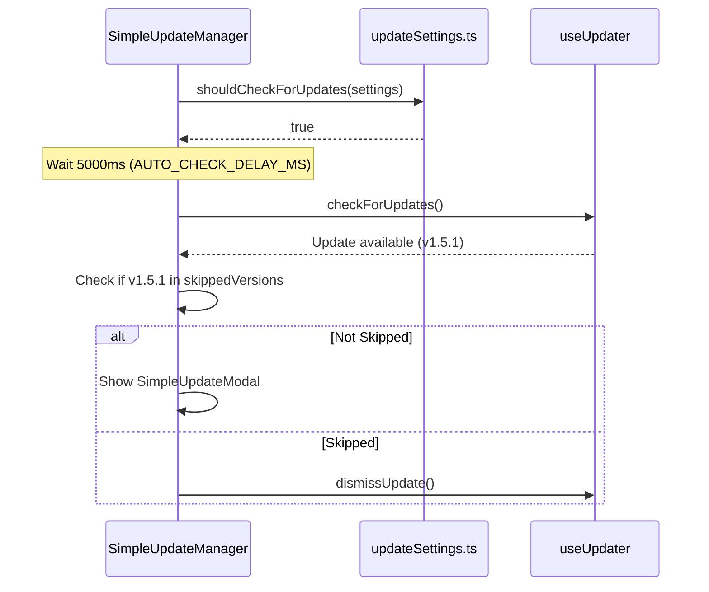

# Auto-Updater

<details>
<summary>관련 소스 파일</summary>

다음 파일들은 이 위키 페이지를 생성하기 위한 컨텍스트로 사용되었습니다.

- [docs/superpowers/specs/2026-03-28-wsl-support-design.md](docs/superpowers/specs/2026-03-28-wsl-support-design.md)
- [src-tauri/src/commands/multi_provider.rs](src-tauri/src/commands/multi_provider.rs)
- [src-tauri/tests/capabilities.test.ts](src-tauri/tests/capabilities.test.ts)
- [src/components/MessageViewer/helpers/agentProgressHelpers.ts](src/components/MessageViewer/helpers/agentProgressHelpers.ts)
- [src/components/SimpleUpdateManager.tsx](src/components/SimpleUpdateManager.tsx)
- [src/components/SimpleUpdateModal.tsx](src/components/SimpleUpdateModal.tsx)
- [src/components/contentRenderer/toolUseRenderers/ApplyPatchToolRenderer.tsx](src/components/contentRenderer/toolUseRenderers/ApplyPatchToolRenderer.tsx)
- [src/components/contentRenderer/toolUseRenderers/TaskToolRenderer.tsx](src/components/contentRenderer/toolUseRenderers/TaskToolRenderer.tsx)
- [src/components/contentRenderer/toolUseRenderers/UpdatePlanToolRenderer.tsx](src/components/contentRenderer/toolUseRenderers/UpdatePlanToolRenderer.tsx)
- [src/hooks/useUpdater.test.ts](src/hooks/useUpdater.test.ts)
- [src/hooks/useUpdater.ts](src/hooks/useUpdater.ts)
- [src/test/SimpleUpdateManager.test.tsx](src/test/SimpleUpdateManager.test.tsx)
- [src/test/SimpleUpdateModal.test.tsx](src/test/SimpleUpdateModal.test.tsx)
- [src/test/updateDiagnostics.test.ts](src/test/updateDiagnostics.test.ts)
- [src/test/updateSettings.test.ts](src/test/updateSettings.test.ts)
- [src/types/updateSettings.ts](src/types/updateSettings.ts)
- [src/utils/updateDiagnostics.ts](src/utils/updateDiagnostics.ts)
- [src/utils/updateError.ts](src/utils/updateError.ts)
- [src/utils/updateSettings.ts](src/utils/updateSettings.ts)

</details>


이 페이지는 Claude Code History Viewer의 client-side auto-updater system을 문서화합니다. 애플리케이션은 `@tauri-apps/plugin-updater`를 사용해 software update의 lifecycle을 관리하며, 여기에는 discovery, secure download, automated installation이 포함됩니다.

## 개요

update system은 Tauri Rust backend와 interface하는 frontend state machine을 통해 orchestrate됩니다. automatic background check와 manual user-initiated check를 모두 지원하며, version skipping과 postponement를 처리하는 logic을 포함합니다.

```mermaid
graph TB
    subgraph "Frontend (React/TypeScript)"
        SUM["SimpleUpdateManager.tsx<br/>Orchestrator"]
        Hook["useUpdater.ts<br/>State Machine"]
        Store["useAppStore (Zustand)<br/>Persistence"]
        Modal["SimpleUpdateModal.tsx<br/>UI & Release Notes"]
    end
    
    subgraph "Tauri Layer (Rust/JS Bridge)"
        TauriPlugin["@tauri-apps/plugin-updater"]
        Process["@tauri-apps/plugin-process<br/>relaunch()"]
    end
    
    subgraph "External (GitHub)"
        Manifest["latest.json<br/>Update Metadata"]
        Binary["Platform Binary<br/>.dmg / .exe / .AppImage"]
    end

    SUM --> Hook
    SUM --> Store
    Hook -->|check()| TauriPlugin
    TauriPlugin -->|Fetch| Manifest
    Hook -->|downloadAndInstall()| TauriPlugin
    TauriPlugin -->|Download| Binary
    TauriPlugin -->|Verify & Install| Process
    SUM --> Modal
```

출처: [src/components/SimpleUpdateManager.tsx:1-10](), [src/hooks/useUpdater.ts:31-54](), [src/utils/updateSettings.ts:6-24]()

## State Management 및 Persistence

update settings와 state는 volatile React state(현재 session의 download progress용)와 persistent `localStorage`(skipped version 같은 user preference용)로 나뉩니다.

### UpdateSettings (Zustand/LocalStorage)
애플리케이션은 `update_settings` key 아래 `localStorage`에 update preference를 persist합니다 [src/utils/updateSettings.ts:6-7](). 이는 global store의 `updateSettings` slice를 통해 관리됩니다 [src/components/SimpleUpdateManager.tsx:20-24]().

| Setting | Type | Description |
|---------|------|-------------|
| `autoCheck` | `boolean` | update를 automatic하게 check할지 여부 [src/utils/updateSettings.ts:35-37]() |
| `checkInterval` | `string` | frequency: `startup`, `daily`, `weekly`, 또는 `never` [src/utils/updateSettings.ts:10]() |
| `skippedVersions` | `string[]` | 사용자가 ignore하기로 선택한 version [src/utils/updateSettings.ts:42-45]() |
| `lastCheckedAt` | `number` | 마지막 successful check의 timestamp [src/utils/updateSettings.ts:49-51]() |
| `lastPostponedAt` | `number` | 사용자가 "Remind Me Later"를 click한 timestamp [src/utils/updateSettings.ts:46-48]() |

### useUpdater State Machine
`useUpdater` hook은 active update process의 transient state를 관리합니다 [src/hooks/useUpdater.ts:35-47](). checking부터 restarting까지의 lifecycle을 추적하기 위해 state object를 사용합니다.

```typescript
export interface UpdateState {
  isChecking: boolean;
  hasUpdate: boolean;
  isDownloading: boolean;
  isInstalling: boolean;
  isRestarting: boolean;
  requiresManualRestart: boolean;
  downloadProgress: number;
  error: string | null;
  updateInfo: Update | null;
  currentVersion: string;
  newVersion: string | null;
}
```
출처: [src/hooks/useUpdater.ts:35-47](), [src/utils/updateSettings.ts:29-66](), [src/hooks/useUpdater.ts:80-92]()

## 구현 세부 사항: SimpleUpdateManager

`SimpleUpdateManager`는 `useUpdater` hook과 애플리케이션의 persistent settings를 조율하는 top-level headless component입니다.

### Auto-Check Logic
manager는 environment가 production이고 settings가 허용하는 경우 app start 5초 후(`AUTO_CHECK_DELAY_MS`) automatic check를 수행합니다 [src/components/SimpleUpdateManager.tsx:12-121]().



### Manual Checks
manual check는 custom window event `manual-update-check`를 통해 trigger됩니다 [src/components/SimpleUpdateManager.tsx:178-194](). 이는 `isManualCheck`를 true로 설정하여, update가 발견되지 않은 경우에도 result(예: "Up to date" notification)가 표시되도록 보장합니다 [src/components/SimpleUpdateManager.tsx:132-144]().

출처: [src/components/SimpleUpdateManager.tsx:107-121](), [src/components/SimpleUpdateManager.tsx:147-175](), [src/utils/updateSettings.ts:92-129]()

## Update UI Components

### SimpleUpdateModal
이 component는 update의 "Read" phase를 처리합니다. update server가 반환한 raw JSON에서 release note와 name을 parse합니다 [src/components/SimpleUpdateModal.tsx:33-54]().

- **Release Notes Parsing**: `body`, `rawJson.notes`, `rawJson.releaseNotes`, 또는 `rawJson.changelog`에서 note를 찾으려고 시도합니다 [src/components/SimpleUpdateModal.tsx:44-54]().
- **Primary Action**: `updater.downloadAndInstall()`을 trigger하여 state machine을 downloading phase로 전환합니다 [src/components/SimpleUpdateModal.tsx:73-75]().
- **Restart Handling**: `requiresManualRestart`가 true이면 사용자에게 구체적인 안내를 제공합니다 [src/components/SimpleUpdateModal.tsx:100-101]().

### Notifications
시스템은 non-modal feedback을 제공하기 위해 여러 specialized notification component를 사용합니다.
- `UpdateCheckingNotification`: manual check 중 표시됩니다 [src/components/SimpleUpdateManager.tsx:124-130]().
- `UpToDateNotification`: manual check 후 update가 없으면 잠시 표시됩니다 [src/components/SimpleUpdateManager.tsx:138-140]().
- `UpdateErrorNotification`: localized error message를 표시합니다 [src/components/SimpleUpdateManager.tsx:135-137]().

출처: [src/components/SimpleUpdateModal.tsx:56-138](), [src/components/SimpleUpdateManager.tsx:223-260]()

## Error Handling 및 Diagnostics

update는 network issue, signature mismatch, permission error로 인해 실패할 수 있습니다.

### Error Resolution
utility `resolveUpdateErrorMessage`는 internal error code를 localized string으로 mapping합니다. 중요한 code는 `update.download_complete_restart`이며, update가 준비되었지만 app에 manual restart가 필요함을 나타냅니다 [src/components/SimpleUpdateModal.tsx:97-99]().

### Diagnostics Reporting
update가 실패하면 `SimpleUpdateModal`은 "Report Issue" button을 제공합니다 [src/components/SimpleUpdateModal.tsx:103-127](). 이는 `buildUpdateDiagnostics`를 사용해 다음을 포함한 technical summary를 생성합니다.
- 현재 및 target version
- failure 시점의 download progress
- state flag(`isInstalling`, `isRestarting`)
- error message

이 diagnostic block은 feedback modal에 미리 채워집니다 [src/components/SimpleUpdateModal.tsx:117-124]().

출처: [src/utils/updateError.ts:1-13](), [src/utils/updateDiagnostics.ts:1-44](), [src/components/SimpleUpdateModal.tsx:103-127]()

## Technical Specifications

| Feature | Implementation |
|---------|----------------|
| **Version Comparison** | Tauri가 SemVer로 처리합니다 [src/hooks/useUpdater.ts:125-128]() |
| **Timeout** | manifest check에 20초(`CHECK_TIMEOUT_MS`) [src/hooks/useUpdater.ts:7]() |
| **Download Tracking** | Tauri plugin의 `started`, `progress`, `finished` event를 listen합니다 [src/hooks/useUpdater.ts:177-217]() |
| **Restart Mechanism** | successful installation 후 `@tauri-apps/plugin-process` `relaunch()`를 호출합니다 [src/hooks/useUpdater.ts:245-249]() |

출처: [src/hooks/useUpdater.ts:7-250](), [src/hooks/useUpdater.ts:158-260]()
