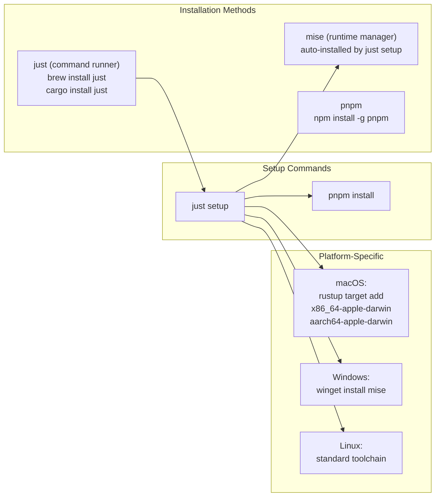
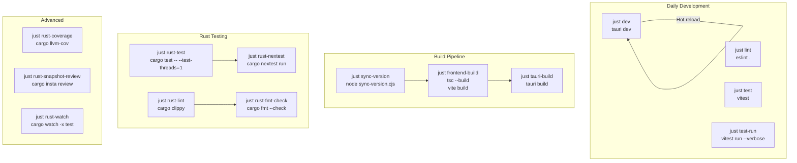
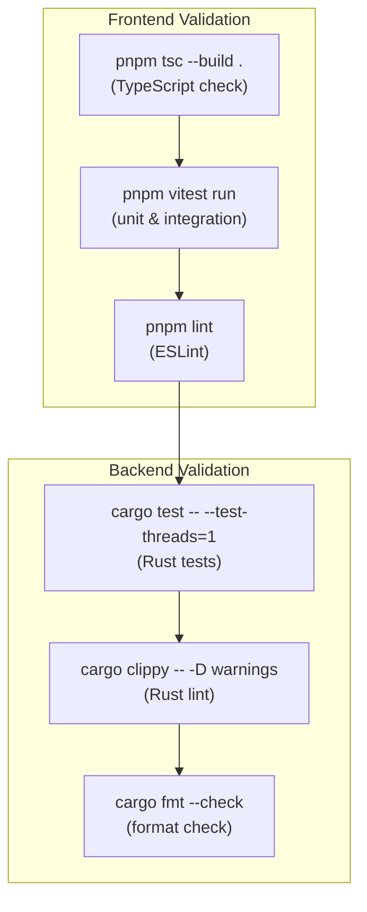
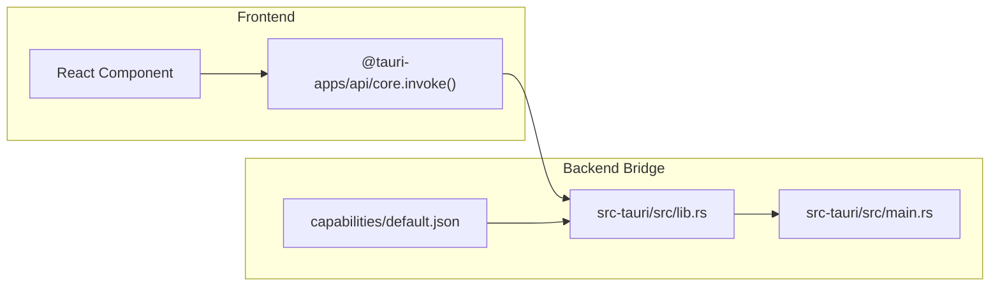
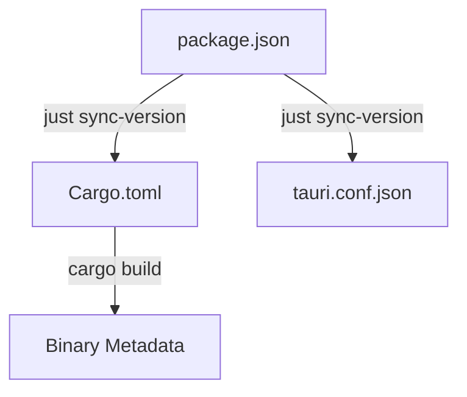

# Development Guide

관련 소스 파일

다음 파일들은 이 위키 페이지를 생성하기 위한 컨텍스트로 사용되었습니다.

- [.github/workflows/updater-release.yml](.github/workflows/updater-release.yml)
- [.prettierrc](.prettierrc)
- [eslint.config.js](eslint.config.js)
- [justfile](justfile)
- [pnpm-lock.yaml](pnpm-lock.yaml)
- [pnpm-workspace.yaml](pnpm-workspace.yaml)
- [postcss.config.js](postcss.config.js)
- [src-tauri/.cargo/config.toml](src-tauri/.cargo/config.toml)
- [src-tauri/.gitignore](src-tauri/.gitignore)
- [src-tauri/build.rs](src-tauri/build.rs)
- [src-tauri/capabilities/default.json](src-tauri/capabilities/default.json)
- [src/index.css](src/index.css)
- [tailwind.config.js](tailwind.config.js)
- [tsconfig.json](tsconfig.json)

이 문서는 Claude Code History Viewer codebase에서 작업하는 developer를 위한 포괄적인 지침을 제공합니다. environment setup, development workflow, code quality standard, architecture pattern, release procedure를 다룹니다.

**Scope:** 이 페이지는 toolchain setup, development command, coding standard를 포함하여 project에 contribution하는 실무적 측면에 초점을 맞춥니다. 특정 subsystem에 대한 자세한 정보는 다음을 참조하세요.
- Build system configuration 및 toolchain details: [Build System](#9.1) 참조
- Test suite 및 testing strategy: [Testing](#9.2) 참조  
- Shared utility function 및 helper: [Utility Functions](#9.3) 참조

---

## Environment Setup

### Prerequisites

애플리케이션에는 세 가지 핵심 technology가 필요합니다.

| Tool | Version | Purpose |
|------|---------|---------|
| **Node.js** | 20+ | Frontend build 및 package management |
| **pnpm** | Latest | 빠르고 disk-efficient한 package manager |
| **Rust** | Latest stable | Tauri를 통한 backend compilation |

### Toolchain Installation

project는 command runner로 `just`를, runtime management로 `mise`를 사용합니다.

**출처:** [justfile:16-42](), [pnpm-lock.yaml:127-129](), [.github/workflows/updater-release.yml:76-87]()

`justfile`은 중요한 environment configuration을 제공합니다.
- [justfile:5]()는 `node_modules/.bin`과 `.mise/shims`를 `PATH`에 추가합니다.
- [justfile:19]()는 올바른 Node.js 및 tool version이 있는지 보장하기 위해 `mise install`을 실행합니다.

**Platform-Specific Setup:**
- **macOS:** [justfile:38-41]()는 universal binary target(`x86_64-apple-darwin`, `aarch64-apple-darwin`)을 자동으로 추가합니다.
- **Windows:** [justfile:26-27]()는 `winget`을 통해 mise를 설치합니다.
- **Linux:** Tauri를 위해 `libwebkit2gtk-4.1-dev` 및 `libappindicator3-dev` 같은 system dependency가 필요합니다 [.github/workflows/updater-release.yml:89-93]().

---

## Development Workflow

### Command Reference

project는 `just`를 사용해 frontend(Vite/Vitest)와 backend(Cargo) task를 통합합니다.

**출처:** [justfile:13-197](), [eslint.config.js:1-31](), [src-tauri/.cargo/config.toml:23-37]()

### Key Commands

| Command | Description | Implementation |
|---------|-------------|----------------|
| `just dev` | hot reload로 Tauri + Vite 실행 | [justfile:44-45]() |
| `just test` | watch mode로 Vitest 실행 | [justfile:86-87]() |
| `just rust-test` | Rust test 실행(single-threaded) | [justfile:131-132]() |
| `just sync-version` | package.json에서 Cargo.toml로 version sync | [justfile:79-80]() |
| `just serve-dev` | backend를 web server(WebUI mode)로 실행 | [justfile:124-125]() |

**중요 참고:** [justfile:131-132]()는 `cargo test -- --test-threads=1`을 실행합니다. 여러 backend test가 environment variable 또는 process-global state를 사용해 parallel execution에서 race condition을 일으킬 수 있기 때문입니다. 안전한 경우 더 빠른 parallel testing을 위해 `just rust-nextest` [justfile:135-136]()를 사용할 수 있습니다.

---

## Code Quality Standards

### Quality Gates

project는 release 전에 엄격한 validation을 강제합니다. CI pipeline은 이러한 local check를 mirror합니다.

**출처:** [justfile:170-172](), [eslint.config.js:12-23](), [src-tauri/.cargo/config.toml:29-30]()

### Testing Integration

codebase는 frontend testing에 `Vitest` [pnpm-lock.yaml:188-190]()를, backend testing에 `cargo nextest` [src-tauri/.cargo/config.toml:25-26]()를 사용합니다. Rust에서는 `cargo insta` [justfile:186-187]()를 통한 snapshot testing이 지원됩니다.

---

## Architecture Patterns

### Command Execution Pattern

backend logic은 Tauri command를 통해 React frontend에 노출됩니다. application logic의 entry point는 command와 plugin을 등록하는 Tauri builder입니다.

**출처:** [src-tauri/src/main.rs:1-3](), [src-tauri/capabilities/default.json:8-23](), [pnpm-lock.yaml:58-60]()

### Design System

애플리케이션은 Tailwind CSS와 OKLCH color space를 통해 구현된 custom "Command Center" design system을 사용합니다.

| Entity | Code Reference | Role |
|--------|----------------|------|
| **Design Tokens** | `src/index.css` | "Industrial Luxury" aesthetic을 위한 OKLCH variable 정의 [src/index.css:24-187]() |
| **Tailwind Config** | `tailwind.config.js` | CSS variable을 Tailwind utility class에 mapping [tailwind.config.js:33-132]() |
| **Fonts** | `IBM Plex Sans` | primary UI typography [tailwind.config.js:9]() |

---

## Version Management

### Single Source of Truth

**`package.json`**은 authoritative version source입니다. `sync-version` script는 이를 `Cargo.toml` 및 기타 configuration file로 propagate합니다.

**출처:** [justfile:79-80](), [.github/workflows/updater-release.yml:19-20]()

### Release Process

1. **Quality Gate**: `just rust-check-all` [justfile:171]()을 통해 모든 frontend 및 backend test를 통과합니다.
2. **Version Bump**: `package.json`을 update하고 `just sync-version` [justfile:79-80]()을 실행합니다.
3. **Tag**: release workflow를 trigger하기 위해 `v`로 시작하는 git tag를 생성합니다 [.github/workflows/updater-release.yml:4-7]().
4. **Automation**: GitHub Actions가 multi-platform binary(macOS Universal, Ubuntu, Windows)를 build하고 code signing을 처리합니다 [.github/workflows/updater-release.yml:53-130]().

---

## Related Documentation

특정 development topic에 대한 더 깊은 내용은 다음을 참조하세요.

- **Build System Details:** justfile configuration, available recipe, platform-specific build target → [Build System](#9.1)
- **Testing Strategies:** unit test, integration test, Rust property-based test, coverage reporting → [Testing](#9.2)
- **Utility Functions:** path decoding, git worktree detection, frontend search를 위한 shared helper → [Utility Functions](#9.3)
