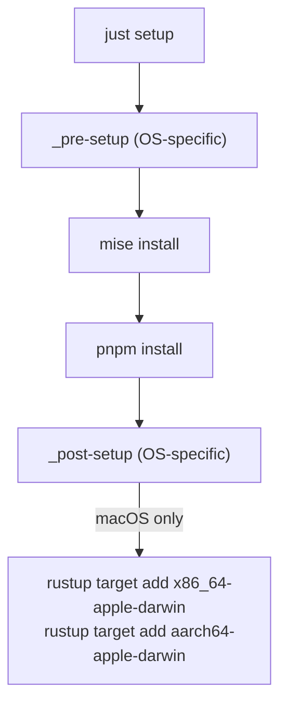
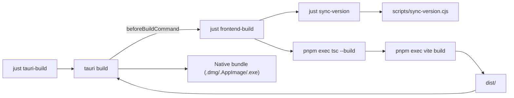
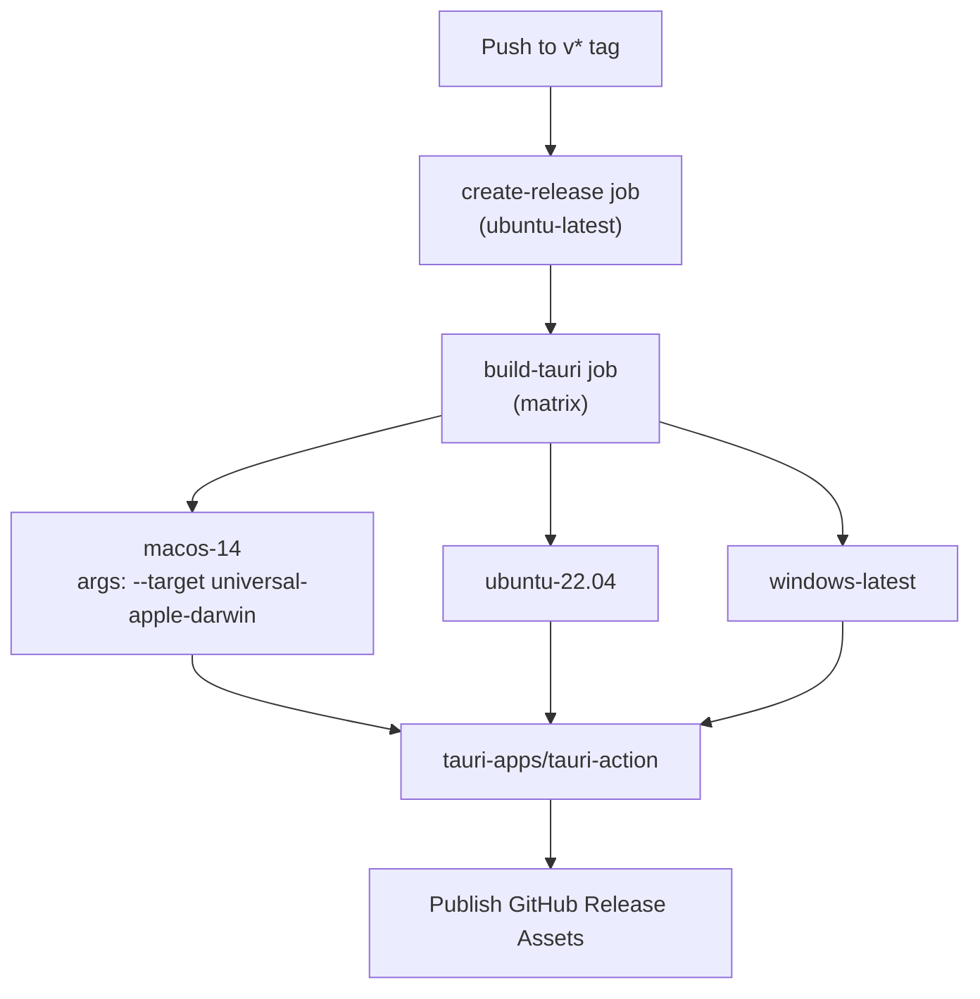

# 빌드 시스템

<details>
<summary>관련 소스 파일</summary>

다음 파일들은 이 위키 페이지를 생성하기 위한 컨텍스트로 사용되었습니다.

- [.github/workflows/updater-release.yml](.github/workflows/updater-release.yml)
- [.prettierrc](.prettierrc)
- [eslint.config.js](eslint.config.js)
- [justfile](justfile)
- [mise.toml](mise.toml)
- [pnpm-lock.yaml](pnpm-lock.yaml)
- [pnpm-workspace.yaml](pnpm-workspace.yaml)
- [postcss.config.js](postcss.config.js)
- [src-tauri/.cargo/config.toml](src-tauri/.cargo/config.toml)
- [src-tauri/.gitignore](src-tauri/.gitignore)
- [src-tauri/build.rs](src-tauri/build.rs)
- [src-tauri/capabilities/default.json](src-tauri/capabilities/default.json)
- [src-tauri/tests/configImport.test.ts](src-tauri/tests/configImport.test.ts)
- [src-tauri/tests/tauriConfig.test.ts](src-tauri/tests/tauriConfig.test.ts)
- [src/index.css](src/index.css)
- [src/test/setup.ts](src/test/setup.ts)
- [tailwind.config.js](tailwind.config.js)
- [tsconfig.json](tsconfig.json)

</details>


이 페이지는 로컬 개발 빌드 시스템, 사용 가능한 `just` recipe, Vite 프론트엔드 빌드 파이프라인, Tauri 데스크톱 빌드 대상을 문서화합니다. CI/CD 릴리스 파이프라인과 자동화된 GitHub Actions 워크플로에 대한 정보는 [Release Workflow](#8.1)를 참조하세요. 테스트 하위 시스템은 [Testing](#9.2)을 참조하세요.

---

## 개요

이 프로젝트는 [just](https://just.systems/)를 명령 실행기로 사용하며, 세 가지 기반 툴체인을 조율합니다.

| 툴체인 | 역할 |
|---|---|
| **pnpm** | 프론트엔드 의존성 관리 및 스크립트 실행기 [package.json:108-108]() |
| **Vite** | TypeScript 컴파일 및 프론트엔드 번들링 [package.json:7-8]() |
| **Tauri CLI** | Rust 컴파일 및 데스크톱 앱 패키징 [package.json:9-10]() |

개발자용 명령은 모두 저장소 루트의 `justfile`에 중앙화되어 있습니다. 인자 없이 `just`를 실행하면 사용 가능한 모든 recipe가 나열됩니다.

출처: [justfile:1-14](), [package.json:1-19]()

---

## Justfile 설정

justfile은 두 가지 전역 설정을 사용합니다.

```just
set dotenv-load
set windows-powershell := true
```

- `dotenv-load`는 `.env` 파일이 있으면 자동으로 소싱합니다 [justfile:1-1]().
- `windows-powershell`은 Windows에서 셸 명령에 PowerShell이 사용되도록 보장합니다 [justfile:2-2]().

파일 상단에서 `PATH`를 확장해 로컬 `node_modules/.bin` 및 `.mise/shims`를 포함하므로, 모든 프로젝트 로컬 바이너리(`vite`, `tsc`, `tauri` 등)를 전역 설치 없이 사용할 수 있습니다.

[justfile:5-5]()

출처: [justfile:1-6]()

---

## Recipe 참조

### 설정

**환경 설정 다이어그램**



출처: [justfile:17-41]()

`setup` recipe는 환경 부트스트래핑을 처리합니다. OS별 hook(`_pre-setup`, `_post-setup`)은 플랫폼별로 정의됩니다. macOS `_post-setup`은 Intel 및 Apple Silicon Rust target을 모두 추가하며, 이는 universal binary를 생성하는 데 필요합니다.

| Recipe | OS | 동작 |
|---|---|---|
| `_pre-setup` | Windows | `winget install mise` [justfile:25-27]() |
| `_pre-setup` | Linux | _(no-op)_ [justfile:29-29]() |
| `_pre-setup` | macOS | _(no-op)_ [justfile:31-31]() |
| `_post-setup` | Windows | _(no-op)_ [justfile:34-34]() |
| `_post-setup` | Linux | _(no-op)_ [justfile:35-36]() |
| `_post-setup` | macOS | `x86_64-apple-darwin` 및 `aarch64-apple-darwin` target 추가 [justfile:38-41]() |

출처: [justfile:24-41]()

---

### 개발

| Recipe | 명령 | 참고 |
|---|---|---|
| `dev` | `tauri dev` | 전체 개발 루프를 시작합니다. Tauri가 `just vite-dev`를 자동으로 생성합니다 [justfile:44-45]() |
| `vite-dev` | `vite` | 포트 5173에서 Vite HMR 서버를 시작합니다. **직접 실행하지 마세요** [justfile:48-49]() |
| `vite-preview` | `vite preview` | 프로덕션 `dist/`를 로컬에서 제공합니다 [justfile:55-56]() |
| `lint` | `eslint .` | 모든 소스 파일에 ESLint를 실행합니다 [justfile:51-52]() |

`dev` recipe는 `tauri dev`에 위임하며, 이 명령은 `tauri.conf.json`을 읽고 `beforeDevCommand`를 실행합니다.

[src-tauri/tauri.conf.json:76-76]()

```json
"beforeDevCommand": "just vite-dev",
"devUrl": "http://localhost:5173"
```

출처: [justfile:43-55](), [src-tauri/tauri.conf.json:71-86]()

---

### 빌드 파이프라인

**빌드 의존성 다이어그램**



출처: [justfile:59-76](), [src-tauri/tauri.conf.json:71-86]()

#### `sync-version`

[justfile:79-80]()

`node scripts/sync-version.cjs`를 실행해 `package.json`의 버전 문자열을 `src-tauri/Cargo.toml` 및 `src-tauri/tauri.conf.json`으로 복사합니다. 이를 통해 세 버전 선언이 모두 동기화된 상태로 유지됩니다.

#### `frontend-build`

[justfile:59-66]()

`sync-version`에 의존한 다음:
1. `pnpm exec tsc --build`로 TypeScript를 컴파일합니다.
2. `pnpm exec vite build`로 프론트엔드를 번들링합니다.

출력은 `dist/`로 이동하며, 이 디렉터리는 `tauri.conf.json`에서 `frontendDist`로 참조됩니다.

[src-tauri/tauri.conf.json:74-74]()

#### `tauri-build`

[justfile:68-76]()

OS별 recipe:

| OS | 명령 |
|---|---|
| Windows | `tauri build` [justfile:69-70]() |
| Linux | `tauri build` [justfile:72-73]() |
| macOS | `tauri build --target universal-apple-darwin` [justfile:75-76]() |

macOS는 `x86_64-apple-darwin` 및 `aarch64-apple-darwin` slice를 결합한 universal binary를 빌드합니다. Tauri는 내부적으로 `beforeBuildCommand`를 통해 `just frontend-build`를 호출합니다.

출처: [justfile:59-80](), [src-tauri/tauri.conf.json:71-86]()

---

### WebUI 서버 모드

빌드 시스템은 Rust 백엔드를 프론트엔드가 임베드된 독립 실행형 바이너리로 컴파일하는 특수한 "WebUI Server Mode"를 지원합니다.

| Recipe | 명령 | 목적 |
|---|---|---|
| `serve-build` | `frontend-build` 후 `cargo build --release --features webui-server` | 임베드된 프론트엔드를 포함한 단일 바이너리를 빌드합니다 [justfile:112-113]() |
| `serve-dev` | `frontend-build` 후 `cargo run --features webui-server` | 외부의 hot-reload 가능한 dist/로 서버를 실행합니다 [justfile:124-125]() |

이 모드는 `Cargo.toml`의 `webui-server` feature를 사용하며, 이 feature는 `axum`, `tower-http`, `rust-embed` 같은 의존성을 활성화합니다.

출처: [justfile:109-125](), [src-tauri/Cargo.toml:19-19]()

---

## Vite 설정

프론트엔드 빌드는 Vite가 주도합니다. Tauri 빌드와의 주요 통합 지점은 다음과 같습니다.

| `tauri.conf.json` 키 | 값 | 목적 |
|---|---|---|
| `build.devUrl` | `http://localhost:5173` | 개발 모드에서 Tauri WebView가 연결되는 위치 [src-tauri/tauri.conf.json:75-75]() |
| `build.frontendDist` | `../dist` | Tauri가 앱에 번들링하는 출력 디렉터리 [src-tauri/tauri.conf.json:74-74]() |
| `build.beforeDevCommand` | `just vite-dev` | Tauri WebView가 열리기 전에 생성됩니다 [src-tauri/tauri.conf.json:76-76]() |
| `build.beforeBuildCommand` | `just frontend-build` | TypeScript 컴파일과 번들링을 실행합니다 [src-tauri/tauri.conf.json:77-77]() |

프론트엔드 빌드 도구는 `package.json`에 dev dependency로 선언되어 있습니다.

| Package | 버전 | 역할 |
|---|---|---|
| `vite` | `^7.1.12` | 빌드 도구 및 개발 서버 [package.json:157-157]() |
| `typescript` | `^5.8.3` | 타입 검사 [package.json:155-155]() |
| `@vitejs/plugin-react` | `^4.5.2` | JSX transform 및 HMR [package.json:185-185]() |
| `@tailwindcss/vite` | `^4.1.11` | Tailwind CSS 통합 [package.json:52-52]() |

출처: [src-tauri/tauri.conf.json:71-86](), [package.json:157-210]()

---

## Cargo / Rust 빌드 설정

Rust crate는 `src-tauri/`에 있습니다. 이 crate의 `Cargo.toml`은 빌드 profile을 정의합니다.

| Profile | `opt-level` | `debug` | 목적 |
|---|---|---|---|
| `dev` | 0 | true | 빠른 반복 개발 [src-tauri/Cargo.toml:106-108]() |
| `dev.package."*"` | 2 | — | dev 빌드에서 의존성을 최적화합니다 [src-tauri/Cargo.toml:111-112]() |
| `test` | 1 | true | 더 빠른 테스트 실행 [src-tauri/Cargo.toml:114-116]() |
| `coverage` | 0 | true | `cargo llvm-cov`에서 사용됩니다 [src-tauri/Cargo.toml:119-122]() |

`src-tauri/.cargo/config.toml`의 Cargo workspace 수준 설정은 사용 가능한 모든 CPU 코어를 사용하도록 `jobs = -1`을 설정하고, 짧은 alias를 정의합니다.

[src-tauri/.cargo/config.toml:4-6]()

| Alias | 확장 대상 |
|---|---|
| `t` | `nextest run` [src-tauri/.cargo/config.toml:26-26]() |
| `tcov` | `llvm-cov nextest --lcov --output-path lcov.info` [src-tauri/.cargo/config.toml:28-28]() |
| `lint` | `clippy --all-targets --all-features -- -D warnings` [src-tauri/.cargo/config.toml:30-30]() |
| `fmt-check` | `fmt --all -- --check` [src-tauri/.cargo/config.toml:36-36]() |

출처: [src-tauri/Cargo.toml:106-123](), [src-tauri/.cargo/config.toml:1-37]()

---

## Rust 유지보수 Recipe

justfile은 `rust-*` namespace 아래에 Rust 전용 recipe 전체 세트를 제공합니다.

[justfile:127-197]()

| Recipe | 명령 | 목적 |
|---|---|---|
| `rust-test` | `cargo test -- --test-threads=1` | 단일 스레드 실행입니다. 테스트의 `env::set_var` 때문에 필요합니다 [justfile:131-132]() |
| `rust-nextest` | `cargo nextest run` | 더 빠른 병렬 테스트 실행기 [justfile:135-136]() |
| `rust-coverage` | `cargo llvm-cov nextest --html` | HTML coverage report [justfile:139-140]() |
| `rust-coverage-open` | `cargo llvm-cov nextest --html --open` | 브라우저에서 report를 엽니다 [justfile:143-144]() |
| `rust-test-ci` | `cargo nextest run --profile ci` | CI에 최적화된 테스트 실행 [justfile:147-148]() |
| `rust-lint` | `cargo clippy --all-targets --all-features -- -D warnings` | 경고를 오류로 처리하는 Clippy [justfile:151-152]() |
| `rust-fmt-check` | `cargo fmt --all -- --check` | 형식 검사(비파괴적) [justfile:155-156]() |
| `rust-fmt` | `cargo fmt --all` | 제자리에서 형식 지정 [justfile:159-160]() |
| `rust-bench` | `cargo bench` | criterion benchmark 실행 [justfile:163-164]() |
| `rust-audit` | `cargo audit` | 취약점 scan [justfile:167-168]() |
| `rust-check-all` | `rust-fmt-check rust-lint rust-test` | 전체 pre-push 검사 [justfile:171-172]() |
| `rust-watch` | `cargo watch -x test` | 파일 변경 시 테스트를 다시 실행합니다 [justfile:174-175]() |
| `rust-doc` | `cargo doc --no-deps --document-private-items --open` | API docs 생성 [justfile:178-179]() |
| `rust-proptest` | `cargo test proptest` | property-based test만 실행 [justfile:182-183]() |
| `rust-snapshot-review` | `cargo insta review` | insta snapshot diff 검토 [justfile:186-187]() |

출처: [justfile:127-197]()

---

## CI 빌드 매트릭스

GitHub Actions 워크플로 `.github/workflows/updater-release.yml`은 CI에서 로컬 빌드를 복제합니다. 같은 방식으로 `just`를 사용합니다.

**CI 빌드 매트릭스 다이어그램**



출처: [.github/workflows/updater-release.yml:13-72]()

Ubuntu 빌드는 `apt-get`으로 설치되는 추가 시스템 라이브러리가 필요합니다.

[.github/workflows/updater-release.yml:89-93]()

```bash
sudo apt-get install -y libwebkit2gtk-4.1-dev libappindicator3-dev librsvg2-dev patchelf
```

CI 워크플로는 정확한 도구 버전을 고정하고, 재현 가능한 설치를 보장하기 위해 `pnpm install --frozen-lockfile`을 사용합니다 [.github/workflows/updater-release.yml:110-110](). Rust 컴파일 artifact는 `Cargo.toml` 및 `.cargo/config.toml` hash를 키로 하여 `swatinem/rust-cache@v2`를 통해 캐시됩니다.

[.github/workflows/updater-release.yml:100-107]()

출처: [.github/workflows/updater-release.yml:53-130]()

---

## Package Manager

프로젝트는 `pnpm-lock.yaml`에 표시된 대로 pnpm을 사용합니다.

[pnpm-lock.yaml:1-1]()

`pnpm-workspace.yaml`은 root package를 정의합니다.

[pnpm-workspace.yaml:1-2]()

빌드 시스템은 불필요한 재컴파일을 피하기 위해 특정 빌드된 의존성을 무시합니다.

[pnpm-workspace.yaml:4-5]()

출처: [pnpm-lock.yaml:1-1](), [pnpm-workspace.yaml:1-5]()
